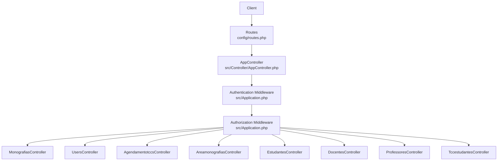
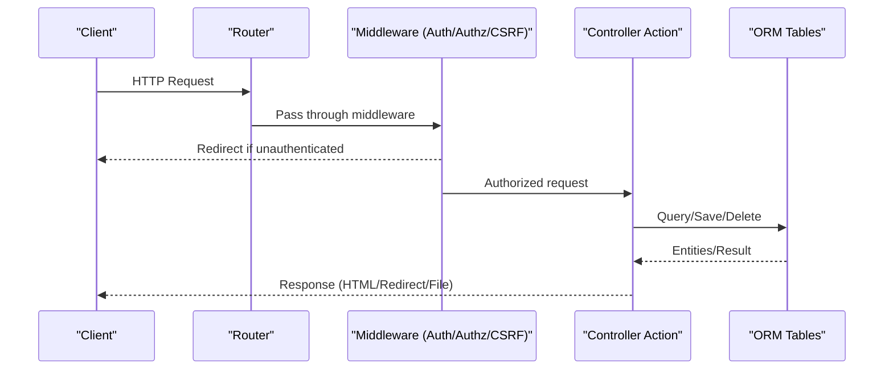
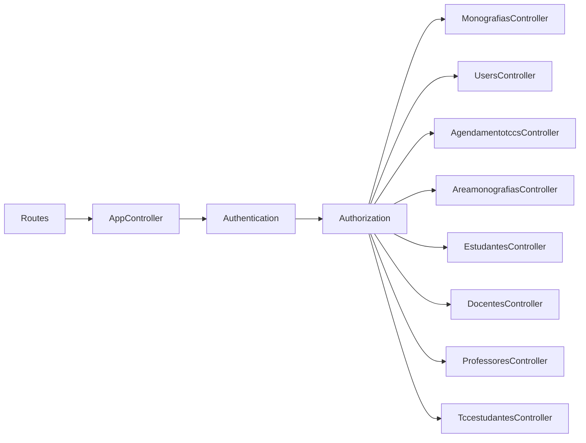

# API Reference

<cite>
**Referenced Files in This Document**
- [routes.php](file://config/routes.php)
- [Application.php](file://src/Application.php)
- [AppController.php](file://src/Controller/AppController.php)
- [MonografiasController.php](file://src/Controller/MonografiasController.php)
- [UsersController.php](file://src/Controller/UsersController.php)
- [AgendamentotccsController.php](file://src/Controller/AgendamentotccsController.php)
- [AreamonografiasController.php](file://src/Controller/AreamonografiasController.php)
- [EstudantesController.php](file://src/Controller/EstudantesController.php)
- [DocentesController.php](file://src/Controller/DocentesController.php)
- [ProfessoresController.php](file://src/Controller/ProfessoresController.php)
- [TccestudantesController.php](file://src/Controller/TccestudantesController.php)
- [ErrorController.php](file://src/Controller/ErrorController.php)
- [app.php](file://config/app.php)
</cite>

## Table of Contents
1. [Introduction](#introduction)
2. [Project Structure](#project-structure)
3. [Core Components](#core-components)
4. [Architecture Overview](#architecture-overview)
5. [Detailed Component Analysis](#detailed-component-analysis)
6. [Dependency Analysis](#dependency-analysis)
7. [Performance Considerations](#performance-considerations)
8. [Troubleshooting Guide](#troubleshooting-guide)
9. [Conclusion](#conclusion)
10. [Appendices](#appendices)

## Introduction
This document provides comprehensive API documentation for the CakePHP-based application, focusing on controller endpoints that implement REST-like behavior for monograph management, user operations, scheduling functions, and administrative tasks. It covers HTTP methods, URL patterns, request/response schemas, authentication and authorization requirements, error handling, and status codes. Where applicable, it includes example requests and responses to illustrate usage.

The application uses session-based form authentication with role-based authorization policies. Endpoints are primarily web-facing (HTML templates), but many actions can be consumed as JSON or used by clients via standard HTTP verbs. CSRF protection is enabled at the root scope.

## Project Structure
The routing layer maps URLs to controllers and actions. The application registers Authentication and Authorization middleware globally and applies CSRF protection. Controllers define CRUD-style endpoints for entities such as Monografias, Users, Agendamentotccs, Areamonografias, Estudantes, Docentes, Professores, and Tccestudantes.

**Diagram sources**
- [routes.php:48-87](file://config/routes.php#L48-L87)
- [Application.php:91-113](file://src/Application.php#L91-L113)
- [AppController.php:44-67](file://src/Controller/AppController.php#L44-L67)

**Section sources**
- [routes.php:48-87](file://config/routes.php#L48-L87)
- [Application.php:91-113](file://src/Application.php#L91-L113)
- [AppController.php:44-67](file://src/Controller/AppController.php#L44-L67)

## Core Components
- Authentication: Session and Form authenticators configured; login/logout handled by UsersController. Unauthenticated actions are declared per controller where needed.
- Authorization: Role-based via policies; admin-only actions enforced by checking user category.
- CSRF: Enabled globally for forms.
- Pagination and sorting: Many list endpoints support pagination and sortable fields via query parameters.

Key behaviors:
- Some actions are explicitly marked unauthenticated (e.g., index, view, busca, download).
- Admin-only features require user category '1'.
- File uploads for PDFs are supported in Monografias.

**Section sources**
- [Application.php:135-165](file://src/Application.php#L135-L165)
- [AppController.php:62-67](file://src/Controller/AppController.php#L62-L67)
- [MonografiasController.php:33-39](file://src/Controller/MonografiasController.php#L33-L39)
- [UsersController.php:23-32](file://src/Controller/UsersController.php#L23-L32)

## Architecture Overview
The request lifecycle:
1. Request enters via routes.
2. Error handling, asset, routing, authentication, and authorization middleware execute.
3. Controller action processes data, interacts with tables/entities, and returns a response (often redirecting after mutations).
4. Views render HTML; some actions disable rendering for file downloads.

**Diagram sources**
- [Application.php:91-113](file://src/Application.php#L91-L113)
- [AppController.php:44-67](file://src/Controller/AppController.php#L44-L67)

## Detailed Component Analysis

### Monographs Management (Monografias)
Endpoints:
- GET /monografias/index
  - Purpose: List monographs with optional search by title and sorting.
  - Query params: sort, titulo (POST body field used for search).
  - Auth: Public (unauthenticated actions include index, view, busca, download).
  - Response: Paginated list of monographs with related Docente, Area, Student info.
- GET /monografias/view/:id
  - Purpose: View details of a monograph.
  - Auth: Public.
  - Response: Single monograph entity with associations.
- POST /monografias/add
  - Purpose: Create a new monograph and optionally upload a PDF file.
  - Body: Form fields including titulo, periodo (ano/semestre), professor_id, banca1, estudantes_ids[], url (file upload).
  - Auth: Requires authorization unless skipped; typically requires admin or appropriate role.
  - Response: Redirect to view on success; flash messages on errors.
- PATCH/POST/PUT /monografias/edit/:id
  - Purpose: Update an existing monograph; supports syncing associated students.
  - Body: Same as add plus id.
  - Auth: Requires authorization.
  - Response: Redirect to view on success.
- DELETE /monografias/delete/:id
  - Purpose: Delete a monograph.
  - Method: POST or DELETE.
  - Auth: Requires authorization.
  - Response: Redirect to index with flash message.
- GET /monografias/download/:dre/:id
  - Purpose: Download a PDF file by student registration code.
  - Auth: Public.
  - Response: File download or redirect with error.

Notes:
- Sorting fields include titulo, periodo, url, student name, docente name, area.
- File upload accepts only PDFs; invalid files produce flash errors.

Example:
- Create monograph with PDF
  - Method: POST
  - URL: /monografias/add
  - Content-Type: multipart/form-data
  - Fields: titulo, ano, semestre, professor_id, banca1, estudantes_ids[ ], url (PDF)
  - Success: 302 redirect to /monografias/view/{id}
  - Errors: Flash error messages rendered in HTML

**Section sources**
- [MonografiasController.php:46-75](file://src/Controller/MonografiasController.php#L46-L75)
- [MonografiasController.php:84-95](file://src/Controller/MonografiasController.php#L84-L95)
- [MonografiasController.php:102-170](file://src/Controller/MonografiasController.php#L102-L170)
- [MonografiasController.php:211-263](file://src/Controller/MonografiasController.php#L211-L263)
- [MonografiasController.php:292-310](file://src/Controller/MonografiasController.php#L292-L310)
- [MonografiasController.php:319-332](file://src/Controller/MonografiasController.php#L319-L332)
- [MonografiasController.php:499-511](file://src/Controller/MonografiasController.php#L499-L511)

### User Operations (Users)
Endpoints:
- GET /users/login
  - Purpose: Display login form.
  - Auth: Public.
  - Response: HTML login template.
- POST /users/login
  - Purpose: Authenticate using email/password.
  - Body: email, password.
  - Auth: Public.
  - Response: Redirect based on user category; flash messages on failure.
- POST /users/logout
  - Purpose: Log out current session.
  - Auth: Public.
  - Response: Redirect to login with success flash.
- GET /users
  - Purpose: List users (admin only).
  - Auth: Requires admin (category '1').
  - Response: Paginated list of users.
- GET /users/view/:id
  - Purpose: View user details.
  - Auth: Requires authorization.
  - Response: Single user entity.
- POST /users/add
  - Purpose: Register a new user; may associate with Aluno/Professor/Supervisor depending on category.
  - Body: email, password, categoria, numero (identifier like DRE/SIAPE/CRESS).
  - Auth: Public.
  - Response: Redirect to associated profile or login; flash messages on errors.
- PATCH/POST/PUT /users/edit/:id
  - Purpose: Edit user details.
  - Auth: Requires authorization.
  - Response: Redirect to view with flash messages.
- DELETE /users/delete/:id
  - Purpose: Delete a user.
  - Method: POST or DELETE.
  - Auth: Requires authorization.
  - Response: Redirect to login with flash messages.

Example:
- Login
  - Method: POST
  - URL: /users/login
  - Content-Type: application/x-www-form-urlencoded
  - Body: email=...&password=...
  - Success: 302 redirect to role-specific dashboard
  - Failure: 302 redirect back to login with error flash

**Section sources**
- [UsersController.php:23-32](file://src/Controller/UsersController.php#L23-L32)
- [UsersController.php:34-156](file://src/Controller/UsersController.php#L34-L156)
- [UsersController.php:158-171](file://src/Controller/UsersController.php#L158-L171)
- [UsersController.php:178-191](file://src/Controller/UsersController.php#L178-L191)
- [UsersController.php:200-206](file://src/Controller/UsersController.php#L200-L206)
- [UsersController.php:213-299](file://src/Controller/UsersController.php#L213-L299)
- [UsersController.php:308-324](file://src/Controller/UsersController.php#L308-L324)
- [UsersController.php:333-353](file://src/Controller/UsersController.php#L333-L353)

### Scheduling Functions (Agendamentotccs)
Endpoints:
- GET /agendamentotccs/index
  - Purpose: List schedules with sorting and filtering.
  - Query params: sort.
  - Auth: Public for listing.
  - Response: Paginated schedule entries with related Estudante and Docentes.
- GET /agendamentotccs/view/:id
  - Purpose: View schedule details.
  - Auth: Public for viewing.
  - Response: Single schedule entity with associations.
- POST /agendamentotccs/add
  - Purpose: Create a new schedule entry.
  - Body: estudante_id, docente_id, data, horario (HH:mm or HH:mm:ss), sala, convidado, avaliacao.
  - Auth: Requires authorization.
  - Response: Redirect to view with success/error flash.
- PATCH/POST/PUT /agendamentotccs/edit/:id
  - Purpose: Update schedule entry.
  - Body: Same as add plus id.
  - Auth: Requires authorization.
  - Response: Redirect to view with flash messages.
- DELETE /agendamentotccs/delete/:id
  - Purpose: Delete schedule entry.
  - Method: POST or DELETE.
  - Auth: Requires authorization.
  - Response: Redirect to index with flash messages.

Example:
- Create schedule
  - Method: POST
  - URL: /agendamentotccs/add
  - Content-Type: application/x-www-form-urlencoded
  - Body: estudante_id=..., docente_id=..., data=YYYY-MM-DD, horario=HH:mm, sala=..., convidado=..., avaliacao=...
  - Success: 302 redirect to /agendamentotccs/view/{id}

**Section sources**
- [AgendamentotccsController.php:22-26](file://src/Controller/AgendamentotccsController.php#L22-L26)
- [AgendamentotccsController.php:33-65](file://src/Controller/AgendamentotccsController.php#L33-L65)
- [AgendamentotccsController.php:74-89](file://src/Controller/AgendamentotccsController.php#L74-L89)
- [AgendamentotccsController.php:96-139](file://src/Controller/AgendamentotccsController.php#L96-L139)
- [AgendamentotccsController.php:148-198](file://src/Controller/AgendamentotccsController.php#L148-L198)
- [AgendamentotccsController.php:207-228](file://src/Controller/AgendamentotccsController.php#L207-L228)

### Administrative Tasks (Areas, Students, Teachers, Professors, TCC Students)
- Areas (Areamonografias)
  - GET /areamonografias/index: List areas with sorting.
  - GET /areamonografias/view/:id: View area details.
  - POST /areamonografias/add: Create area.
  - PATCH/POST/PUT /areamonografias/edit/:id: Update area.
  - DELETE /areamonografias/delete/:id: Delete area (if no monographs associated).
- Students (Estudantes)
  - GET /estudantes/index: List students with filters and sorting.
  - GET /estudantes/view/:id: View student details.
  - POST /estudantes/add: Register student.
  - PATCH/POST/PUT /estudantes/edit/:id: Update student.
  - DELETE /estudantes/delete/:id: Delete student (if no related records).
- Teachers (Docentes)
  - GET /docentes/index: List teachers with sorting.
  - GET /docentes/view/:id: View teacher details.
  - POST /docentes/add: Add teacher (validates siape/email uniqueness).
  - PATCH/POST/PUT /docentes/edit/:id: Update teacher.
  - DELETE /docentes/delete/:id: Delete teacher.
- Professors (Professores)
  - GET /professores/index: List professors with sorting.
  - GET /professores/view/:id: View professor details (supports lookup by siape).
  - POST /professores/add: Add professor (checks existence by siape/email).
  - PATCH/POST/PUT /professores/edit/:id: Update professor.
  - DELETE /professores/delete/:id: Delete professor (if no interns associated).
- TCC Students (Tccestudantes)
  - GET /tccestudantes/index: List TCC student records with search by nome.
  - GET /tccestudantes/view/:id: View record details.
  - POST /tccestudantes/add: Associate student with monograph.
  - PATCH/POST/PUT /tccestudantes/edit/:id: Update association.
  - DELETE /tccestudantes/delete/:id: Delete association.

Examples:
- Add teacher
  - Method: POST
  - URL: /docentes/add
  - Content-Type: application/x-www-form-urlencoded
  - Body: siape=..., email=..., departmental fields...
  - Success: 302 redirect to /docentes/view/{id}
  - Errors: Flash messages indicating duplicate or missing fields

**Section sources**
- [AreamonografiasController.php:29-38](file://src/Controller/AreamonografiasController.php#L29-L38)
- [AreamonografiasController.php:47-56](file://src/Controller/AreamonografiasController.php#L47-L56)
- [AreamonografiasController.php:63-82](file://src/Controller/AreamonografiasController.php#L63-L82)
- [AreamonografiasController.php:91-110](file://src/Controller/AreamonografiasController.php#L91-L110)
- [AreamonografiasController.php:119-137](file://src/Controller/AreamonografiasController.php#L119-L137)
- [EstudantesController.php:27-40](file://src/Controller/EstudantesController.php#L27-L40)
- [EstudantesController.php:47-70](file://src/Controller/EstudantesController.php#L47-L70)
- [EstudantesController.php:111-130](file://src/Controller/EstudantesController.php#L111-L130)
- [EstudantesController.php:137-157](file://src/Controller/EstudantesController.php#L137-L157)
- [EstudantesController.php:166-188](file://src/Controller/EstudantesController.php#L166-L188)
- [EstudantesController.php:197-232](file://src/Controller/EstudantesController.php#L197-L232)
- [DocentesController.php:29-33](file://src/Controller/DocentesController.php#L29-L33)
- [DocentesController.php:41-58](file://src/Controller/DocentesController.php#L41-L58)
- [DocentesController.php:67-84](file://src/Controller/DocentesController.php#L67-L84)
- [DocentesController.php:91-130](file://src/Controller/DocentesController.php#L91-L130)
- [DocentesController.php:139-162](file://src/Controller/DocentesController.php#L139-L162)
- [DocentesController.php:171-188](file://src/Controller/DocentesController.php#L171-L188)
- [ProfessoresController.php:29-34](file://src/Controller/ProfessoresController.php#L29-L34)
- [ProfessoresController.php:42-57](file://src/Controller/ProfessoresController.php#L42-L57)
- [ProfessoresController.php:66-108](file://src/Controller/ProfessoresController.php#L66-L108)
- [ProfessoresController.php:115-181](file://src/Controller/ProfessoresController.php#L115-L181)
- [ProfessoresController.php:190-206](file://src/Controller/ProfessoresController.php#L190-L206)
- [ProfessoresController.php:215-241](file://src/Controller/ProfessoresController.php#L215-L241)
- [TccestudantesController.php:31-66](file://src/Controller/TccestudantesController.php#L31-L66)
- [TccestudantesController.php:75-85](file://src/Controller/TccestudantesController.php#L75-L85)
- [TccestudantesController.php:93-145](file://src/Controller/TccestudantesController.php#L93-L145)
- [TccestudantesController.php:154-184](file://src/Controller/TccestudantesController.php#L154-L184)
- [TccestudantesController.php:193-204](file://src/Controller/TccestudantesController.php#L193-L204)

## Dependency Analysis
- Routing: Default fallbacks connect controller/action patterns; custom route for monografias/index exists.
- Middleware: Authentication and Authorization are applied globally; CSRF protection is active.
- Policies: Role checks enforce admin-only access for certain actions (e.g., user listing).
- Controllers depend on ORM tables for data operations and use Flash messaging for user feedback.

**Diagram sources**
- [routes.php:48-87](file://config/routes.php#L48-L87)
- [Application.php:91-113](file://src/Application.php#L91-L113)
- [AppController.php:44-67](file://src/Controller/AppController.php#L44-L67)

**Section sources**
- [routes.php:48-87](file://config/routes.php#L48-L87)
- [Application.php:91-113](file://src/Application.php#L91-L113)
- [AppController.php:44-67](file://src/Controller/AppController.php#L44-L67)

## Performance Considerations
- Pagination: Most list endpoints use pagination to limit result sets and improve performance.
- Sorting: Use sortableFields to avoid expensive queries; default ordering is applied when not specified.
- File handling: PDF uploads are validated server-side; ensure storage path permissions and limits are configured appropriately.
- Memory: Some views increase memory limits for heavy datasets (e.g., professor view with many interns).

[No sources needed since this section provides general guidance]

## Troubleshooting Guide
Common issues and resolutions:
- Unauthorized access: Ensure user is authenticated and has required role (category '1' for admin actions). Check unauthenticated actions configuration.
- CSRF errors: Forms must include CSRF tokens; CSRF middleware is enabled at the root scope.
- Missing records: Controllers handle RecordNotFoundException and redirect with flash messages.
- Duplicate entries: Teacher and professor creation validate uniqueness of siape/email; check validation messages.
- File upload failures: Only PDFs are accepted; verify MIME type and file size limits.

Error handling:
- Global error handler configured; exceptions are logged and rendered according to debug settings.
- Custom error controller sets template path for error pages.

**Section sources**
- [Application.php:91-113](file://src/Application.php#L91-L113)
- [ErrorController.php:54-59](file://src/Controller/ErrorController.php#L54-L59)
- [app.php:150-174](file://config/app.php#L150-L174)

## Conclusion
This API reference documents the core endpoints for managing monographs, users, schedules, and administrative resources. The system relies on session-based authentication and role-based authorization, with CSRF protection enabled. While primarily designed for web interfaces, endpoints follow RESTful conventions and can be integrated by clients adhering to the documented request/response patterns. For robust integrations, consider implementing proper error handling, respecting redirects and flash messages, and ensuring CSRF compliance for state-changing requests.

[No sources needed since this section summarizes without analyzing specific files]

## Appendices

### Authentication Methods
- Session-based authentication: Users log in via /users/login with email and password.
- Form authenticator configured to accept username=email and password fields.
- Unauthenticated actions are explicitly allowed per controller (e.g., index, view, busca, download).

**Section sources**
- [Application.php:135-165](file://src/Application.php#L135-L165)
- [AppController.php:62-67](file://src/Controller/AppController.php#L62-L67)
- [MonografiasController.php:33-39](file://src/Controller/MonografiasController.php#L33-L39)
- [UsersController.php:23-32](file://src/Controller/UsersController.php#L23-L32)

### Authorization Requirements
- Admin-only actions require user category '1'.
- Policies enforce resource-level permissions; controllers often call Authorization::authorize() before mutations.

**Section sources**
- [UsersController.php:178-191](file://src/Controller/UsersController.php#L178-L191)
- [MonografiasController.php:102-170](file://src/Controller/MonografiasController.php#L102-L170)
- [AgendamentotccsController.php:96-139](file://src/Controller/AgendamentotccsController.php#L96-L139)

### Rate Limiting Policies
- No explicit rate limiting is implemented in the provided codebase.
- Consider adding a rate-limiting middleware or leveraging reverse proxy configurations for production environments.

[No sources needed since this section provides general guidance]

### API Versioning Strategy and Backward Compatibility
- No versioned API base path is defined; all endpoints are under the root scope.
- To introduce versioning, create a scoped route group (e.g., /api/v1) and register version-specific routes and middleware.
- Maintain backward compatibility by deprecating old endpoints gradually and providing migration guides.

[No sources needed since this section provides general guidance]