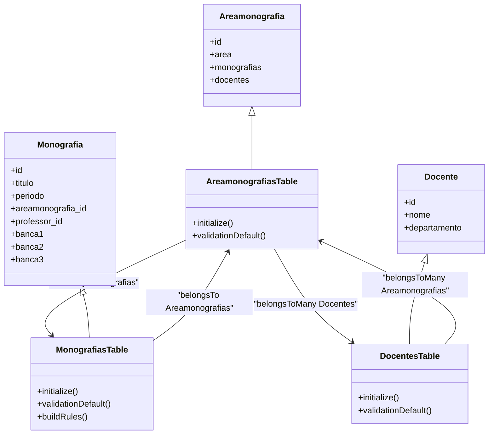
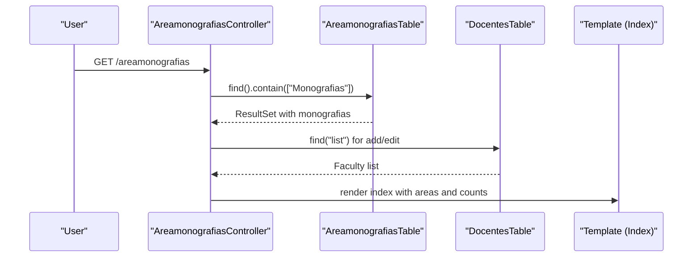
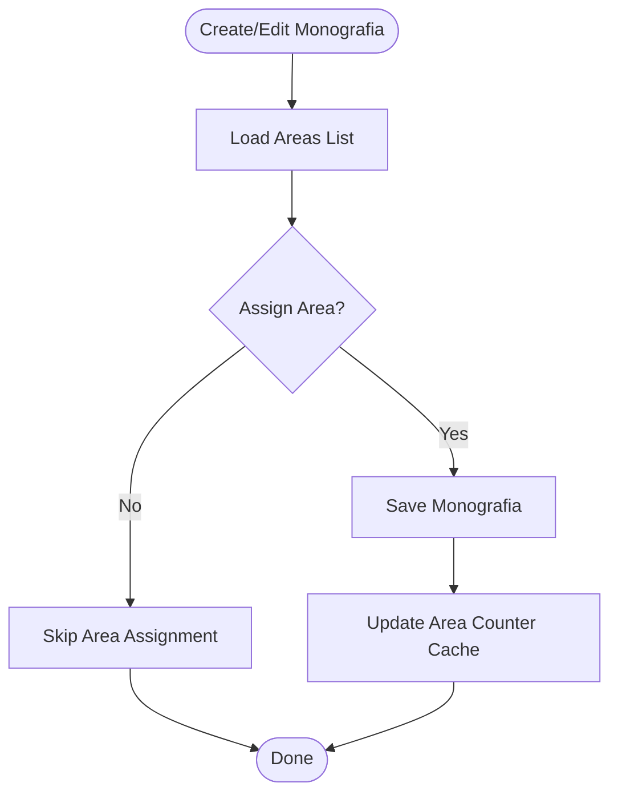
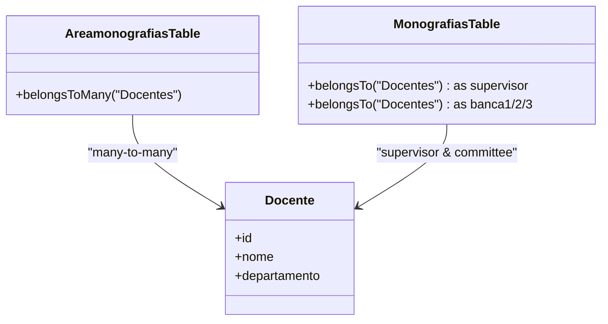
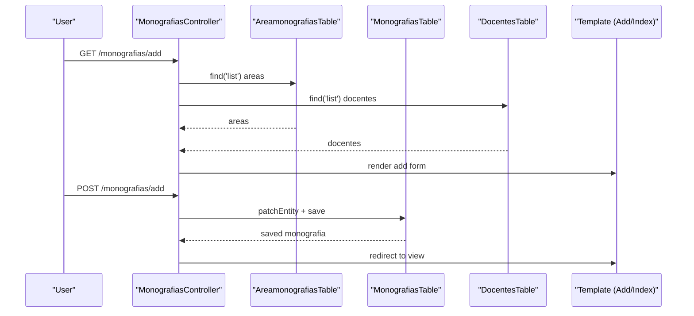
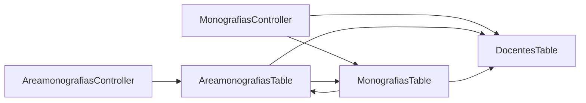

# Academic Areas and Classification

<cite>
**Referenced Files in This Document**
- [Areamonografia.php](file://src/Model/Entity/Areamonografia.php)
- [AreamonografiasTable.php](file://src/Model/Table/AreamonografiasTable.php)
- [AreamonografiasController.php](file://src/Controller/AreamonografiasController.php)
- [Monografia.php](file://src/Model/Entity/Monografia.php)
- [MonografiasTable.php](file://src/Model/Table/MonografiasTable.php)
- [MonografiasController.php](file://src/Controller/MonografiasController.php)
- [Docente.php](file://src/Model/Entity/Docente.php)
- [DocentesTable.php](file://src/Model/Table/DocentesTable.php)
- [schema.sql](file://config/Migrations/schema.sql)
- [index.php (Areamonografias)](file://templates/Areamonografias/index.php)
- [view.php (Areamonografias)](file://templates/Areamonografias/view.php)
- [index.php (Monografias)](file://templates/Monografias/index.php)
- [add.php (Monografias)](file://templates/Monografias/add.php)
</cite>

## Table of Contents
1. Introduction
2. Project Structure
3. Core Components
4. Architecture Overview
5. Detailed Component Analysis
6. Dependency Analysis
7. Performance Considerations
8. Troubleshooting Guide
9. Conclusion
10. Appendices

## Introduction
This document explains the academic areas management system focused on research area classification, monograph categorization, and area-specific workflows. It details the Areamonografia entity structure, how research fields are organized and associated with monographs, and how these relationships support filtering, search, and statistical reporting by research field. It also outlines integration points with academic department structures via faculty associations and demonstrates examples for managing area hierarchies conceptually, analyzing monograph distribution across areas, and generating reports by research field.

## Project Structure
The system is implemented as a CakePHP application with MVC layers:
- Models define entities and tables, including Areamonografia and Monografia, and their relationships to Docentes and Tccestudantes.
- Controllers orchestrate requests for listing, viewing, adding, editing, and deleting areas and monographs.
- Templates render lists, views, and forms for users to manage areas and monographs.
- The database schema defines the core tables for areas, monographs, and related entities.

```mermaid
graph TB
subgraph "Models"
ARE["AreamonografiasTable"]
MON["MonografiasTable"]
DOC["DocentesTable"]
end
subgraph "Controllers"
ARC["AreamonografiasController"]
MNC["MonografiasController"]
end
subgraph "Templates"
ATI["Areamonografias Index/View"]
MTI["Monografias Index/Add"]
end
subgraph "Database"
DBARE["areamonografias"]
DBMON["monografias"]
DBDOC["professores"]
DBJN["areamonografias_docentes"]
end
ARC --> ARE
MNC --> MON
MNC --> DOC
ARC --> DOC
ARE --> |hasMany| MON
MON --> |belongsTo| ARE
ARE --> |belongsToMany| DOC
DOC --> |belongsToMany| ARE
DBARE < --> DBJN
DBMON --> DBARE
DBMON --> DBDOC
ATI --> ARC
MTI --> MNC
```

**Diagram sources**
- [AreamonografiasTable.php:41-60](file://src/Model/Table/AreamonografiasTable.php#L41-L60)
- [MonografiasTable.php:41-100](file://src/Model/Table/MonografiasTable.php#L41-L100)
- [DocentesTable.php:36-78](file://src/Model/Table/DocentesTable.php#L36-L78)
- [AreamonografiasController.php:29-56](file://src/Controller/AreamonografiasController.php#L29-L56)
- [MonografiasController.php:46-75](file://src/Controller/MonografiasController.php#L46-L75)
- [schema.sql:118-136](file://config/Migrations/schema.sql#L118-L136)
- [schema.sql:437-456](file://config/Migrations/schema.sql#L437-L456)

**Section sources**
- [AreamonografiasTable.php:41-60](file://src/Model/Table/AreamonografiasTable.php#L41-L60)
- [MonografiasTable.php:41-100](file://src/Model/Table/MonografiasTable.php#L41-L100)
- [DocentesTable.php:36-78](file://src/Model/Table/DocentesTable.php#L36-L78)
- [schema.sql:118-136](file://config/Migrations/schema.sql#L118-L136)
- [schema.sql:437-456](file://config/Migrations/schema.sql#L437-L456)

## Core Components
- Areamonografia entity and table represent research areas and maintain relationships to monographs and faculty.
- Monografia entity and table represent individual monographs and link to an area, supervisor(s), committee members, and students.
- Docentes entity and table represent faculty members and associate with multiple areas and monographs.
- Controllers provide CRUD operations and list views for areas and monographs, enabling classification and browsing.
- Templates present paginated lists, search by title, and detail views showing area-based grouping and counts.

Key responsibilities:
- Area classification: create, edit, delete research areas; associate faculty to areas.
- Monograph categorization: assign each monograph to a research area during creation/editing.
- Reporting: display counts per area and navigate from area view to monographs within that area.

**Section sources**
- [Areamonografia.php:8-33](file://src/Model/Entity/Areamonografia.php#L8-L33)
- [AreamonografiasTable.php:41-79](file://src/Model/Table/AreamonografiasTable.php#L41-L79)
- [Monografia.php:8-72](file://src/Model/Entity/Monografia.php#L8-L72)
- [MonografiasTable.php:41-100](file://src/Model/Table/MonografiasTable.php#L41-L100)
- [Docente.php:8-106](file://src/Model/Entity/Docente.php#L8-L106)
- [DocentesTable.php:36-78](file://src/Model/Table/DocentesTable.php#L36-L78)

## Architecture Overview
The system uses a relational model where monographs belong to research areas, and areas can be associated with multiple faculty members. Counting is optimized using a counter cache to reflect the number of monographs per area efficiently.



**Diagram sources**
- [AreamonografiasTable.php:41-60](file://src/Model/Table/AreamonografiasTable.php#L41-L60)
- [MonografiasTable.php:41-100](file://src/Model/Table/MonografiasTable.php#L41-L100)
- [DocentesTable.php:36-78](file://src/Model/Table/DocentesTable.php#L36-L78)
- [Areamonografia.php:8-33](file://src/Model/Entity/Areamonografia.php#L8-L33)
- [Monografia.php:8-72](file://src/Model/Entity/Monografia.php#L8-L72)
- [Docente.php:8-106](file://src/Model/Entity/Docente.php#L8-L106)

## Detailed Component Analysis

### Areamonografia Entity and Table
- Purpose: Represents a research area with a text label and relationships to monographs and faculty.
- Relationships:
  - Has many monographs via foreign key on monografias table.
  - Belongs to many faculty through a join table.
- Validation: Ensures area name is present and within length limits.
- Usage: Listed and paginated; count of monographs shown via counter cache or association count.



**Diagram sources**
- [AreamonografiasController.php:29-38](file://src/Controller/AreamonografiasController.php#L29-L38)
- [AreamonografiasTable.php:41-60](file://src/Model/Table/AreamonografiasTable.php#L41-L60)
- [DocentesTable.php:36-78](file://src/Model/Table/DocentesTable.php#L36-L78)

**Section sources**
- [Areamonografia.php:8-33](file://src/Model/Entity/Areamonografia.php#L8-L33)
- [AreamonografiasTable.php:41-79](file://src/Model/Table/AreamonografiasTable.php#L41-L79)
- [AreamonografiasController.php:29-137](file://src/Controller/AreamonografiasController.php#L29-L137)

### Monografia Entity and Table
- Purpose: Represents a monograph record with metadata, supervisor/co-supervisor, committee members, and area assignment.
- Relationships:
  - Belongs to an area (Areamonografias).
  - Belongs to faculty for supervisor and committee roles.
  - Has many student records (Tccestudantes).
- Counter Cache: Automatically maintains a count of monographs per area for efficient reporting.
- Validation: Enforces field types and lengths; ensures referential integrity with area and supervisor.



**Diagram sources**
- [MonografiasTable.php:41-100](file://src/Model/Table/MonografiasTable.php#L41-L100)
- [MonografiasController.php:102-170](file://src/Controller/MonografiasController.php#L102-L170)

**Section sources**
- [Monografia.php:8-72](file://src/Model/Entity/Monografia.php#L8-L72)
- [MonografiasTable.php:41-190](file://src/Model/Table/MonografiasTable.php#L41-L190)
- [MonografiasController.php:102-170](file://src/Controller/MonografiasController.php#L102-L170)

### Faculty Integration (Docentes)
- Purpose: Stores faculty information and links them to areas and monographs.
- Relationships:
  - Many-to-many with areas via join table.
  - One-to-many with monographs as supervisors and committee members.
- Departmental context: Faculty records include department fields, enabling area-based filtering by department when needed.



**Diagram sources**
- [DocentesTable.php:36-78](file://src/Model/Table/DocentesTable.php#L36-L78)
- [AreamonografiasTable.php:54-59](file://src/Model/Table/AreamonografiasTable.php#L54-L59)
- [MonografiasTable.php:55-91](file://src/Model/Table/MonografiasTable.php#L55-L91)

**Section sources**
- [Docente.php:8-106](file://src/Model/Entity/Docente.php#L8-L106)
- [DocentesTable.php:36-272](file://src/Model/Table/DocentesTable.php#L36-L272)

### User Interfaces and Workflows
- Area listing shows each area and its monograph count; clicking an area navigates to a detail view listing monographs and associated faculty.
- Monograph listing supports search by title and sorting by area, period, student, supervisor, and PDF availability.
- Adding a monograph includes selecting an area, supervisor(s), committee members, and optional PDF upload.



**Diagram sources**
- [MonografiasController.php:102-170](file://src/Controller/MonografiasController.php#L102-L170)
- [AreamonografiasTable.php:41-60](file://src/Model/Table/AreamonografiasTable.php#L41-L60)
- [DocentesTable.php:36-78](file://src/Model/Table/DocentesTable.php#L36-L78)

**Section sources**
- [index.php (Areamonografias):27-63](file://templates/Areamonografias/index.php#L27-L63)
- [view.php (Areamonografias):34-110](file://templates/Areamonografias/view.php#L34-L110)
- [index.php (Monografias):25-110](file://templates/Monografias/index.php#L25-L110)
- [add.php (Monografias):40-309](file://templates/Monografias/add.php#L40-L309)

## Dependency Analysis
- AreamonografiasTable depends on MonografiasTable and DocentesTable for relationships and data access.
- MonografiasTable depends on AreamonografiasTable and DocentesTable for associations and validation rules.
- Controllers depend on their respective Tables and use templates to render UI.
- Database schema enforces primary keys and relationships; join table manages many-to-many between areas and faculty.



**Diagram sources**
- [AreamonografiasController.php:29-137](file://src/Controller/AreamonografiasController.php#L29-L137)
- [MonografiasController.php:46-170](file://src/Controller/MonografiasController.php#L46-L170)
- [AreamonografiasTable.php:41-60](file://src/Model/Table/AreamonografiasTable.php#L41-L60)
- [MonografiasTable.php:41-100](file://src/Model/Table/MonografiasTable.php#L41-L100)
- [DocentesTable.php:36-78](file://src/Model/Table/DocentesTable.php#L36-L78)

**Section sources**
- [AreamonografiasController.php:29-137](file://src/Controller/AreamonografiasController.php#L29-L137)
- [MonografiasController.php:46-170](file://src/Controller/MonografiasController.php#L46-L170)
- [AreamonografiasTable.php:41-60](file://src/Model/Table/AreamonografiasTable.php#L41-L60)
- [MonografiasTable.php:41-100](file://src/Model/Table/MonografiasTable.php#L41-L100)
- [DocentesTable.php:36-78](file://src/Model/Table/DocentesTable.php#L36-L78)

## Performance Considerations
- Counter Cache: MonografiasTable applies a CounterCache behavior to track the number of monographs per area, reducing query overhead for listing and reporting.
- Pagination and Sorting: Controllers paginate results and allow sorting by key fields (title, period, area, student, supervisor), improving usability and performance for large datasets.
- Eager Loading: Contain clauses load related entities (monografias, docentes, tccestudantes) to avoid N+1 queries in views.

[No sources needed since this section provides general guidance]

## Troubleshooting Guide
- Deleting an area with associated monographs: The controller prevents deletion if monographs are linked, prompting unassociation first.
- Missing monograph: View methods handle exceptions and redirect with error messages.
- File upload validation: Only PDF files are accepted; non-PDF uploads trigger an error message.
- Search and sort: Ensure query parameters are correctly passed; verify sortable fields are configured in pagination settings.

**Section sources**
- [AreamonografiasController.php:119-137](file://src/Controller/AreamonografiasController.php#L119-L137)
- [MonografiasController.php:84-95](file://src/Controller/MonografiasController.php#L84-L95)
- [MonografiasController.php:319-332](file://src/Controller/MonografiasController.php#L319-L332)

## Conclusion
The system provides a robust framework for classifying research areas and categorizing monographs, with clear relationships to faculty and students. Area-based workflows enable efficient management and reporting, supported by counter caching and paginated interfaces. While the current area model is flat, it can be extended to support hierarchical organization by introducing parent-child relationships and path traversal logic.

[No sources needed since this section summarizes without analyzing specific files]

## Appendices

### Example: Area Hierarchy Management (Conceptual)
- Introduce a parent_id column in the areas table to enable hierarchical trees.
- Implement recursive queries to traverse ancestors/descendants.
- Update controllers and templates to display indented area lists and enforce hierarchy constraints.

[No sources needed since this section describes conceptual enhancements]

### Example: Monograph Distribution Analysis
- Use the counter cache field to compute counts per area for dashboards.
- Aggregate by area and optionally filter by department via faculty associations.
- Export aggregated results for reporting.

[No sources needed since this section provides general guidance]

### Example: Reporting by Research Field
- Generate reports listing areas and their monograph counts.
- Include links to detailed views for each area to drill down into monographs.
- Optionally integrate with department filters based on faculty data.

[No sources needed since this section provides general guidance]