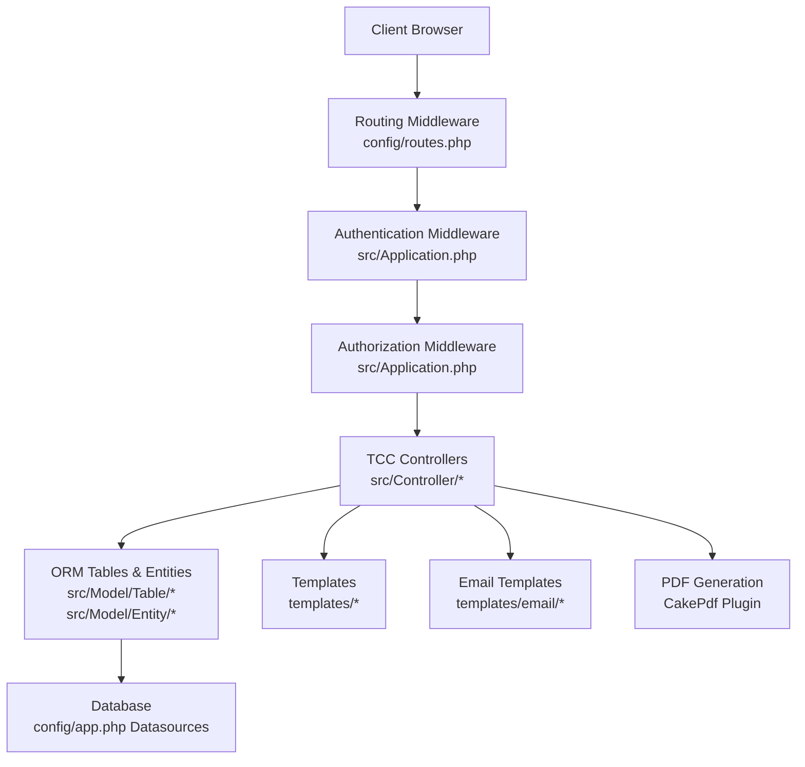
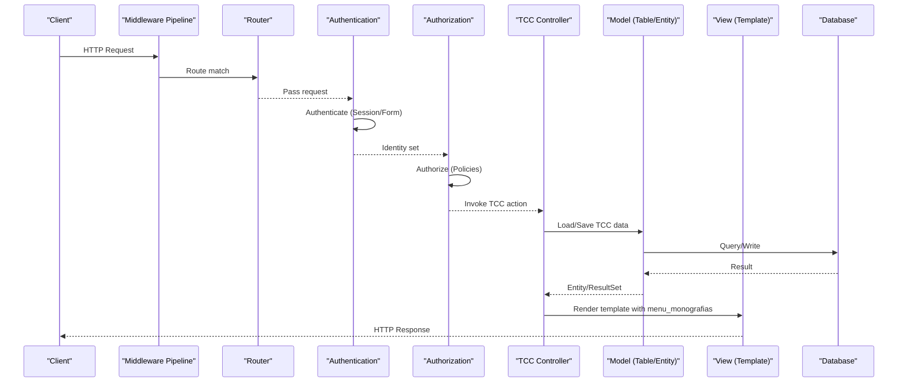
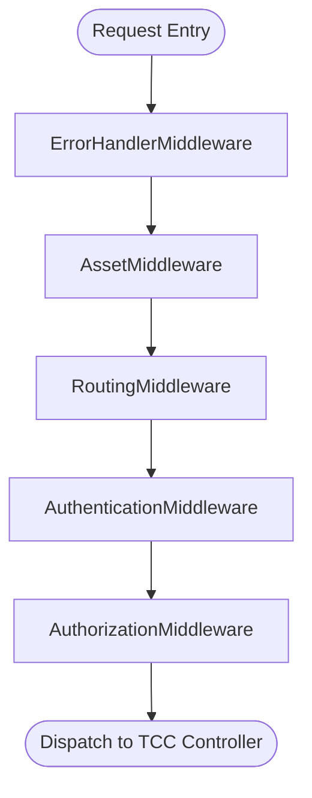
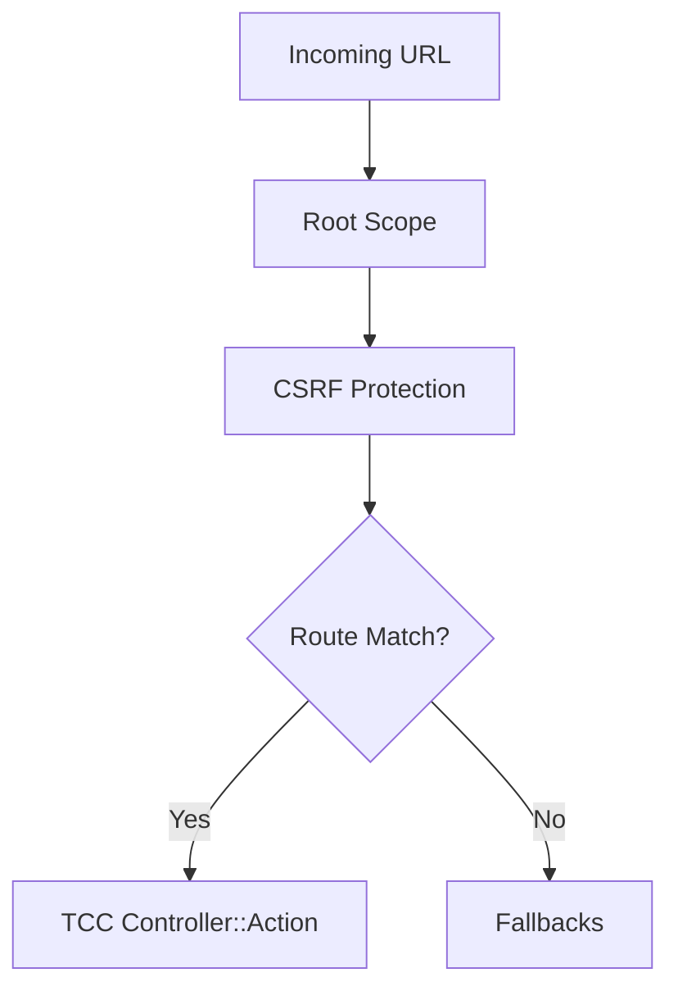
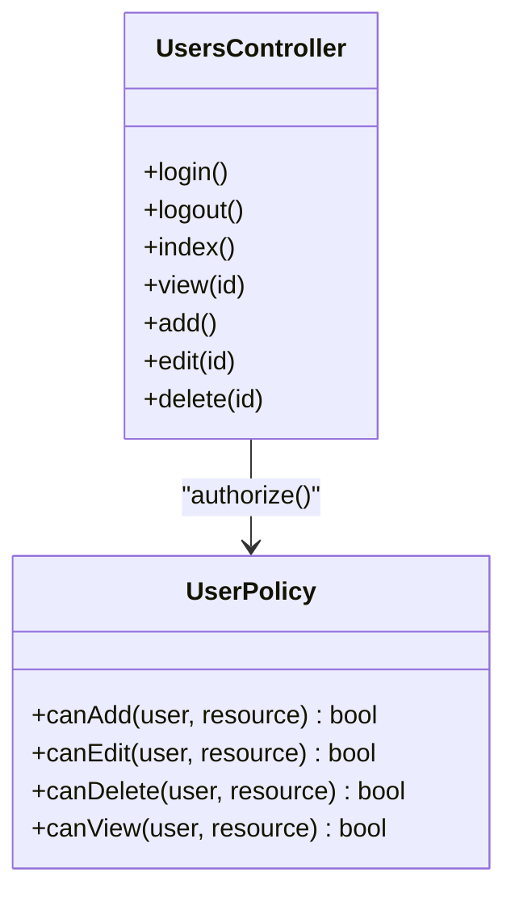
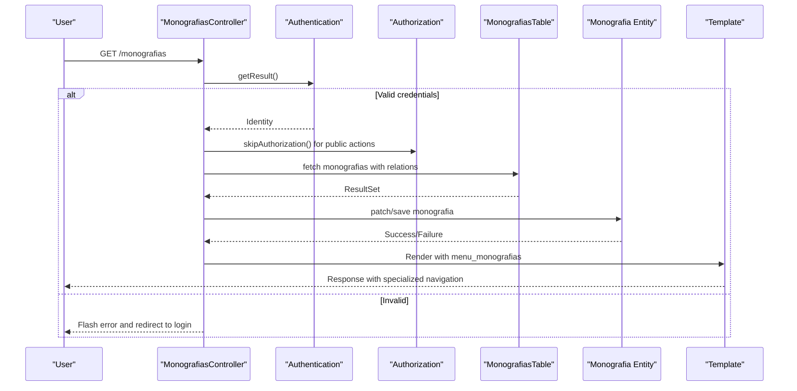
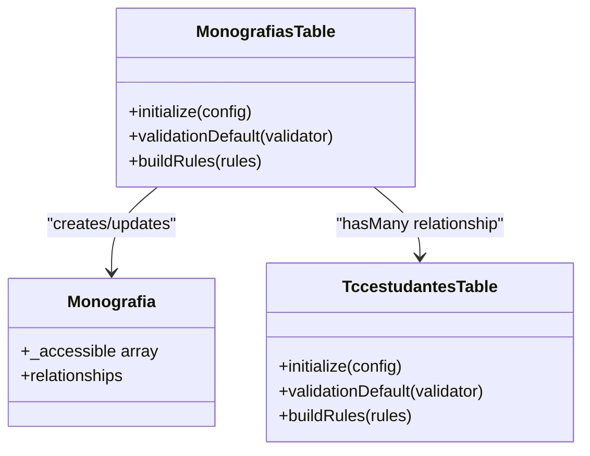
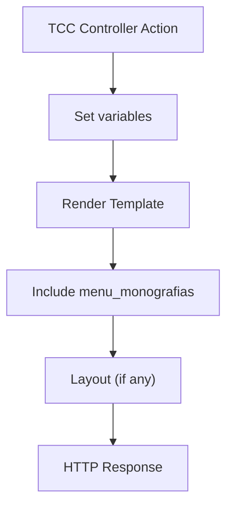
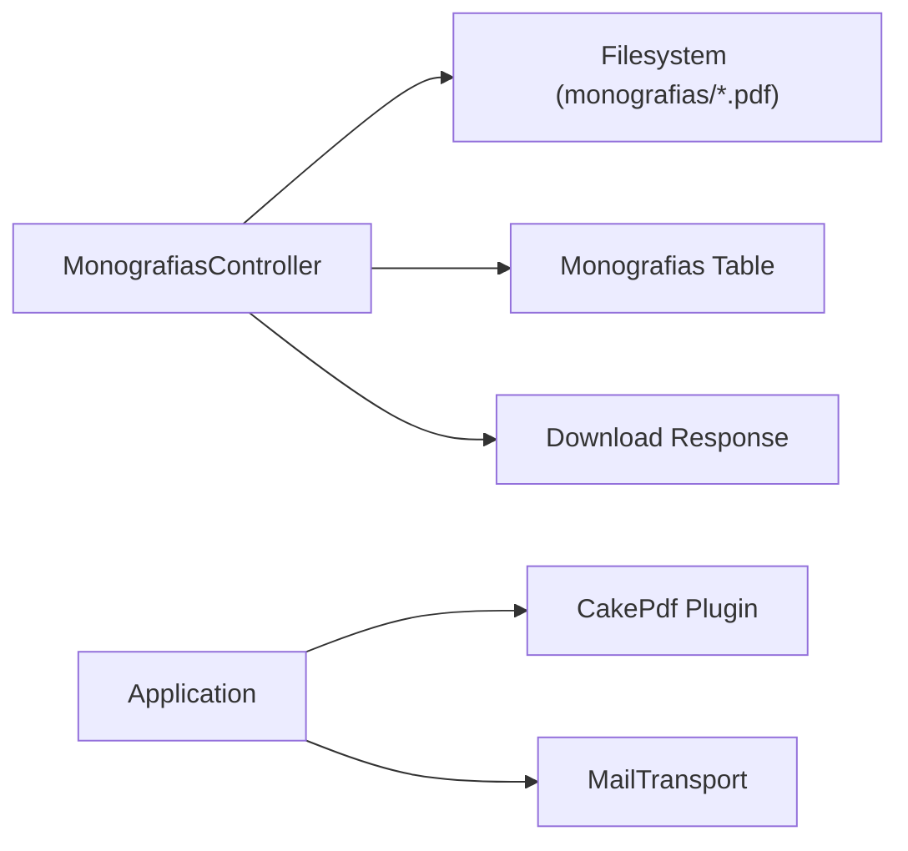
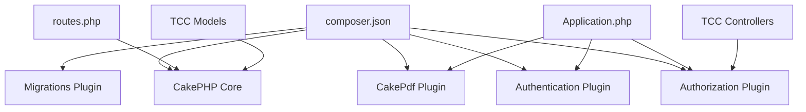

# Architecture Overview

<cite>
**Referenced Files in This Document**
- [Application.php](file://src/Application.php)
- [routes.php](file://config/routes.php)
- [AppController.php](file://src/Controller/AppController.php)
- [MonografiasController.php](file://src/Controller/MonografiasController.php)
- [TccestudantesController.php](file://src/Controller/TccestudantesController.php)
- [AreamonografiasController.php](file://src/Controller/AreamonografiasController.php)
- [AgendamentotccsController.php](file://src/Controller/AgendamentotccsController.php)
- [MonografiasTable.php](file://src/Model/Table/MonografiasTable.php)
- [TccestudantesTable.php](file://src/Model/Table/TccestudantesTable.php)
- [Monografia.php](file://src/Model/Entity/Monografia.php)
- [AppView.php](file://src/View/AppView.php)
- [menu_monografias.php](file://templates/element/menu_monografias.php)
- [index.php (Monografias template)](file://templates/Monografias/index.php)
- [app.php](file://config/app.php)
- [composer.json](file://composer.json)
</cite>

## Update Summary
**Changes Made**
- Updated architecture documentation to reflect the specialized monograph/TCC management focus
- Replaced broad internship management system references with TCC-specific components
- Updated navigation menu references from menu_mural to menu_monografias
- Enhanced MVC layer descriptions to focus on monograph, student, and scheduling management
- Added detailed analysis of TCC-specific controllers and models

## Table of Contents
1. Introduction
2. Project Structure
3. Core Components
4. Architecture Overview
5. Detailed Component Analysis
6. Dependency Analysis
7. Performance Considerations
8. Troubleshooting Guide
9. Conclusion

## Introduction
This document describes the TCC5 system's specialized MVC architecture built on CakePHP 5, focused on monograph and TCC (Trabalho de Conclusão de Curso) management. It explains how HTTP requests flow through routing, middleware (authentication and authorization), controllers, models, and views. The system has been refocused from a broad internship management system to a specialized tool for managing academic monographs, student associations, and defense scheduling.

## Project Structure
TCC5 follows a standard CakePHP layout with specialized TCC management components:
- Application bootstrap and middleware are defined in src/Application.php.
- Routing is configured in config/routes.php with TCC-specific routes.
- Controllers live under src/Controller with TCC-focused functionality including Monografias, Tccestudantes, Areamonografias, and Agendamentotccs.
- Models use CakePHP ORM: Tables under src/Model/Table and Entities under src/Model/Entity.
- Views are templates under templates, with a specialized navigation menu in templates/element/menu_monografias.php.
- Configuration lives under config/app.php and other files.
- Plugins include Authentication, Authorization, CakePdf, Migrations, and DebugKit.

**Diagram sources**
- [Application.php:91-113](file://src/Application.php#L91-L113)
- [routes.php:48-88](file://config/routes.php#L48-L88)
- [app.php:261-327](file://config/app.php#L261-L327)

**Section sources**
- [Application.php:62-83](file://src/Application.php#L62-L83)
- [routes.php:48-88](file://config/routes.php#L48-L88)
- [app.php:261-327](file://config/app.php#L261-L327)

## Core Components
- Application bootstrap registers plugins (DebugKit, CakePdf, Authorization, Authentication) and builds the middleware pipeline.
- Routing maps URLs to TCC-specific controllers/actions and applies CSRF protection at the route scope.
- Controllers extend AppController, which loads Flash, Authentication, and Authorization components and exposes the current identity to views.
- Models define ORM tables and entities with validation rules and relationships specific to TCC management.
- Views render HTML using templates and helpers; email templates provide default HTML formatting.
- Policies enforce fine-grained authorization per entity or table.

Key responsibilities:
- Request lifecycle: HTTP request → Error handling → Assets → Routing → Authentication → Authorization → TCC Controller action → Model operations → View rendering → Response.
- Security: Session-based login, form authenticator, CSRF protection, policy checks.
- Integrations: CakePdf for PDFs, MailTransport for emails.

**Section sources**
- [Application.php:62-83](file://src/Application.php#L62-L83)
- [Application.php:91-113](file://src/Application.php#L91-L113)
- [routes.php:48-88](file://config/routes.php#L48-L88)
- [AppController.php:44-67](file://src/Controller/AppController.php#L44-L67)

## Architecture Overview
The system uses CakePHP's MVC pattern with explicit separation, specialized for TCC management:
- Model: ORM tables/entities encapsulate data access for monographs, students, areas, and scheduling.
- View: Templates render responses with specialized navigation menu; email templates format messages.
- Controller: Orchestrates TCC business logic, delegates to models, and selects views.
- Middleware: Centralizes cross-cutting concerns like error handling, asset serving, routing, authentication, and authorization.

**Diagram sources**
- [Application.php:91-113](file://src/Application.php#L91-L113)
- [routes.php:48-88](file://config/routes.php#L48-L88)
- [MonografiasController.php:33-39](file://src/Controller/MonografiasController.php#L33-L39)
- [MonografiasTable.php:41-100](file://src/Model/Table/MonografiasTable.php#L41-L100)

## Detailed Component Analysis

### Application Bootstrap and Middleware
- Registers plugins: DebugKit (dev only), CakePdf, Authorization, Authentication.
- Middleware stack order: Error handler → Asset middleware → Routing → Authentication → Authorization.
- Provides AuthenticationService and AuthorizationService implementations.

**Diagram sources**
- [Application.php:91-113](file://src/Application.php#L91-L113)
- [Application.php:135-171](file://src/Application.php#L135-L171)

**Section sources**
- [Application.php:62-83](file://src/Application.php#L62-L83)
- [Application.php:91-113](file://src/Application.php#L91-L113)
- [Application.php:135-171](file://src/Application.php#L135-L171)

### Routing
- Uses dashed routes and applies CSRF protection within the root scope.
- Connects home page, pages routes, and TCC-specific routes; includes fallbacks for dynamic controllers/actions.

**Diagram sources**
- [routes.php:48-88](file://config/routes.php#L48-L88)

**Section sources**
- [routes.php:48-88](file://config/routes.php#L48-L88)

### Authentication and Authorization
- Authentication:
  - Session authenticator first, then Form authenticator using email/password via Orm resolver.
  - Redirects unauthenticated users to login and supports redirect query parameter.
- Authorization:
  - Uses OrmResolver with policies per entity/table.
  - Policies restrict actions based on user category.

**Diagram sources**
- [UserPolicy.php:21-61](file://src/Policy/UserPolicy.php#L21-L61)
- [UsersController.php:34-156](file://src/Controller/UsersController.php#L34-L156)

**Section sources**
- [Application.php:135-171](file://src/Application.php#L135-L171)
- [AppController.php:44-67](file://src/Controller/AppController.php#L44-L67)

### TCC-Specific Controller Layer
- **MonografiasController**: Manages monograph CRUD operations, PDF file handling, student associations, and search functionality.
- **TccestudantesController**: Handles student-monograph associations and student management.
- **AreamonografiasController**: Manages academic areas and their relationships with monographs.
- **AgendamentotccsController**: Handles TCC defense scheduling and coordination.
- All controllers extend AppController and implement proper authorization checks.

**Diagram sources**
- [MonografiasController.php:33-39](file://src/Controller/MonografiasController.php#L33-L39)
- [MonografiasTable.php:41-100](file://src/Model/Table/MonografiasTable.php#L41-L100)
- [Monografia.php:46-70](file://src/Model/Entity/Monografia.php#L46-L70)
- [menu_monografias.php:14-50](file://templates/element/menu_monografias.php#L14-L50)

**Section sources**
- [AppController.php:44-67](file://src/Controller/AppController.php#L44-L67)
- [MonografiasController.php:33-39](file://src/Controller/MonografiasController.php#L33-L39)
- [menu_monografias.php:14-50](file://templates/element/menu_monografias.php#L14-L50)

### TCC-Specific Model Layer
- **MonografiasTable**: Defines relationships with Docentes (advisors/co-advisors), Areamonografias (academic areas), and Tccestudantes (student associations).
- **TccestudantesTable**: Manages student-monograph associations and links to Estudantes.
- **Monografia Entity**: Mass-assignable fields for all monograph properties and relationships.
- Validation enforces required fields and constraints for TCC data integrity.

**Diagram sources**
- [MonografiasTable.php:41-100](file://src/Model/Table/MonografiasTable.php#L41-L100)
- [MonografiasTable.php:108-188](file://src/Model/Table/MonografiasTable.php#L108-L188)
- [TccestudantesTable.php:34-97](file://src/Model/Table/TccestudantesTable.php#L34-L97)
- [Monografia.php:46-70](file://src/Model/Entity/Monografia.php#L46-L70)

**Section sources**
- [MonografiasTable.php:41-100](file://src/Model/Table/MonografiasTable.php#L41-L100)
- [MonografiasTable.php:108-188](file://src/Model/Table/MonografiasTable.php#L108-L188)
- [TccestudantesTable.php:34-97](file://src/Model/Table/TccestudantesTable.php#L34-L97)
- [Monografia.php:46-70](file://src/Model/Entity/Monografia.php#L46-L70)

### Specialized View Layer
- **menu_monografias.php**: Specialized navigation menu providing access to TCC-specific features including monograph management, student administration, area management, and scheduling.
- **AppView**: Base view class for common initialization.
- Templates render HTML with role-based navigation and TCC-specific functionality.

**Diagram sources**
- [AppView.php:38-40](file://src/View/AppView.php#L38-L40)
- [menu_monografias.php:14-50](file://templates/element/menu_monografias.php#L14-L50)
- [index.php:9](file://templates/Monografias/index.php#L9)

**Section sources**
- [AppView.php:38-40](file://src/View/AppView.php#L38-L40)
- [menu_monografias.php:14-50](file://templates/element/menu_monografias.php#L14-L50)
- [index.php:9](file://templates/Monografias/index.php#L9)

### External Integrations: PDF and Email
- PDF Generation:
  - CakePdf plugin is loaded in Application bootstrap.
  - MonografiasController handles PDF file uploads, storage, and downloads.
- Email:
  - Email transport configured in app.php using MailTransport.
  - Email templates under templates/email provide default HTML structure.

**Diagram sources**
- [Application.php:79-82](file://src/Application.php#L79-L82)
- [MonografiasController.php:326-339](file://src/Controller/MonografiasController.php#L326-L339)
- [app.php:206-246](file://config/app.php#L206-L246)

**Section sources**
- [Application.php:79-82](file://src/Application.php#L79-L82)
- [MonografiasController.php:326-339](file://src/Controller/MonografiasController.php#L326-L339)
- [app.php:206-246](file://config/app.php#L206-L246)

## Dependency Analysis
- Framework and plugins declared in composer.json: CakePHP core, Authentication, Authorization, Migrations, CakePdf, Dompdf, MobileDetect.
- Application bootstrap wires these plugins into the runtime.
- Routing and middleware depend on CakePHP core classes.
- Controllers depend on ORM tables/entities and policy classes.
- Models depend on database configuration.

**Diagram sources**
- [composer.json:7-15](file://composer.json#L7-L15)
- [Application.php:79-82](file://src/Application.php#L79-L82)
- [routes.php:48-88](file://config/routes.php#L48-L88)

**Section sources**
- [composer.json:7-15](file://composer.json#L7-L15)
- [Application.php:79-82](file://src/Application.php#L79-L82)

## Performance Considerations
- Enable route caching in production by configuring the RoutingMiddleware with a cache config name to reduce route resolution overhead.
- Use database connection settings appropriately (e.g., enable query logging only when needed).
- Prefer pagination for large datasets in TCC controllers.
- Avoid unnecessary contains in ORM queries to prevent N+1 issues.
- Ensure assets have appropriate cache headers via AssetMiddleware configuration.

[No sources needed since this section provides general guidance]

## Troubleshooting Guide
- Authentication failures:
  - Verify session storage and cookie settings in app.php.
  - Confirm that loginUrl and identifier fields match the form inputs.
- Authorization denials:
  - Check policy methods for correct role checks (e.g., categoria == '1').
- Missing routes:
  - Ensure routes are registered and fallbacks are enabled if needed.
- Email not sending:
  - Validate MailTransport configuration and network access to mail server.
- PDF download errors:
  - Confirm file paths exist and permissions allow reading from webroot.
- Navigation menu issues:
  - Verify menu_monografias element is properly included in templates.
  - Check user role conditions in navigation menu.

**Section sources**
- [app.php:398-400](file://config/app.php#L398-L400)
- [Application.php:135-164](file://src/Application.php#L135-L164)
- [routes.php:48-88](file://config/routes.php#L48-L88)
- [app.php:206-246](file://config/app.php#L206-L246)
- [menu_monografias.php:29-46](file://templates/element/menu_monografias.php#L29-L46)

## Conclusion
TCC5 adopts a clean MVC architecture on CakePHP 5 with robust authentication and authorization via dedicated plugins, specifically focused on monograph and TCC management. The middleware pipeline centralizes cross-cutting concerns, while specialized controllers orchestrate TCC business logic using well-defined models and policies. The system features a specialized navigation menu (menu_monografias) that provides focused access to TCC-related functionality. Integrations for PDF generation and email are modular and configurable. This design promotes maintainability, security, and scalability for the specialized TCC5 system.

[No sources needed since this section summarizes without analyzing specific files]