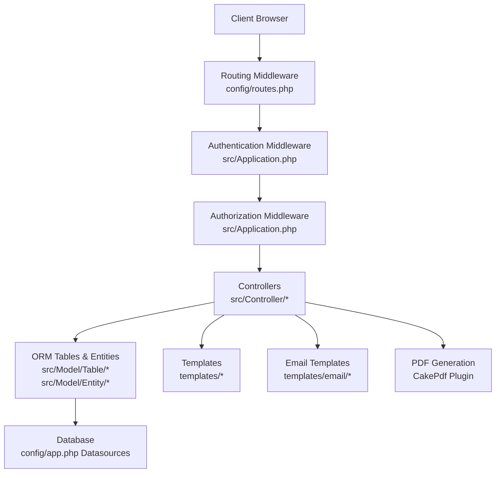
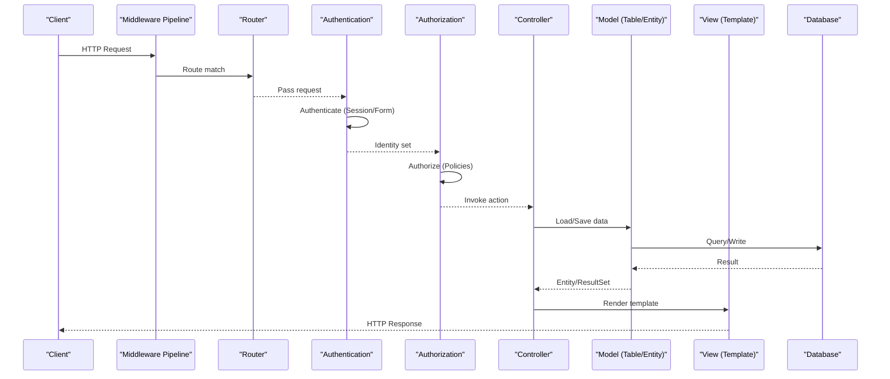
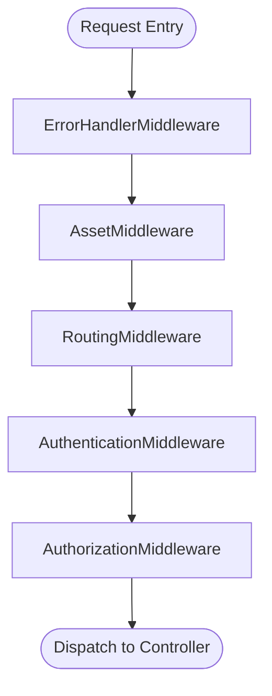
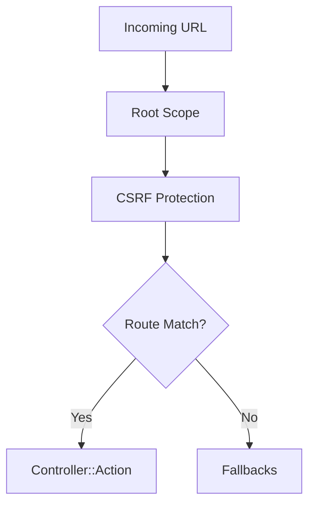
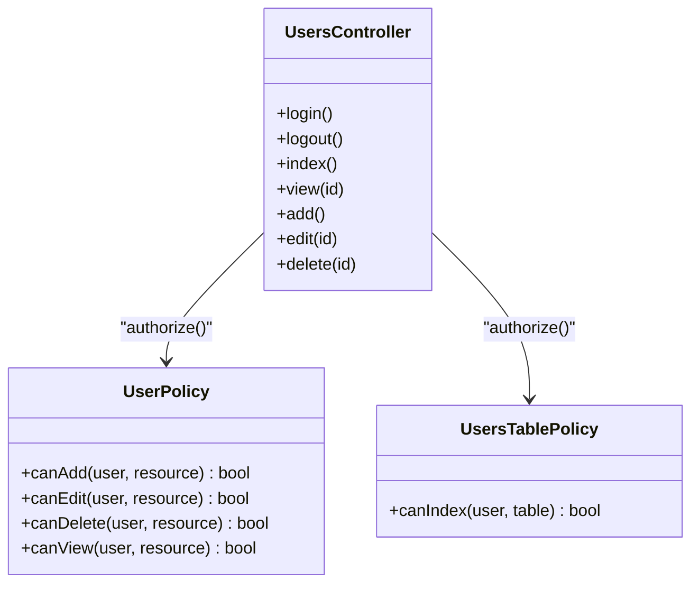
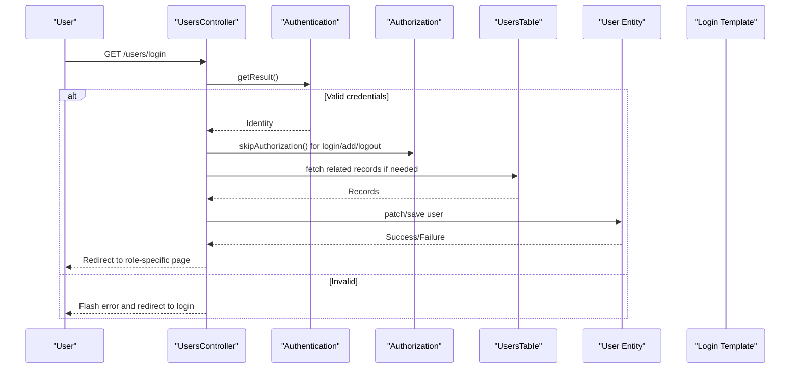
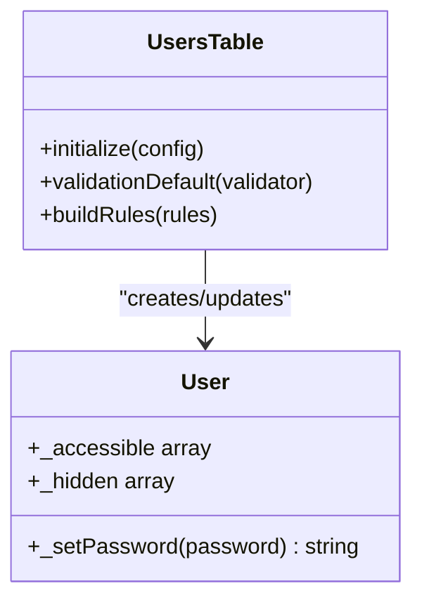
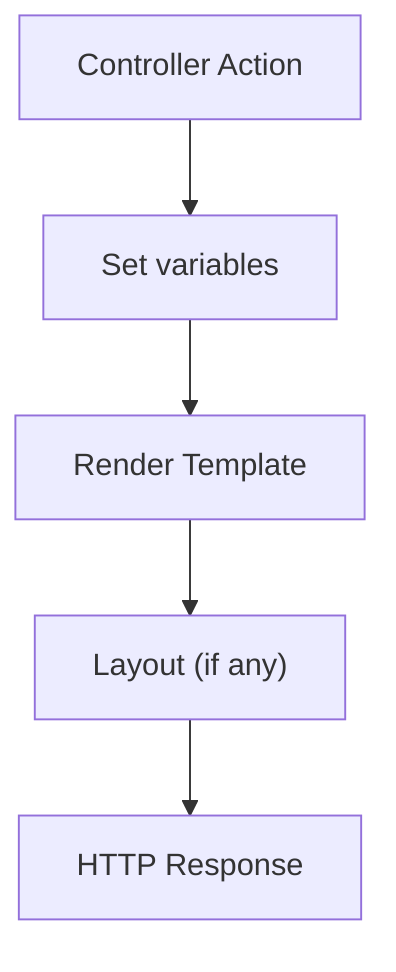
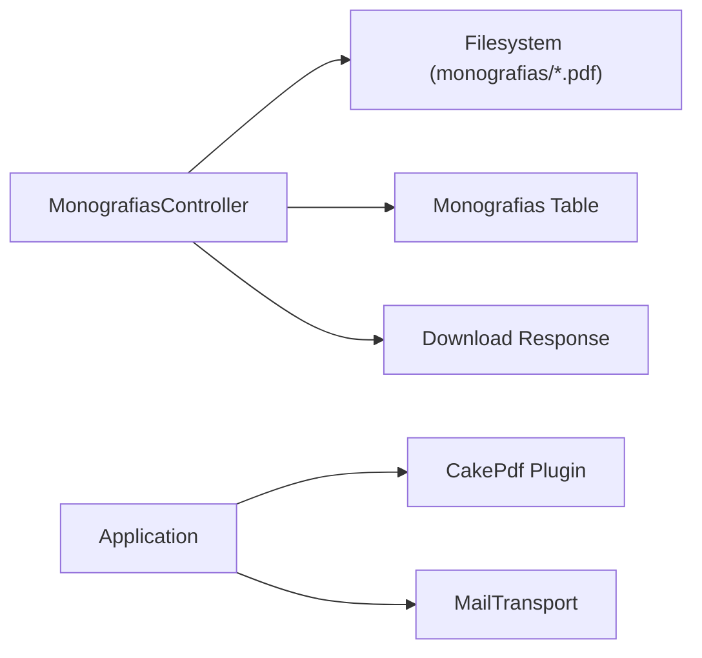
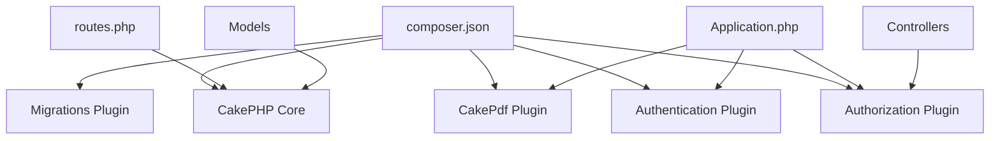

# Architecture Overview

<cite>
**Referenced Files in This Document**
- [Application.php](file://src/Application.php)
- [routes.php](file://config/routes.php)
- [AppController.php](file://src/Controller/AppController.php)
- [UsersController.php](file://src/Controller/UsersController.php)
- [UsersTable.php](file://src/Model/Table/UsersTable.php)
- [User.php](file://src/Model/Entity/User.php)
- [AppView.php](file://src/View/AppView.php)
- [login.php](file://templates/Users/login.php)
- [app.php](file://config/app.php)
- [composer.json](file://composer.json)
- [bootstrap.php](file://config/bootstrap.php)
- [MonografiasController.php](file://src/Controller/MonografiasController.php)
- [default.php (email html template)](file://templates/email/html/default.php)
- [UserPolicy.php](file://src/Policy/UserPolicy.php)
- [UsersTablePolicy.php](file://src/Policy/UsersTablePolicy.php)
</cite>

## Table of Contents
1. Introduction
2. Project Structure
3. Core Components
4. Architecture Overview
5. Detailed Component Analysis
6. Dependency Analysis
7. Performance Considerations
8. Troubleshooting Guide
9. Conclusion

## Introduction
This document describes the TCC5 system’s MVC architecture built on CakePHP 5. It explains how HTTP requests flow through routing, middleware (authentication and authorization), controllers, models, and views. It also documents technical decisions around adopting CakePHP, using its plugin architecture for authentication and authorization, and integrating external services such as PDF generation and email delivery.

## Project Structure
TCC5 follows a standard CakePHP layout:
- Application bootstrap and middleware are defined in src/Application.php.
- Routing is configured in config/routes.php.
- Controllers live under src/Controller with an application base controller AppController.
- Models use CakePHP ORM: Tables under src/Model/Table and Entities under src/Model/Entity.
- Views are templates under templates, with a base view class in src/View/AppView.php.
- Configuration lives under config/app.php and other files.
- Plugins include Authentication, Authorization, CakePdf, Migrations, and DebugKit.

**Diagram sources**
- [Application.php:91-113](file://src/Application.php#L91-L113)
- [routes.php:48-88](file://config/routes.php#L48-L88)
- [app.php:261-327](file://config/app.php#L261-L327)

**Section sources**
- [Application.php:62-83](file://src/Application.php#L62-L83)
- [routes.php:48-88](file://config/routes.php#L48-L88)
- [app.php:261-327](file://config/app.php#L261-L327)

## Core Components
- Application bootstrap registers plugins (DebugKit, CakePdf, Authorization, Authentication) and builds the middleware pipeline.
- Routing maps URLs to controllers/actions and applies CSRF protection at the route scope.
- Controllers extend AppController, which loads Flash, Authentication, and Authorization components and exposes the current identity to views.
- Models define ORM tables and entities with validation rules and relationships.
- Views render HTML using templates and helpers; email templates provide default HTML formatting.
- Policies enforce fine-grained authorization per entity or table.

Key responsibilities:
- Request lifecycle: HTTP request → Error handling → Assets → Routing → Authentication → Authorization → Controller action → Model operations → View rendering → Response.
- Security: Session-based login, form authenticator, CSRF protection, policy checks.
- Integrations: CakePdf for PDFs, MailTransport for emails.

**Section sources**
- [Application.php:62-83](file://src/Application.php#L62-L83)
- [Application.php:91-113](file://src/Application.php#L91-L113)
- [routes.php:48-88](file://config/routes.php#L48-L88)
- [AppController.php:44-67](file://src/Controller/AppController.php#L44-L67)
- [UsersTable.php:40-59](file://src/Model/Table/UsersTable.php#L40-L59)
- [User.php:38-58](file://src/Model/Entity/User.php#L38-L58)
- [AppView.php:38-40](file://src/View/AppView.php#L38-L40)
- [default.php (email html template):17-21](file://templates/email/html/default.php#L17-L21)

## Architecture Overview
The system uses CakePHP’s MVC pattern with explicit separation:
- Model: ORM tables/entities encapsulate data access, validation, and relationships.
- View: Templates render responses; email templates format messages.
- Controller: Orchestrates business logic, delegates to models, and selects views.
- Middleware: Centralizes cross-cutting concerns like error handling, asset serving, routing, authentication, and authorization.

**Diagram sources**
- [Application.php:91-113](file://src/Application.php#L91-L113)
- [routes.php:48-88](file://config/routes.php#L48-L88)
- [UsersController.php:34-156](file://src/Controller/UsersController.php#L34-L156)
- [UsersTable.php:40-59](file://src/Model/Table/UsersTable.php#L40-L59)
- [User.php:53-58](file://src/Model/Entity/User.php#L53-L58)

## Detailed Component Analysis

### Application Bootstrap and Middleware
- Registers plugins: DebugKit (dev only), CakePdf, Authorization, Authentication.
- Middleware stack order: Error handler → Asset middleware → Routing → Authentication → Authorization.
- Provides AuthenticationService and AuthorizationService implementations.

**Diagram sources**
- [Application.php:91-113](file://src/Application.php#L91-L113)
- [Application.php:135-171](file://src/Application.php#L135-L171)

**Section sources**
- [Application.php:62-83](file://src/Application.php#L62-L83)
- [Application.php:91-113](file://src/Application.php#L91-L113)
- [Application.php:135-171](file://src/Application.php#L135-L171)

### Routing
- Uses dashed routes and applies CSRF protection within the root scope.
- Connects home page and pages routes; includes fallbacks for dynamic controllers/actions.

**Diagram sources**
- [routes.php:48-88](file://config/routes.php#L48-L88)

**Section sources**
- [routes.php:48-88](file://config/routes.php#L48-L88)

### Authentication and Authorization
- Authentication:
  - Session authenticator first, then Form authenticator using email/password via Orm resolver.
  - Redirects unauthenticated users to a specific index and supports redirect query parameter.
- Authorization:
  - Uses OrmResolver with policies per entity/table.
  - Policies restrict actions based on user category.

**Diagram sources**
- [UserPolicy.php:21-61](file://src/Policy/UserPolicy.php#L21-L61)
- [UsersTablePolicy.php:22-24](file://src/Policy/UsersTablePolicy.php#L22-L24)
- [UsersController.php:34-156](file://src/Controller/UsersController.php#L34-L156)

**Section sources**
- [Application.php:135-171](file://src/Application.php#L135-L171)
- [AppController.php:44-67](file://src/Controller/AppController.php#L44-L67)
- [UserPolicy.php:21-61](file://src/Policy/UserPolicy.php#L21-L61)
- [UsersTablePolicy.php:22-24](file://src/Policy/UsersTablePolicy.php#L22-L24)

### Controller Layer
- AppController loads Flash, Authentication, and Authorization components and injects the current user into views.
- UsersController implements login/logout flows, registration, listing, viewing, editing, and deletion with appropriate authorization checks and redirects.

**Diagram sources**
- [UsersController.php:34-156](file://src/Controller/UsersController.php#L34-L156)
- [UsersTable.php:40-59](file://src/Model/Table/UsersTable.php#L40-L59)
- [User.php:53-58](file://src/Model/Entity/User.php#L53-L58)
- [login.php:13-35](file://templates/Users/login.php#L13-L35)

**Section sources**
- [AppController.php:44-67](file://src/Controller/AppController.php#L44-L67)
- [UsersController.php:34-156](file://src/Controller/UsersController.php#L34-L156)
- [login.php:13-35](file://templates/Users/login.php#L13-L35)

### Model Layer
- UsersTable defines table mapping, primary key, display field, and relationships to Alunos, Supervisores, Professores.
- Validation enforces required fields and constraints.
- RulesChecker ensures referential integrity for foreign keys.
- User entity mass-assignable fields and password hashing via DefaultPasswordHasher.

**Diagram sources**
- [UsersTable.php:40-59](file://src/Model/Table/UsersTable.php#L40-L59)
- [UsersTable.php:67-125](file://src/Model/Table/UsersTable.php#L67-L125)
- [User.php:38-58](file://src/Model/Entity/User.php#L38-L58)

**Section sources**
- [UsersTable.php:40-59](file://src/Model/Table/UsersTable.php#L40-L59)
- [UsersTable.php:67-125](file://src/Model/Table/UsersTable.php#L67-L125)
- [User.php:38-58](file://src/Model/Entity/User.php#L38-L58)

### View Layer
- AppView provides a base view class for common initialization.
- Login template renders a form for email/password and links to registration.
- Email templates provide default HTML formatting for outgoing messages.

**Diagram sources**
- [AppView.php:38-40](file://src/View/AppView.php#L38-L40)
- [login.php:13-35](file://templates/Users/login.php#L13-L35)
- [default.php (email html template):17-21](file://templates/email/html/default.php#L17-L21)

**Section sources**
- [AppView.php:38-40](file://src/View/AppView.php#L38-L40)
- [login.php:13-35](file://templates/Users/login.php#L13-L35)
- [default.php (email html template):17-21](file://templates/email/html/default.php#L17-L21)

### External Integrations: PDF and Email
- PDF Generation:
  - CakePdf plugin is loaded in Application bootstrap.
  - MonografiasController includes utilities to verify and update PDF file references and to serve downloads.
- Email:
  - Email transport configured in app.php using MailTransport.
  - Email templates under templates/email provide default HTML structure.

**Diagram sources**
- [Application.php:79-82](file://src/Application.php#L79-L82)
- [MonografiasController.php:406-512](file://src/Controller/MonografiasController.php#L406-L512)
- [app.php:206-246](file://config/app.php#L206-L246)

**Section sources**
- [Application.php:79-82](file://src/Application.php#L79-L82)
- [MonografiasController.php:406-512](file://src/Controller/MonografiasController.php#L406-L512)
- [app.php:206-246](file://config/app.php#L206-L246)

## Dependency Analysis
- Framework and plugins declared in composer.json: CakePHP core, Authentication, Authorization, Migrations, CakePdf, Dompdf, MobileDetect.
- Application bootstrap wires these plugins into the runtime.
- Routing and middleware depend on CakePHP core classes.
- Controllers depend on ORM tables/entities and policy classes.
- Models depend on database configuration.

**Diagram sources**
- [composer.json:7-15](file://composer.json#L7-L15)
- [Application.php:79-82](file://src/Application.php#L79-L82)
- [routes.php:48-88](file://config/routes.php#L48-L88)

**Section sources**
- [composer.json:7-15](file://composer.json#L7-L15)
- [Application.php:79-82](file://src/Application.php#L79-L82)

## Performance Considerations
- Enable route caching in production by configuring the RoutingMiddleware with a cache config name to reduce route resolution overhead.
- Use database connection settings appropriately (e.g., enable query logging only when needed).
- Prefer pagination for large datasets in controllers.
- Avoid unnecessary contains in ORM queries to prevent N+1 issues.
- Ensure assets have appropriate cache headers via AssetMiddleware configuration.

[No sources needed since this section provides general guidance]

## Troubleshooting Guide
- Authentication failures:
  - Verify session storage and cookie settings in app.php.
  - Confirm that loginUrl and identifier fields match the form inputs.
- Authorization denials:
  - Check policy methods for correct role checks (e.g., categoria == '1').
- Missing routes:
  - Ensure routes are registered and fallbacks are enabled if needed.
- Email not sending:
  - Validate MailTransport configuration and network access to mail server.
- PDF download errors:
  - Confirm file paths exist and permissions allow reading from webroot.

**Section sources**
- [app.php:398-400](file://config/app.php#L398-L400)
- [Application.php:135-164](file://src/Application.php#L135-L164)
- [UserPolicy.php:34-61](file://src/Policy/UserPolicy.php#L34-L61)
- [routes.php:48-88](file://config/routes.php#L48-L88)
- [app.php:206-246](file://config/app.php#L206-L246)
- [MonografiasController.php:499-512](file://src/Controller/MonografiasController.php#L499-L512)

## Conclusion
TCC5 adopts a clean MVC architecture on CakePHP 5 with robust authentication and authorization via dedicated plugins. The middleware pipeline centralizes cross-cutting concerns, while controllers orchestrate business logic using well-defined models and policies. Integrations for PDF generation and email are modular and configurable. This design promotes maintainability, security, and scalability for the TCC5 system.

[No sources needed since this section summarizes without analyzing specific files]