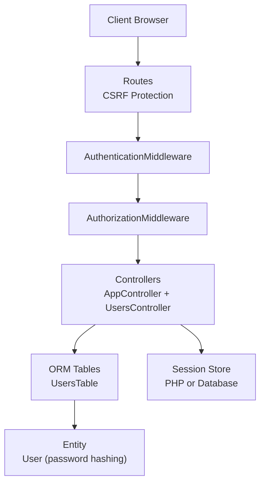
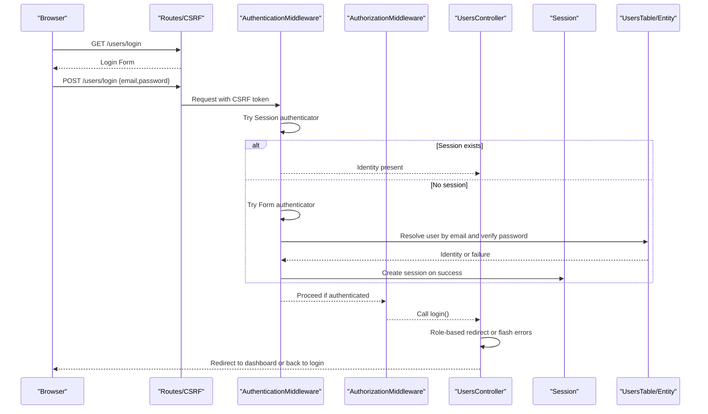
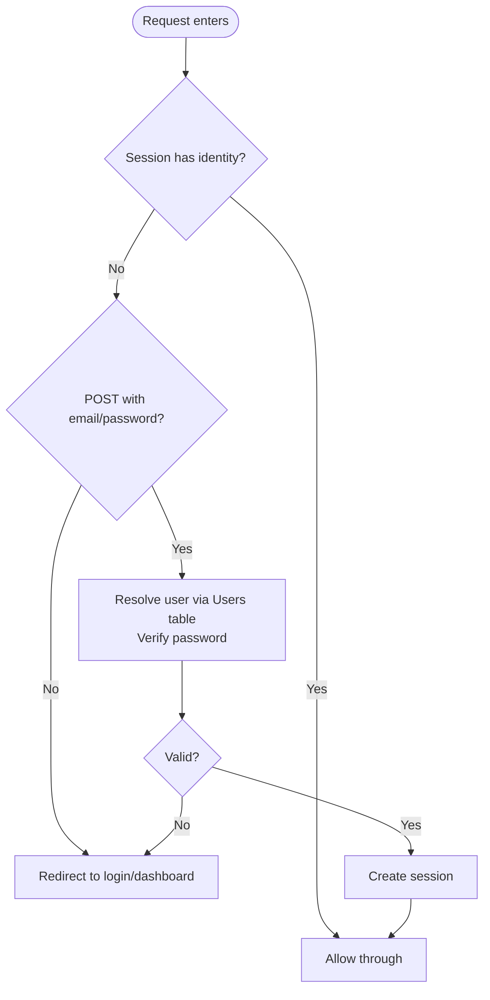
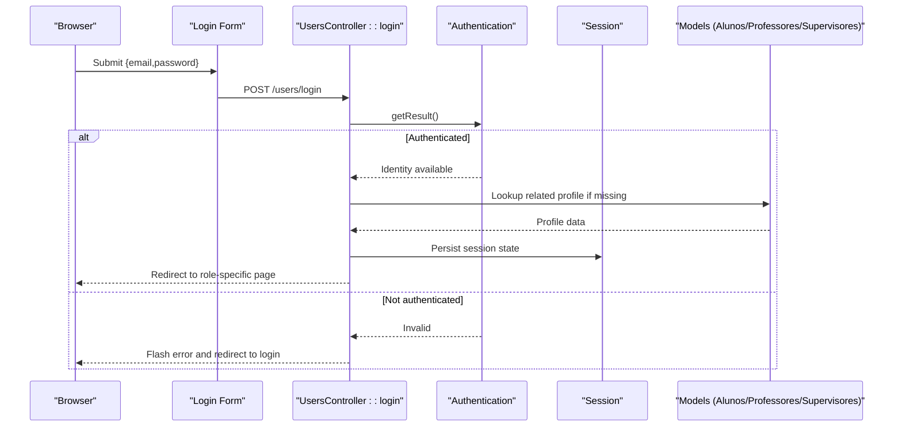
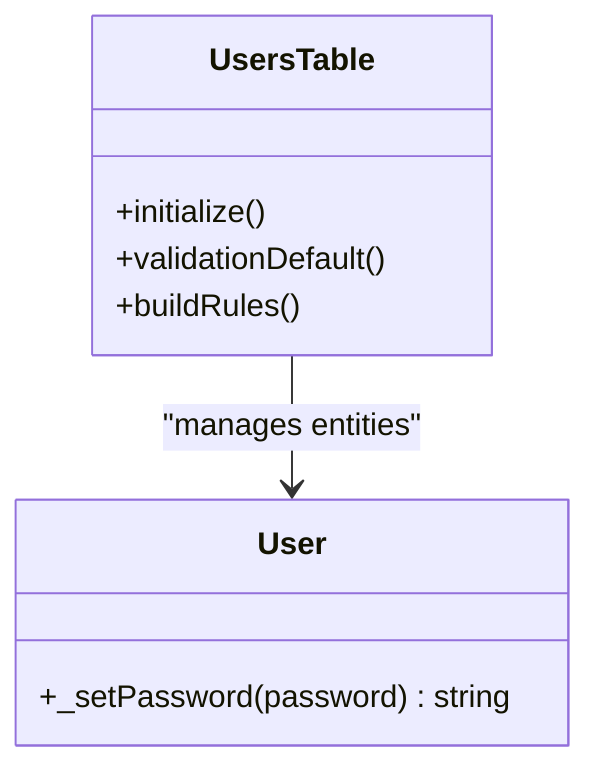
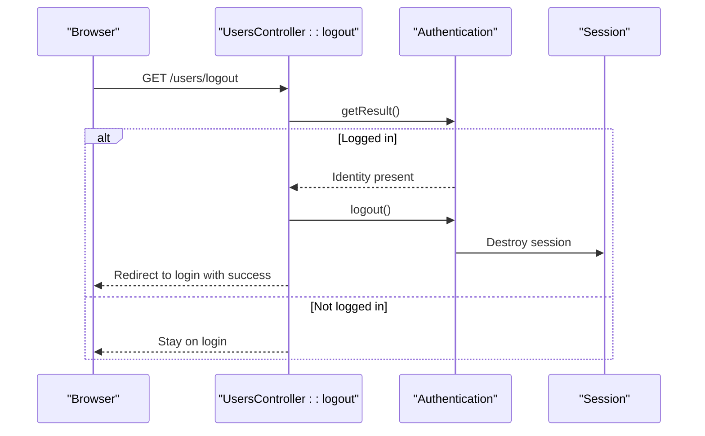
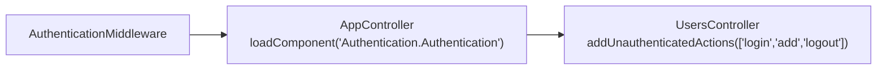
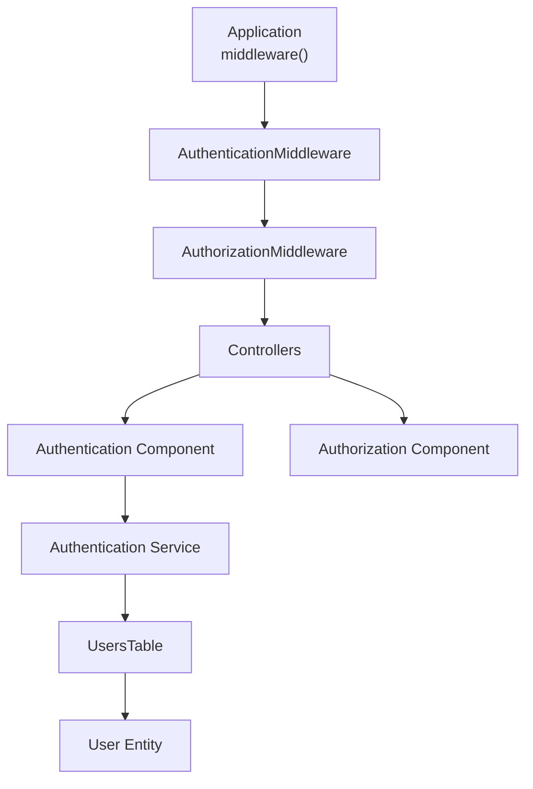

# Authentication Flow

<cite>
**Referenced Files in This Document**
- [Application.php](file://src/Application.php)
- [AppController.php](file://src/Controller/AppController.php)
- [UsersController.php](file://src/Controller/UsersController.php)
- [UsersTable.php](file://src/Model/Table/UsersTable.php)
- [User.php](file://src/Model/Entity/User.php)
- [login.php](file://templates/Users/login.php)
- [routes.php](file://config/routes.php)
- [app.php](file://config/app.php)
- [sessions.sql](file://config/schema/sessions.sql)
</cite>

## Table of Contents
1. [Introduction](#introduction)
2. [Project Structure](#project-structure)
3. [Core Components](#core-components)
4. [Architecture Overview](#architecture-overview)
5. [Detailed Component Analysis](#detailed-component-analysis)
6. [Dependency Analysis](#dependency-analysis)
7. [Performance Considerations](#performance-considerations)
8. [Troubleshooting Guide](#troubleshooting-guide)
9. [Conclusion](#conclusion)

## Introduction
This document explains the multi-layered authentication flow in the TCC5 system. It covers how HTTP requests are intercepted by middleware, how session-based and form-based authentication work together, how login forms submit credentials to verify against the Users table, and how sessions are managed for login and logout. It also documents configuration points for the Authentication plugin, redirect handling for unauthenticated users, error handling for invalid credentials, and security considerations such as CSRF protection and password hashing.

## Project Structure
The authentication flow spans several layers:
- Middleware layer: Application registers Authentication and Authorization middleware; routes apply CSRF protection.
- Controller layer: AppController loads components and sets global unauthenticated actions; UsersController handles login/logout and role-based redirects.
- Model layer: UsersTable defines the Users ORM mapping; User entity hashes passwords on save.
- Template layer: Login form posts email/password to /users/login.
- Configuration: Session defaults and schema for database-backed sessions.

**Diagram sources**
- [Application.php:91-113](file://src/Application.php#L91-L113)
- [routes.php:48-58](file://config/routes.php#L48-L58)
- [AppController.php:44-67](file://src/Controller/AppController.php#L44-L67)
- [UsersController.php:23-32](file://src/Controller/UsersController.php#L23-L32)
- [UsersTable.php:40-59](file://src/Model/Table/UsersTable.php#L40-L59)
- [User.php:53-58](file://src/Model/Entity/User.php#L53-L58)
- [app.php:398-400](file://config/app.php#L398-L400)

**Section sources**
- [Application.php:91-113](file://src/Application.php#L91-L113)
- [routes.php:48-58](file://config/routes.php#L48-L58)
- [AppController.php:44-67](file://src/Controller/AppController.php#L44-L67)
- [UsersController.php:23-32](file://src/Controller/UsersController.php#L23-L32)
- [UsersTable.php:40-59](file://src/Model/Table/UsersTable.php#L40-L59)
- [User.php:53-58](file://src/Model/Entity/User.php#L53-L58)
- [app.php:398-400](file://config/app.php#L398-L400)

## Core Components
- Authentication service configuration: Defines authenticators (session first, then form), form fields mapping (email/password), login URL, and password resolver using the Users model.
- Controllers: AppController loads Authentication and Authorization components and sets default unauthenticated actions; UsersController declares login/add/logout as unauthenticated and implements login/logout logic with role-based redirections.
- Models: UsersTable maps to the users table; User entity hashes passwords automatically when saving.
- Templates: Login form posts email and password to /users/login.
- Sessions: Configured via app.php; optional database-backed sessions via sessions.sql.

**Section sources**
- [Application.php:135-165](file://src/Application.php#L135-L165)
- [AppController.php:44-67](file://src/Controller/AppController.php#L44-L67)
- [UsersController.php:23-32](file://src/Controller/UsersController.php#L23-L32)
- [UsersTable.php:40-59](file://src/Model/Table/UsersTable.php#L40-L59)
- [User.php:53-58](file://src/Model/Entity/User.php#L53-L58)
- [login.php:14-31](file://templates/Users/login.php#L14-L31)
- [app.php:398-400](file://config/app.php#L398-L400)

## Architecture Overview
The request lifecycle integrates CakePHP’s middleware pipeline with the Authentication plugin:
- CSRF middleware protects POST requests.
- AuthenticationMiddleware runs after routing and before controllers, enforcing identity checks.
- AuthorizationMiddleware enforces access policies after authentication.
- Controllers handle business logic, including login processing and redirects.

**Diagram sources**
- [routes.php:48-58](file://config/routes.php#L48-L58)
- [Application.php:91-113](file://src/Application.php#L91-L113)
- [Application.php:135-165](file://src/Application.php#L135-L165)
- [UsersController.php:34-156](file://src/Controller/UsersController.php#L34-L156)
- [UsersTable.php:40-59](file://src/Model/Table/UsersTable.php#L40-L59)
- [User.php:53-58](file://src/Model/Entity/User.php#L53-L58)

## Detailed Component Analysis

### Authentication Service Configuration
- Authenticators order: Session first, then Form. This allows returning users to be recognized without re-entering credentials.
- Form authenticator:
  - Fields map username to email and password to password.
  - Uses a Password identifier with an ORM resolver targeting the Users model.
  - Login URL is set to /users/login.
- Unauthenticated redirect: When not logged in, requests are redirected to /muralestagios/index unless the action is explicitly allowed.

**Diagram sources**
- [Application.php:135-165](file://src/Application.php#L135-L165)

**Section sources**
- [Application.php:135-165](file://src/Application.php#L135-L165)

### Login Form Processing
- The login template renders a form with email and password fields that POST to /users/login.
- UsersController::login accepts GET and POST, skips authorization, and uses Authentication component to check result.
- On successful authentication, it inspects the user’s category to determine the target controller/action and performs role-specific updates and redirects.
- On failed POST attempts, it flashes an error message and redirects back to the login page.

**Diagram sources**
- [login.php:14-31](file://templates/Users/login.php#L14-L31)
- [UsersController.php:34-156](file://src/Controller/UsersController.php#L34-L156)

**Section sources**
- [login.php:14-31](file://templates/Users/login.php#L14-L31)
- [UsersController.php:34-156](file://src/Controller/UsersController.php#L34-L156)

### Password Verification Against Users Table
- The form authenticator uses the Password identifier with an ORM resolver configured to query the Users model.
- The UsersTable defines the table alias and primary key, enabling ORM resolution.
- The User entity overrides password setting to hash values before persistence, ensuring secure storage.

**Diagram sources**
- [UsersTable.php:40-59](file://src/Model/Table/UsersTable.php#L40-L59)
- [User.php:53-58](file://src/Model/Entity/User.php#L53-L58)

**Section sources**
- [UsersTable.php:40-59](file://src/Model/Table/UsersTable.php#L40-L59)
- [User.php:53-58](file://src/Model/Entity/User.php#L53-L58)

### Session Management and Logout
- Sessions are used to persist identity across requests. Default session handler is PHP; database-backed sessions are available via the provided schema.
- UsersController::logout clears the session and redirects to the login page with a success message.

**Diagram sources**
- [UsersController.php:158-171](file://src/Controller/UsersController.php#L158-L171)
- [app.php:398-400](file://config/app.php#L398-L400)
- [sessions.sql:8-15](file://config/schema/sessions.sql#L8-L15)

**Section sources**
- [UsersController.php:158-171](file://src/Controller/UsersController.php#L158-L171)
- [app.php:398-400](file://config/app.php#L398-L400)
- [sessions.sql:8-15](file://config/schema/sessions.sql#L8-L15)

### Integration with CakePHP Request Lifecycle
- Application registers Authentication and Authorization middleware in the correct order after routing.
- AppController loads Authentication and Authorization components and sets default unauthenticated actions globally.
- UsersController further whitelists login, add, and logout to bypass authentication checks.

**Diagram sources**
- [Application.php:91-113](file://src/Application.php#L91-L113)
- [AppController.php:44-67](file://src/Controller/AppController.php#L44-L67)
- [UsersController.php:23-32](file://src/Controller/UsersController.php#L23-L32)

**Section sources**
- [Application.php:91-113](file://src/Application.php#L91-L113)
- [AppController.php:44-67](file://src/Controller/AppController.php#L44-L67)
- [UsersController.php:23-32](file://src/Controller/UsersController.php#L23-L32)

### Error Handling for Invalid Credentials
- On failed authentication during POST to /users/login, the controller flashes an error message and redirects back to the login page.
- The form authenticator will not create a session when credentials are invalid, so subsequent requests will be treated as unauthenticated.

**Section sources**
- [UsersController.php:151-156](file://src/Controller/UsersController.php#L151-L156)

### Security Considerations
- CSRF Protection: Routes register CsrfProtectionMiddleware and apply it to the scope, protecting POST requests from cross-site request forgery.
- Password Hashing: The User entity hashes passwords automatically upon save using a default hasher, preventing plaintext storage.
- Session Security: Session defaults are configured; consider switching to database-backed sessions for distributed environments and ensure secure cookie settings in production.

**Section sources**
- [routes.php:48-58](file://config/routes.php#L48-L58)
- [User.php:53-58](file://src/Model/Entity/User.php#L53-L58)
- [app.php:398-400](file://config/app.php#L398-L400)

## Dependency Analysis
The authentication flow depends on:
- Application middleware ordering: Routing -> Authentication -> Authorization.
- Controllers relying on Authentication component to manage identity and session.
- Models providing ORM resolution and secure password handling.

**Diagram sources**
- [Application.php:91-113](file://src/Application.php#L91-L113)
- [Application.php:135-165](file://src/Application.php#L135-L165)
- [UsersController.php:23-32](file://src/Controller/UsersController.php#L23-L32)
- [UsersTable.php:40-59](file://src/Model/Table/UsersTable.php#L40-L59)
- [User.php:53-58](file://src/Model/Entity/User.php#L53-L58)

**Section sources**
- [Application.php:91-113](file://src/Application.php#L91-L113)
- [Application.php:135-165](file://src/Application.php#L135-L165)
- [UsersController.php:23-32](file://src/Controller/UsersController.php#L23-L32)
- [UsersTable.php:40-59](file://src/Model/Table/UsersTable.php#L40-L59)
- [User.php:53-58](file://src/Model/Entity/User.php#L53-L58)

## Performance Considerations
- Prefer database-backed sessions in multi-server deployments to avoid local file session bottlenecks.
- Ensure the Users table has appropriate indexes on email and foreign keys to speed up lookups during authentication and role resolution.
- Keep debug mode off in production to reduce overhead and avoid exposing sensitive information.

[No sources needed since this section provides general guidance]

## Troubleshooting Guide
Common issues and resolutions:
- Redirect loop or unexpected redirect to dashboard:
  - Verify unauthenticated actions include login, add, logout in UsersController.
  - Confirm Application’s getAuthenticationService sets the correct loginUrl and unauthenticatedRedirect.
- Login fails repeatedly:
  - Check that the form posts email and password fields matching the authenticator configuration.
  - Ensure the Users table contains valid hashed passwords and that the User entity’s password setter is active.
- CSRF validation errors on login:
  - Confirm CSRF middleware is applied and that the login form includes the required CSRF token.
- Session not persisting:
  - Validate session configuration and ensure the session store (PHP files or database) is writable/configured correctly.
  - If using database sessions, ensure the sessions table exists per schema.

**Section sources**
- [UsersController.php:23-32](file://src/Controller/UsersController.php#L23-L32)
- [Application.php:135-165](file://src/Application.php#L135-L165)
- [routes.php:48-58](file://config/routes.php#L48-L58)
- [app.php:398-400](file://config/app.php#L398-L400)
- [sessions.sql:8-15](file://config/schema/sessions.sql#L8-L15)

## Conclusion
The TCC5 authentication flow combines session-based and form-based mechanisms orchestrated by the Authentication plugin within CakePHP’s middleware pipeline. Controllers enforce access control, handle login/logout flows, and perform role-aware redirections. Security is reinforced by CSRF protection and secure password hashing. Proper configuration of authenticators, unauthenticated actions, and sessions ensures robust and maintainable authentication behavior across the application.