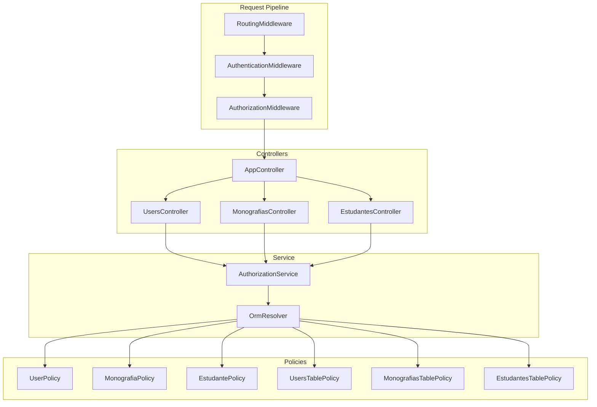
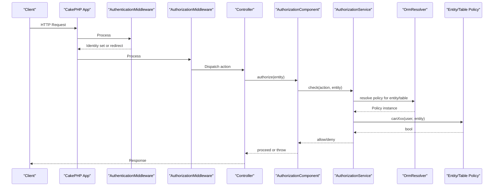
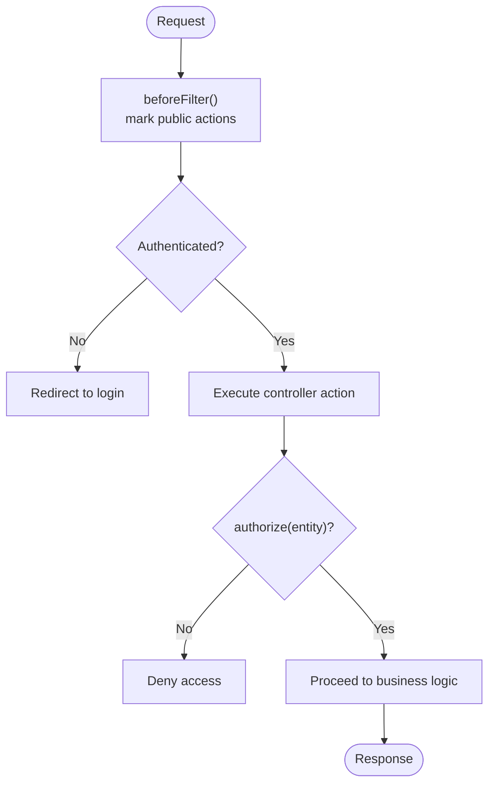
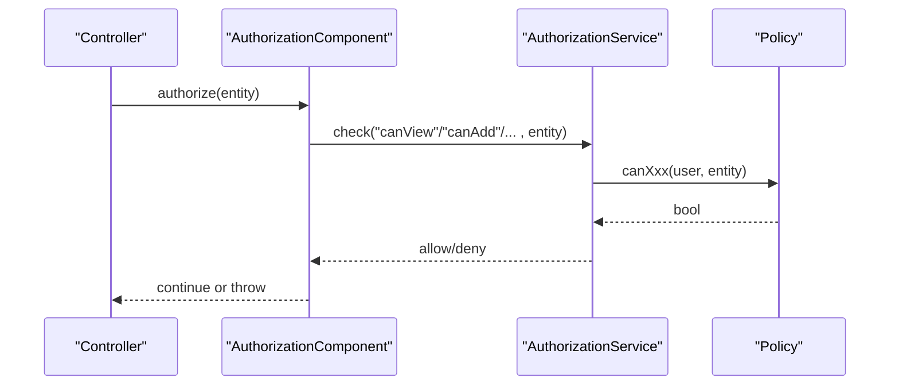
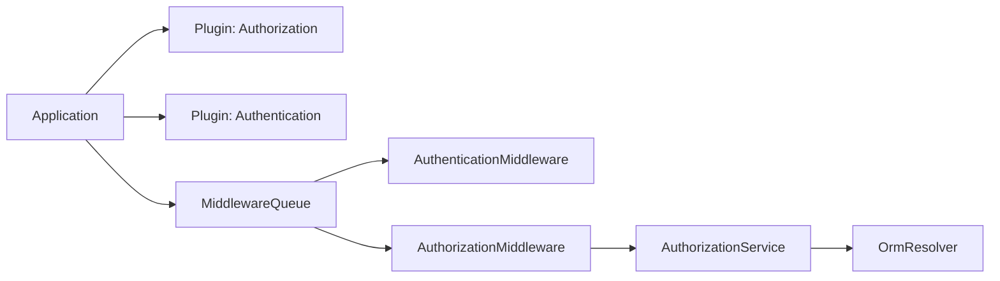

# Authorization Policies

<cite>
**Referenced Files in This Document**
- [Application.php](file://src/Application.php)
- [AppController.php](file://src/Controller/AppController.php)
- [UsersController.php](file://src/Controller/UsersController.php)
- [MonografiasController.php](file://src/Controller/MonografiasController.php)
- [EstudantesController.php](file://src/Controller/EstudantesController.php)
- [UserPolicy.php](file://src/Policy/UserPolicy.php)
- [MonografiaPolicy.php](file://src/Policy/MonografiaPolicy.php)
- [EstudantePolicy.php](file://src/Policy/EstudantePolicy.php)
- [UsersTablePolicy.php](file://src/Policy/UsersTablePolicy.php)
- [MonografiasTablePolicy.php](file://src/Policy/MonografiasTablePolicy.php)
- [EstudantesTablePolicy.php](file://src/Policy/EstudantesTablePolicy.php)
- [composer.lock](file://composer.lock)
</cite>

## Table of Contents
1. [Introduction](#introduction)
2. [Project Structure](#project-structure)
3. [Core Components](#core-components)
4. [Architecture Overview](#architecture-overview)
5. [Detailed Component Analysis](#detailed-component-analysis)
6. [Dependency Analysis](#dependency-analysis)
7. [Performance Considerations](#performance-considerations)
8. [Troubleshooting Guide](#troubleshooting-guide)
9. [Conclusion](#conclusion)
10. [Appendices](#appendices)

## Introduction
This document explains the authorization policy system in TCC5, focusing on how the Authorization plugin implements policy-based access control across controllers and entities. It details the policy pattern used for role-based decisions, the integration with CakePHP’s middleware and components, and the OrmResolver that maps policies to entities and tables. It also covers testing strategies, custom policy development, and performance considerations for large-scale applications.

## Project Structure
TCC5 organizes authorization logic into:
- Application-level configuration for Authentication and Authorization plugins and middleware
- Controllers that declare public actions and explicitly authorize resource operations
- Policy classes per entity/table that implement canAdd(), canEdit(), canDelete(), canView() (and table-level methods like canIndex())
- Table policies for list/index permissions

**Diagram sources**
- [Application.php:91-111](file://src/Application.php#L91-L111)
- [AppController.php:44-67](file://src/Controller/AppController.php#L44-L67)
- [UsersController.php:23-32](file://src/Controller/UsersController.php#L23-L32)
- [MonografiasController.php:33-39](file://src/Controller/MonografiasController.php#L33-L39)
- [EstudantesController.php:27-40](file://src/Controller/EstudantesController.php#L27-L40)
- [UserPolicy.php:12-63](file://src/Policy/UserPolicy.php#L12-L63)
- [MonografiaPolicy.php:12-62](file://src/Policy/MonografiaPolicy.php#L12-L62)
- [EstudantePolicy.php:13-59](file://src/Policy/EstudantePolicy.php#L13-L59)
- [UsersTablePolicy.php:13-26](file://src/Policy/UsersTablePolicy.php#L13-L26)
- [MonografiasTablePolicy.php:13-26](file://src/Policy/MonografiasTablePolicy.php#L13-L26)
- [EstudantesTablePolicy.php:13-26](file://src/Policy/EstudantesTablePolicy.php#L13-L26)

**Section sources**
- [Application.php:81-82](file://src/Application.php#L81-L82)
- [Application.php:91-111](file://src/Application.php#L91-L111)
- [AppController.php:44-67](file://src/Controller/AppController.php#L44-L67)

## Core Components
- Authorization service and resolver: The application registers the Authorization plugin and provides an AuthorizationService backed by an OrmResolver, enabling automatic policy discovery based on entities and tables.
- Middleware pipeline: Authentication runs before Authorization so that a user identity is available when policies evaluate permissions.
- Controller integration: Controllers load the Authorization component, mark public actions via beforeFilter(), and call $this->Authorization->authorize($entity) to enforce policies on specific resources.
- Policies: Each entity has a policy class implementing canAdd/canEdit/canDelete/canView, and each table may have a TablePolicy for list/index permissions.

Key implementation references:
- Service setup and resolver: [Application.php:167-171](file://src/Application.php#L167-L171)
- Middleware order: [Application.php:91-111](file://src/Application.php#L91-L111)
- Component loading and unauthenticated actions: [AppController.php:44-67](file://src/Controller/AppController.php#L44-L67)

**Section sources**
- [Application.php:81-82](file://src/Application.php#L81-L82)
- [Application.php:91-111](file://src/Application.php#L91-L111)
- [Application.php:167-171](file://src/Application.php#L167-L171)
- [AppController.php:44-67](file://src/Controller/AppController.php#L44-L67)

## Architecture Overview
The request flow enforces authentication first, then authorization. Controllers explicitly authorize resource operations using the Authorization component. Policies encapsulate business rules for each entity and role.

**Diagram sources**
- [Application.php:91-111](file://src/Application.php#L91-L111)
- [Application.php:167-171](file://src/Application.php#L167-L171)
- [UsersController.php:203-205](file://src/Controller/UsersController.php#L203-L205)
- [MonografiasController.php:104-105](file://src/Controller/MonografiasController.php#L104-L105)
- [EstudantesController.php:128-129](file://src/Controller/EstudantesController.php#L128-L129)

## Detailed Component Analysis

### UserPolicy
Implements granular permissions for the User entity:
- canAdd(): Allows creation without restriction in this policy.
- canEdit()/canDelete()/canView(): Restricted to users with a specific role code.

Role-based decisions are derived from the authenticated user’s role attribute.

**Section sources**
- [UserPolicy.php:21-25](file://src/Policy/UserPolicy.php#L21-L25)
- [UserPolicy.php:34-37](file://src/Policy/UserPolicy.php#L34-L37)
- [UserPolicy.php:46-49](file://src/Policy/UserPolicy.php#L46-L49)
- [UserPolicy.php:58-61](file://src/Policy/UserPolicy.php#L58-L61)

### MonografiaPolicy
Implements permissions for Monografia entities:
- canAdd()/canEdit()/canDelete(): Restricted to administrators based on role code.
- canView(): Open to all authenticated users.

Context-aware checks rely on the current identity’s role attribute.

**Section sources**
- [MonografiaPolicy.php:21-24](file://src/Policy/MonografiaPolicy.php#L21-L24)
- [MonografiaPolicy.php:33-36](file://src/Policy/MonografiaPolicy.php#L33-L36)
- [MonografiaPolicy.php:45-48](file://src/Policy/MonografiaPolicy.php#L45-L48)
- [MonografiaPolicy.php:57-61](file://src/Policy/MonografiaPolicy.php#L57-L61)

### EstudantePolicy
Implements permissions for Estudante entities:
- canAdd()/canEdit()/canDelete(): Restricted to administrators based on role code.
- canView(): Open to all authenticated users.

**Section sources**
- [EstudantePolicy.php:22-24](file://src/Policy/EstudantePolicy.php#L22-L24)
- [EstudantePolicy.php:33-35](file://src/Policy/EstudantePolicy.php#L33-L35)
- [EstudantePolicy.php:44-46](file://src/Policy/EstudantePolicy.php#L44-L46)
- [EstudantePolicy.php:55-57](file://src/Policy/EstudantePolicy.php#L55-L57)

### Table Policies (List/Index Access)
- UsersTablePolicy.canIndex(): Restricts listing users to administrators.
- MonografiasTablePolicy.canIndex(): Restricts listing monographs to administrators.
- EstudantesTablePolicy.canIndex(): Allows both administrators and students to list students.

These policies complement entity policies by controlling collection-level access.

**Section sources**
- [UsersTablePolicy.php:22-24](file://src/Policy/UsersTablePolicy.php#L22-L24)
- [MonografiasTablePolicy.php:22-24](file://src/Policy/MonografiasTablePolicy.php#L22-L24)
- [EstudantesTablePolicy.php:22-24](file://src/Policy/EstudantesTablePolicy.php#L22-L24)

### Controller Integration and beforeFilter()
- AppController loads Authentication and Authorization components and marks common public actions (index, view, busca, download).
- UsersController overrides beforeFilter() to allow login/add/logout without authentication and uses skipAuthorization() where appropriate.
- MonografiasController and EstudantesController similarly manage public actions and explicit authorization calls for resource mutations.

**Diagram sources**
- [AppController.php:44-67](file://src/Controller/AppController.php#L44-L67)
- [UsersController.php:23-32](file://src/Controller/UsersController.php#L23-L32)
- [MonografiasController.php:33-39](file://src/Controller/MonografiasController.php#L33-L39)
- [EstudantesController.php:27-40](file://src/Controller/EstudantesController.php#L27-L40)

**Section sources**
- [AppController.php:44-67](file://src/Controller/AppController.php#L44-L67)
- [UsersController.php:23-32](file://src/Controller/UsersController.php#L23-L32)
- [MonografiasController.php:33-39](file://src/Controller/MonografiasController.php#L33-L39)
- [EstudantesController.php:27-40](file://src/Controller/EstudantesController.php#L27-L40)

### OrmResolver Mapping
The OrmResolver automatically maps:
- Entity policies (e.g., UserPolicy -> User entity)
- Table policies (e.g., UsersTablePolicy -> Users table)

This mapping enables consistent authorization checks across CRUD operations without manual wiring.

**Section sources**
- [Application.php:167-171](file://src/Application.php#L167-L171)

### Authorization Enforcement in Controllers
Examples of explicit authorization usage:
- Users::view(): authorizes viewing a specific user
- Monografias::add(): authorizes creating a new monograph
- Estudantes::view(): authorizes viewing a specific student

**Diagram sources**
- [UsersController.php:203-205](file://src/Controller/UsersController.php#L203-L205)
- [MonografiasController.php:104-105](file://src/Controller/MonografiasController.php#L104-L105)
- [EstudantesController.php:128-129](file://src/Controller/EstudantesController.php#L128-L129)

**Section sources**
- [UsersController.php:203-205](file://src/Controller/UsersController.php#L203-L205)
- [MonografiasController.php:104-105](file://src/Controller/MonografiasController.php#L104-L105)
- [EstudantesController.php:128-129](file://src/Controller/EstudantesController.php#L128-L129)

## Dependency Analysis
- Plugins: Authorization and Authentication are loaded during bootstrap and integrated via middleware.
- Composer dependencies confirm the presence of cakephp/authentication and cakephp/orm suggestions for OrmResolver usage.

**Diagram sources**
- [Application.php:81-82](file://src/Application.php#L81-L82)
- [Application.php:91-111](file://src/Application.php#L91-L111)
- [Application.php:167-171](file://src/Application.php#L167-L171)
- [composer.lock:100-108](file://composer.lock#L100-L108)

**Section sources**
- [Application.php:81-82](file://src/Application.php#L81-L82)
- [Application.php:91-111](file://src/Application.php#L91-L111)
- [composer.lock:100-108](file://composer.lock#L100-L108)

## Performance Considerations
- Prefer minimal use of skipAuthorization() to reduce bypassing security checks; only use it for truly public endpoints.
- Keep policy logic lightweight; avoid heavy queries inside canXxx() methods. Cache expensive lookups if necessary.
- Use table policies for list/index restrictions to prevent unnecessary entity-level checks on collections.
- Ensure database indexes support role-based filters and foreign keys used in policies to minimize query costs.
- Avoid N+1 queries in controllers when preparing data for views; use contain() and selective fields.

[No sources needed since this section provides general guidance]

## Troubleshooting Guide
Common issues and resolutions:
- Unauthorized access errors: Verify that the correct policy exists for the entity/table and that the method name matches the operation (canAdd/canEdit/canDelete/canView/canIndex).
- Public actions still prompting login: Confirm that beforeFilter() includes the action in addUnauthenticatedActions() and that skipAuthorization() is not inadvertently used.
- Inconsistent behavior between index and view: Ensure table policies cover list access and entity policies cover item-level access.
- Debugging tips: Temporarily log the identity and requested action in controllers; ensure AuthorizationMiddleware runs after AuthenticationMiddleware.

**Section sources**
- [AppController.php:44-67](file://src/Controller/AppController.php#L44-L67)
- [UsersController.php:23-32](file://src/Controller/UsersController.php#L23-L32)
- [MonografiasController.php:33-39](file://src/Controller/MonografiasController.php#L33-L39)
- [EstudantesController.php:27-40](file://src/Controller/EstudantesController.php#L27-L40)

## Conclusion
TCC5’s authorization system leverages CakePHP’s Authorization plugin with a clear separation of concerns: middleware handles authentication and enforcement, controllers orchestrate requests and explicitly authorize resources, and policies encapsulate role-based and context-aware rules. The OrmResolver simplifies policy resolution, while table policies provide efficient list-level controls. Following the patterns shown here ensures scalable, maintainable access control across the application.

[No sources needed since this section summarizes without analyzing specific files]

## Appendices

### Testing Strategies
- Unit tests for policies: Instantiate policies with mock identities and resources to assert allowed/denied outcomes for each canXxx() method.
- Integration tests for controllers: Use CakePHP’s IntegrationTestTrait to simulate authenticated and unauthenticated requests, asserting redirects or access denials.
- Fixtures: Prepare test data for roles and entities to validate policy decisions across scenarios.

Example test scaffolding references:
- [UsersControllerTest.php:15-118](file://tests/TestCase/Controller/UsersControllerTest.php#L15-L118)
- [MonografiasControllerTest.php:15-140](file://tests/TestCase/Controller/MonografiasControllerTest.php#L15-L140)

**Section sources**
- [UsersControllerTest.php:15-118](file://tests/TestCase/Controller/UsersControllerTest.php#L15-L118)
- [MonografiasControllerTest.php:15-140](file://tests/TestCase/Controller/MonografiasControllerTest.php#L15-L140)

### Custom Policy Development Checklist
- Create a policy class named <Entity>Policy under src/Policy.
- Implement canAdd(), canEdit(), canDelete(), canView() returning booleans based on the identity and resource.
- If list access differs, create a <Entity>TablePolicy with canIndex().
- Ensure the OrmResolver can discover your policy (naming convention and namespace).
- Add controller-side authorize() calls for mutation endpoints; mark public endpoints in beforeFilter().

**Section sources**
- [Application.php:167-171](file://src/Application.php#L167-L171)
- [UserPolicy.php:12-63](file://src/Policy/UserPolicy.php#L12-L63)
- [MonografiaPolicy.php:12-62](file://src/Policy/MonografiaPolicy.php#L12-L62)
- [EstudantePolicy.php:13-59](file://src/Policy/EstudantePolicy.php#L13-L59)
- [UsersTablePolicy.php:13-26](file://src/Policy/UsersTablePolicy.php#L13-L26)
- [MonografiasTablePolicy.php:13-26](file://src/Policy/MonografiasTablePolicy.php#L13-L26)
- [EstudantesTablePolicy.php:13-26](file://src/Policy/EstudantesTablePolicy.php#L13-L26)