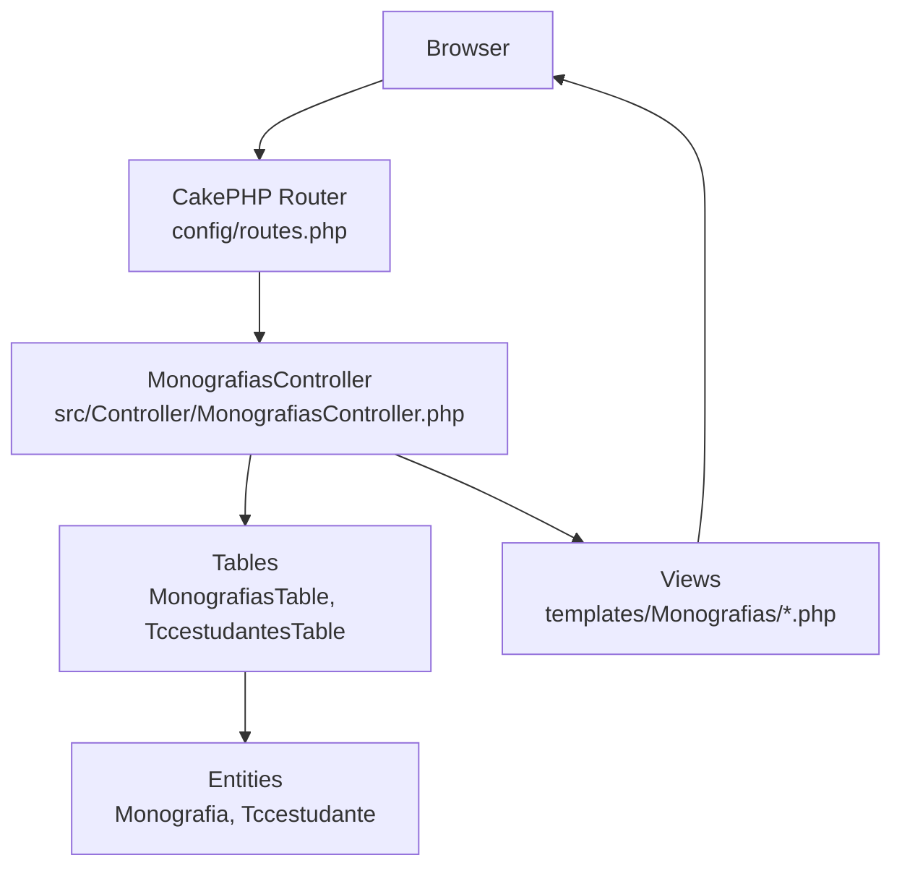
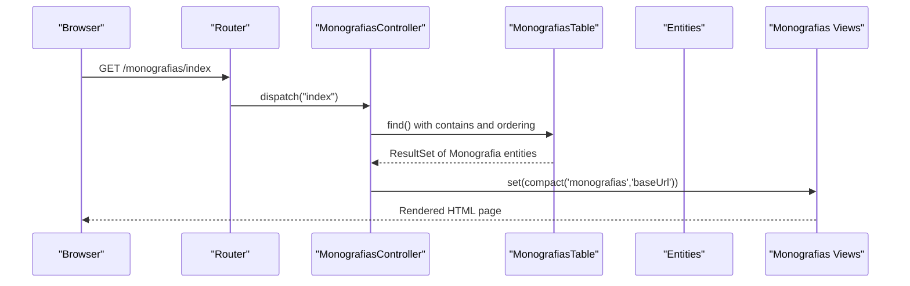
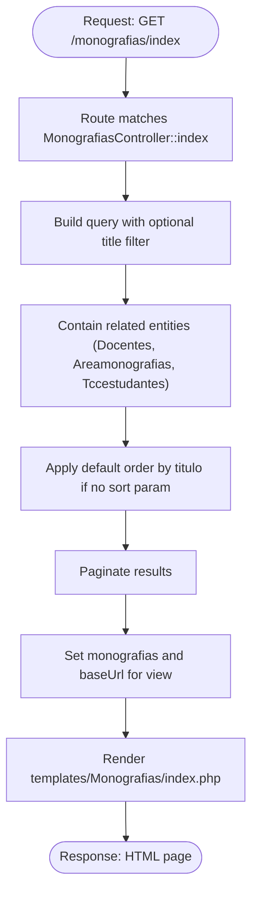
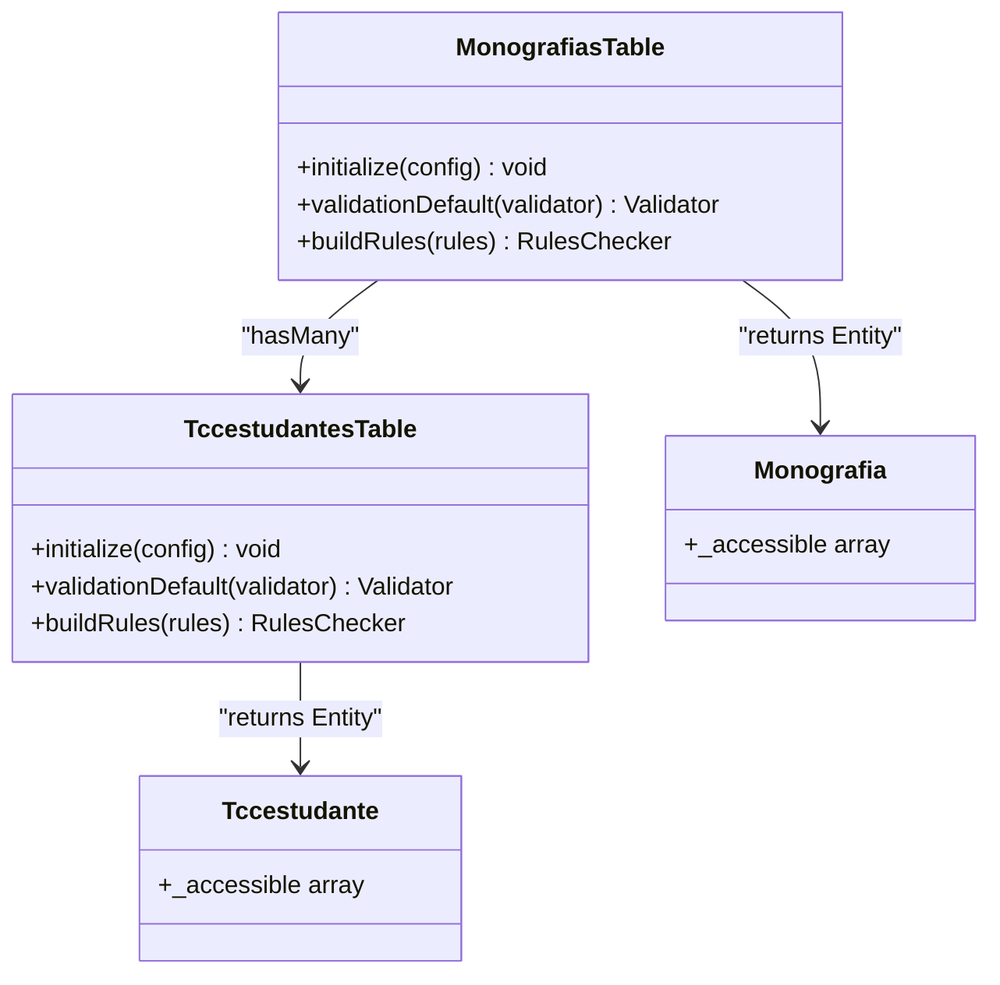
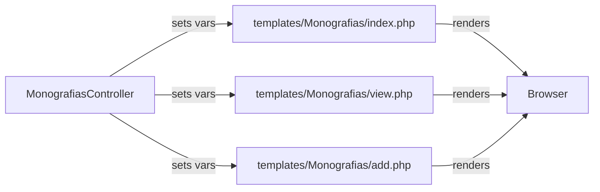
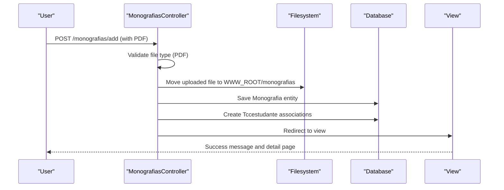
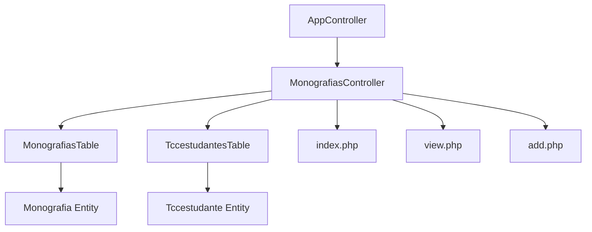

# MVC Pattern Implementation

<cite>
**Referenced Files in This Document**
- [MonografiasController.php](file://src/Controller/MonografiasController.php)
- [AppController.php](file://src/Controller/AppController.php)
- [routes.php](file://config/routes.php)
- [MonografiasTable.php](file://src/Model/Table/MonografiasTable.php)
- [TccestudantesTable.php](file://src/Model/Table/TccestudantesTable.php)
- [Monografia.php](file://src/Model/Entity/Monografia.php)
- [Tccestudante.php](file://src/Model/Entity/Tccestudante.php)
- [index.php (Monografias view)](file://templates/Monografias/index.php)
- [view.php (Monografias view)](file://templates/Monografias/view.php)
- [add.php (Monografias view)](file://templates/Monografias/add.php)
</cite>

## Table of Contents
1. [Introduction](#introduction)
2. [Project Structure](#project-structure)
3. [Core Components](#core-components)
4. [Architecture Overview](#architecture-overview)
5. [Detailed Component Analysis](#detailed-component-analysis)
6. [Dependency Analysis](#dependency-analysis)
7. [Performance Considerations](#performance-considerations)
8. [Troubleshooting Guide](#troubleshooting-guide)
9. [Conclusion](#conclusion)

## Introduction
This document explains how the TCC5 application implements the Model-View-Controller (MVC) pattern using CakePHP. It focuses on separation of concerns: controllers handle HTTP requests and orchestrate business logic; models manage data access, relationships, and validation via Table classes and Entities; views render HTML templates with embedded PHP to present data to users. The Monografias module is used as a concrete example to illustrate request flow from routing through controller actions, model operations for database interactions, and view rendering for user interfaces.

## Project Structure
The application follows a standard CakePHP layout:
- Controllers under src/Controller handle HTTP requests and coordinate between Models and Views.
- Models under src/Model/Table define data access and associations; Entities under src/Model/Entity represent records and encapsulate behavior.
- Views under templates/<Controller>/ contain PHP templates that render HTML.
- Routes under config/routes.php map URLs to controller actions.

**Diagram sources**
- [routes.php:48-88](file://config/routes.php#L48-L88)
- [MonografiasController.php:25-75](file://src/Controller/MonografiasController.php#L25-L75)
- [MonografiasTable.php:32-100](file://src/Model/Table/MonografiasTable.php#L32-L100)
- [TccestudantesTable.php:25-57](file://src/Model/Table/TccestudantesTable.php#L25-L57)
- [Monografia.php:34-72](file://src/Model/Entity/Monografia.php#L34-L72)
- [Tccestudante.php:17-35](file://src/Model/Entity/Tccestudante.php#L17-L35)
- [index.php (Monografias view):1-110](file://templates/Monografias/index.php#L1-L110)

**Section sources**
- [routes.php:48-88](file://config/routes.php#L48-L88)
- [MonografiasController.php:25-75](file://src/Controller/MonografiasController.php#L25-L75)

## Core Components
- Controllers:
  - AppController sets up global components (Flash, Authentication, Authorization) and makes certain actions public.
  - MonografiasController implements CRUD-like actions (index, view, add, edit, delete), file upload handling, and coordination with related tables.
- Models:
  - MonografiasTable defines table configuration, associations (to Docentes, Areamonografias, Tccestudantes), behaviors (CounterCache), validation rules, and integrity rules.
  - TccestudantesTable defines associations back to Monografias and Estudantes, plus validation and rules.
  - Entities (Monografia, Tccestudante) expose accessible fields and relationships for mass assignment and ORM hydration.
- Views:
  - Monografias index, view, and add templates render lists, details, and forms using CakePHP Form and Html helpers, pagination, and elements.

Key responsibilities:
- Controllers parse requests, authorize access, interact with Tables, set view variables, and return responses or redirect.
- Tables encapsulate queries, associations, validations, and persistence.
- Entities provide domain objects with controlled mutability and relationship access.
- Views focus purely on presentation, consuming entities and helpers without business logic.

**Section sources**
- [AppController.php:33-69](file://src/Controller/AppController.php#L33-L69)
- [MonografiasController.php:25-513](file://src/Controller/MonografiasController.php#L25-L513)
- [MonografiasTable.php:32-189](file://src/Model/Table/MonografiasTable.php#L32-L189)
- [TccestudantesTable.php:25-99](file://src/Model/Table/TccestudantesTable.php#L25-L99)
- [Monografia.php:34-72](file://src/Model/Entity/Monografia.php#L34-L72)
- [Tccestudante.php:17-35](file://src/Model/Entity/Tccestudante.php#L17-L35)
- [index.php (Monografias view):1-110](file://templates/Monografias/index.php#L1-L110)
- [view.php (Monografias view):1-121](file://templates/Monografias/view.php#L1-L121)
- [add.php (Monografias view):1-366](file://templates/Monografias/add.php#L1-L366)

## Architecture Overview
The MVC request flow in TCC5:
1. Routing maps incoming URLs to controller actions (e.g., /monografias/index).
2. MonografiasController action processes the request: reads input, authorizes, queries models, and prepares data for the view.
3. Models (Tables) perform database operations, enforce validation, and manage relationships.
4. Views render HTML using entities and helpers, presenting data to the user.

**Diagram sources**
- [routes.php:72-87](file://config/routes.php#L72-L87)
- [MonografiasController.php:46-75](file://src/Controller/MonografiasController.php#L46-L75)
- [MonografiasTable.php:41-100](file://src/Model/Table/MonografiasTable.php#L41-L100)
- [index.php (Monografias view):1-110](file://templates/Monografias/index.php#L1-L110)

## Detailed Component Analysis

### Request Flow: Index Action
- Routing: /monografias/index maps to MonografiasController::index.
- Controller: Builds a query with optional title filter, contains related entities (Docentes, Areamonografias, Tccestudantes), applies sorting and pagination, then sets variables for the view.
- Model: MonografiasTable provides find() with configured associations and CounterCache behavior for area counts.
- View: Renders a paginated list with search form, sortable columns, links to related entities, and PDF download links.

**Diagram sources**
- [routes.php:72-87](file://config/routes.php#L72-L87)
- [MonografiasController.php:46-75](file://src/Controller/MonografiasController.php#L46-L75)
- [MonografiasTable.php:41-100](file://src/Model/Table/MonografiasTable.php#L41-L100)
- [index.php (Monografias view):1-110](file://templates/Monografias/index.php#L1-L110)

**Section sources**
- [MonografiasController.php:46-75](file://src/Controller/MonografiasController.php#L46-L75)
- [MonografiasTable.php:41-100](file://src/Model/Table/MonografiasTable.php#L41-L100)
- [index.php (Monografias view):1-110](file://templates/Monografias/index.php#L1-L110)

### Data Access and Relationships: MonografiasTable
- Associations:
  - BelongsTo Docentes (advisor), multiple Docentes aliases for co-advisor and panel members.
  - BelongsTo Areamonografias (area).
  - HasMany Tccestudantes (student associations).
- Behavior: CounterCache updates area counts when monografias change.
- Validation: Field types, lengths, and allowEmpty configurations.
- Rules: Existence checks for professor and area foreign keys.

**Diagram sources**
- [MonografiasTable.php:32-189](file://src/Model/Table/MonografiasTable.php#L32-L189)
- [TccestudantesTable.php:25-99](file://src/Model/Table/TccestudantesTable.php#L25-L99)
- [Monografia.php:34-72](file://src/Model/Entity/Monografia.php#L34-L72)
- [Tccestudante.php:17-35](file://src/Model/Entity/Tccestudante.php#L17-L35)

**Section sources**
- [MonografiasTable.php:41-189](file://src/Model/Table/MonografiasTable.php#L41-L189)
- [TccestudantesTable.php:34-99](file://src/Model/Table/TccestudantesTable.php#L34-L99)
- [Monografia.php:34-72](file://src/Model/Entity/Monografia.php#L34-L72)
- [Tccestudante.php:17-35](file://src/Model/Entity/Tccestudante.php#L17-L35)

### View Rendering: Templates
- index.php:
  - Displays search form, paginated table, sortable headers, and links to related entities.
  - Uses helpers like Form, Html, Paginator, and element includes.
- view.php:
  - Presents detailed information about a single monografia, including associated students, advisor, co-advisor, area, defense date, and PDF link.
- add.php:
  - Provides a comprehensive form for creating a new monografia, including student selection, metadata, and PDF upload field. Integrates CKEditor for rich text editing.

**Diagram sources**
- [MonografiasController.php:46-75](file://src/Controller/MonografiasController.php#L46-L75)
- [index.php (Monografias view):1-110](file://templates/Monografias/index.php#L1-L110)
- [view.php (Monografias view):1-121](file://templates/Monografias/view.php#L1-L121)
- [add.php (Monografias view):1-366](file://templates/Monografias/add.php#L1-L366)

**Section sources**
- [index.php (Monografias view):1-110](file://templates/Monografias/index.php#L1-L110)
- [view.php (Monografias view):1-121](file://templates/Monografias/view.php#L1-L121)
- [add.php (Monografias view):1-366](file://templates/Monografias/add.php#L1-L366)

### File Upload and Download Workflow
- Add workflow:
  - Controller handles POST, validates uploaded file type (PDF only), moves file to webroot directory, and stores filename in entity before saving.
  - After saving, associates selected students with the monografia via Tccestudantes.
- Download workflow:
  - Controller serves files from disk with appropriate headers, or shows error and redirects if not found.

**Diagram sources**
- [MonografiasController.php:102-170](file://src/Controller/MonografiasController.php#L102-L170)
- [MonografiasController.php:175-202](file://src/Controller/MonografiasController.php#L175-L202)
- [MonografiasController.php:319-332](file://src/Controller/MonografiasController.php#L319-L332)
- [MonografiasController.php:499-511](file://src/Controller/MonografiasController.php#L499-L511)

**Section sources**
- [MonografiasController.php:102-170](file://src/Controller/MonografiasController.php#L102-L170)
- [MonografiasController.php:175-202](file://src/Controller/MonografiasController.php#L175-L202)
- [MonografiasController.php:319-332](file://src/Controller/MonografiasController.php#L319-L332)
- [MonografiasController.php:499-511](file://src/Controller/MonografiasController.php#L499-L511)

## Dependency Analysis
- Controllers depend on:
  - AppController for shared components and authentication/authorization setup.
  - Tables for data operations and relationships.
  - Views for rendering responses.
- Tables depend on:
  - Entities for hydrated records.
  - Behaviors and validators for cross-cutting concerns.
- Views depend on:
  - Helpers (Form, Html, Paginator) and elements for reusable UI components.

**Diagram sources**
- [AppController.php:33-69](file://src/Controller/AppController.php#L33-L69)
- [MonografiasController.php:25-75](file://src/Controller/MonografiasController.php#L25-L75)
- [MonografiasTable.php:32-100](file://src/Model/Table/MonografiasTable.php#L32-L100)
- [TccestudantesTable.php:25-57](file://src/Model/Table/TccestudantesTable.php#L25-L57)
- [Monografia.php:34-72](file://src/Model/Entity/Monografia.php#L34-L72)
- [Tccestudante.php:17-35](file://src/Model/Entity/Tccestudante.php#L17-L35)
- [index.php (Monografias view):1-110](file://templates/Monografias/index.php#L1-L110)
- [view.php (Monografias view):1-121](file://templates/Monografias/view.php#L1-L121)
- [add.php (Monografias view):1-366](file://templates/Monografias/add.php#L1-L366)

**Section sources**
- [AppController.php:33-69](file://src/Controller/AppController.php#L33-L69)
- [MonografiasController.php:25-75](file://src/Controller/MonografiasController.php#L25-L75)

## Performance Considerations
- Use contains strategically to avoid N+1 queries; the index action already uses contains for related entities.
- Leverage CounterCache behavior to reduce count queries on areas.
- Apply pagination to large datasets to limit memory usage and improve response times.
- Avoid unnecessary file system scans; use glob or directory listing efficiently where needed.
- Cache frequently accessed lookups (e.g., docentes lists) if they are static or infrequently changing.

[No sources needed since this section provides general guidance]

## Troubleshooting Guide
- Record not found:
  - get($id) throws exceptions; wrap in try/catch and flash an error message, then redirect to index.
- Authorization errors:
  - Ensure entities exist before authorizing; skip authorization for public actions where appropriate.
- File upload issues:
  - Validate MIME type strictly; ensure destination directory exists and is writable; handle upload errors gracefully.
- Database integrity:
  - Validation rules and rules checker prevent invalid foreign key references; check validator messages for user feedback.

**Section sources**
- [MonografiasController.php:84-95](file://src/Controller/MonografiasController.php#L84-L95)
- [MonografiasController.php:211-240](file://src/Controller/MonografiasController.php#L211-L240)
- [MonografiasController.php:292-310](file://src/Controller/MonografiasController.php#L292-L310)
- [MonografiasTable.php:108-189](file://src/Model/Table/MonografiasTable.php#L108-L189)
- [TccestudantesTable.php:65-99](file://src/Model/Table/TccestudantesTable.php#L65-L99)

## Conclusion
TCC5’s MVC implementation cleanly separates concerns:
- Controllers handle HTTP requests, authorization, and orchestration.
- Models encapsulate data access, relationships, validation, and business rules via Tables and Entities.
- Views focus on presentation using helpers and elements.
The Monografias module demonstrates these patterns effectively, providing a robust foundation for maintaining clean architecture and scalability. Adhering to best practices—such as explicit validation, strategic querying, and clear separation of responsibilities—ensures maintainability and performance across the application.