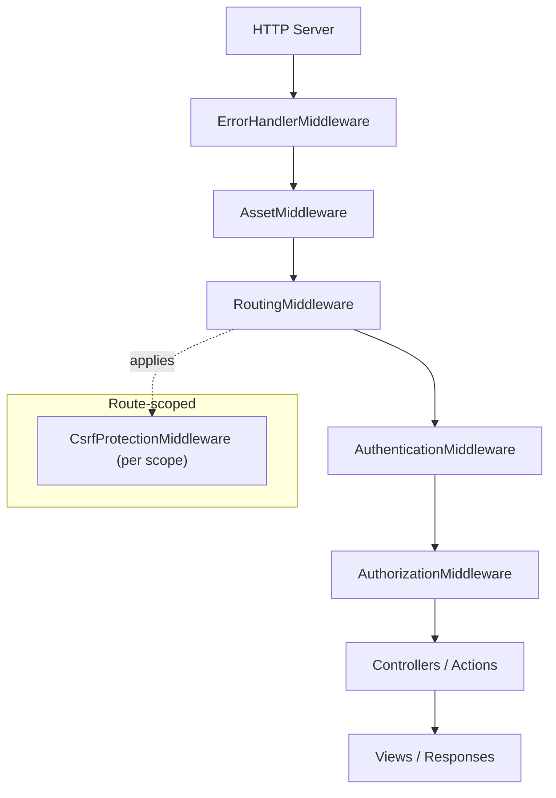
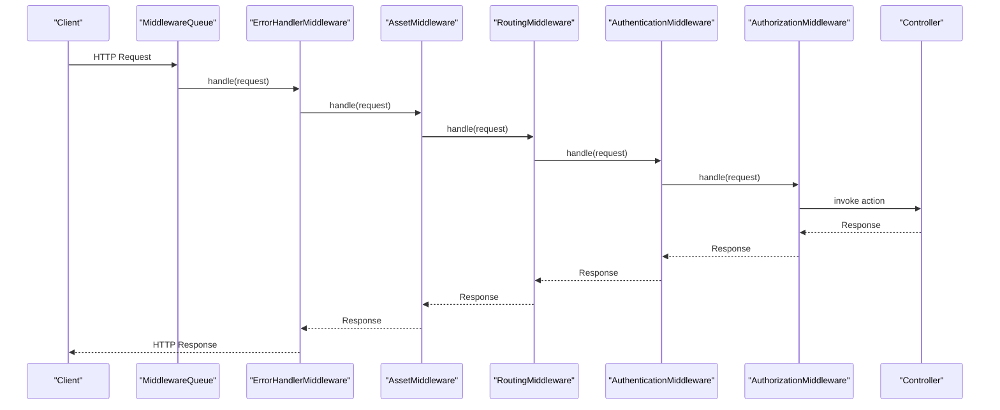
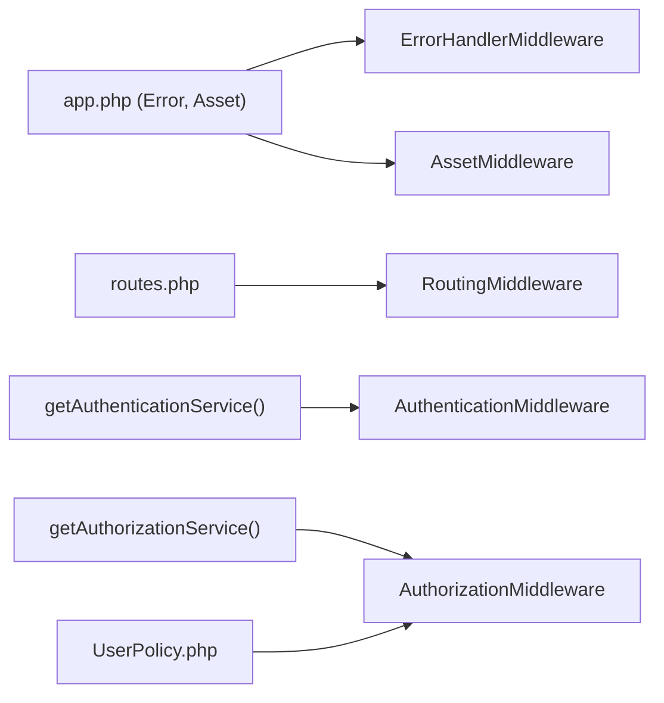

# Middleware Stack Architecture

<cite>
**Referenced Files in This Document**
- [Application.php](file://src/Application.php)
- [bootstrap.php](file://config/bootstrap.php)
- [app.php](file://config/app.php)
- [routes.php](file://config/routes.php)
- [ErrorController.php](file://src/Controller/ErrorController.php)
- [AppController.php](file://src/Controller/AppController.php)
- [UserPolicy.php](file://src/Policy/UserPolicy.php)
- [ApplicationTest.php](file://tests/TestCase/ApplicationTest.php)
</cite>

## Table of Contents
1. [Introduction](#introduction)
2. [Project Structure](#project-structure)
3. [Core Components](#core-components)
4. [Architecture Overview](#architecture-overview)
5. [Detailed Component Analysis](#detailed-component-analysis)
6. [Dependency Analysis](#dependency-analysis)
7. [Performance Considerations](#performance-considerations)
8. [Troubleshooting Guide](#troubleshooting-guide)
9. [Conclusion](#conclusion)
10. [Appendices](#appendices)

## Introduction
This document explains the middleware stack architecture in TCC5, focusing on how an HTTP request flows through the pipeline from entry to response. It covers the execution order and responsibilities of ErrorHandlerMiddleware, AssetMiddleware, RoutingMiddleware, AuthenticationMiddleware, and AuthorizationMiddleware. It also documents parameter configuration for each middleware, patterns for creating custom middleware, examples of interception points, performance implications of ordering, debugging techniques, and integration with CakePHP core and third-party plugin middleware.

## Project Structure
The middleware stack is configured in the application class and extended by route-scoped middleware. Key files:
- Application class defines the global middleware queue and authentication/authorization services.
- Bootstrap sets up error traps and environment.
- App configuration provides settings consumed by middleware (e.g., Error, Asset).
- Routes register scoped middleware (e.g., CSRF protection).
- Error controller customizes error rendering.
- App controller integrates Authentication and Authorization components for controllers.
- Policies define authorization rules used by the Authorization middleware.

**Diagram sources**
- [Application.php:91-113](file://src/Application.php#L91-L113)
- [routes.php:48-58](file://config/routes.php#L48-L58)

**Section sources**
- [Application.php:91-113](file://src/Application.php#L91-L113)
- [routes.php:48-58](file://config/routes.php#L48-L58)

## Core Components
- ErrorHandlerMiddleware: Wraps lower layers to catch exceptions and render error responses using configured renderer and logging options.
- AssetMiddleware: Serves static assets (CSS/JS/images) with optional cache-time headers.
- RoutingMiddleware: Resolves URLs to controller actions and populates request attributes.
- AuthenticationMiddleware: Authenticates requests using configured authenticators (session and form-based), sets identity, and handles redirects for unauthenticated users.
- AuthorizationMiddleware: Enforces access control using policies resolved via OrmResolver.

Configuration highlights:
- Error handling options are loaded from app configuration.
- Asset caching duration is read from app configuration.
- Authentication service configures session and form authenticators, login URL, redirect behavior, and field mappings.
- Authorization service uses ORM resolver to map resources to policies.

**Section sources**
- [Application.php:91-113](file://src/Application.php#L91-L113)
- [Application.php:135-171](file://src/Application.php#L135-L171)
- [app.php:179-185](file://config/app.php#L179-L185)
- [app.php:90-93](file://config/app.php#L90-L93)

## Architecture Overview
The request lifecycle follows a clear pipeline:
1. Request enters the server and is passed to the middleware queue.
2. ErrorHandlerMiddleware ensures any exception thrown downstream is caught and rendered as an appropriate HTTP response.
3. AssetMiddleware short-circuits serving static files when applicable.
4. RoutingMiddleware resolves the route and prepares the request for controller dispatch.
5. AuthenticationMiddleware validates identity based on configured authenticators; if not authenticated, it redirects or returns an unauthorized response.
6. AuthorizationMiddleware checks permissions against policies before allowing controller action execution.
7. Controllers execute business logic and return responses.
8. Responses traverse back through the middleware chain, where they can be modified or logged.

**Diagram sources**
- [Application.php:91-113](file://src/Application.php#L91-L113)

## Detailed Component Analysis

### ErrorHandlerMiddleware
- Purpose: Centralized exception handling and error response rendering.
- Configuration: Uses Error configuration (renderer, logging, trace levels) from app configuration.
- Behavior: Catches exceptions from subsequent middleware and controllers, renders error pages or JSON depending on context, and logs errors per configuration.

Integration points:
- Registered first in the queue so all downstream exceptions are captured.
- Works with ErrorController to customize error templates and paths.

**Section sources**
- [Application.php:91-96](file://src/Application.php#L91-L96)
- [app.php:179-185](file://config/app.php#L179-L185)
- [ErrorController.php:26-59](file://src/Controller/ErrorController.php#L26-L59)

### AssetMiddleware
- Purpose: Serve static assets efficiently, optionally setting cache headers.
- Configuration: Reads cacheTime from app configuration under Asset.
- Behavior: If the requested path matches a static asset, serves it directly and short-circuits further processing.

Performance note: Placing AssetMiddleware after ErrorHandler but early in the chain avoids unnecessary routing work for static assets.

**Section sources**
- [Application.php:97-100](file://src/Application.php#L97-L100)
- [app.php:90-93](file://config/app.php#L90-L93)

### RoutingMiddleware
- Purpose: Resolve URLs to controller/action pairs and populate request attributes needed by controllers.
- Behavior: Matches routes defined in routes configuration and fallbacks; supports route caching for performance.

Integration points:
- Enables route-scoped middleware registration and application (e.g., CSRF protection).

**Section sources**
- [Application.php:101-107](file://src/Application.php#L101-L107)
- [routes.php:48-58](file://config/routes.php#L48-L58)

### AuthenticationMiddleware
- Purpose: Authenticate requests using configured authenticators and set the user identity on the request.
- Configuration:
  - Session authenticator enabled first for stateful sessions.
  - Form authenticator configured with field mappings (username mapped to email), login URL, and password identifier resolver using ORM against Users model.
  - Unauthenticated redirect target and query parameter for redirect preservation.
- Behavior:
  - Attempts authentication in order of registered authenticators.
  - On success, attaches identity to request attributes.
  - On failure, may redirect to login or return unauthorized responses based on configuration.

Controller integration:
- AppController loads Authentication component and marks certain actions as public (unauthenticated) to allow access without login.

**Section sources**
- [Application.php:135-165](file://src/Application.php#L135-L165)
- [AppController.php:47-67](file://src/Controller/AppController.php#L47-L67)

### AuthorizationMiddleware
- Purpose: Enforce access control based on policies associated with resources and actions.
- Configuration: Uses OrmResolver to resolve policies for entities automatically.
- Behavior:
  - Checks permissions before controller actions execute.
  - Denies access when policy returns false, typically resulting in forbidden responses.

Policy example:
- UserPolicy restricts edit/delete/view operations to users with specific role/categoria values.

**Section sources**
- [Application.php:167-171](file://src/Application.php#L167-L171)
- [UserPolicy.php:21-61](file://src/Policy/UserPolicy.php#L21-L61)

### Route-scoped Middleware (CSRF Protection)
- Purpose: Protect forms against cross-site request forgery.
- Configuration: Registered within a route scope and applied to that scope.
- Behavior: Validates CSRF tokens on state-changing requests within the scope.

**Section sources**
- [routes.php:48-58](file://config/routes.php#L48-L58)

## Dependency Analysis
The middleware stack depends on configuration and plugins:
- ErrorHandlerMiddleware depends on Error configuration.
- AssetMiddleware depends on Asset configuration.
- RoutingMiddleware depends on routes definitions.
- AuthenticationMiddleware depends on Authentication plugin and its service configuration.
- AuthorizationMiddleware depends on Authorization plugin and policy resolution.

**Diagram sources**
- [Application.php:91-113](file://src/Application.php#L91-L113)
- [Application.php:135-171](file://src/Application.php#L135-L171)
- [app.php:90-93](file://config/app.php#L90-L93)
- [app.php:179-185](file://config/app.php#L179-L185)
- [routes.php:48-58](file://config/routes.php#L48-L58)
- [UserPolicy.php:21-61](file://src/Policy/UserPolicy.php#L21-L61)

**Section sources**
- [Application.php:91-113](file://src/Application.php#L91-L113)
- [Application.php:135-171](file://src/Application.php#L135-L171)
- [app.php:90-93](file://config/app.php#L90-L93)
- [app.php:179-185](file://config/app.php#L179-L185)
- [routes.php:48-58](file://config/routes.php#L48-L58)
- [UserPolicy.php:21-61](file://src/Policy/UserPolicy.php#L21-L61)

## Performance Considerations
- Middleware ordering matters:
  - Place ErrorHandlerMiddleware at the top to ensure all exceptions are captured.
  - Place AssetMiddleware early to bypass routing for static assets, reducing overhead.
  - RoutingMiddleware should precede Authentication and Authorization to avoid unnecessary auth checks for non-existent routes.
  - AuthenticationMiddleware must come before AuthorizationMiddleware because authorization relies on a valid identity.
- Route caching:
  - For large route sets, consider enabling route caching in production via RoutingMiddleware constructor arguments (as noted in comments).
- Debug vs Production:
  - In development, shorter cache durations are set for routes and translations to aid iteration speed.
- Logging and tracing:
  - Error configuration controls whether exceptions are logged and traced; tune these for production to minimize overhead.

[No sources needed since this section provides general guidance]

## Troubleshooting Guide
Common issues and debugging steps:
- Exceptions not handled:
  - Verify ErrorHandlerMiddleware is first in the queue and Error configuration is correct.
  - Check ErrorController template path and renderer settings.
- Static assets not served:
  - Ensure AssetMiddleware is present and cacheTime is configured appropriately.
  - Confirm file paths exist under webroot and match requested URLs.
- Routing failures:
  - Inspect routes configuration and fallbacks.
  - Use debug mode to see route matching details.
- Authentication problems:
  - Confirm authenticators are loaded in the correct order (Session first, then Form).
  - Validate field mappings (username -> email) and login URL.
  - Check unauthenticated redirect and query parameters.
  - Review AppController’s unauthenticated actions list.
- Authorization denials:
  - Ensure policies exist and implement required methods (canView, canEdit, etc.).
  - Verify OrmResolver is configured and entity classes match models.
  - Check identity presence and role/categoria values used in policies.

Practical references:
- Error handling configuration and renderer: [app.php:179-185](file://config/app.php#L179-L185)
- ErrorController template path setup: [ErrorController.php:54-59](file://src/Controller/ErrorController.php#L54-L59)
- Asset cache configuration: [app.php:90-93](file://config/app.php#L90-L93)
- Authentication service configuration: [Application.php:135-165](file://src/Application.php#L135-L165)
- Unauthenticated actions in AppController: [AppController.php:62-67](file://src/Controller/AppController.php#L62-L67)
- Authorization policy example: [UserPolicy.php:21-61](file://src/Policy/UserPolicy.php#L21-L61)

**Section sources**
- [app.php:179-185](file://config/app.php#L179-L185)
- [ErrorController.php:54-59](file://src/Controller/ErrorController.php#L54-L59)
- [app.php:90-93](file://config/app.php#L90-L93)
- [Application.php:135-165](file://src/Application.php#L135-L165)
- [AppController.php:62-67](file://src/Controller/AppController.php#L62-L67)
- [UserPolicy.php:21-61](file://src/Policy/UserPolicy.php#L21-L61)

## Conclusion
TCC5’s middleware stack follows a well-defined order that balances robustness, security, and performance. ErrorHandlerMiddleware ensures consistent error handling, AssetMiddleware optimizes static asset delivery, RoutingMiddleware resolves requests to controllers, AuthenticationMiddleware secures endpoints by verifying identity, and AuthorizationMiddleware enforces fine-grained access control via policies. Proper configuration and ordering are critical for reliable operation. Route-scoped middleware like CSRF protection complements the global stack to secure specific areas of the application.

[No sources needed since this section summarizes without analyzing specific files]

## Appendices

### Middleware Execution Order Summary
- ErrorHandlerMiddleware
- AssetMiddleware
- RoutingMiddleware
- AuthenticationMiddleware
- AuthorizationMiddleware
- Route-scoped middleware (e.g., CsrfProtectionMiddleware)

**Section sources**
- [Application.php:91-113](file://src/Application.php#L91-L113)
- [routes.php:48-58](file://config/routes.php#L48-L58)

### Custom Middleware Development Patterns
To create custom middleware in CakePHP:
- Implement PSR-15 ServerRequestHandlerInterface or use CakePHP’s middleware abstractions.
- Add your middleware to the queue in Application::middleware or register it in route scopes.
- Follow single-responsibility principles: one concern per middleware (e.g., logging, CORS, rate limiting).
- Test middleware independently to verify request/response transformations and error handling.

[No sources needed since this section provides general guidance]

### Integration Points with Core and Plugins
- Core middleware: ErrorHandlerMiddleware, AssetMiddleware, RoutingMiddleware are part of CakePHP core.
- Plugin middleware: AuthenticationMiddleware and AuthorizationMiddleware are provided by Authentication and Authorization plugins, respectively.
- Route-scoped middleware: CsrfProtectionMiddleware is integrated via routes configuration.

**Section sources**
- [Application.php:91-113](file://src/Application.php#L91-L113)
- [routes.php:48-58](file://config/routes.php#L48-L58)

### Validation of Middleware Stack in Tests
Tests confirm the presence and order of key middleware in the queue, ensuring stability across changes.

**Section sources**
- [ApplicationTest.php:77-89](file://tests/TestCase/ApplicationTest.php#L77-L89)