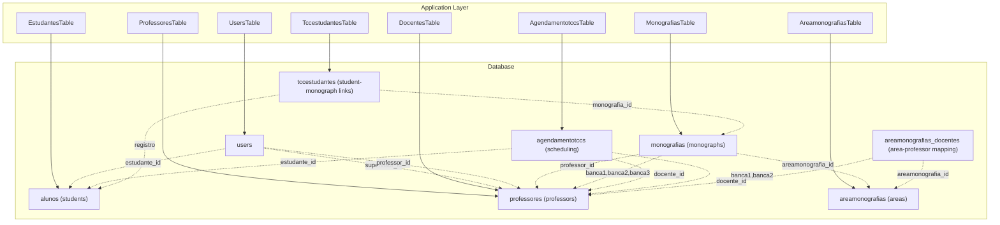
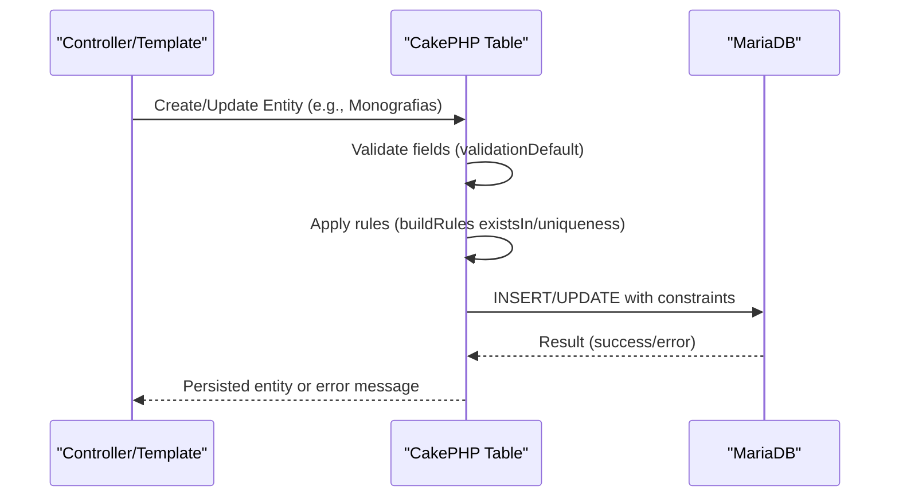
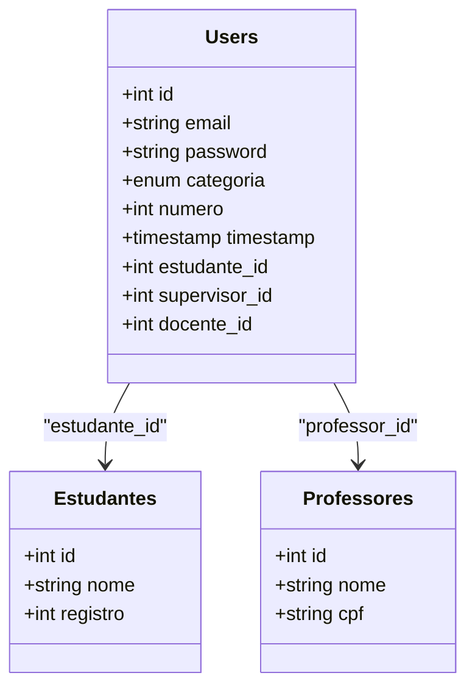
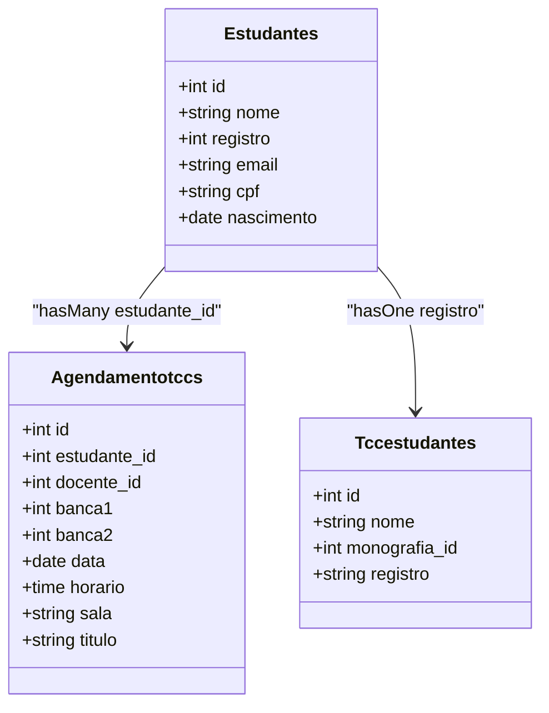
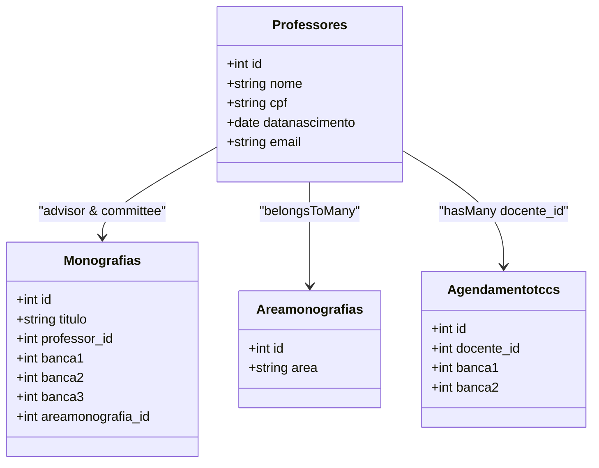
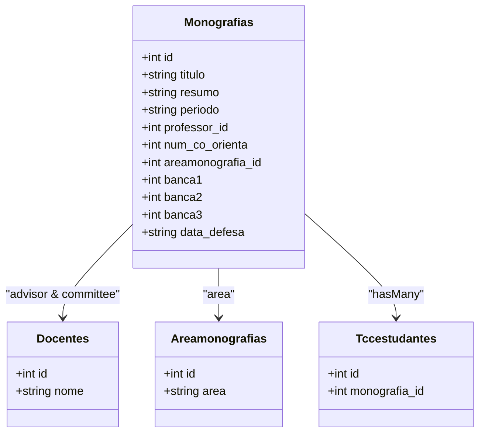
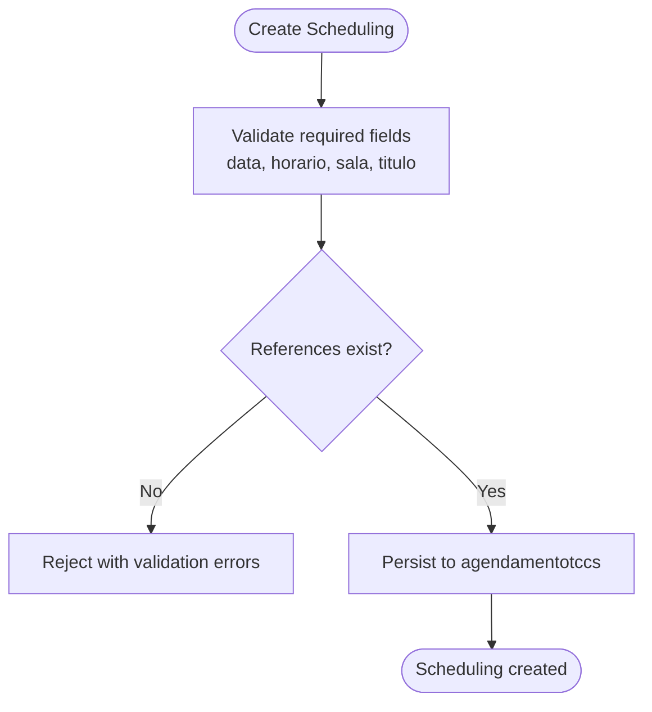
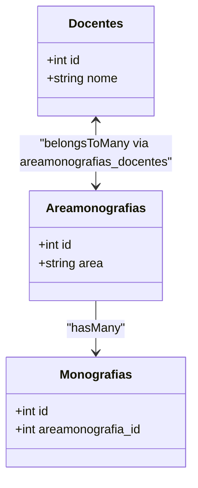
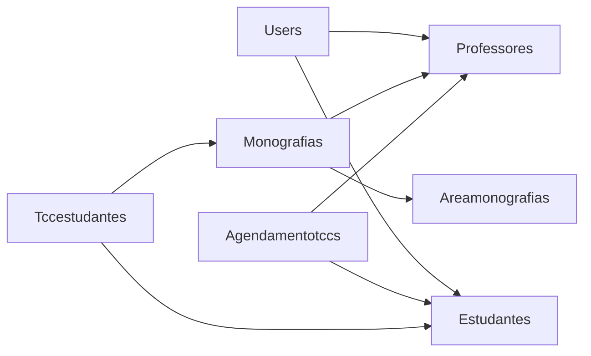

# Database Schema Design

<cite>
**Referenced Files in This Document**
- [schema.sql](file://config/Migrations/schema.sql)
- [tccess.sql](file://tccess.sql)
- [UsersTable.php](file://src/Model/Table/UsersTable.php)
- [EstudantesTable.php](file://src/Model/Table/EstudantesTable.php)
- [ProfessoresTable.php](file://src/Model/Table/ProfessoresTable.php)
- [MonografiasTable.php](file://src/Model/Table/MonografiasTable.php)
- [AgendamentotccsTable.php](file://src/Model/Table/AgendamentotccsTable.php)
- [TccestudantesTable.php](file://src/Model/Table/TccestudantesTable.php)
- [AreamonografiasTable.php](file://src/Model/Table/AreamonografiasTable.php)
- [DocentesTable.php](file://src/Model/Table/DocentesTable.php)
- [i18n.sql](file://config/schema/i18n.sql)
- [sessions.sql](file://config/schema/sessions.sql)
</cite>

## Table of Contents
1. [Introduction](#introduction)
2. [Project Structure](#project-structure)
3. [Core Components](#core-components)
4. [Architecture Overview](#architecture-overview)
5. [Detailed Component Analysis](#detailed-component-analysis)
6. [Dependency Analysis](#dependency-analysis)
7. [Performance Considerations](#performance-considerations)
8. [Troubleshooting Guide](#troubleshooting-guide)
9. [Conclusion](#conclusion)
10. [Appendices](#appendices)

## Introduction
This document provides comprehensive data model documentation for the TCC5 academic database (database name: tccess). It focuses on the core entities Users, Students, Professors, Monographs, and Scheduling, detailing entity relationships, primary and foreign keys, indexes, constraints, validation rules enforced at the application layer, indexing strategy, migration management procedures, data integrity constraints, optimization techniques, backup strategies, and maintenance procedures.

The schema supports academic workflows including student records, professor profiles, monograph registration and defense scheduling, and user access control. The CakePHP ORM models define associations and validation rules that complement the underlying SQL schema.

## Project Structure
The database is defined by SQL dumps and managed via migrations. The application layer uses CakePHP ORM tables to define relationships and validation rules.

**Diagram sources**
- [schema.sql:33-45](file://config/Migrations/schema.sql#L33-L45)
- [schema.sql:327-346](file://config/Migrations/schema.sql#L327-L346)
- [schema.sql:529-567](file://config/Migrations/schema.sql#L529-L567)
- [schema.sql:438-457](file://config/Migrations/schema.sql#L438-L457)
- [schema.sql:621-627](file://config/Migrations/schema.sql#L621-L627)
- [schema.sql:118-136](file://config/Migrations/schema.sql#L118-L136)
- [UsersTable.php:40-59](file://src/Model/Table/UsersTable.php#L40-L59)
- [EstudantesTable.php:32-53](file://src/Model/Table/EstudantesTable.php#L32-L53)
- [ProfessoresTable.php:35-55](file://src/Model/Table/ProfessoresTable.php#L35-L55)
- [MonografiasTable.php:41-100](file://src/Model/Table/MonografiasTable.php#L41-L100)
- [AgendamentotccsTable.php:43-75](file://src/Model/Table/AgendamentotccsTable.php#L43-L75)
- [TccestudantesTable.php:34-57](file://src/Model/Table/TccestudantesTable.php#L34-L57)
- [AreamonografiasTable.php:41-60](file://src/Model/Table/AreamonografiasTable.php#L41-L60)
- [DocentesTable.php:36-78](file://src/Model/Table/DocentesTable.php#L36-L78)

**Section sources**
- [schema.sql:1-1081](file://config/Migrations/schema.sql#L1-L1081)
- [UsersTable.php:1-127](file://src/Model/Table/UsersTable.php#L1-L127)
- [EstudantesTable.php:1-165](file://src/Model/Table/EstudantesTable.php#L1-L165)
- [ProfessoresTable.php:1-247](file://src/Model/Table/ProfessoresTable.php#L1-L247)
- [MonografiasTable.php:1-190](file://src/Model/Table/MonografiasTable.php#L1-L190)
- [AgendamentotccsTable.php:1-152](file://src/Model/Table/AgendamentotccsTable.php#L1-L152)
- [TccestudantesTable.php:1-100](file://src/Model/Table/TccestudantesTable.php#L1-L100)
- [AreamonografiasTable.php:1-82](file://src/Model/Table/AreamonografiasTable.php#L1-L82)
- [DocentesTable.php:1-272](file://src/Model/Table/DocentesTable.php#L1-L272)

## Core Components
This section summarizes the core academic entities and their responsibilities:

- Users: Authentication and role-based access; links to students, supervisors, and professors.
- Students (alunos): Personal and contact information; unique student registration number.
- Professors (professores): Academic staff details; linked to monographs as advisor or committee member; linked to scheduling.
- Monographs (monografias): Academic works with title, abstract, period, advisor, co-advisor, area, and defense details.
- Scheduling (agendamentotccs): Defense scheduling linking students, advisors, and committee members with date/time and room.

Key relationships:
- Users belongs to Estudantes, Supervisores, and Professores.
- Monografias belongs to Docentes (advisor), Areamonografias (area), and multiple Docentes (committee).
- Agendamentotccs belongs to Estudantes and Docentes (advisor and committee).
- Tccestudantes links monographs to students via monografia_id and registro.

Validation and constraints:
- Application-level validation ensures required fields, formats, and uniqueness (e.g., email, registro).
- Database-level primary keys are defined; some unique constraints exist (e.g., alunos.registro, estudantes.registro).
- Foreign key enforcement is not explicitly declared in the provided SQL; referential integrity relies on application rules and ORM checks.

**Section sources**
- [schema.sql:33-45](file://config/Migrations/schema.sql#L33-L45)
- [schema.sql:327-346](file://config/Migrations/schema.sql#L327-L346)
- [schema.sql:529-567](file://config/Migrations/schema.sql#L529-L567)
- [schema.sql:438-457](file://config/Migrations/schema.sql#L438-L457)
- [schema.sql:621-627](file://config/Migrations/schema.sql#L621-L627)
- [UsersTable.php:67-108](file://src/Model/Table/UsersTable.php#L67-L108)
- [EstudantesTable.php:61-147](file://src/Model/Table/EstudantesTable.php#L61-L147)
- [ProfessoresTable.php:63-231](file://src/Model/Table/ProfessoresTable.php#L63-L231)
- [MonografiasTable.php:108-173](file://src/Model/Table/MonografiasTable.php#L108-L173)
- [AgendamentotccsTable.php:83-132](file://src/Model/Table/AgendamentotccsTable.php#L83-L132)
- [TccestudantesTable.php:65-82](file://src/Model/Table/TccestudantesTable.php#L65-L82)

## Architecture Overview
The system follows a layered architecture:
- Presentation: Controllers and templates render UI for managing users, students, professors, monographs, and scheduling.
- Application: CakePHP ORM tables define associations, validation, and business rules.
- Data: MariaDB stores entities with primary keys and limited indexes; referential integrity is enforced primarily at the application level.

**Diagram sources**
- [MonografiasTable.php:41-100](file://src/Model/Table/MonografiasTable.php#L41-L100)
- [MonografiasTable.php:108-173](file://src/Model/Table/MonografiasTable.php#L108-L173)
- [MonografiasTable.php:182-188](file://src/Model/Table/MonografiasTable.php#L182-L188)
- [schema.sql:438-457](file://config/Migrations/schema.sql#L438-L457)

## Detailed Component Analysis

### Users
- Table: users
- Primary Key: id
- Notable Fields: email, password, categoria (enum), numero, timestamp, estudante_id, supervisor_id, docente_id
- Relationships:
  - BelongsTo Estudantes via estudante_id
  - BelongsTo Supervisores via supervisor_id
  - BelongsTo Professores via professor_id
- Validation:
  - Email required and valid format
  - Password required and length-limited
  - Categoria must be one of allowed values
  - Numeric checks for numero and IDs
- Rules:
  - existsIn checks ensure referenced IDs exist in related tables

**Diagram sources**
- [schema.sql:647-658](file://config/Migrations/schema.sql#L647-L658)
- [UsersTable.php:40-59](file://src/Model/Table/UsersTable.php#L40-L59)
- [UsersTable.php:67-108](file://src/Model/Table/UsersTable.php#L67-L108)
- [UsersTable.php:118-125](file://src/Model/Table/UsersTable.php#L118-L125)

**Section sources**
- [schema.sql:647-658](file://config/Migrations/schema.sql#L647-L658)
- [UsersTable.php:40-125](file://src/Model/Table/UsersTable.php#L40-L125)

### Students (Alunos/Estudantes)
- Table: alunos (used by EstudantesTable)
- Primary Key: id
- Unique Constraint: registro (unique per student)
- Notable Fields: nome, registro, telefone, celular, email, cpf, identidade, orgao, nascimento, endereco, cep, municipio, bairro, observacoes
- Relationships:
  - HasMany Agendamentotccs via estudante_id
  - HasOne Tccestudantes via registro
- Validation:
  - Required name, phone codes
  - Length limits for text fields
  - Unique email and registro enforced at application level

**Diagram sources**
- [schema.sql:53-72](file://config/Migrations/schema.sql#L53-L72)
- [schema.sql:327-346](file://config/Migrations/schema.sql#L327-L346)
- [schema.sql:621-627](file://config/Migrations/schema.sql#L621-L627)
- [EstudantesTable.php:32-53](file://src/Model/Table/EstudantesTable.php#L32-L53)
- [EstudantesTable.php:61-147](file://src/Model/Table/EstudantesTable.php#L61-L147)
- [EstudantesTable.php:156-163](file://src/Model/Table/EstudantesTable.php#L156-L163)

**Section sources**
- [schema.sql:53-72](file://config/Migrations/schema.sql#L53-L72)
- [schema.sql:327-346](file://config/Migrations/schema.sql#L327-L346)
- [schema.sql:621-627](file://config/Migrations/schema.sql#L621-L627)
- [EstudantesTable.php:32-163](file://src/Model/Table/EstudantesTable.php#L32-L163)

### Professors (Professores/Docentes)
- Table: professores (aliased as Docentes in ORM)
- Primary Key: id
- Notable Fields: nome, cpf, siape, datanascimento, localnascimento, sexo, ddd_telefone, telefone, ddd_celular, celular, email, homepage, redesocial, curriculolattes, atualizacaolattes, curriculosigma, pesquisadordgp, formacaoprofissional, universidadedegraduacao, anoformacao, mestradoarea, mestradouniversidade, mestradoanoconclusao, doutoradoarea, doutoradouniversidade, doutoradoanoconclusao, dataingresso, formaingresso, tipocargo, categoria, regimetrabalho, departamento, dataegresso, motivoegresso, observacoes
- Relationships:
  - HasMany Users via professor_id
  - HasMany Monografias via professor_id (advisor)
  - HasMany Monografias via banca1/banca2/banca3 (committee)
  - BelongsToMany Areamonografias via areamonografias_docentes
  - HasMany Agendamentotccs via docente_id
- Validation:
  - Required name and phone codes
  - Length limits for text fields
  - Date validations for birth, entry, graduation dates

**Diagram sources**
- [schema.sql:529-567](file://config/Migrations/schema.sql#L529-L567)
- [schema.sql:438-457](file://config/Migrations/schema.sql#L438-L457)
- [schema.sql:33-45](file://config/Migrations/schema.sql#L33-L45)
- [schema.sql:118-136](file://config/Migrations/schema.sql#L118-L136)
- [ProfessoresTable.php:35-55](file://src/Model/Table/ProfessoresTable.php#L35-L55)
- [DocentesTable.php:36-78](file://src/Model/Table/DocentesTable.php#L36-L78)
- [ProfessoresTable.php:63-231](file://src/Model/Table/ProfessoresTable.php#L63-L231)

**Section sources**
- [schema.sql:529-567](file://config/Migrations/schema.sql#L529-L567)
- [ProfessoresTable.php:35-231](file://src/Model/Table/ProfessoresTable.php#L35-L231)
- [DocentesTable.php:36-78](file://src/Model/Table/DocentesTable.php#L36-L78)

### Monographs (Monografias)
- Table: monografias
- Primary Key: id
- Notable Fields: catalogo, titulo, resumo, data, periodo, professor_id, co_orienta_id (mapped via num_co_orienta in ORM), areamonografia_id, classificamonografia_id, data_defesa, banca1, banca2, banca3, convidado, url, timestamp
- Relationships:
  - BelongsTo Docentes (advisor) via professor_id
  - BelongsTo Docentes (co-advisor) via num_co_orienta
  - BelongsTo Docentes (committee) via banca1/banca2/banca3
  - BelongsTo Areamonografias via areamonografia_id
  - HasMany Tccestudantes via monografia_id
- Validation:
  - Length limits for title, abstract, URL, etc.
  - Period string length limit
  - Committee IDs validated as integers
- CounterCache behavior used to cache monograph counts per area

**Diagram sources**
- [schema.sql:438-457](file://config/Migrations/schema.sql#L438-L457)
- [MonografiasTable.php:41-100](file://src/Model/Table/MonografiasTable.php#L41-L100)
- [MonografiasTable.php:108-173](file://src/Model/Table/MonografiasTable.php#L108-L173)
- [MonografiasTable.php:182-188](file://src/Model/Table/MonografiasTable.php#L182-L188)

**Section sources**
- [schema.sql:438-457](file://config/Migrations/schema.sql#L438-L457)
- [MonografiasTable.php:41-188](file://src/Model/Table/MonografiasTable.php#L41-L188)

### Scheduling (Agendamentotccs)
- Table: agendamentotccs
- Primary Key: id
- Notable Fields: estudante_id, docente_id, banca1, banca2, data, horario, sala, convidado, titulo, avaliacao
- Relationships:
  - BelongsTo Estudantes via estudante_id
  - BelongsTo Docentes via docente_id (advisor)
  - BelongsTo Docentes via banca1/banca2 (committee)
- Validation:
  - Required date, time, room, title
  - Committee IDs required on create
  - Length limits for strings

**Diagram sources**
- [schema.sql:33-45](file://config/Migrations/schema.sql#L33-L45)
- [AgendamentotccsTable.php:43-75](file://src/Model/Table/AgendamentotccsTable.php#L43-L75)
- [AgendamentotccsTable.php:83-132](file://src/Model/Table/AgendamentotccsTable.php#L83-L132)
- [AgendamentotccsTable.php:141-149](file://src/Model/Table/AgendamentotccsTable.php#L141-L149)

**Section sources**
- [schema.sql:33-45](file://config/Migrations/schema.sql#L33-L45)
- [AgendamentotccsTable.php:43-149](file://src/Model/Table/AgendamentotccsTable.php#L43-L149)

### Area-Monograph and Area-Professor Mapping
- Tables: areamonografias, areamonografias_docentes
- Relationships:
  - Monografias belong to Areamonografias via areamonografia_id
  - Docentes and Areamonografias are linked via a many-to-many join table

**Diagram sources**
- [schema.sql:118-136](file://config/Migrations/schema.sql#L118-L136)
- [AreamonografiasTable.php:41-60](file://src/Model/Table/AreamonografiasTable.php#L41-L60)
- [MonografiasTable.php:86-91](file://src/Model/Table/MonografiasTable.php#L86-L91)
- [DocentesTable.php:69-73](file://src/Model/Table/DocentesTable.php#L69-L73)

**Section sources**
- [schema.sql:118-136](file://config/Migrations/schema.sql#L118-L136)
- [AreamonografiasTable.php:41-60](file://src/Model/Table/AreamonografiasTable.php#L41-L60)
- [MonografiasTable.php:86-91](file://src/Model/Table/MonografiasTable.php#L86-L91)
- [DocentesTable.php:69-73](file://src/Model/Table/DocentesTable.php#L69-L73)

## Dependency Analysis
Key dependency chains:
- Users depend on Estudantes, Supervisores, and Professores for identity linkage.
- Monografias depend on Docentes (advisor/co-advisor/committee) and Areamonografias (area).
- Agendamentotccs depend on Estudantes and Docentes (advisor/committee).
- Tccestudantes link Monografias to Estudantes via monografia_id and registro.

Indexing and constraints:
- Primary keys are defined for all core tables.
- Unique constraints exist for aluno and estudante registros.
- Additional indexes are minimal; consider adding composite indexes for frequent queries (e.g., monografias.professor_id, monografias.areamonografia_id, agendamentotccs.estudante_id, agendamentotccs.data).

**Diagram sources**
- [UsersTable.php:40-59](file://src/Model/Table/UsersTable.php#L40-L59)
- [MonografiasTable.php:41-100](file://src/Model/Table/MonografiasTable.php#L41-L100)
- [AgendamentotccsTable.php:43-75](file://src/Model/Table/AgendamentotccsTable.php#L43-L75)
- [TccestudantesTable.php:34-57](file://src/Model/Table/TccestudantesTable.php#L34-L57)

**Section sources**
- [UsersTable.php:40-59](file://src/Model/Table/UsersTable.php#L40-L59)
- [MonografiasTable.php:41-100](file://src/Model/Table/MonografiasTable.php#L41-L100)
- [AgendamentotccsTable.php:43-75](file://src/Model/Table/AgendamentotccsTable.php#L43-L75)
- [TccestudantesTable.php:34-57](file://src/Model/Table/TccestudantesTable.php#L34-L57)

## Performance Considerations
- Indexing Strategy:
  - Add composite indexes on frequently queried columns:
    - monografias: (professor_id, areamonografia_id), (banca1), (banca2), (banca3)
    - agendamentotccs: (estudante_id, data), (docente_id, data)
    - tccestudantes: (monografia_id), (registro)
  - Ensure character set/collation consistency to avoid implicit conversions during joins.
- Query Optimization:
  - Use eager loading for associated entities to reduce N+1 queries.
  - Limit result sets with pagination and selective field retrieval.
- Storage:
  - Use appropriate data types (e.g., DATE/TIME for dates/times) to leverage index efficiency.
  - Avoid excessive TEXT fields in high-frequency queries.

[No sources needed since this section provides general guidance]

## Troubleshooting Guide
Common issues and resolutions:
- Referential Integrity Errors:
  - Ensure referenced IDs exist before saving (application-level existsIn rules).
  - Validate foreign key references in controllers/services.
- Validation Failures:
  - Check required fields and formats in validationDefault methods.
  - Confirm unique constraints (email, registro) are respected.
- Migration Issues:
  - Verify schema.sql matches current database state.
  - Use migration tools to apply incremental changes safely.

**Section sources**
- [UsersTable.php:118-125](file://src/Model/Table/UsersTable.php#L118-L125)
- [EstudantesTable.php:156-163](file://src/Model/Table/EstudantesTable.php#L156-L163)
- [MonografiasTable.php:182-188](file://src/Model/Table/MonografiasTable.php#L182-L188)
- [AgendamentotccsTable.php:141-149](file://src/Model/Table/AgendamentotccsTable.php#L141-L149)

## Conclusion
The TCC5 database schema supports academic workflows through well-defined entities and relationships. While primary keys and some unique constraints are present, referential integrity relies heavily on application-level validation and ORM rules. Enhancing indexing and enforcing foreign key constraints at the database level will improve performance and data integrity. Proper migration management and regular maintenance will ensure long-term reliability.

[No sources needed since this section summarizes without analyzing specific files]

## Appendices

### Sample Data Structures
- Users: id, email, password, categoria, numero, timestamp, estudante_id, supervisor_id, docente_id
- Students: id, nome, registro, telefone, celular, email, cpf, identidade, orgao, nascimento, endereco, cep, municipio, bairro, observacoes
- Professors: id, nome, cpf, siape, datanascimento, localnascimento, sexo, ddd_telefone, telefone, ddd_celular, celular, email, homepage, redesocial, curriculolattes, atualizacaolattes, curriculosigma, pesquisadordgp, formacaoprofissional, universidadedegraduacao, anoformacao, mestradoarea, mestradouniversidade, mestradoanoconclusao, doutoradoarea, doutoradouniversidade, doutoradoanoconclusao, dataingresso, formaingresso, tipocargo, categoria, regimetrabalho, departamento, dataegresso, motivoegresso, observacoes
- Monographs: id, catalogo, titulo, resumo, data, periodo, professor_id, co_orienta_id, areamonografia_id, classificamonografia_id, data_defesa, banca1, banca2, banca3, convidado, url, timestamp
- Scheduling: id, estudante_id, docente_id, banca1, banca2, data, horario, sala, convidado, titulo, avaliacao

**Section sources**
- [schema.sql:33-45](file://config/Migrations/schema.sql#L33-L45)
- [schema.sql:327-346](file://config/Migrations/schema.sql#L327-L346)
- [schema.sql:529-567](file://config/Migrations/schema.sql#L529-L567)
- [schema.sql:438-457](file://config/Migrations/schema.sql#L438-L457)
- [schema.sql:621-627](file://config/Migrations/schema.sql#L621-L627)

### Migration Management Procedures
- Initialize database using schema.sql or migration scripts.
- Apply incremental changes via versioned migration files.
- Validate schema against ORM definitions to ensure consistency.
- Backup before applying migrations; rollback if necessary.

**Section sources**
- [schema.sql:1-25](file://config/Migrations/schema.sql#L1-L25)
- [i18n.sql:8-18](file://config/schema/i18n.sql#L8-L18)
- [sessions.sql:8-15](file://config/schema/sessions.sql#L8-L15)

### Data Integrity Constraints
- Primary Keys: All core tables have primary keys.
- Unique Constraints: Student registrations (alunos.registro, estudantes.registro) are unique.
- Application-Level Constraints: Email uniqueness, required fields, and reference existence checks via ORM rules.

**Section sources**
- [schema.sql:688-692](file://config/Migrations/schema.sql#L688-L692)
- [schema.sql:774-778](file://config/Migrations/schema.sql#L774-L778)
- [EstudantesTable.php:156-163](file://src/Model/Table/EstudantesTable.php#L156-L163)
- [UsersTable.php:118-125](file://src/Model/Table/UsersTable.php#L118-L125)

### Backup Strategies
- Regular full backups of the tccess database.
- Incremental backups for transaction logs.
- Test restore procedures periodically.
- Version-controlled schema and seed data for reproducibility.

[No sources needed since this section provides general guidance]

### Maintenance Procedures
- Analyze and optimize tables regularly.
- Rebuild indexes if fragmentation occurs.
- Monitor query performance and adjust indexes accordingly.
- Review and update validation rules as business requirements evolve.

[No sources needed since this section provides general guidance]