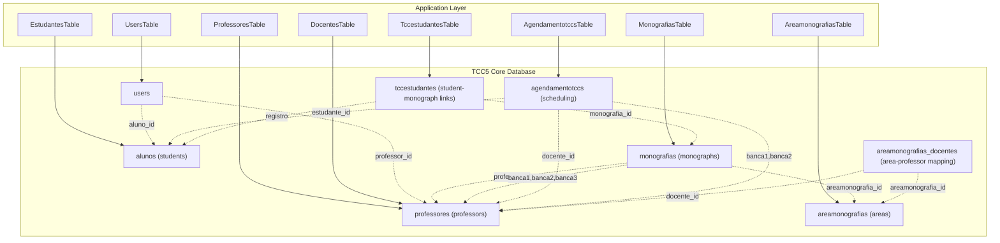
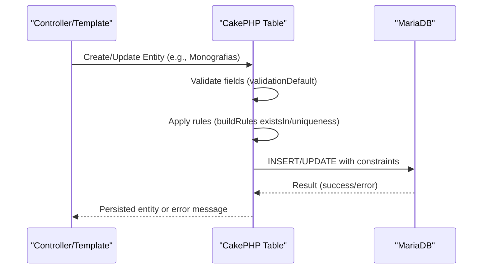
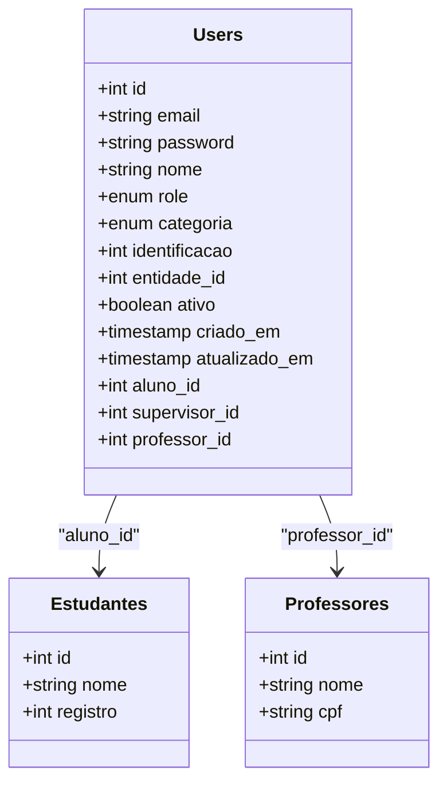
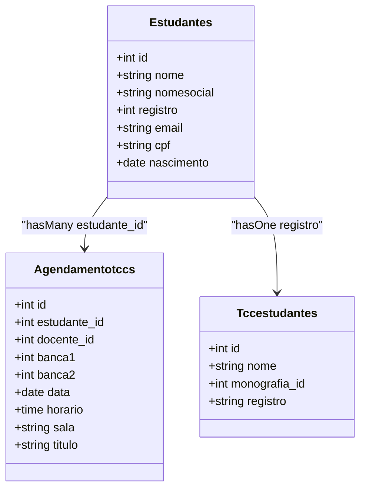
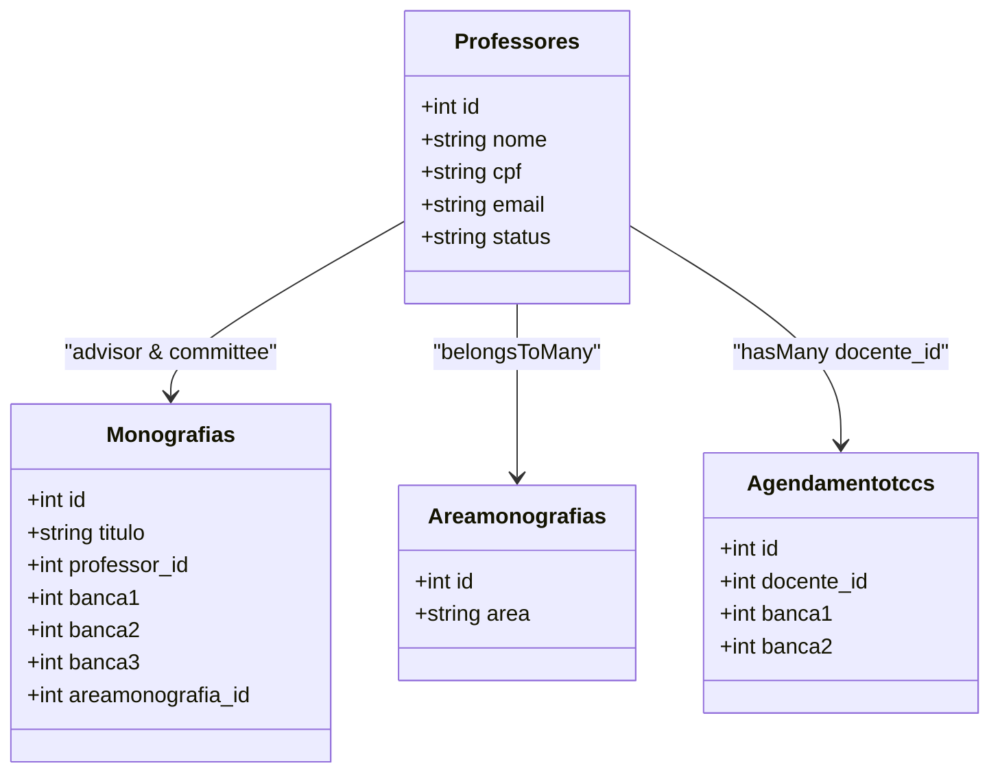
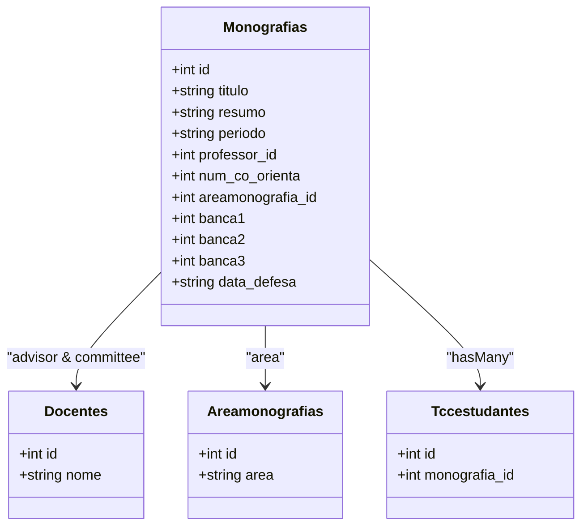
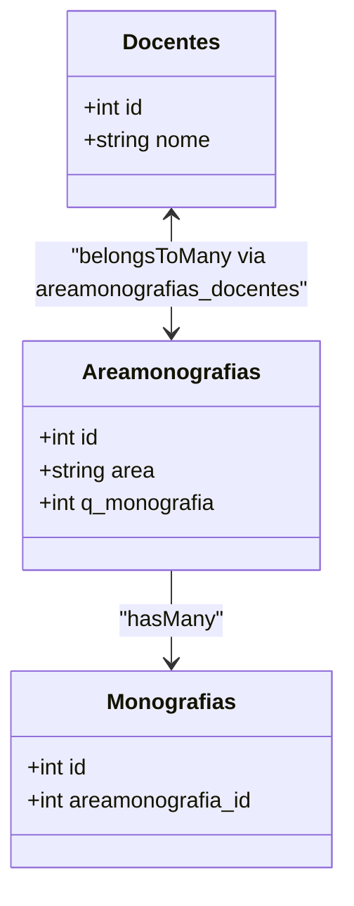
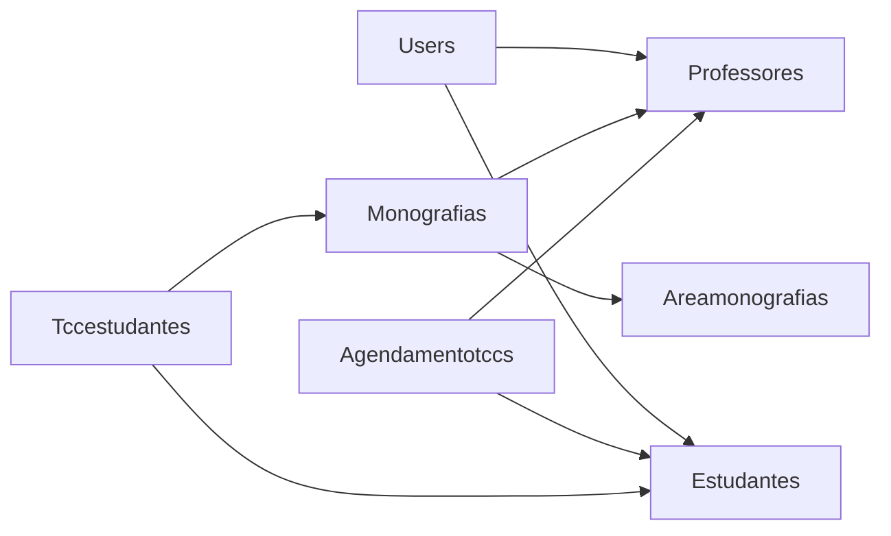

# Database Schema Design

<cite>
**Referenced Files in This Document**
- [schema.sql](file://config/Migrations/schema.sql)
- [UsersTable.php](file://src/Model/Table/UsersTable.php)
- [EstudantesTable.php](file://src/Model/Table/EstudantesTable.php)
- [ProfessoresTable.php](file://src/Model/Table/ProfessoresTable.php)
- [MonografiasTable.php](file://src/Model/Table/MonografiasTable.php)
- [AgendamentotccsTable.php](file://src/Model/Table/AgendamentotccsTable.php)
- [TccestudantesTable.php](file://src/Model/Table/TccestudantesTable.php)
- [AreamonografiasTable.php](file://src/Model/Table/AreamonografiasTable.php)
- [DocentesTable.php](file://src/Model/Table/DocentesTable.php)
</cite>

## Update Summary
**Changes Made**
- Updated schema documentation to reflect streamlined 243-line reference schema
- Removed all references to internship-related tables and functionality
- Updated entity relationships to focus on core TCC5 application tables
- Revised architecture diagrams to show current simplified structure
- Updated validation rules and constraints based on new schema design

## Table of Contents
1. [Introduction](#introduction)
2. [Project Structure](#project-structure)
3. [Core Components](#core-components)
4. [Architecture Overview](#architecture-overview)
5. [Detailed Component Analysis](#detailed-component-analysis)
6. [Dependency Analysis](#dependency-analysis)
7. [Performance Considerations](#performance-considerations)
8. [Troubleshooting Guide](#troubleshooting-guide)
9. [Conclusion](#conclusion)
9. [Appendices](#appendices)

## Introduction
This document provides comprehensive data model documentation for the TCC5 academic database (database name: tccess). The schema has been completely refactored from a 1080-line phpMyAdmin dump to a streamlined 243-line reference schema that focuses exclusively on TCC5 application functionality. All internship-related tables have been removed, leaving only the core academic entities: Users, Students, Professors, Monographs, Scheduling, Areas, and Student-Monograph links.

The schema supports essential academic workflows including student records, professor profiles, monograph registration and defense scheduling, and user access control. The CakePHP ORM models define associations and validation rules that complement the underlying SQL schema.

## Project Structure
The database is defined by a streamlined reference schema and managed via migrations. The application layer uses CakePHP ORM tables to define relationships and validation rules for the focused TCC5 domain.

**Diagram sources**
- [schema.sql:82-99](file://config/Migrations/schema.sql#L82-L99)
- [schema.sql:100-131](file://config/Migrations/schema.sql#L100-L131)
- [schema.sql:132-151](file://config/Migrations/schema.sql#L132-L151)
- [schema.sql:152-175](file://config/Migrations/schema.sql#L152-L175)
- [schema.sql:176-203](file://config/Migrations/schema.sql#L176-L203)
- [schema.sql:204-215](file://config/Migrations/schema.sql#L204-L215)
- [schema.sql:216-236](file://config/Migrations/schema.sql#L216-L236)

**Section sources**
- [schema.sql:1-244](file://config/Migrations/schema.sql#L1-L244)
- [UsersTable.php:1-128](file://src/Model/Table/UsersTable.php#L1-L128)
- [EstudantesTable.php:1-165](file://src/Model/Table/EstudantesTable.php#L1-L165)
- [ProfessoresTable.php:1-244](file://src/Model/Table/ProfessoresTable.php#L1-L244)
- [MonografiasTable.php:1-190](file://src/Model/Table/MonografiasTable.php#L1-L190)
- [AgendamentotccsTable.php:1-152](file://src/Model/Table/AgendamentotccsTable.php#L1-L152)
- [TccestudantesTable.php:1-100](file://src/Model/Table/TccestudantesTable.php#L1-L100)
- [AreamonografiasTable.php:1-82](file://src/Model/Table/AreamonografiasTable.php#L1-L82)
- [DocentesTable.php:1-272](file://src/Model/Table/DocentesTable.php#L1-L272)

## Core Components
This section summarizes the core academic entities and their responsibilities in the streamlined TCC5 schema:

- **Users**: Authentication and role-based access; links to students and professors through aluno_id and professor_id fields.
- **Students (alunos)**: Personal and contact information; unique student registration number with comprehensive contact details.
- **Professors (professores)**: Academic staff details with simplified profile fields; linked to monographs as advisor or committee member; linked to scheduling.
- **Monographs (monografias)**: Academic works with title, abstract, period, advisor, co-advisor, area, and defense details.
- **Scheduling (agendamentotccs)**: Defense scheduling linking students, advisors, and committee members with date/time and room.
- **Areas (areamonografias)**: Academic areas for monograph classification with counter cache for monograph counts.
- **Student-Monograph Links (tccestudantes)**: Links between students and monographs via monografia_id and registro.

Key relationships:
- Users belongs to Estudantes and Professores through aluno_id and professor_id.
- Monografias belongs to Docentes (advisor), Areamonografias (area), and multiple Docentes (committee).
- Agendamentotccs belongs to Estudantes and Docentes (advisor and committee).
- Tccestudantes links monographs to students via monografia_id and registro.

Validation and constraints:
- Application-level validation ensures required fields, formats, and uniqueness (e.g., email, registro).
- Database-level primary keys are defined; unique constraints exist for student registrations.
- Foreign key enforcement relies primarily on application rules and ORM checks.

**Section sources**
- [schema.sql:82-236](file://config/Migrations/schema.sql#L82-L236)
- [UsersTable.php:43-127](file://src/Model/Table/UsersTable.php#L43-L127)
- [EstudantesTable.php:32-165](file://src/Model/Table/EstudantesTable.php#L32-L165)
- [ProfessoresTable.php:34-244](file://src/Model/Table/ProfessoresTable.php#L34-L244)
- [MonografiasTable.php:41-190](file://src/Model/Table/MonografiasTable.php#L41-L190)
- [AgendamentotccsTable.php:43-152](file://src/Model/Table/AgendamentotccsTable.php#L43-L152)
- [TccestudantesTable.php:34-100](file://src/Model/Table/TccestudantesTable.php#L34-L100)
- [AreamonografiasTable.php:41-82](file://src/Model/Table/AreamonografiasTable.php#L41-L82)
- [DocentesTable.php:36-272](file://src/Model/Table/DocentesTable.php#L36-L272)

## Architecture Overview
The system follows a streamlined layered architecture focused on TCC5 core functionality:
- **Presentation**: Controllers and templates render UI for managing users, students, professors, monographs, and scheduling.
- **Application**: CakePHP ORM tables define associations, validation, and business rules for the focused domain.
- **Data**: MariaDB stores entities with primary keys and minimal indexes; referential integrity is enforced primarily at the application level.

**Diagram sources**
- [MonografiasTable.php:41-190](file://src/Model/Table/MonografiasTable.php#L41-L190)
- [schema.sql:152-175](file://config/Migrations/schema.sql#L152-L175)

## Detailed Component Analysis

### Users
- **Table**: users
- **Primary Key**: id
- **Notable Fields**: email, password, nome, role, categoria, identificacao, entidade_id, ativo, criado_em, atualizado_em, aluno_id, supervisor_id, professor_id
- **Relationships**:
  - BelongsTo Estudantes via aluno_id
  - BelongsTo Supervisores via supervisor_id (maintained for mural5 compatibility)
  - BelongsTo Professores via professor_id
- **Validation**:
  - Email required and valid format
  - Password required and length-limited
  - Categoria must be one of allowed values (1, 2, 3, 4)
  - Numeric checks for identificacao and IDs
- **Rules**:
  - existsIn checks ensure referenced IDs exist in related tables

**Diagram sources**
- [schema.sql:216-236](file://config/Migrations/schema.sql#L216-L236)
- [UsersTable.php:43-127](file://src/Model/Table/UsersTable.php#L43-L127)

**Section sources**
- [schema.sql:216-236](file://config/Migrations/schema.sql#L216-L236)
- [UsersTable.php:43-127](file://src/Model/Table/UsersTable.php#L43-L127)

### Students (Alunos/Estudantes)
- **Table**: alunos (used by EstudantesTable)
- **Primary Key**: id
- **Unique Constraint**: registro (unique per student)
- **Notable Fields**: nome, nomesocial, registro, codigo_telefone, telefone, codigo_celular, celular, email, cpf, identidade, orgao, nascimento, endereco, cep, municipio, bairro, ingresso, turno, turno_id, user_id, inscricao_count, estagiario_count, observacoes
- **Relationships**:
  - HasMany Agendamentotccs via estudante_id
  - HasOne Tccestudantes via registro
- **Validation**:
  - Required name and phone codes
  - Length limits for text fields
  - Unique email and registro enforced at application level

**Diagram sources**
- [schema.sql:100-131](file://config/Migrations/schema.sql#L100-L131)
- [schema.sql:82-99](file://config/Migrations/schema.sql#L82-L99)
- [schema.sql:204-215](file://config/Migrations/schema.sql#L204-L215)
- [EstudantesTable.php:32-165](file://src/Model/Table/EstudantesTable.php#L32-L165)

**Section sources**
- [schema.sql:100-131](file://config/Migrations/schema.sql#L100-L131)
- [schema.sql:82-99](file://config/Migrations/schema.sql#L82-L99)
- [schema.sql:204-215](file://config/Migrations/schema.sql#L204-L215)
- [EstudantesTable.php:32-165](file://src/Model/Table/EstudantesTable.php#L32-L165)

### Professors (Professores/Docentes)
- **Table**: professores (aliased as Docentes in ORM)
- **Primary Key**: id
- **Notable Fields**: nome, cpf, siape, cress, regiao, codigo_telefone, telefone, codigo_celular, celular, email, curriculolattes, atualizacaolattes, dataingresso, departamento, dataegresso, motivoegresso, status, observacoes, user_id, estagiarios_count
- **Relationships**:
  - HasMany Users via professor_id
  - HasMany Monografias via professor_id (advisor)
  - HasMany Monografias via banca1/banca2/banca3 (committee)
  - BelongsToMany Areamonografias via areamonografias_docentes
  - HasMany Agendamentotccs via docente_id
- **Validation**:
  - Required name and phone codes
  - Length limits for text fields
  - Date validations for entry dates

**Diagram sources**
- [schema.sql:176-203](file://config/Migrations/schema.sql#L176-L203)
- [schema.sql:152-175](file://config/Migrations/schema.sql#L152-L175)
- [schema.sql:132-151](file://config/Migrations/schema.sql#L132-L151)
- [schema.sql:82-99](file://config/Migrations/schema.sql#L82-L99)
- [ProfessoresTable.php:34-244](file://src/Model/Table/ProfessoresTable.php#L34-L244)
- [DocentesTable.php:36-272](file://src/Model/Table/DocentesTable.php#L36-L272)

**Section sources**
- [schema.sql:176-203](file://config/Migrations/schema.sql#L176-L203)
- [ProfessoresTable.php:34-244](file://src/Model/Table/ProfessoresTable.php#L34-L244)
- [DocentesTable.php:36-272](file://src/Model/Table/DocentesTable.php#L36-L272)

### Monographs (Monografias)
- **Table**: monografias
- **Primary Key**: id
- **Notable Fields**: catalogo, titulo, resumo, data, periodo, professor_id, num_co_orienta, areamonografia_id, areamonografia, data_defesa, banca1, banca2, banca3, convidado, url, timestamp
- **Relationships**:
  - BelongsTo Docentes (advisor) via professor_id
  - BelongsTo Docentes (co-advisor) via num_co_orienta
  - BelongsTo Docentes (committee) via banca1/banca2/banca3
  - BelongsTo Areamonografias via areamonografia_id
  - HasMany Tccestudantes via monografia_id
- **Validation**:
  - Length limits for title, abstract, URL, etc.
  - Period string length limit
  - Committee IDs validated as integers
- **CounterCache behavior** used to cache monograph counts per area

**Diagram sources**
- [schema.sql:152-175](file://config/Migrations/schema.sql#L152-L175)
- [MonografiasTable.php:41-190](file://src/Model/Table/MonografiasTable.php#L41-L190)

**Section sources**
- [schema.sql:152-175](file://config/Migrations/schema.sql#L152-L175)
- [MonografiasTable.php:41-190](file://src/Model/Table/MonografiasTable.php#L41-L190)

### Scheduling (Agendamentotccs)
- **Table**: agendamentotccs
- **Primary Key**: id
- **Notable Fields**: estudante_id, docente_id, banca1, banca2, data, horario, sala, convidado, titulo, avaliacao
- **Relationships**:
  - BelongsTo Estudantes via estudante_id
  - BelongsTo Docentes via docente_id (advisor)
  - BelongsTo Docentes via banca1/banca2 (committee)
- **Validation**:
  - Required date, time, room, title
  - Committee IDs required on create
  - Length limits for strings

**Diagram sources**
- [schema.sql:82-99](file://config/Migrations/schema.sql#L82-L99)
- [AgendamentotccsTable.php:43-152](file://src/Model/Table/AgendamentotccsTable.php#L43-L152)

**Section sources**
- [schema.sql:82-99](file://config/Migrations/schema.sql#L82-L99)
- [AgendamentotccsTable.php:43-152](file://src/Model/Table/AgendamentotccsTable.php#L43-L152)

### Area-Monograph and Area-Professor Mapping
- **Tables**: areamonografias, areamonografias_docentes
- **Relationships**:
  - Monografias belong to Areamonografias via areamonografia_id
  - Docentes and Areamonografias are linked via a many-to-many join table
- **Counter Cache**: Areamonografias.q_monografia field caches monograph counts

**Diagram sources**
- [schema.sql:132-151](file://config/Migrations/schema.sql#L132-L151)
- [AreamonografiasTable.php:41-82](file://src/Model/Table/AreamonografiasTable.php#L41-L82)
- [MonografiasTable.php:86-91](file://src/Model/Table/MonografiasTable.php#L86-L91)
- [DocentesTable.php:69-73](file://src/Model/Table/DocentesTable.php#L69-L73)

**Section sources**
- [schema.sql:132-151](file://config/Migrations/schema.sql#L132-L151)
- [AreamonografiasTable.php:41-82](file://src/Model/Table/AreamonografiasTable.php#L41-L82)
- [MonografiasTable.php:86-91](file://src/Model/Table/MonografiasTable.php#L86-L91)
- [DocentesTable.php:69-73](file://src/Model/Table/DocentesTable.php#L69-L73)

## Dependency Analysis
Key dependency chains in the streamlined TCC5 schema:
- Users depend on Estudantes and Professores for identity linkage.
- Monografias depend on Docentes (advisor/co-advisor/committee) and Areamonografias (area).
- Agendamentotccs depend on Estudantes and Docentes (advisor/committee).
- Tccestudantes link Monografias to Estudantes via monografia_id and registro.

Indexing and constraints:
- Primary keys are defined for all core tables.
- Unique constraints exist for student registrations (alunos.registro).
- Additional indexes are minimal; consider adding composite indexes for frequent queries.

**Diagram sources**
- [UsersTable.php:43-127](file://src/Model/Table/UsersTable.php#L43-L127)
- [MonografiasTable.php:41-190](file://src/Model/Table/MonografiasTable.php#L41-L190)
- [AgendamentotccsTable.php:43-152](file://src/Model/Table/AgendamentotccsTable.php#L43-L152)
- [TccestudantesTable.php:34-100](file://src/Model/Table/TccestudantesTable.php#L34-L100)

**Section sources**
- [UsersTable.php:43-127](file://src/Model/Table/UsersTable.php#L43-L127)
- [MonografiasTable.php:41-190](file://src/Model/Table/MonografiasTable.php#L41-L190)
- [AgendamentotccsTable.php:43-152](file://src/Model/Table/AgendamentotccsTable.php#L43-L152)
- [TccestudantesTable.php:34-100](file://src/Model/Table/TccestudantesTable.php#L34-L100)

## Performance Considerations
- **Indexing Strategy**:
  - Add composite indexes on frequently queried columns:
    - monografias: (professor_id, areamonografia_id), (banca1), (banca2), (banca3)
    - agendamentotccs: (estudante_id, data), (docente_id, data)
    - tccestudantes: (monografia_id), (registro)
  - Ensure character set/collation consistency to avoid implicit conversions during joins.
- **Query Optimization**:
  - Use eager loading for associated entities to reduce N+1 queries.
  - Limit result sets with pagination and selective field retrieval.
- **Storage**:
  - Use appropriate data types (e.g., DATE/TIME for dates/times) to leverage index efficiency.
  - Avoid excessive TEXT fields in high-frequency queries.

## Troubleshooting Guide
Common issues and resolutions:
- **Referential Integrity Errors**:
  - Ensure referenced IDs exist before saving (application-level existsIn rules).
  - Validate foreign key references in controllers/services.
- **Validation Failures**:
  - Check required fields and formats in validationDefault methods.
  - Confirm unique constraints (email, registro) are respected.
- **Migration Issues**:
  - Verify schema.sql matches current database state.
  - Use migration tools to apply incremental changes safely.

**Section sources**
- [UsersTable.php:119-127](file://src/Model/Table/UsersTable.php#L119-L127)
- [EstudantesTable.php:156-165](file://src/Model/Table/EstudantesTable.php#L156-L165)
- [MonografiasTable.php:182-190](file://src/Model/Table/MonografiasTable.php#L182-L190)
- [AgendamentotccsTable.php:141-152](file://src/Model/Table/AgendamentotccsTable.php#L141-L152)

## Conclusion
The streamlined TCC5 database schema supports essential academic workflows through well-defined entities and relationships. The refactoring from a 1080-line dump to a focused 243-line reference schema has eliminated complexity while maintaining core functionality. While primary keys and some unique constraints are present, referential integrity relies heavily on application-level validation and ORM rules. Enhancing indexing and enforcing foreign key constraints at the database level will improve performance and data integrity. Proper migration management and regular maintenance will ensure long-term reliability.

## Appendices

### Sample Data Structures
- **Users**: id, email, password, nome, role, categoria, identificacao, entidade_id, ativo, criado_em, atualizado_em, aluno_id, supervisor_id, professor_id
- **Students**: id, nome, nomesocial, registro, codigo_telefone, telefone, codigo_celular, celular, email, cpf, identidade, orgao, nascimento, endereco, cep, municipio, bairro, ingresso, turno, turno_id, user_id, inscricao_count, estagiario_count, observacoes
- **Professors**: id, nome, cpf, siape, cress, regiao, codigo_telefone, telefone, codigo_celular, celular, email, curriculolattes, atualizacaolattes, dataingresso, departamento, dataegresso, motivoegresso, status, observacoes, user_id, estagiarios_count
- **Monographs**: id, catalogo, titulo, resumo, data, periodo, professor_id, num_co_orienta, areamonografia_id, areamonografia, data_defesa, banca1, banca2, banca3, convidado, url, timestamp
- **Scheduling**: id, estudante_id, docente_id, banca1, banca2, data, horario, sala, convidado, titulo, avaliacao
- **Areas**: id, area, q_monografia
- **Student-Monograph Links**: id, nome, monografia_id, registro

**Section sources**
- [schema.sql:82-236](file://config/Migrations/schema.sql#L82-L236)

### Migration Management Procedures
- Initialize database using the streamlined schema.sql reference file.
- Apply incremental changes via versioned migration files.
- Validate schema against ORM definitions to ensure consistency.
- Backup before applying migrations; rollback if necessary.

**Section sources**
- [schema.sql:1-25](file://config/Migrations/schema.sql#L1-L25)

### Data Integrity Constraints
- **Primary Keys**: All core tables have primary keys.
- **Unique Constraints**: Student registrations (alunos.registro) are unique.
- **Application-Level Constraints**: Email uniqueness, required fields, and reference existence checks via ORM rules.

**Section sources**
- [schema.sql:128-129](file://config/Migrations/schema.sql#L128-L129)
- [EstudantesTable.php:156-165](file://src/Model/Table/EstudantesTable.php#L156-L165)
- [UsersTable.php:119-127](file://src/Model/Table/UsersTable.php#L119-L127)

### Backup Strategies
- Regular full backups of the tccess database.
- Incremental backups for transaction logs.
- Test restore procedures periodically.
- Version-controlled schema and seed data for reproducibility.

### Maintenance Procedures
- Analyze and optimize tables regularly.
- Rebuild indexes if fragmentation occurs.
- Monitor query performance and adjust indexes accordingly.
- Review and update validation rules as business requirements evolve.