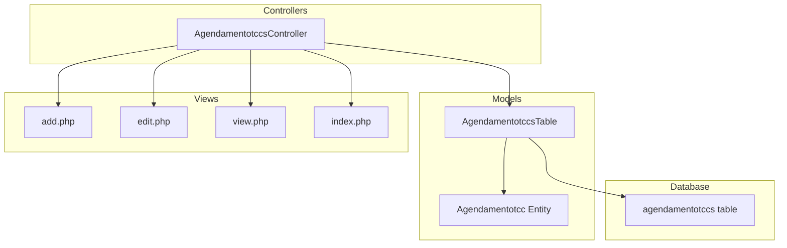
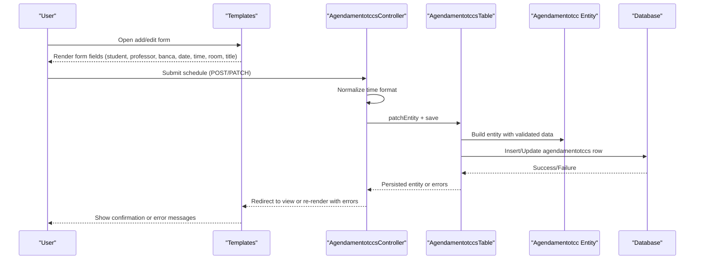
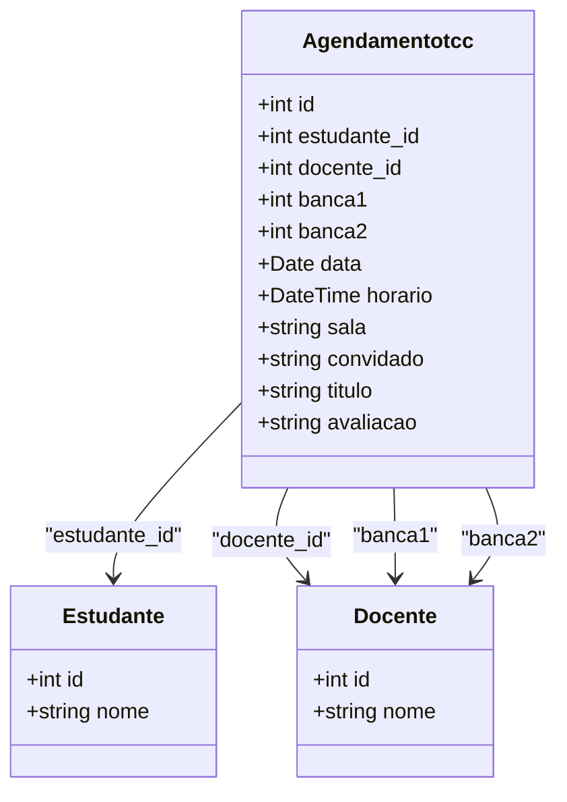
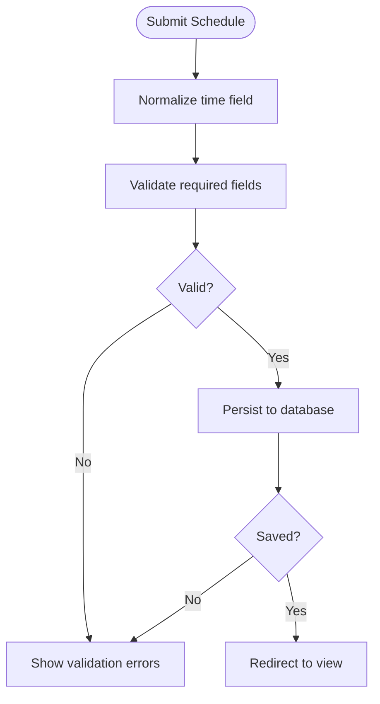
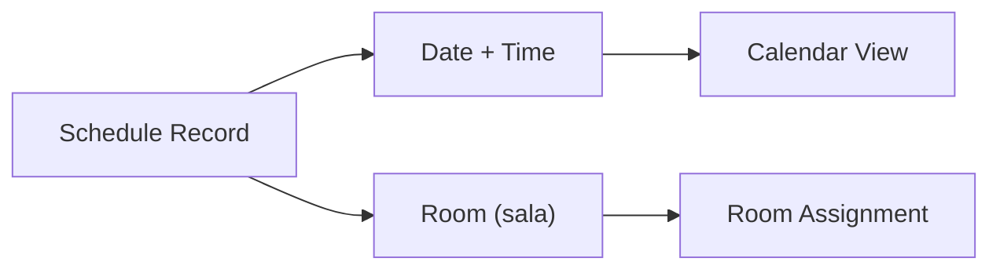
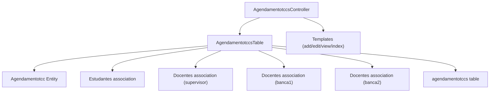

# Defense Scheduling System

<cite>
**Referenced Files in This Document**
- [Agendamentotcc.php](file://src/Model/Entity/Agendamentotcc.php)
- [AgendamentotccsTable.php](file://src/Model/Table/AgendamentotccsTable.php)
- [AgendamentotccsController.php](file://src/Controller/AgendamentotccsController.php)
- [add.php](file://templates/Agendamentotccs/add.php)
- [edit.php](file://templates/Agendamentotccs/edit.php)
- [view.php](file://templates/Agendamentotccs/view.php)
- [index.php](file://templates/Agendamentotccs/index.php)
- [schema.sql](file://config/Migrations/schema.sql)
- [app.php](file://config/app.php)
</cite>

## Table of Contents
1. [Introduction](#introduction)
2. [Project Structure](#project-structure)
3. [Core Components](#core-components)
4. [Architecture Overview](#architecture-overview)
5. [Detailed Component Analysis](#detailed-component-analysis)
6. [Dependency Analysis](#dependency-analysis)
7. [Performance Considerations](#performance-considerations)
8. [Troubleshooting Guide](#troubleshooting-guide)
9. [Conclusion](#conclusion)
10. [Appendices](#appendices)

## Introduction
This document describes the defense scheduling system for TCC (Thesis/Project) defenses. It focuses on calendar-based planning, room allocation, and conflict detection as implemented in the codebase. It details the Agendamentotcc entity structure, the current scheduling workflow from proposal to final scheduling, and how participants are involved. Where automated features such as notification systems or advanced conflict resolution are not present in the code, this is explicitly noted so readers can plan extensions accordingly.

## Project Structure
The scheduling feature follows a standard MVC pattern:
- Model layer defines the data model and validation rules for defense schedules.
- Controller handles requests to create, edit, view, list, and delete schedules.
- Templates provide user interfaces for adding/editing/viewing schedules and listing them.
- Database schema defines the storage structure for schedules and related entities.

**Diagram sources**
- [AgendamentotccsController.php:20-230](file://src/Controller/AgendamentotccsController.php#L20-L230)
- [Agendamentotcc.php:28-55](file://src/Model/Entity/Agendamentotcc.php#L28-L55)
- [AgendamentotccsTable.php:43-151](file://src/Model/Table/AgendamentotccsTable.php#L43-L151)
- [add.php:40-132](file://templates/Agendamentotccs/add.php#L40-L132)
- [edit.php:33-133](file://templates/Agendamentotccs/edit.php#L33-L133)
- [view.php:42-90](file://templates/Agendamentotccs/view.php#L42-L90)
- [index.php:52-68](file://templates/Agendamentotccs/index.php#L52-L68)
- [schema.sql:32-45](file://config/Migrations/schema.sql#L32-L45)

**Section sources**
- [AgendamentotccsController.php:20-230](file://src/Controller/AgendamentotccsController.php#L20-L230)
- [Agendamentotcc.php:28-55](file://src/Model/Entity/Agendamentotcc.php#L28-L55)
- [AgendamentotccsTable.php:43-151](file://src/Model/Table/AgendamentotccsTable.php#L43-L151)
- [add.php:40-132](file://templates/Agendamentotccs/add.php#L40-L132)
- [edit.php:33-133](file://templates/Agendamentotccs/edit.php#L33-L133)
- [view.php:42-90](file://templates/Agendamentotccs/view.php#L42-L90)
- [index.php:52-68](file://templates/Agendamentotccs/index.php#L52-L68)
- [schema.sql:32-45](file://config/Migrations/schema.sql#L32-L45)

## Core Components
- Agendamentotcc Entity: Represents a scheduled defense with fields for student, supervisor, two committee members (banca1, banca2), date, time, room, guest, title, and evaluation status.
- AgendamentotccsTable: Defines associations to students and professors, and enforces validation rules for required fields like date, time, room, and titles.
- AgendamentotccsController: Provides CRUD operations; normalizes time input before saving; lists and displays schedules with related entities.
- Templates: Provide forms for creating/editing schedules and views to inspect schedule details and list all schedules.

Key responsibilities:
- Data integrity via validation and relationships.
- User-facing scheduling workflows through forms and listings.
- Display of schedule details including associated student and professor names.

**Section sources**
- [Agendamentotcc.php:28-55](file://src/Model/Entity/Agendamentotcc.php#L28-L55)
- [AgendamentotccsTable.php:43-151](file://src/Model/Table/AgendamentotccsTable.php#L43-L151)
- [AgendamentotccsController.php:96-198](file://src/Controller/AgendamentotccsController.php#L96-L198)
- [add.php:40-132](file://templates/Agendamentotccs/add.php#L40-L132)
- [edit.php:33-133](file://templates/Agendamentotccs/edit.php#L33-L133)
- [view.php:42-90](file://templates/Agendamentotccs/view.php#L42-L90)

## Architecture Overview
The scheduling flow uses CakePHP’s MVC components:
- Users interact with add/edit templates to propose or modify a defense schedule.
- The controller validates and persists the schedule via the table layer.
- The table layer ensures data integrity and manages relationships to students and professors.
- Views render lists and details, showing associated entities.

**Diagram sources**
- [AgendamentotccsController.php:96-198](file://src/Controller/AgendamentotccsController.php#L96-L198)
- [AgendamentotccsTable.php:83-151](file://src/Model/Table/AgendamentotccsTable.php#L83-L151)
- [add.php:40-132](file://templates/Agendamentotccs/add.php#L40-L132)
- [edit.php:33-133](file://templates/Agendamentotccs/edit.php#L33-L133)
- [schema.sql:32-45](file://config/Migrations/schema.sql#L32-L45)

## Detailed Component Analysis

### Agendamentotcc Entity Structure
- Fields include identifiers for student and supervisor, two committee members (banca1, banca2), date, time, room, guest, title, and evaluation.
- Relationships allow loading associated student and professor records for display and validation.

**Diagram sources**
- [Agendamentotcc.php:28-55](file://src/Model/Entity/Agendamentotcc.php#L28-L55)
- [schema.sql:32-45](file://config/Migrations/schema.sql#L32-L45)

**Section sources**
- [Agendamentotcc.php:28-55](file://src/Model/Entity/Agendamentotcc.php#L28-L55)
- [schema.sql:32-45](file://config/Migrations/schema.sql#L32-L45)

### Scheduling Workflow and Validation
- Add/Edit flows accept inputs for student, supervisor, committee members, date/time, room, guest, and title.
- Time normalization ensures seconds are present before persistence.
- Validation requires presence of key fields and enforces types and lengths.

**Diagram sources**
- [AgendamentotccsController.php:96-198](file://src/Controller/AgendamentotccsController.php#L96-L198)
- [AgendamentotccsTable.php:83-151](file://src/Model/Table/AgendamentotccsTable.php#L83-L151)

**Section sources**
- [AgendamentotccsController.php:96-198](file://src/Controller/AgendamentotccsController.php#L96-L198)
- [AgendamentotccsTable.php:83-151](file://src/Model/Table/AgendamentotccsTable.php#L83-L151)

### Calendar-Based Planning and Room Allocation
- Date and time fields support calendar-based planning.
- Room allocation is stored as a string field; value “0” indicates non-presential sessions per template hints.
- Listing and detail views show date, time, and room for each schedule.

**Diagram sources**
- [add.php:88-105](file://templates/Agendamentotccs/add.php#L88-L105)
- [edit.php:90-106](file://templates/Agendamentotccs/edit.php#L90-L106)
- [view.php:73-84](file://templates/Agendamentotccs/view.php#L73-L84)
- [index.php:59-62](file://templates/Agendamentotccs/index.php#L59-L62)

**Section sources**
- [add.php:88-105](file://templates/Agendamentotccs/add.php#L88-L105)
- [edit.php:90-106](file://templates/Agendamentotccs/edit.php#L90-L106)
- [view.php:73-84](file://templates/Agendamentotccs/view.php#L73-L84)
- [index.php:59-62](file://templates/Agendamentotccs/index.php#L59-L62)

### Conflict Detection and Automated Resolution
- No explicit conflict detection logic is implemented in the controller or table layers.
- No automated rescheduling or conflict resolution routines are present in the analyzed files.
- To implement conflict detection, one would need to query existing schedules for overlapping times for the same student, supervisor, or committee members, and enforce constraints during save.

[No sources needed since this section explains absence of functionality]

### Notification Systems and Calendar Integration
- Email configuration exists in the application config, but no email sending logic was found in the scheduling controller or related models.
- No calendar integration (e.g., Google Calendar API) is implemented in the analyzed files.
- Notifications and external calendar sync would require additional services or mailers integrated into the controller or table lifecycle hooks.

**Section sources**
- [app.php:187-246](file://config/app.php#L187-L246)

[No sources needed since this section highlights missing integrations]

### Availability Checking for Professors and Rooms
- There is no availability checking logic for professors or rooms in the analyzed code.
- The system stores selected professors and rooms but does not validate against their existing commitments or room bookings.
- Implementing availability checks would involve querying other schedules and possibly a dedicated room resource table.

[No sources needed since this section explains absence of functionality]

### Rescheduling Procedures When Conflicts Arise
- Manual rescheduling is supported via edit/delete actions.
- Automated conflict-driven rescheduling is not implemented.
- In case of conflicts, an administrator would need to manually adjust dates/times/rooms using the provided edit interface.

**Section sources**
- [AgendamentotccsController.php:148-198](file://src/Controller/AgendamentotccsController.php#L148-L198)
- [AgendamentotccsController.php:207-228](file://src/Controller/AgendamentotccsController.php#L207-L228)

## Dependency Analysis
- Controller depends on Table for persistence and validation.
- Table defines BelongsTo associations to Estudantes and Docentes for both supervisor and committee roles.
- Templates depend on controller-provided data to render forms and lists.
- Database schema defines the core table structure for schedules.

**Diagram sources**
- [AgendamentotccsController.php:20-230](file://src/Controller/AgendamentotccsController.php#L20-L230)
- [AgendamentotccsTable.php:43-75](file://src/Model/Table/AgendamentotccsTable.php#L43-L75)
- [schema.sql:32-45](file://config/Migrations/schema.sql#L32-L45)

**Section sources**
- [AgendamentotccsTable.php:43-75](file://src/Model/Table/AgendamentotccsTable.php#L43-L75)
- [AgendamentotccsController.php:20-230](file://src/Controller/AgendamentotccsController.php#L20-L230)
- [schema.sql:32-45](file://config/Migrations/schema.sql#L32-L45)

## Performance Considerations
- Pagination is used when listing schedules, which helps performance for large datasets.
- Associations are loaded via contain() to avoid N+1 queries when rendering lists and details.
- Validation occurs at the table layer, reducing invalid writes to the database.

[No sources needed since this section provides general guidance]

## Troubleshooting Guide
Common issues and where to look:
- Validation failures: Check required fields and types enforced by the table validator.
- Time format issues: Ensure seconds are included; the controller normalizes time before saving.
- Missing records: Controllers handle record-not-found cases and redirect with flash messages.
- Permission/access: Authorization is applied in some flows; ensure appropriate roles.

**Section sources**
- [AgendamentotccsTable.php:83-151](file://src/Model/Table/AgendamentotccsTable.php#L83-L151)
- [AgendamentotccsController.php:74-89](file://src/Controller/AgendamentotccsController.php#L74-L89)
- [AgendamentotccsController.php:96-198](file://src/Controller/AgendamentotccsController.php#L96-L198)

## Conclusion
The defense scheduling system provides a solid foundation for calendar-based planning and room allocation through well-defined entities, validation, and MVC controllers/templates. However, it currently lacks automated conflict detection, availability checking for professors and rooms, notifications, and external calendar integrations. These capabilities can be added by extending the table and controller layers with business rules and integrating email/calendar services.

[No sources needed since this section summarizes without analyzing specific files]

## Appendices

### Example: Creating a New Defense Schedule
- Navigate to the add form, select student, supervisor, committee members, set date/time, choose room (use “0” for non-presential), enter title, and submit.
- The controller normalizes the time and persists the schedule if valid.

**Section sources**
- [add.php:40-132](file://templates/Agendamentotccs/add.php#L40-L132)
- [AgendamentotccsController.php:96-139](file://src/Controller/AgendamentotccsController.php#L96-L139)

### Example: Editing or Rescheduling a Defense
- Use the edit action to modify any field (date, time, room, committee).
- On successful update, the system redirects to the detail view.

**Section sources**
- [edit.php:33-133](file://templates/Agendamentotccs/edit.php#L33-L133)
- [AgendamentotccsController.php:148-198](file://src/Controller/AgendamentotccsController.php#L148-L198)

### Example: Viewing Schedule Details
- The view page shows student, supervisor, committee members, guest, title, room, date, time, and evaluation status.

**Section sources**
- [view.php:42-90](file://templates/Agendamentotccs/view.php#L42-L90)

### Database Schema Reference
- The agendamentotccs table stores all schedule-related fields and links to students and professors.

**Section sources**
- [schema.sql:32-45](file://config/Migrations/schema.sql#L32-L45)