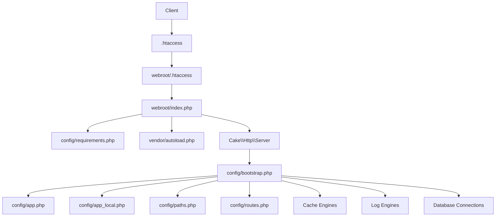
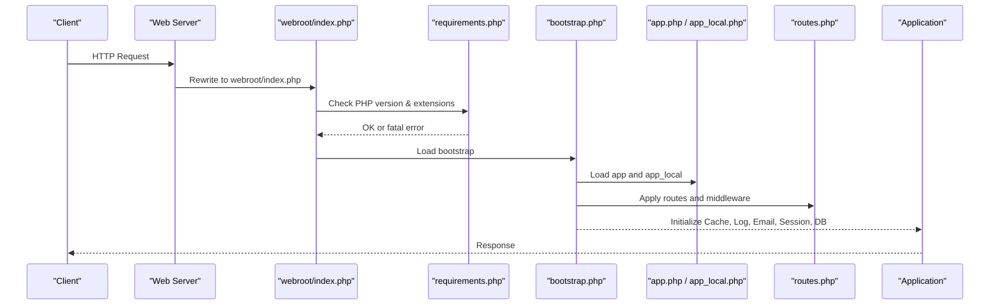

# Deployment and Configuration

<cite>
**Referenced Files in This Document**
- [index.php](file://index.php)
- [webroot/index.php](file://webroot/index.php)
- [config/requirements.php](file://config/requirements.php)
- [config/paths.php](file://config/paths.php)
- [config/bootstrap.php](file://config/bootstrap.php)
- [config/app.php](file://config/app.php)
- [config/app_local.example.php](file://config/app_local.example.php)
- [config/routes.php](file://config/routes.php)
- [config/schema/sessions.sql](file://config/schema/sessions.sql)
- [config/Migrations/schema.sql](file://config/Migrations/schema.sql)
- [composer.json](file://composer.json)
- [webroot/.htaccess](file://webroot/.htaccess)
- [.htaccess](file:.htaccess)
</cite>

## Table of Contents
1. Introduction
2. Project Structure
3. Core Components
4. Architecture Overview
5. Detailed Component Analysis
6. Dependency Analysis
7. Performance Considerations
8. Troubleshooting Guide
9. Conclusion
10. Appendices

## Introduction
This document provides production deployment guidance for a CakePHP application, covering server requirements, PHP extensions, environment configuration, database setup, performance tuning, caching, logging, security hardening, backups, and disaster recovery. It is based on the repository’s configuration files and bootstrap process to ensure accuracy and consistency with the codebase.

## Project Structure
The application follows a standard CakePHP layout:
- Web entry points route requests through webroot/index.php into the framework.
- Configuration is split between shared settings (app.php) and per-environment overrides (app_local.php).
- Bootstrap wires up paths, error handling, cache, logging, and routing.
- Database schema and migrations are provided under config/schema and config/Migrations.

**Diagram sources**
- [index.php:1-17](file://index.php#L1-L17)
- [webroot/index.php:1-41](file://webroot/index.php#L1-L41)
- [config/requirements.php:1-47](file://config/requirements.php#L1-L47)
- [config/bootstrap.php:1-170](file://config/bootstrap.php#L1-L170)
- [config/app.php:1-402](file://config/app.php#L1-L402)
- [config/app_local.example.php:1-94](file://config/app_local.example.php#L1-L94)
- [config/paths.php:1-95](file://config/paths.php#L1-L95)
- [config/routes.php:1-101](file://config/routes.php#L1-L101)
- [webroot/.htaccess:1-6](file://webroot/.htaccess#L1-L6)
- [.htaccess:1-13](file:.htaccess#L1-L13)

**Section sources**
- [index.php:1-17](file://index.php#L1-L17)
- [webroot/index.php:1-41](file://webroot/index.php#L1-L41)
- [config/paths.php:1-95](file://config/paths.php#L1-L95)
- [config/bootstrap.php:1-170](file://config/bootstrap.php#L1-L170)
- [config/app.php:1-402](file://config/app.php#L1-L402)
- [config/app_local.example.php:1-94](file://config/app_local.example.php#L1-L94)
- [config/routes.php:1-101](file://config/routes.php#L1-L101)
- [webroot/.htaccess:1-6](file://webroot/.htaccess#L1-L6)
- [.htaccess:1-13](file:.htaccess#L1-L13)

## Core Components
- Server entrypoint: The root index.php delegates to webroot/index.php, which loads requirements checks, Composer autoloader, and boots the CakePHP server.
- Requirements check: Enforces minimum PHP version and required extensions (intl, mbstring).
- Bootstrap: Loads configuration, sets timezone/locale, registers error handlers, configures cache/log/email/session, and applies routes.
- Configuration: app.php defines framework-wide defaults; app_local.php overrides per environment (DB credentials, debug flag, salts).
- Routing: Defines CSRF middleware and default routes.
- Database: Uses MySQL driver by default; connection details can be set via DSN or individual keys.

**Section sources**
- [webroot/index.php:18-41](file://webroot/index.php#L18-L41)
- [config/requirements.php:20-47](file://config/requirements.php#L20-L47)
- [config/bootstrap.php:81-170](file://config/bootstrap.php#L81-L170)
- [config/app.php:10-402](file://config/app.php#L10-L402)
- [config/app_local.example.php:8-93](file://config/app_local.example.php#L8-L93)
- [config/routes.php:48-88](file://config/routes.php#L48-L88)

## Architecture Overview
Production request flow:
- HTTP request arrives at the web server root.
- .htaccess rewrites to webroot unless serving static assets.
- webroot/.htaccess forwards non-static requests to index.php.
- webroot/index.php validates platform requirements, loads Composer, and starts the CakePHP server.
- Bootstrap loads configuration, initializes cache/log/email/session, and sets up routing.
- Application processes the request using controllers, models, and views.

**Diagram sources**
- [webroot/index.php:18-41](file://webroot/index.php#L18-L41)
- [config/requirements.php:20-47](file://config/requirements.php#L20-L47)
- [config/bootstrap.php:81-170](file://config/bootstrap.php#L81-L170)
- [config/app.php:10-402](file://config/app.php#L10-L402)
- [config/app_local.example.php:8-93](file://config/app_local.example.php#L8-L93)
- [config/routes.php:48-88](file://config/routes.php#L48-L88)

## Detailed Component Analysis

### Environment Variables and Configuration Management
- Debug mode: Controlled via DEBUG environment variable and applied in both app.php and app_local.example.php.
- Security salt: Provided via SECURITY_SALT environment variable and consumed by Security configuration.
- Database: Default connection uses MySQL; credentials can be set via DATABASE_URL or host/port/username/password/database in app_local.php.
- Email transport: Configurable via EMAIL_TRANSPORT_DEFAULT_URL or SMTP settings in app.php/app_local.php.
- Logging: File-based logs for debug, error, and queries; log file paths use LOGS constant from paths.php.
- Locale/timezone: Set in bootstrap.php; timezone also read from App.defaultTimezone.

Operational notes:
- Keep app_local.php out of version control; manage secrets via environment variables or secure secret managers.
- Use DATABASE_URL for concise per-environment DB configuration.
- Ensure LOGS directory is writable by the web server user.

**Section sources**
- [config/app.php:20-20](file://config/app.php#L20-L20)
- [config/app.php:78-80](file://config/app.php#L78-L80)
- [config/app.php:261-327](file://config/app.php#L261-L327)
- [config/app.php:332-357](file://config/app.php#L332-L357)
- [config/app_local.example.php:18-29](file://config/app_local.example.php#L18-L29)
- [config/app_local.example.php:37-61](file://config/app_local.example.php#L37-L61)
- [config/app_local.example.php:83-91](file://config/app_local.example.php#L83-L91)
- [config/paths.php:69-76](file://config/paths.php#L69-L76)
- [config/bootstrap.php:108-123](file://config/bootstrap.php#L108-L123)
- [config/bootstrap.php:289-293](file://config/bootstrap.php#L289-L293)

### Database Setup and Configuration
- Driver: MySQL is configured by default in app.php.
- Connection options: persistent connections disabled; timezone set; metadata caching enabled; identifier quoting disabled by default.
- Schema: A full database dump is available in config/Migrations/schema.sql; session storage table is provided in config/schema/sessions.sql if using database sessions.
- Recommended encoding: utf8mb4 for full UTF-8 support.

Deployment steps:
- Create the database and import schema.sql.
- If using database sessions, create the sessions table using sessions.sql.
- Configure DATABASE_URL or individual DB credentials in app_local.php.

**Section sources**
- [config/app.php:261-327](file://config/app.php#L261-L327)
- [config/Migrations/schema.sql:1-24](file://config/Migrations/schema.sql#L1-L24)
- [config/schema/sessions.sql:8-15](file://config/schema/sessions.sql#L8-L15)

### Web Server and URL Rewriting
- Root .htaccess rewrites requests to webroot while allowing well-known paths.
- webroot/.htaccess serves static files directly and forwards other requests to index.php.
- For Apache, ensure mod_rewrite is enabled. For Nginx/Apache without rewrite, configure equivalent rules to point to webroot/index.php.

**Section sources**
- [.htaccess:1-13](file:.htaccess#L1-L13)
- [webroot/.htaccess:1-6](file://webroot/.htaccess#L1-L6)

### Routing and Middleware
- CSRF protection middleware is registered and applied globally in routes.php.
- Fallback routes connect controller/action URLs dynamically.

Security note:
- Ensure HTTPS termination at the reverse proxy and enforce secure cookies where applicable.

**Section sources**
- [config/routes.php:48-88](file://config/routes.php#L48-L88)

### Error Handling and Logging
- Error handler is registered in bootstrap.php based on environment (CLI vs web).
- Logging is configured to write to LOGS directory with separate channels for debug, error, and queries.
- Query logging requires enabling the datasource log flag.

Operational tips:
- Rotate log files regularly.
- Centralize logs to a log aggregation system in production.

**Section sources**
- [config/bootstrap.php:124-141](file://config/bootstrap.php#L124-L141)
- [config/app.php:150-185](file://config/app.php#L150-L185)
- [config/app.php:332-357](file://config/app.php#L332-L357)

### Caching Strategy
- Default cache engine is FileEngine, writing to CACHE path derived from TMP/cache.
- Dedicated caches exist for translations, model metadata, and routes.
- In development, durations are shortened; in production, long durations improve performance.

Recommendations:
- Switch to a shared memory cache (e.g., Redis/Memcached) for multi-server deployments.
- Ensure CACHE directory is writable and consider externalizing cache storage for scalability.

**Section sources**
- [config/app.php:95-148](file://config/app.php#L95-L148)
- [config/paths.php:63-76](file://config/paths.php#L63-L76)
- [config/bootstrap.php:96-105](file://config/bootstrap.php#L96-L105)

### Sessions
- Default session handler uses PHP’s built-in mechanism.
- Alternative handlers include cache and database-backed sessions; database sessions require the sessions table.

Best practices:
- For horizontal scaling, prefer cache or database sessions to share state across servers.
- Secure cookie settings should be enforced at the web server or via application configuration.

**Section sources**
- [config/app.php:359-400](file://config/app.php#L359-L400)
- [config/schema/sessions.sql:8-15](file://config/schema/sessions.sql#L8-L15)

### Email Delivery
- Default transport is MailTransport; SMTP can be configured via EMAIL_TRANSPORT_DEFAULT_URL or explicit host/port/credentials.
- Ensure outbound email is allowed and consider using a transactional email provider.

**Section sources**
- [config/app.php:187-246](file://config/app.php#L187-L246)
- [config/app_local.example.php:76-91](file://config/app_local.example.php#L76-L91)

## Dependency Analysis
Runtime dependencies:
- PHP >= 8.1
- intl extension with ICU >= 50.1
- mbstring extension
- MySQL driver (PDO_MYSQL) for database connectivity
- Optional: Redis/Memcached for scalable caching

Framework and plugins:
- cakephp/cakephp ^5.0
- authentication, authorization, migrations
- dompdf/dompdf and friendsofcake/cakepdf for PDF generation
- mobiledetect/mobiledetectlib for device detection

Composer-managed installation ensures consistent dependency resolution.

**Section sources**
- [composer.json:7-16](file://composer.json#L7-L16)
- [config/requirements.php:20-47](file://config/requirements.php#L20-L47)

## Performance Considerations
- Disable debug in production to reduce overhead and hide errors.
- Enable opcode caching (OPcache) at the PHP level.
- Use a high-performance cache backend (Redis/Memcached) instead of file-based cache for multi-server setups.
- Tune database connection pooling and query caching; enable metadata caching as configured.
- Serve static assets via CDN or web server caching; leverage browser caching headers at the reverse proxy.
- Optimize database indexes and avoid heavy queries; monitor slow queries via query logging when needed.
- Consider enabling gzip/deflate compression at the web server.

[No sources needed since this section provides general guidance]

## Troubleshooting Guide
Common issues and resolutions:
- Platform requirement failures: Ensure PHP version meets minimum and required extensions (intl, mbstring) are enabled.
- Database connection errors: Verify DATABASE_URL or credentials in app_local.php; confirm network access and firewall rules.
- Permission errors: Ensure tmp, logs, and cache directories are writable by the web server user.
- Routing issues: Confirm web server rewrite rules direct requests to webroot/index.php.
- Email delivery failures: Validate SMTP settings or mailer configuration; check outbound connectivity and provider limits.

Operational checks:
- Inspect logs in the LOGS directory for errors and warnings.
- Use health checks to verify database connectivity and cache availability.

**Section sources**
- [config/requirements.php:20-47](file://config/requirements.php#L20-L47)
- [config/app.php:332-357](file://config/app.php#L332-L357)
- [config/paths.php:63-76](file://config/paths.php#L63-L76)
- [webroot/.htaccess:1-6](file://webroot/.htaccess#L1-L6)

## Conclusion
This deployment guide aligns with the application’s configuration and bootstrap behavior to ensure a secure, performant, and maintainable production environment. Follow the environment management, database setup, and performance recommendations to achieve reliable operations. Implement robust monitoring, logging, backups, and disaster recovery procedures to protect data and service continuity.

[No sources needed since this section summarizes without analyzing specific files]

## Appendices

### Production Checklist
- Set DEBUG=false and configure SECURITY_SALT via environment variables.
- Configure DATABASE_URL or DB credentials in app_local.php.
- Ensure LOGS and CACHE directories are writable and rotated.
- Enable OPcache and tune PHP settings for production.
- Configure web server rewrite rules to serve static assets and forward dynamic requests.
- Set up database backups and test restore procedures.
- Monitor application logs and database performance metrics.

[No sources needed since this section provides general guidance]