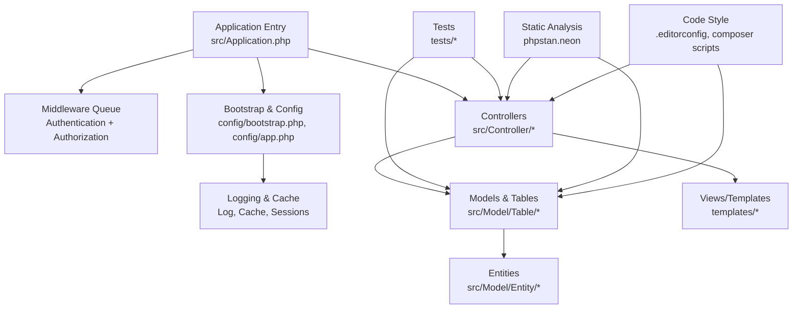
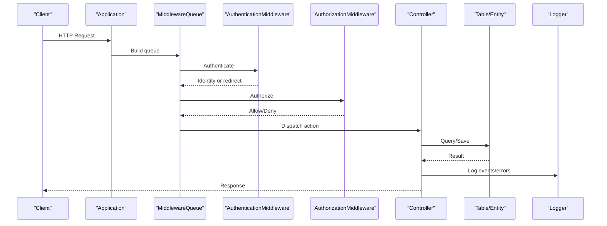
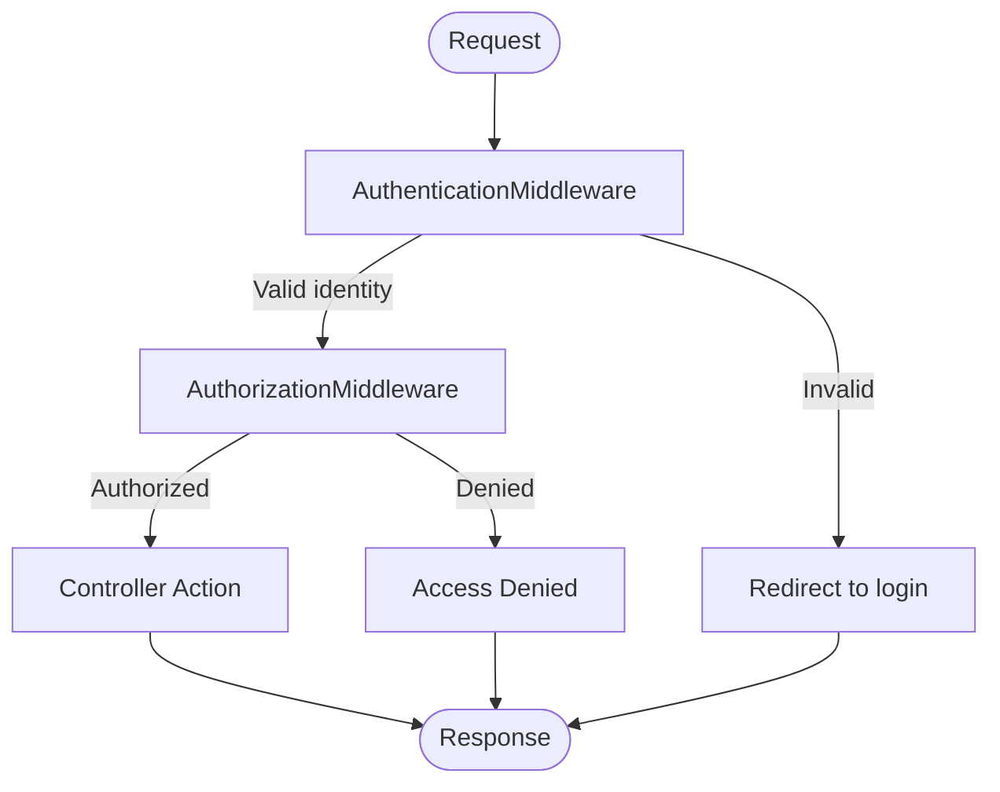
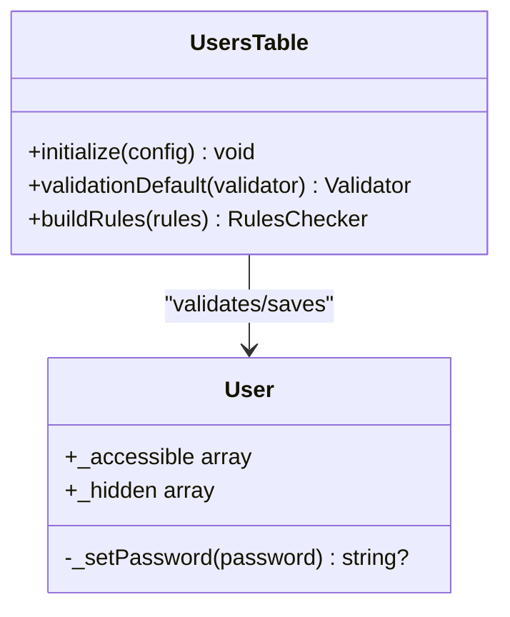
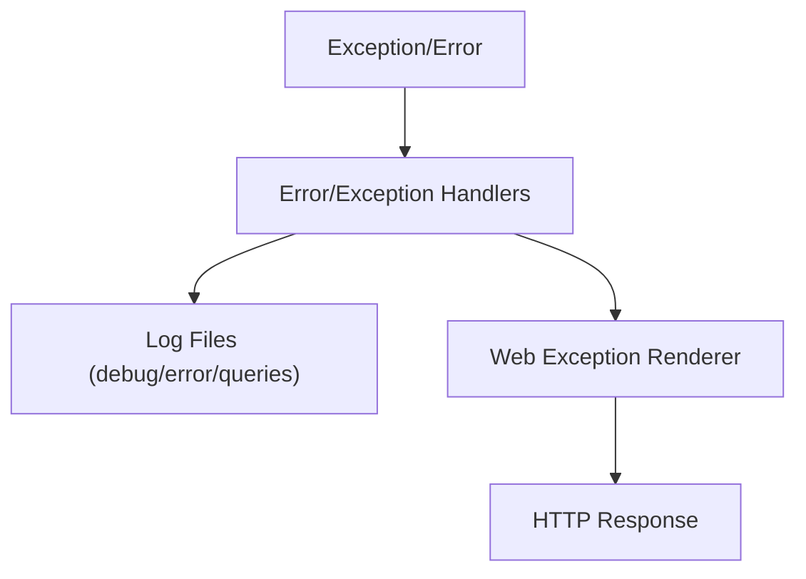
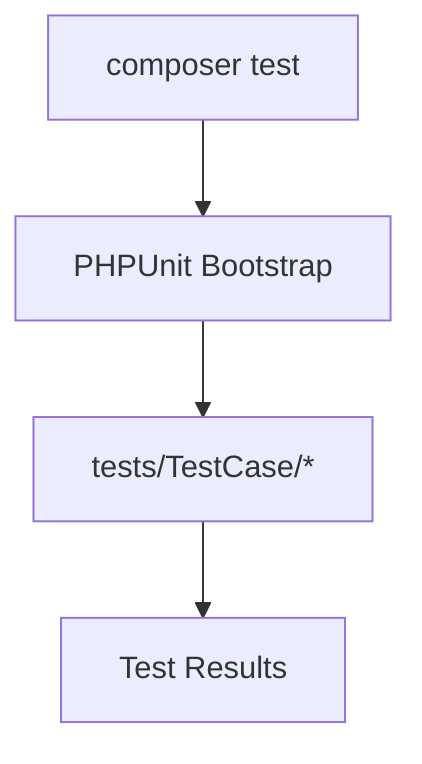
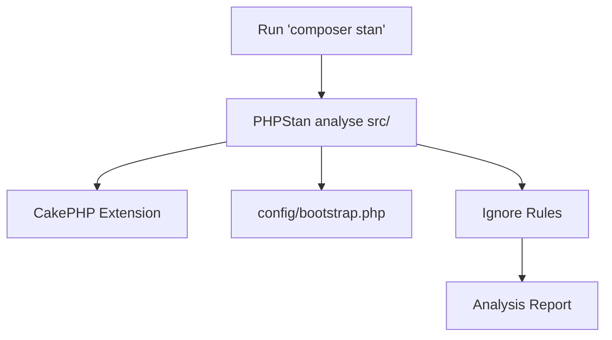
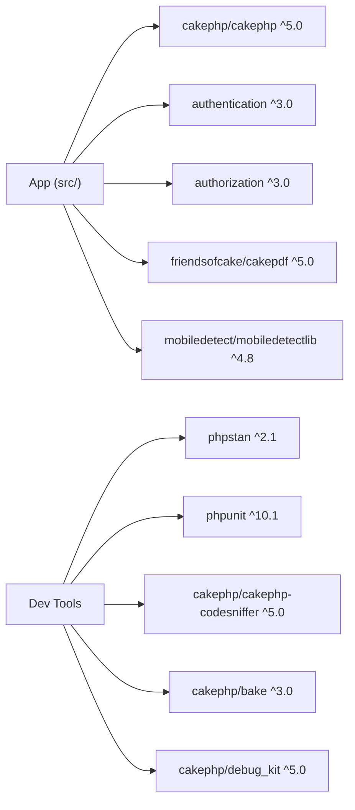

# Development Guidelines

<cite>
**Referenced Files in This Document**
- [composer.json](file://composer.json)
- [phpstan.neon](file://phpstan.neon)
- [phpunit.xml.dist](file://phpunit.xml.dist)
- [README.md](file://README.md)
- [src/Application.php](file://src/Application.php)
- [config/app.php](file://config/app.php)
- [config/bootstrap.php](file://config/bootstrap.php)
- [src/Controller/AppController.php](file://src/Controller/AppController.php)
- [src/Model/Table/UsersTable.php](file://src/Model/Table/UsersTable.php)
- [src/Model/Entity/User.php](file://src/Model/Entity/User.php)
- [.editorconfig](file://.editorconfig)
</cite>

## Table of Contents
1. [Introduction](#introduction)
2. [Project Structure](#project-structure)
3. [Core Components](#core-components)
4. [Architecture Overview](#architecture-overview)
5. [Detailed Component Analysis](#detailed-component-analysis)
6. [Dependency Analysis](#dependency-analysis)
7. [Performance Considerations](#performance-considerations)
8. [Troubleshooting Guide](#troubleshooting-guide)
9. [Conclusion](#conclusion)
10. [Appendices](#appendices)

## Introduction
This document provides comprehensive development guidelines for the CakePHP application, covering coding standards, Git workflow, code review processes, debugging techniques, static analysis configuration, automated testing, and continuous integration setup. It aligns with PSR standards, CakePHP conventions, and the project’s existing tooling (Composer scripts, PHPStan, PHPUnit).

## Project Structure
The application follows a standard CakePHP layout:
- src/: Application code (Controllers, Models, Entities, Policies, Views, Commands)
- config/: Configuration files (app settings, bootstrap, routes, migrations)
- templates/: View templates organized by controller
- tests/: Unit and integration tests with fixtures
- webroot/: Public assets
- bin/: CLI entry points
- vendor/: Dependencies managed by Composer

**Diagram sources**
- [src/Application.php:91-113](file://src/Application.php#L91-L113)
- [config/bootstrap.php:165-169](file://config/bootstrap.php#L165-L169)
- [config/app.php:332-357](file://config/app.php#L332-L357)
- [phpstan.neon:1-10](file://phpstan.neon#L1-L10)
- [.editorconfig:6-11](file://.editorconfig#L6-L11)

**Section sources**
- [README.md:1-54](file://README.md#L1-L54)
- [composer.json:32-53](file://composer.json#L32-L53)

## Core Components
- Application bootstrap and middleware pipeline define authentication and authorization flow.
- Controllers load components for Flash messages, Authentication, and Authorization.
- Models use Tables and Entities with validation rules and relationships.
- Logging is configured to write debug/error/query logs to files.
- Static analysis uses PHPStan with CakePHP-specific extensions and level 5.
- Testing uses PHPUnit with a dedicated test suite and source inclusion/exclusion.

Key responsibilities:
- src/Application.php: Bootstraps plugins, registers middleware, configures Authentication and Authorization services.
- src/Controller/AppController.php: Loads core components and sets up unauthenticated actions.
- src/Model/Table/UsersTable.php: Defines table metadata, associations, validation, and rules.
- src/Model/Entity/User.php: Mass assignment policy, password hashing, hidden fields.
- config/app.php: Logging, cache, sessions, email transports, database connections.
- config/bootstrap.php: Environment setup, locale/timezone, CakePdf configuration.
- phpstan.neon: PHPStan configuration including CakePHP extension and ignore rules.
- phpunit.xml.dist: Test suite definition and coverage source configuration.

**Section sources**
- [src/Application.php:62-113](file://src/Application.php#L62-L113)
- [src/Controller/AppController.php:44-67](file://src/Controller/AppController.php#L44-L67)
- [src/Model/Table/UsersTable.php:40-125](file://src/Model/Table/UsersTable.php#L40-L125)
- [src/Model/Entity/User.php:38-67](file://src/Model/Entity/User.php#L38-L67)
- [config/app.php:179-185](file://config/app.php#L179-L185)
- [config/app.php:332-357](file://config/app.php#L332-L357)
- [config/bootstrap.php:288-313](file://config/bootstrap.php#L288-L313)
- [phpstan.neon:1-10](file://phpstan.neon#L1-L10)
- [phpunit.xml.dist:8-24](file://phpunit.xml.dist#L8-L24)

## Architecture Overview
The request lifecycle integrates authentication and authorization via middleware before reaching controllers. Logging and caching are configured at bootstrap and used throughout the application.

**Diagram sources**
- [src/Application.php:91-113](file://src/Application.php#L91-L113)
- [config/app.php:332-357](file://config/app.php#L332-L357)

**Section sources**
- [src/Application.php:91-113](file://src/Application.php#L91-L113)
- [config/app.php:332-357](file://config/app.php#L332-L357)

## Detailed Component Analysis

### Coding Standards and Conventions
- EditorConfig enforces consistent indentation, line endings, and trailing whitespace across editors.
- Code style checks and fixes are provided via Composer scripts using CakePHP CodeSniffer.
- PHPStan level 5 with CakePHP extension ensures type safety and catches common issues.

Practical guidance:
- Use PSR-4 autoloading; namespace classes under App\*.
- Follow CakePHP naming conventions for controllers, tables, entities, and templates.
- Keep strict types enabled where appropriate.

**Section sources**
- [.editorconfig:6-11](file://.editorconfig#L6-L11)
- [composer.json:46-53](file://composer.json#L46-L53)
- [phpstan.neon:1-10](file://phpstan.neon#L1-L10)

### Authentication and Authorization Flow
- Middleware-based authentication and authorization are registered in the application.
- Unauthenticated actions can be whitelisted in the base controller.

**Diagram sources**
- [src/Application.php:91-113](file://src/Application.php#L91-L113)
- [src/Controller/AppController.php:62-67](file://src/Controller/AppController.php#L62-L67)

**Section sources**
- [src/Application.php:91-113](file://src/Application.php#L91-L113)
- [src/Controller/AppController.php:62-67](file://src/Controller/AppController.php#L62-L67)

### Data Validation and Security
- UsersTable defines validation rules and relationship constraints.
- User entity hashes passwords on set and hides sensitive fields in serialization.

**Diagram sources**
- [src/Model/Table/UsersTable.php:40-125](file://src/Model/Table/UsersTable.php#L40-L125)
- [src/Model/Entity/User.php:38-67](file://src/Model/Entity/User.php#L38-L67)

**Section sources**
- [src/Model/Table/UsersTable.php:67-108](file://src/Model/Table/UsersTable.php#L67-L108)
- [src/Model/Entity/User.php:53-67](file://src/Model/Entity/User.php#L53-L67)

### Logging and Error Handling
- Error handling is configured to log exceptions and render web errors.
- Dedicated log channels exist for debug, error, and queries.

**Diagram sources**
- [config/app.php:179-185](file://config/app.php#L179-L185)
- [config/app.php:332-357](file://config/app.php#L332-L357)

**Section sources**
- [config/app.php:179-185](file://config/app.php#L179-L185)
- [config/app.php:332-357](file://config/app.php#L332-L357)

### Testing Setup
- PHPUnit is configured with a test suite and source includes/excludes.
- Composer script runs tests with colors enabled.

**Diagram sources**
- [phpunit.xml.dist:8-24](file://phpunit.xml.dist#L8-L24)
- [composer.json:53](file://composer.json#L53)

**Section sources**
- [phpunit.xml.dist:8-24](file://phpunit.xml.dist#L8-L24)
- [composer.json:53](file://composer.json#L53)

### Static Analysis Configuration
- PHPStan level 5 with CakePHP extension included.
- Bootstrap file loaded to ensure runtime context.
- Targeted ignore rules address dynamic CakePHP behaviors.

**Diagram sources**
- [phpstan.neon:1-10](file://phpstan.neon#L1-L10)
- [phpstan.neon:11-37](file://phpstan.neon#L11-L37)
- [composer.json:52](file://composer.json#L52)

**Section sources**
- [phpstan.neon:1-10](file://phpstan.neon#L1-L10)
- [phpstan.neon:11-37](file://phpstan.neon#L11-L37)
- [composer.json:52](file://composer.json#L52)

## Dependency Analysis
The application relies on CakePHP core, Authentication/Authorization plugins, PDF generation, and mobile detection. Dev dependencies include Bake, DebugKit, PHPStan, PHPUnit, and code sniffer.

**Diagram sources**
- [composer.json:7-25](file://composer.json#L7-L25)

**Section sources**
- [composer.json:7-25](file://composer.json#L7-L25)

## Performance Considerations
- Enable route caching in production when using many routes.
- Adjust cache durations per environment; development uses shorter durations for faster feedback.
- Use query logging judiciously; enable only when diagnosing performance issues.
- Prefer indexed columns and efficient ORM queries; avoid N+1 problems by using containments.
- Profile with DebugKit in development; disable in production.

[No sources needed since this section provides general guidance]

## Troubleshooting Guide
Common issues and resolutions:
- Authentication redirects loop: Ensure unauthenticated actions are correctly listed in AppController.
- Authorization denials: Verify policies and roles; check Authorization service configuration.
- Logging not writing: Confirm LOGS directory permissions and Log channel paths.
- Tests failing due to DB: Validate test datasource configuration and fixtures.
- PHPStan false positives: Review ignore rules and adjust levels if necessary.

Operational tips:
- Check logs in logs/ directory for debug, error, and queries.
- Use Composer scripts to run checks consistently across environments.
- Enable DebugKit locally for detailed request profiling.

**Section sources**
- [src/Controller/AppController.php:62-67](file://src/Controller/AppController.php#L62-L67)
- [config/app.php:332-357](file://config/app.php#L332-L357)
- [phpunit.xml.dist:8-24](file://phpunit.xml.dist#L8-L24)
- [phpstan.neon:11-37](file://phpstan.neon#L11-L37)

## Conclusion
This guide consolidates coding standards, workflows, and tooling practices aligned with the project’s CakePHP architecture. By following these guidelines, teams can maintain consistency, improve code quality, and streamline development through automated checks and clear debugging strategies.

[No sources needed since this section summarizes without analyzing specific files]

## Appendices

### Git Workflow and Branching Strategy
- Use feature branches named after user stories or tasks (e.g., feature/add-user-role).
- Create a main branch for stable releases and a develop branch for integration.
- Merge via pull requests with required reviews and passing CI checks.

### Commit Message Conventions
- Use imperative mood and concise summaries (e.g., “Add user role management”).
- Include scope and ticket references when applicable (e.g., “[Users] Add role field”).
- Separate subject from body with a blank line; keep lines under 72 characters.

### Code Review Checklist
- Adheres to PSR and CakePHP conventions.
- Includes tests for new functionality.
- No security regressions (input validation, output escaping, authz checks).
- Logs appropriately and avoids sensitive data exposure.
- Performance impact considered (queries, caching).

### Continuous Integration Pipeline
- Install dependencies via Composer.
- Run code style checks: composer cs-check.
- Run static analysis: composer stan.
- Execute tests: composer test.
- Fail the build on any failures; gate merges on passing checks.

[No sources needed since this section provides general guidance]