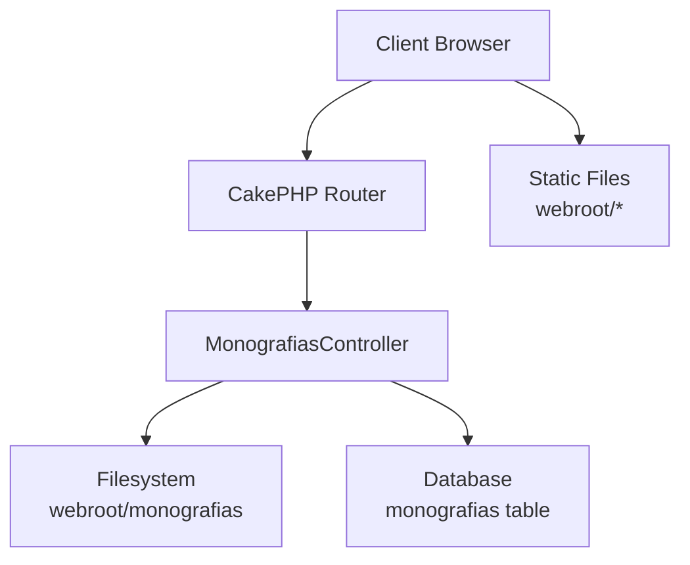
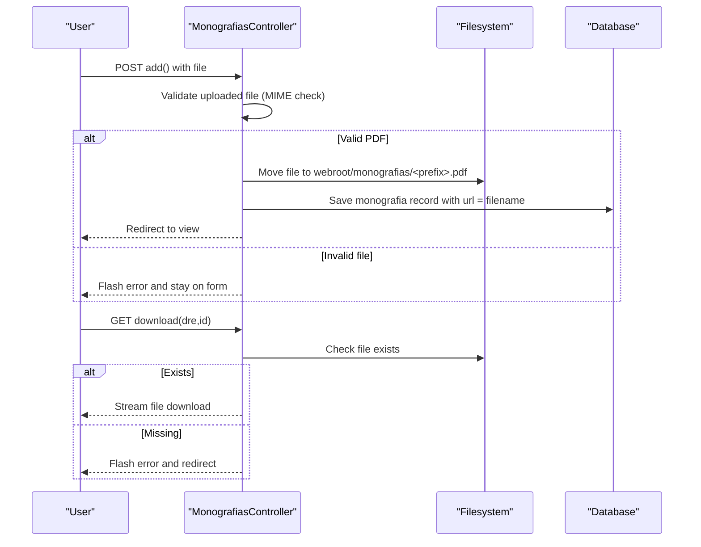
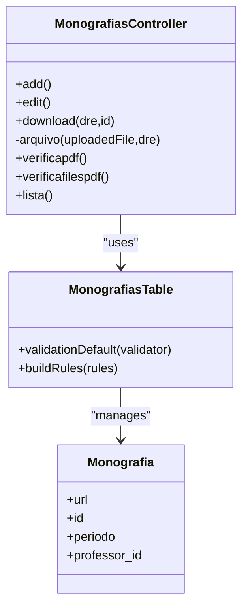

# File Management System

<cite>
**Referenced Files in This Document**
- [MonografiasController.php](file://src/Controller/MonografiasController.php)
- [MonografiasTable.php](file://src/Model/Table/MonografiasTable.php)
- [Monografia.php](file://src/Model/Entity/Monografia.php)
- [schema.sql](file://config/Migrations/schema.sql)
- [app.php](file://config/app.php)
- [.htaccess](file://webroot/.htaccess)
- [edit.php](file://templates/Monografias/edit.php)
</cite>

## Table of Contents
1. [Introduction](#introduction)
2. [Project Structure](#project-structure)
3. [Core Components](#core-components)
4. [Architecture Overview](#architecture-overview)
5. [Detailed Component Analysis](#detailed-component-analysis)
6. [Dependency Analysis](#dependency-analysis)
7. [Performance Considerations](#performance-considerations)
8. [Troubleshooting Guide](#troubleshooting-guide)
9. [Conclusion](#conclusion)
10. [Appendices](#appendices)

## Introduction
This document explains the file management system for monograph PDFs, covering upload, storage, validation, download, and maintenance utilities. It focuses on how files are accepted, validated, stored under the webroot directory, linked to database records, and served for download. It also outlines current limitations and provides recommendations for security hardening, backup and recovery procedures, and performance optimization for large files.

## Project Structure
The file handling logic is centered around:
- Controller actions that accept uploads, validate MIME type, store files, and serve downloads
- Model definitions that define the monograph entity and its fields (including the URL reference)
- Database schema that stores metadata and a filename reference
- Web server configuration that routes requests through CakePHP and exposes the public assets folder

**Diagram sources**
- [MonografiasController.php:107-121](file://src/Controller/MonografiasController.php#L107-L121)
- [MonografiasController.php:319-331](file://src/Controller/MonografiasController.php#L319-L331)
- [MonografiasController.php:499-511](file://src/Controller/MonografiasController.php#L499-L511)
- [schema.sql:434-456](file://config/Migrations/schema.sql#L434-L456)
- [app.php:50-69](file://config/app.php#L50-L69)

**Section sources**
- [MonografiasController.php:107-121](file://src/Controller/MonografiasController.php#L107-L121)
- [MonografiasController.php:319-331](file://src/Controller/MonografiasController.php#L319-L331)
- [MonografiasController.php:499-511](file://src/Controller/MonografiasController.php#L499-L511)
- [schema.sql:434-456](file://config/Migrations/schema.sql#L434-L456)
- [app.php:50-69](file://config/app.php#L50-L69)

## Core Components
- Upload flow: The controller accepts a file via a form field, validates it as a PDF by MIME type, names the file using a student registration or timestamp, and moves it into webroot/monografias.
- Storage location: All monograph PDFs are stored directly under webroot/monografias with simple filenames derived from identifiers.
- Metadata linkage: The saved filename is persisted in the monografias table’s url column.
- Download flow: A controller action serves the file for download using the framework’s response builder.
- Maintenance utilities: Endpoints scan the filesystem and synchronize database references to ensure consistency between stored files and database entries.

**Section sources**
- [MonografiasController.php:107-121](file://src/Controller/MonografiasController.php#L107-L121)
- [MonografiasController.php:319-331](file://src/Controller/MonografiasController.php#L319-L331)
- [MonografiasController.php:499-511](file://src/Controller/MonografiasController.php#L499-L511)
- [schema.sql:434-456](file://config/Migrations/schema.sql#L434-L456)

## Architecture Overview
The end-to-end flow for uploading and downloading monograph PDFs:

**Diagram sources**
- [MonografiasController.php:107-121](file://src/Controller/MonografiasController.php#L107-L121)
- [MonografiasController.php:319-331](file://src/Controller/MonografiasController.php#L319-L331)
- [MonografiasController.php:499-511](file://src/Controller/MonografiasController.php#L499-L511)

## Detailed Component Analysis

### Upload Handling and Validation
- Entry point: The add action checks for an uploaded file and prepares a prefix based on the primary student registration or a timestamp if none is available.
- Validation: The private arquivo method validates the client-provided MIME type and only accepts application/pdf. If not a PDF, it returns null and displays an error message.
- Storage: On success, the file is moved to webroot/monografias with a name composed of the prefix plus .pdf extension.
- Persistence: The resulting filename is stored in the monografias.url field when saving the entity.

Security considerations:
- Only client MIME type is checked; there is no server-side content verification or virus scanning in the current code.
- No explicit size limit is enforced at the application level; PHP runtime limits apply.

Recommendations:
- Add server-side content validation (e.g., magic bytes or library-based PDF validation).
- Enforce maximum file size in both PHP configuration and application logic.
- Integrate antivirus scanning before moving the file to the final location.

**Section sources**
- [MonografiasController.php:107-121](file://src/Controller/MonografiasController.php#L107-L121)
- [MonografiasController.php:319-331](file://src/Controller/MonografiasController.php#L319-L331)

### Storage Location and Naming Conventions
- Directory: webroot/monografias is used as the public storage path for monograph PDFs.
- Naming: Filenames follow the pattern <identifier>.pdf where identifier is either a student registration number or a timestamp.
- Organization: All files are stored flat in a single directory without subfolders or versioning.

Implications:
- Flat structure simplifies access but increases risk of naming collisions and makes large-scale organization harder.
- Using stable identifiers (student registration) improves traceability.

**Section sources**
- [MonografiasController.php:319-331](file://src/Controller/MonografiasController.php#L319-L331)
- [schema.sql:434-456](file://config/Migrations/schema.sql#L434-L456)

### Database Integration and Metadata
- Entity and table: The Monografia entity maps to the monografias table, which includes a url column storing the filename reference.
- Relationships: The monografias table relates to students via Tccestudantes, enabling association between uploaded files and student records.
- Field constraints: The url field has a limited length; ensure filenames fit within this constraint.

Operational notes:
- When saving a new monografia, the controller sets the url to the stored filename.
- Maintenance endpoints can reconcile filesystem state with database records.

**Section sources**
- [MonografiasTable.php:108-172](file://src/Model/Table/MonografiasTable.php#L108-L172)
- [Monografia.php:46-70](file://src/Model/Entity/Monografia.php#L46-L70)
- [schema.sql:434-456](file://config/Migrations/schema.sql#L434-L456)

### Download Mechanism
- Endpoint: The download action constructs the full path to the requested PDF and streams it back to the client with appropriate headers.
- Error handling: If the file does not exist, it flashes an error and redirects to the monografia view.

Security considerations:
- Authorization is skipped for download; consider restricting access to authenticated users or authorized roles.
- Ensure path traversal is prevented by validating inputs and using safe concatenation.

**Section sources**
- [MonografiasController.php:499-511](file://src/Controller/MonografiasController.php#L499-L511)

### Maintenance Utilities: Synchronization and Listing
- verificapdf(): Scans the monografias table and updates url fields based on actual files present in webroot/monografias. Removes references to missing files and keeps existing ones consistent.
- verificafilespdf(): Scans all PDFs in webroot/monografias and attempts to link them to monografias via Tccestudantes and Monografias tables, updating empty url fields where possible.
- lista(): Lists PDFs found in the monografias directory and associates them with student records when available.

Use cases:
- Reconcile database after manual file operations or migrations.
- Identify orphaned files or missing references.

**Section sources**
- [MonografiasController.php:406-448](file://src/Controller/MonografiasController.php#L406-L448)
- [MonografiasController.php:454-497](file://src/Controller/MonografiasController.php#L454-L497)
- [MonografiasController.php:361-400](file://src/Controller/MonografiasController.php#L361-L400)

### Form Interface for Upload
- The edit template provides a file input for attaching or replacing a monograph PDF.
- The form supports optional attachment and allows changing the file during edits.

Notes:
- Ensure the form uses multipart/form-data encoding when submitting files.
- Provide user feedback on allowed types and size limits.

**Section sources**
- [edit.php:292-324](file://templates/Monografias/edit.php#L292-L324)

## Dependency Analysis
Key dependencies and relationships:
- MonografiasController depends on:
  - Request/Response objects for handling uploads and downloads
  - Filesystem for moving and serving files
  - ORM Tables for persisting metadata and associations
- MonografiasTable defines validations and relationships to other entities
- Schema defines the monografias table structure including the url field

**Diagram sources**
- [MonografiasController.php:107-121](file://src/Controller/MonografiasController.php#L107-L121)
- [MonografiasController.php:319-331](file://src/Controller/MonografiasController.php#L319-L331)
- [MonografiasController.php:499-511](file://src/Controller/MonografiasController.php#L499-L511)
- [MonografiasTable.php:108-172](file://src/Model/Table/MonografiasTable.php#L108-L172)
- [Monografia.php:46-70](file://src/Model/Entity/Monografia.php#L46-L70)

**Section sources**
- [MonografiasController.php:107-121](file://src/Controller/MonografiasController.php#L107-L121)
- [MonografiasTable.php:108-172](file://src/Model/Table/MonografiasTable.php#L108-L172)
- [Monografia.php:46-70](file://src/Model/Entity/Monografia.php#L46-L70)

## Performance Considerations
- Large file uploads:
  - Configure PHP limits (upload_max_filesize, post_max_size) appropriately for expected PDF sizes.
  - Consider chunked uploads or resumable uploads for very large files to improve reliability.
- Streaming downloads:
  - Use framework response streaming to avoid loading entire files into memory.
- Filesystem I/O:
  - Avoid unnecessary scans of the monografias directory; cache results where appropriate.
  - For large directories, consider partitioning by year or area to reduce glob operations.
- Database queries:
  - Optimize synchronization endpoints to batch updates and minimize N+1 queries.

[No sources needed since this section provides general guidance]

## Troubleshooting Guide
Common issues and resolutions:
- Non-PDF uploads rejected:
  - The system validates MIME type; ensure the client sends correct content-type and the file is truly a PDF.
- Missing files causing broken links:
  - Use verificapdf() to remove stale references and verificafilespdf() to re-link files to records.
- Download errors:
  - Verify the file exists in webroot/monografias and the url field matches the stored filename.
- Permission issues:
  - Ensure the web server process has write permissions to webroot/monografias and read permissions for serving files.

**Section sources**
- [MonografiasController.php:319-331](file://src/Controller/MonografiasController.php#L319-L331)
- [MonografiasController.php:406-448](file://src/Controller/MonografiasController.php#L406-L448)
- [MonografiasController.php:454-497](file://src/Controller/MonografiasController.php#L454-L497)
- [MonografiasController.php:499-511](file://src/Controller/MonografiasController.php#L499-L511)

## Conclusion
The current file management system provides a straightforward mechanism for uploading, storing, and downloading monograph PDFs with basic MIME validation and direct filesystem storage under webroot/monografias. While functional, it lacks advanced security controls such as server-side content validation, virus scanning, strict size enforcement, and access restrictions. Maintenance utilities help keep database references synchronized with the filesystem. To enhance robustness, implement comprehensive validation, secure storage practices, access controls, and operational procedures for backups and recovery.

[No sources needed since this section summarizes without analyzing specific files]

## Appendices

### Backup Procedures
- Regularly back up:
  - webroot/monografias directory containing PDFs
  - Database containing monografias metadata and associations
- Maintain consistent snapshots to enable restoration of both files and references.

[No sources needed since this section provides general guidance]

### File Recovery Mechanisms
- Use verificafilespdf() to re-link orphaned files to monografias records.
- Use verificapdf() to clean up stale references when files are removed manually.
- Keep audit logs of upload/download events to aid in tracing discrepancies.

**Section sources**
- [MonografiasController.php:406-448](file://src/Controller/MonografiasController.php#L406-L448)
- [MonografiasController.php:454-497](file://src/Controller/MonografiasController.php#L454-L497)

### Security Hardening Recommendations
- Server-side validation:
  - Validate PDF content beyond MIME type (e.g., magic bytes or library-based checks).
- Size restrictions:
  - Enforce maximum file size in application logic and configure PHP limits.
- Virus scanning:
  - Integrate antivirus scanning before moving files to final storage.
- Access control:
  - Restrict download endpoint to authenticated and authorized users.
- Path safety:
  - Validate inputs to prevent path traversal attacks when constructing file paths.

[No sources needed since this section provides general guidance]