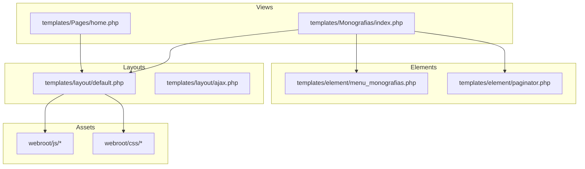
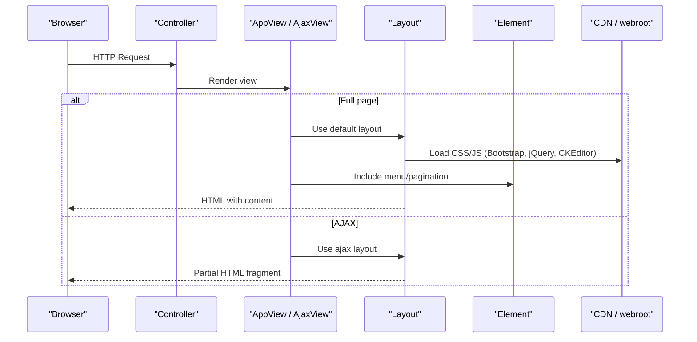
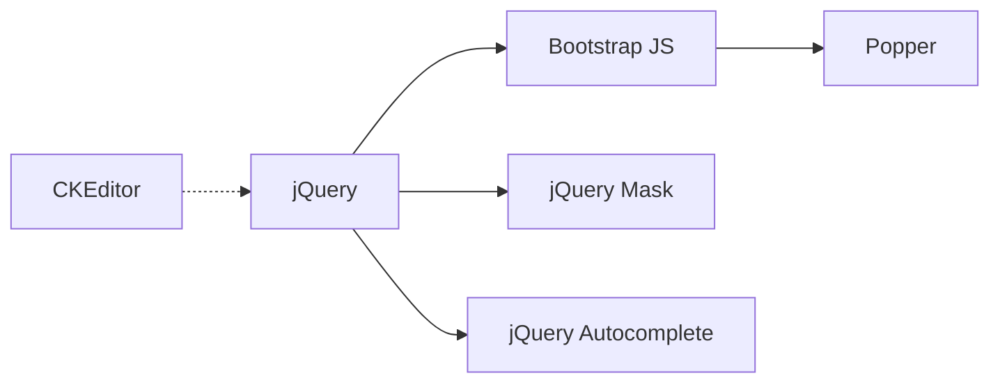

# Frontend Architecture

<cite>
**Referenced Files in This Document**
- [default.php](file://templates/layout/default.php)
- [ajax.php](file://templates/layout/ajax.php)
- [AppView.php](file://src/View/AppView.php)
- [AjaxView.php](file://src/View/AjaxView.php)
- [home.php](file://templates/Pages/home.php)
- [index.php](file://templates/Monografias/index.php)
- [menu_monografias.php](file://templates/element/menu_monografias.php)
- [paginator.php](file://templates/element/paginator.php)
- [jquery-3.6.0.js](file://webroot/js/jquery-3.6.0.js)
- [bootstrap.bundle.min.js](file://webroot/js/bootstrap.bundle.min.js)
- [popper.min.js](file://webroot/js/popper.min.js)
- [jquery.autocomplete.js](file://webroot/js/jquery.autocomplete.js)
- [jquery.mask.min.js](file://webroot/js/jquery.mask.min.js)
</cite>

## Table of Contents
1. [Introduction](#introduction)
2. [Project Structure](#project-structure)
3. [Core Components](#core-components)
4. [Architecture Overview](#architecture-overview)
5. [Detailed Component Analysis](#detailed-component-analysis)
6. [Dependency Analysis](#dependency-analysis)
7. [Performance Considerations](#performance-considerations)
8. [Troubleshooting Guide](#troubleshooting-guide)
9. [Conclusion](#conclusion)

## Introduction
This document explains the frontend architecture of the CakePHP application, focusing on template hierarchy, layout management, element composition, view classes, and JavaScript integration. It covers how Bootstrap CSS and jQuery-based plugins are used to deliver responsive UIs and dynamic interactions, including AJAX-driven content loading via a dedicated AjaxView and minimal layout. The guide also outlines best practices for performance optimization, asset caching, and cross-browser compatibility.

## Project Structure
The frontend is organized according to CakePHP conventions:
- Layouts define the outer HTML shell and global assets.
- Views render per-page content and compose reusable elements.
- Elements encapsulate small, reusable UI fragments (menus, pagination).
- Static assets (CSS/JS) reside under webroot.

**Diagram sources**
- [default.php:18-99](file://templates/layout/default.php#L18-L99)
- [ajax.php:16-18](file://templates/layout/ajax.php#L16-L18)
- [home.php:33-85](file://templates/Pages/home.php#L33-L85)
- [index.php:9-109](file://templates/Monografias/index.php#L9-L109)
- [menu_monografias.php:15-50](file://templates/element/menu_monografias.php#L15-L50)
- [paginator.php:21-60](file://templates/element/paginator.php#L21-L60)

**Section sources**
- [default.php:18-99](file://templates/layout/default.php#L18-L99)
- [ajax.php:16-18](file://templates/layout/ajax.php#L16-L18)
- [home.php:33-85](file://templates/Pages/home.php#L33-L85)
- [index.php:9-109](file://templates/Monografias/index.php#L9-L109)
- [menu_monografias.php:15-50](file://templates/element/menu_monografias.php#L15-L50)
- [paginator.php:21-60](file://templates/element/paginator.php#L21-L60)

## Core Components
- AppView: Base view class for the application; serves as the extension point for custom helpers or initialization logic.
- AjaxView: Specialized view that switches to an AJAX layout and sets response type for partial updates.
- Default layout: Centralizes global meta, stylesheets, scripts, flash messages, and page content injection points.
- AJAX layout: Minimal output for AJAX responses, rendering only the requested content block.
- Elements: Reusable UI fragments such as navigation menus and pagination controls.
- View templates: Feature-specific pages that compose elements and use Bootstrap components.

Key responsibilities:
- Asset orchestration in layouts (Bootstrap, jQuery, CKEditor, masks).
- Content composition via fetch blocks and element inclusion.
- Consistent structure across full-page and AJAX responses.

**Section sources**
- [AppView.php:27-41](file://src/View/AppView.php#L27-L41)
- [AjaxView.php:24-46](file://src/View/AjaxView.php#L24-L46)
- [default.php:21-99](file://templates/layout/default.php#L21-L99)
- [ajax.php:16-18](file://templates/layout/ajax.php#L16-L18)
- [menu_monografias.php:15-50](file://templates/element/menu_monografias.php#L15-L50)
- [paginator.php:21-60](file://templates/element/paginator.php#L21-L60)

## Architecture Overview
The frontend follows a layered approach:
- Controllers render views using AppView by default or AjaxView for AJAX endpoints.
- Views include elements and rely on layouts for chrome and assets.
- Assets are loaded from CDN and local webroot files.
- Interactive features use jQuery and Bootstrap components; CKEditor provides rich text editing.

**Diagram sources**
- [AppView.php:27-41](file://src/View/AppView.php#L27-L41)
- [AjaxView.php:24-46](file://src/View/AjaxView.php#L24-L46)
- [default.php:21-99](file://templates/layout/default.php#L21-L99)
- [ajax.php:16-18](file://templates/layout/ajax.php#L16-L18)
- [menu_monografias.php:15-50](file://templates/element/menu_monografias.php#L15-L50)
- [paginator.php:21-60](file://templates/element/paginator.php#L21-L60)

## Detailed Component Analysis

### Layout Management
- Default layout defines the HTML skeleton, injects meta, title, favicon, and uses fetch blocks for css, script, and content. It loads Bootstrap CSS/JS, Normalize.css, Google Fonts, CKEditor, jQuery, and jQuery Mask from CDN. Flash messages are rendered before content.
- AJAX layout outputs only the content block, suitable for partial updates.

Best practices observed:
- Centralized asset loading reduces duplication across templates.
- Fetch blocks allow child templates to extend head and body sections cleanly.
- Using CDN for major libraries improves cacheability and load times.

**Section sources**
- [default.php:21-99](file://templates/layout/default.php#L21-L99)
- [ajax.php:16-18](file://templates/layout/ajax.php#L16-L18)

### Template Hierarchy and Element Composition
- Pages and feature templates compose UI by including elements (e.g., menu, paginator).
- Pagination element centralizes Bootstrap-styled pagination markup and helper configuration.
- Menu element provides responsive navigation and role-based visibility.

Examples of composition:
- Monografias index includes the monografias menu and pagination element.
- Home page demonstrates a standalone layout with its own head/body when needed.

**Section sources**
- [index.php:9-109](file://templates/Monografias/index.php#L9-L109)
- [menu_monografias.php:15-50](file://templates/element/menu_monografias.php#L15-L50)
- [paginator.php:21-60](file://templates/element/paginator.php#L21-L60)
- [home.php:33-85](file://templates/Pages/home.php#L33-L85)

### View Classes and AJAX Integration
- AppView is the base view class where common initialization can be performed.
- AjaxView extends AppView to set a minimal layout and response type for AJAX requests, enabling efficient partial updates without full page chrome.

Typical usage pattern:
- Controllers return JSON or HTML fragments via AjaxView for dynamic content insertion.
- Client-side code triggers AJAX calls and replaces DOM nodes with returned content.

**Section sources**
- [AppView.php:27-41](file://src/View/AppView.php#L27-L41)
- [AjaxView.php:24-46](file://src/View/AjaxView.php#L24-L46)

### JavaScript Integration and Plugins
- jQuery is loaded via CDN and available globally for event handling and DOM manipulation.
- Bootstrap JS bundle provides interactive components (collapse, modals, tooltips).
- jQuery Mask plugin enables input formatting (e.g., phone numbers, dates).
- jQuery Autocomplete plugin supports search-as-you-type experiences.
- CKEditor is integrated via importmap and stylesheet for rich text editing.

Integration notes:
- Ensure scripts are loaded after jQuery to avoid dependency errors.
- Initialize plugins within document ready or module loaders as appropriate.
- For CKEditor, configure modules and instances in your view or JS file.

**Section sources**
- [default.php:60-85](file://templates/layout/default.php#L60-L85)
- [jquery-3.6.0.js](file://webroot/js/jquery-3.6.0.js)
- [bootstrap.bundle.min.js](file://webroot/js/bootstrap.bundle.min.js)
- [popper.min.js](file://webroot/js/popper.min.js)
- [jquery.autocomplete.js](file://webroot/js/jquery.autocomplete.js)
- [jquery.mask.min.js](file://webroot/js/jquery.mask.min.js)

### Styling Framework and Responsive Design
- Bootstrap 5 is used for grid, utilities, forms, tables, and components.
- Normalize.css ensures consistent baseline styling across browsers.
- Custom styles can be added via webroot CSS files and included through the layout’s fetch(css) mechanism.

Responsive patterns:
- Use Bootstrap’s responsive navbar and grid system for mobile-first layouts.
- Leverage utility classes for spacing, alignment, and color themes.

**Section sources**
- [default.php:32-42](file://templates/layout/default.php#L32-L42)
- [menu_monografias.php:15-50](file://templates/element/menu_monografias.php#L15-L50)
- [paginator.php:21-60](file://templates/element/paginator.php#L21-L60)

### Cross-Browser Compatibility
- Normalize.css mitigates browser inconsistencies.
- Using widely supported CDN versions of Bootstrap and jQuery helps ensure compatibility.
- Avoid experimental features; stick to stable APIs and polyfills if necessary.

**Section sources**
- [default.php:32-42](file://templates/layout/default.php#L32-L42)

## Dependency Analysis
Frontend dependencies are primarily external CDNs and local assets:
- CSS: Bootstrap, Normalize, optional custom styles.
- JS: jQuery, Bootstrap bundle (includes Popper), jQuery Mask, jQuery Autocomplete, CKEditor.

**Diagram sources**
- [default.php:60-85](file://templates/layout/default.php#L60-L85)
- [bootstrap.bundle.min.js](file://webroot/js/bootstrap.bundle.min.js)
- [popper.min.js](file://webroot/js/popper.min.js)
- [jquery.autocomplete.js](file://webroot/js/jquery.autocomplete.js)
- [jquery.mask.min.js](file://webroot/js/jquery.mask.min.js)

**Section sources**
- [default.php:60-85](file://templates/layout/default.php#L60-L85)

## Performance Considerations
- Prefer CDN-hosted libraries to leverage browser caching and reduce server load.
- Defer non-critical scripts (e.g., Bootstrap JS) to improve initial page render.
- Minimize duplicate asset loading; rely on layout to centralize includes.
- Use fetch blocks to conditionally load page-specific CSS/JS only when needed.
- Enable compression and caching headers at the server level for static assets.
- Consider bundling/minifying custom JS/CSS and leveraging versioned filenames for cache busting.

[No sources needed since this section provides general guidance]

## Troubleshooting Guide
Common issues and resolutions:
- Missing jQuery: Ensure jQuery is loaded before other plugins that depend on it.
- Bootstrap components not working: Verify Bootstrap JS bundle and Popper are loaded and initialized.
- Input masks not applied: Confirm jQuery Mask is loaded and initialize masks on relevant inputs.
- CKEditor not loading: Check importmap URLs and network requests; ensure required modules are imported.
- AJAX returning full page instead of fragment: Confirm controller uses AjaxView and the ajax layout renders only content.

Verification steps:
- Inspect network tab to confirm asset loading order and status codes.
- Validate HTML structure around injected content for AJAX responses.
- Test on multiple browsers to identify compatibility gaps.

**Section sources**
- [default.php:60-85](file://templates/layout/default.php#L60-L85)
- [ajax.php:16-18](file://templates/layout/ajax.php#L16-L18)

## Conclusion
The frontend architecture leverages CakePHP’s layout and element system to maintain consistency and reusability. Bootstrap and jQuery form the foundation for responsive design and interactivity, while CKEditor enhances content creation. The separation between full-page and AJAX layouts enables efficient partial updates. Following the recommended practices for asset loading, caching, and compatibility will further improve performance and user experience.