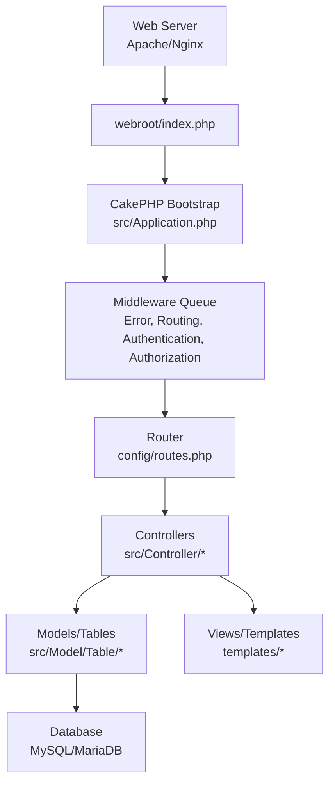
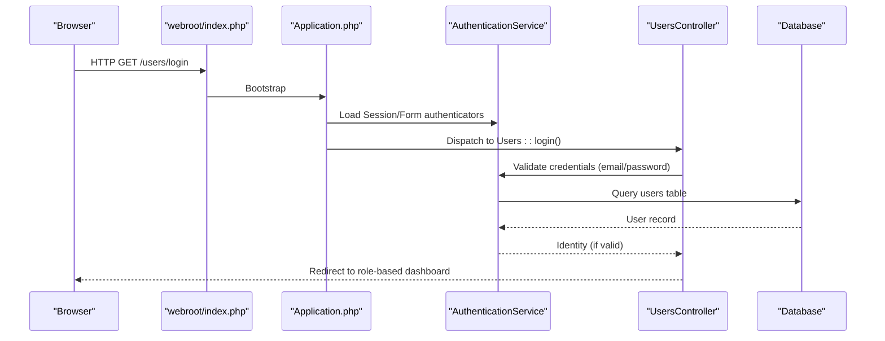
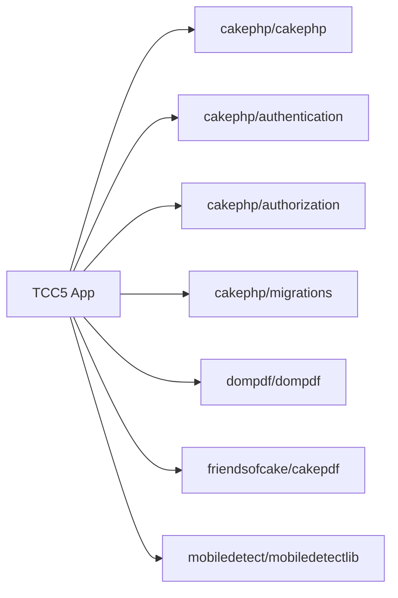

# Getting Started

<cite>
**Referenced Files in This Document**
- [README.md](file://README.md)
- [composer.json](file://composer.json)
- [config/app.php](file://config/app.php)
- [config/app_local.example.php](file://config/app_local.example.php)
- [config/requirements.php](file://config/requirements.php)
- [src/Application.php](file://src/Application.php)
- [src/Console/Installer.php](file://src/Console/Installer.php)
- [src/Controller/UsersController.php](file://src/Controller/UsersController.php)
- [templates/Users/login.php](file://templates/Users/login.php)
- [config/Migrations/schema.sql](file://config/Migrations/schema.sql)
- [tccess.sql](file://tccess.sql)
</cite>

## Table of Contents
1. Introduction
2. Project Structure
3. Core Components
4. Architecture Overview
5. Detailed Component Analysis
6. Dependency Analysis
7. Performance Considerations
8. Troubleshooting Guide
9. Conclusion

## Introduction
This guide helps you set up the TCC5 Academic Management System from scratch, covering prerequisites, Composer-based installation, environment configuration (including app_local.php), database setup and migration execution, starting the server for development or production, first login procedures, and basic navigation. It also includes verification steps and troubleshooting tips to ensure a smooth installation.

## Project Structure
TCC5 is a CakePHP 5 application with:
- Configuration files under config/ (app.php, app_local.example.php, requirements.php, routes.php)
- Application bootstrap and middleware in src/Application.php
- Console installer that creates local configuration and sets permissions in src/Console/Installer.php
- Controllers and templates for user authentication in src/Controller/UsersController.php and templates/Users/login.php
- Database schema available as SQL dumps in config/Migrations/schema.sql and tccess.sql

**Diagram sources**
- [src/Application.php:91-114](file://src/Application.php#L91-L114)
- [config/routes.php:48-65](file://config/routes.php#L48-L65)

**Section sources**
- [README.md:11-35](file://README.md#L11-L35)
- [composer.json:7-16](file://composer.json#L7-L16)
- [config/app.php:261-327](file://config/app.php#L261-L327)

## Core Components
- PHP runtime and extensions required by CakePHP
- MySQL/MariaDB database
- Composer for dependency management
- Web server (development built-in server or production Apache/Nginx)
- Environment-specific configuration via app_local.php
- Authentication and authorization via CakePHP plugins

Key responsibilities:
- Installation and post-install tasks handled by Composer scripts and Installer class
- Database connection configured in app.php and overridden in app_local.php
- Authentication flow configured in Application.php and used by UsersController

**Section sources**
- [config/requirements.php:20-46](file://config/requirements.php#L20-L46)
- [composer.json:7-16](file://composer.json#L7-L16)
- [src/Console/Installer.php:54-87](file://src/Console/Installer.php#L54-L87)
- [config/app.php:261-327](file://config/app.php#L261-L327)
- [src/Application.php:135-165](file://src/Application.php#L135-L165)

## Architecture Overview
The request lifecycle:
1. Request enters webroot/index.php
2. CakePHP boots and loads middleware (error handling, routing, authentication, authorization)
3. Router resolves controller/action
4. Controller processes request using models/tables
5. Views render responses
6. Database interactions use configured Datasources

**Diagram sources**
- [src/Application.php:135-165](file://src/Application.php#L135-L165)
- [src/Controller/UsersController.php:34-156](file://src/Controller/UsersController.php#L34-L156)

## Detailed Component Analysis

### Prerequisites and Environment Setup
- PHP version must be equal or higher than 8.1.0; intl and mbstring extensions are required.
- MySQL or MariaDB server must be installed and accessible.
- Composer must be installed globally or locally to manage dependencies.

Steps:
1. Verify PHP version and required extensions.
2. Ensure MySQL/MariaDB service is running and create a database user with privileges.
3. Install Composer if not present.

Verification:
- Run php -v to confirm version >= 8.1.0.
- Check extension_loaded('intl') and extension_loaded('mbstring').

**Section sources**
- [config/requirements.php:20-46](file://config/requirements.php#L20-L46)

### Installation via Composer
Install the project dependencies and perform post-install tasks:
- Use Composer to install dependencies.
- The post-install script will create config/app_local.php from the example template and prepare writable directories and security salt.

Commands:
- composer install
- If needed, run composer post-install-cmd manually to ensure installer runs.

Notes:
- The installer copies app_local.example.php to app_local.php if it does not exist.
- Writable directories and permissions are set automatically.

**Section sources**
- [composer.json:43-54](file://composer.json#L43-L54)
- [src/Console/Installer.php:54-87](file://src/Console/Installer.php#L54-L87)

### Environment Configuration (app_local.php)
Configure your local environment:
- Copy app_local.example.php to app_local.php if not created by installer.
- Set database connection details (host, username, password, database).
- Optionally configure email transport settings.
- Ensure SECURITY_SALT is set securely.

Example fields to configure:
- Datasources.default.host, username, password, database
- EmailTransport.default host/port/credentials (if using SMTP)

Security note:
- Do not commit app_local.php to version control.

**Section sources**
- [config/app_local.example.php:8-94](file://config/app_local.example.php#L8-L94)
- [config/app.php:78-80](file://config/app.php#L78-L80)

### Database Schema Creation and Migration Execution
You can initialize the database using the provided SQL dump or migrations:
- Option A: Import the SQL dump into MySQL/MariaDB.
- Option B: Use CakePHP migrations plugin commands if applicable.

Recommended approach:
- Create a database named tccess (or your chosen name) and import config/Migrations/schema.sql or tccess.sql.
- Ensure character set utf8mb4 and collation are applied.

Verification:
- Connect to the database and verify tables exist (e.g., users, estudantes, professores, supervisores).
- Confirm the default connection in app_local.php matches the imported database.

**Section sources**
- [config/Migrations/schema.sql:20-25](file://config/Migrations/schema.sql#L20-L25)
- [tccess.sql:20-25](file://tccess.sql#L20-L25)

### Starting the Development Server
Start the built-in PHP server for local development:
- Use bin/cake server to launch the server on a specified port.
- Access the application via http://localhost:<port>.

Default behavior:
- Root route connects to Pages controller displaying home page.

**Section sources**
- [README.md:28-35](file://README.md#L28-L35)
- [config/routes.php:60-65](file://config/routes.php#L60-L65)

### Production Deployment
For production:
- Configure your web server (Apache/Nginx) to point to the webroot directory.
- Ensure proper file permissions for cache, logs, and tmp directories.
- Set debug to false in app_local.php for production.
- Configure secure session storage and email transport as needed.

**Section sources**
- [config/app.php:12-20](file://config/app.php#L12-L20)
- [config/app_local.example.php:8-18](file://config/app_local.example.php#L8-L18)

### First Login Procedures
After setup:
- Navigate to /users/login.
- Enter your email and password.
- Upon successful authentication, you will be redirected based on your user category:
  - Administrator: redirected to mural_estagios index
  - Student: redirected to student view after ensuring association
  - Professor: redirected to professor view after ensuring association
  - Supervisor: redirected to supervisor view after ensuring association

If credentials are invalid:
- An error message will be shown and you will be redirected back to the login page.

**Section sources**
- [templates/Users/login.php:13-36](file://templates/Users/login.php#L13-L36)
- [src/Controller/UsersController.php:34-156](file://src/Controller/UsersController.php#L34-L156)

### Basic Navigation Through the Interface
- Home page: / (Pages controller display action)
- Login: /users/login
- Logout: /users/logout
- Role-based dashboards:
  - Administrators: /muralestagios/index
  - Students: /estudantes/view/<id>
  - Professors: /professores/view/<id>
  - Supervisors: /supervisores/view/<id>

Note:
- Routes may vary depending on customizations; consult controllers for exact endpoints.

**Section sources**
- [config/routes.php:60-65](file://config/routes.php#L60-L65)
- [src/Controller/UsersController.php:140-149](file://src/Controller/UsersController.php#L140-L149)

## Dependency Analysis
Core dependencies include:
- cakephp/cakephp framework
- cakephp/authentication and cakephp/authorization plugins
- cakephp/migrations for database migrations
- dompdf/dompdf and friendsofcake/cakepdf for PDF generation
- mobiledetect/mobiledetectlib for device detection

Development dependencies include testing and code quality tools.

**Diagram sources**
- [composer.json:7-16](file://composer.json#L7-L16)

**Section sources**
- [composer.json:7-26](file://composer.json#L7-L26)

## Performance Considerations
- Enable route caching in production for large numbers of routes.
- Use appropriate cache engines for translations, model metadata, and routes.
- Disable query logging in production unless necessary.
- Optimize database connections and consider persistent connections if beneficial.
- Ensure static assets are served efficiently by your web server.

[No sources needed since this section provides general guidance]

## Troubleshooting Guide
Common issues and resolutions:
- PHP version too low: Upgrade to PHP >= 8.1.0.
- Missing intl or mbstring extensions: Install and enable them.
- Database connection errors: Verify host, username, password, and database name in app_local.php.
- Permission errors: Ensure writable permissions for cache, logs, and tmp directories.
- Authentication failures: Confirm users table exists and credentials are correct.
- Route not found: Check routes configuration and controller/action names.

Verification steps:
- Run php -v and check extensions.
- Test database connectivity using a client tool.
- Access /users/login and attempt login with known credentials.
- Review logs in logs/ directory for detailed error messages.

**Section sources**
- [config/requirements.php:20-46](file://config/requirements.php#L20-L46)
- [config/app.php:261-327](file://config/app.php#L261-L327)
- [src/Controller/UsersController.php:151-156](file://src/Controller/UsersController.php#L151-L156)

## Conclusion
You now have the essential knowledge to install, configure, and operate the TCC5 Academic Management System. Follow the steps for prerequisites, Composer installation, environment configuration, database setup, and server startup. Use the authentication flow to log in and navigate to role-based dashboards. Refer to the troubleshooting guide for common issues and verification steps to ensure a stable setup.