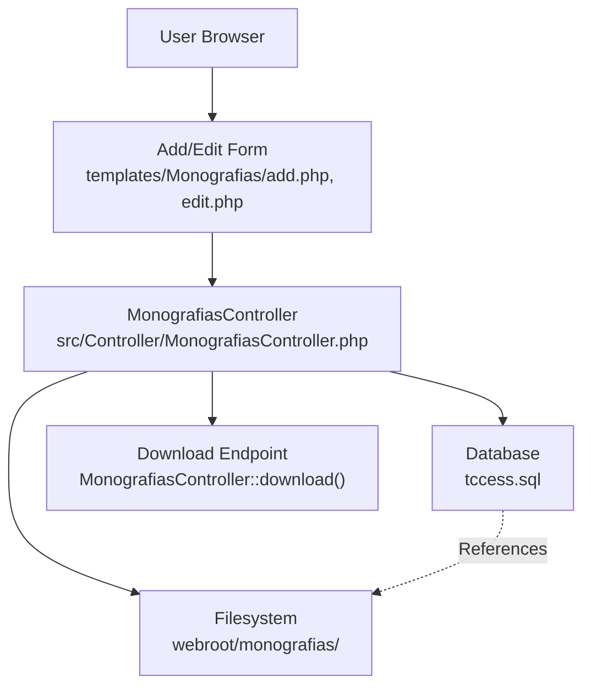
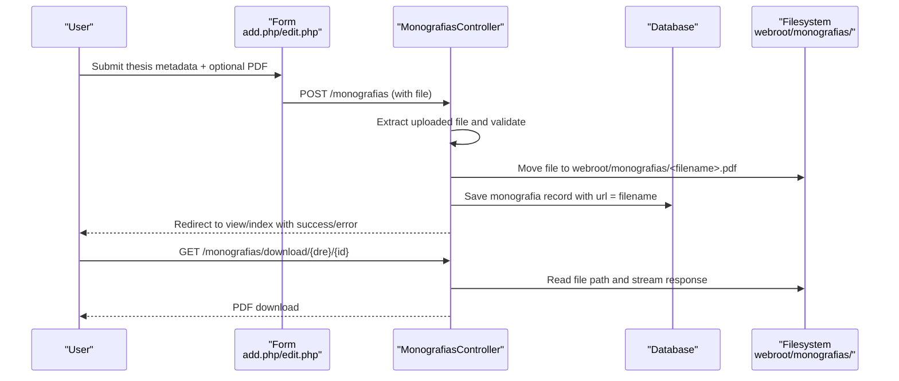
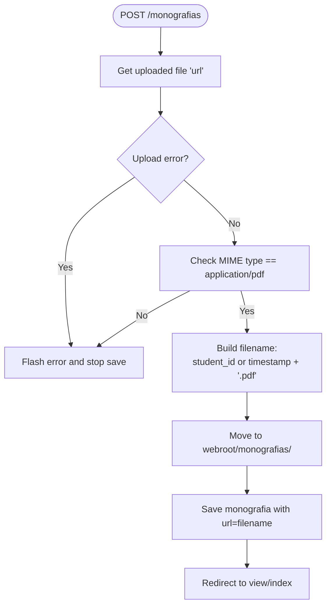
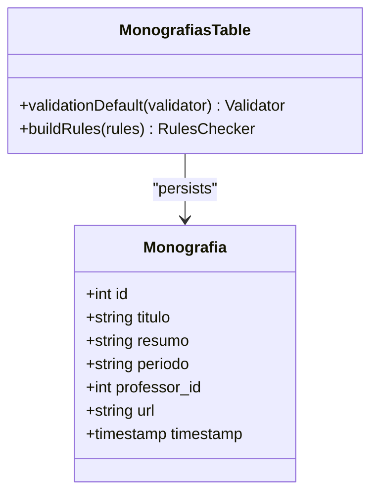
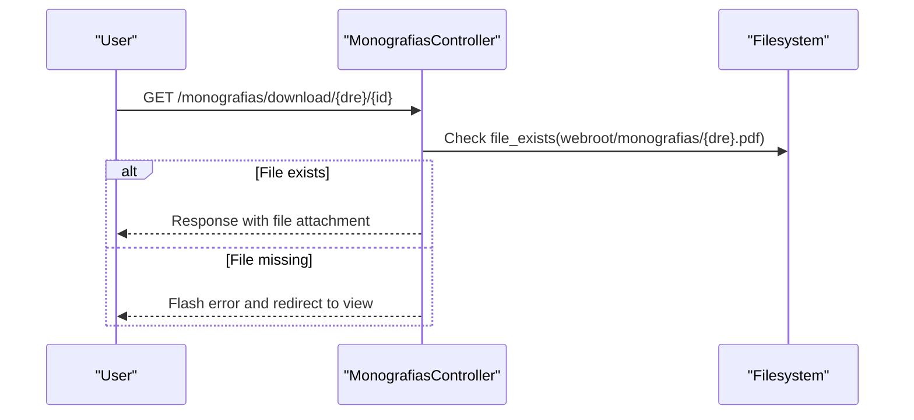
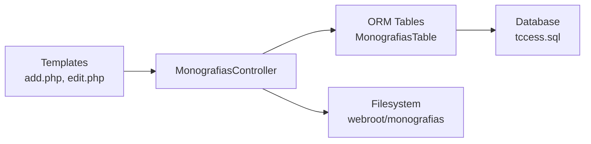

# File Upload and Storage

<cite>
**Referenced Files in This Document**
- [MonografiasController.php](file://src/Controller/MonografiasController.php)
- [MonografiasTable.php](file://src/Model/Table/MonografiasTable.php)
- [Monografia.php](file://src/Model/Entity/Monografia.php)
- [add.php](file://templates/Monografias/add.php)
- [edit.php](file://templates/Monografias/edit.php)
- [app.php](file://config/app.php)
- [tccess.sql](file://tccess.sql)
</cite>

## Table of Contents
1. Introduction
2. Project Structure
3. Core Components
4. Architecture Overview
5. Detailed Component Analysis
6. Dependency Analysis
7. Performance Considerations
8. Troubleshooting Guide
9. Conclusion

## Introduction
This document explains the file upload and storage system for PDF documents and other thesis materials. It covers the end-to-end flow from user submission to persistent storage, validation and security measures, storage location management, file naming conventions, integration with the webroot/monografias directory, access control, and operational considerations such as size limits, MIME type validation, virus scanning, backup strategies, performance, concurrency, and optimization techniques.

## Project Structure
The upload feature is centered around the Monografias (thesis) module:
- Controller handles form processing, file extraction, validation, persistence, and download.
- Model defines database schema relationships and validation rules.
- Templates provide the user interface for uploading and editing thesis metadata and files.
- Configuration sets application paths and runtime behavior.
- Database schema stores thesis metadata and references to stored files.

**Diagram sources**
- [MonografiasController.php:102-170](file://src/Controller/MonografiasController.php#L102-L170)
- [MonografiasController.php:319-331](file://src/Controller/MonografiasController.php#L319-L331)
- [MonografiasController.php:499-511](file://src/Controller/MonografiasController.php#L499-L511)
- [add.php:296-306](file://templates/Monografias/add.php#L296-L306)
- [edit.php:290-324](file://templates/Monografias/edit.php#L290-L324)
- [tccess.sql:438-457](file://tccess.sql#L438-L457)

**Section sources**
- [MonografiasController.php:102-170](file://src/Controller/MonografiasController.php#L102-L170)
- [MonografiasController.php:319-331](file://src/Controller/MonografiasController.php#L319-L331)
- [MonografiasController.php:499-511](file://src/Controller/MonografiasController.php#L499-L511)
- [add.php:296-306](file://templates/Monografias/add.php#L296-L306)
- [edit.php:290-324](file://templates/Monografias/edit.php#L290-L324)
- [tccess.sql:438-457](file://tccess.sql#L438-L457)

## Core Components
- MonografiasController: Orchestrates upload, validation, storage, and download; manages student associations and utility endpoints for synchronization.
- MonografiasTable: Defines ORM relationships and validation constraints for the monografia entity.
- Monografia Entity: Declares accessible fields and relations for mass assignment.
- Templates (add.php, edit.php): Provide forms for metadata entry and file selection; handle client-side character counters and CKEditor integration.
- Configuration (app.php): Sets application paths including webroot and wwwRoot used by the controller to resolve storage locations.
- Database Schema (tccess.sql): Defines the monografias table where the filename reference is stored.

Key responsibilities:
- Validate uploaded file type and error state.
- Generate deterministic filenames based on student registration or timestamp.
- Persist the filename reference in the database.
- Serve downloads securely via a controlled endpoint.

**Section sources**
- [MonografiasController.php:102-170](file://src/Controller/MonografiasController.php#L102-L170)
- [MonografiasController.php:319-331](file://src/Controller/MonografiasController.php#L319-L331)
- [MonografiasController.php:499-511](file://src/Controller/MonografiasController.php#L499-L511)
- [MonografiasTable.php:108-172](file://src/Model/Table/MonografiasTable.php#L108-L172)
- [Monografia.php:46-70](file://src/Model/Entity/Monografia.php#L46-L70)
- [add.php:296-306](file://templates/Monografias/add.php#L296-L306)
- [edit.php:290-324](file://templates/Monografias/edit.php#L290-L324)
- [app.php:50-69](file://config/app.php#L50-L69)
- [tccess.sql:438-457](file://tccess.sql#L438-L457)

## Architecture Overview
The upload workflow integrates UI, controller logic, filesystem, and database:

**Diagram sources**
- [MonografiasController.php:102-170](file://src/Controller/MonografiasController.php#L102-L170)
- [MonografiasController.php:319-331](file://src/Controller/MonografiasController.php#L319-L331)
- [MonografiasController.php:499-511](file://src/Controller/MonografiasController.php#L499-L511)
- [add.php:296-306](file://templates/Monografias/add.php#L296-L306)
- [edit.php:290-324](file://templates/Monografias/edit.php#L290-L324)
- [tccess.sql:438-457](file://tccess.sql#L438-L457)

## Detailed Component Analysis

### Upload Flow and Validation
- The add/edit templates expose a file input named url for selecting a PDF.
- On POST, the controller retrieves the uploaded file and checks for errors.
- If valid, it calls a helper method that validates MIME type and moves the file to the public storage directory.
- The resulting filename is saved into the monografia.url field.

**Diagram sources**
- [MonografiasController.php:107-121](file://src/Controller/MonografiasController.php#L107-L121)
- [MonografiasController.php:319-331](file://src/Controller/MonografiasController.php#L319-L331)

**Section sources**
- [MonografiasController.php:107-121](file://src/Controller/MonografiasController.php#L107-L121)
- [MonografiasController.php:319-331](file://src/Controller/MonografiasController.php#L319-L331)
- [add.php:296-306](file://templates/Monografias/add.php#L296-L306)
- [edit.php:290-324](file://templates/Monografias/edit.php#L290-L324)

### Storage Location Management and File Naming
- Storage location: webroot/monografias/, resolved via WWW_ROOT constant configured in app configuration.
- Filename convention:
  - Primary prefix: student registration number if available; otherwise current timestamp.
  - Extension enforced to .pdf after MIME validation.
- The stored filename is persisted in the monografias.url column.

Operational notes:
- Ensure the webserver process has write permissions to webroot/monografias/.
- Avoid overwriting existing files; consider adding collision handling if needed.

**Section sources**
- [app.php:50-69](file://config/app.php#L50-L69)
- [MonografiasController.php:112-116](file://src/Controller/MonografiasController.php#L112-L116)
- [MonografiasController.php:319-331](file://src/Controller/MonografiasController.php#L319-L331)
- [tccess.sql:438-457](file://tccess.sql#L438-L457)

### Access Control and Security Measures
- Unauthenticated actions: index, view, busca, download are allowed without authentication to support public browsing and downloading of thesis PDFs.
- Authorization is skipped for specific internal helpers during file operations to avoid blocking necessary flows.
- MIME type validation ensures only PDFs are accepted at the server side.
- No explicit virus scanning is implemented in the codebase; consider integrating an external scanner before moving files.

Recommendations:
- Restrict direct execution of scripts in webroot/monografias via webserver configuration.
- Implement server-level protections (e.g., deny PHP execution in upload directories).
- Add CSRF protection on forms if not already handled by the framework defaults.

**Section sources**
- [MonografiasController.php:33-39](file://src/Controller/MonografiasController.php#L33-L39)
- [MonografiasController.php:319-331](file://src/Controller/MonografiasController.php#L319-L331)

### Data Model and Persistence
- The monografias table stores metadata and the filename reference in url.
- Relationships include advisors, co-advisors, committee members, and area classification.
- Validation rules enforce field types and lengths, including url length constraints.

**Diagram sources**
- [MonografiasTable.php:108-172](file://src/Model/Table/MonografiasTable.php#L108-L172)
- [Monografia.php:11-27](file://src/Model/Entity/Monografia.php#L11-L27)

**Section sources**
- [MonografiasTable.php:108-172](file://src/Model/Table/MonografiasTable.php#L108-L172)
- [Monografia.php:11-27](file://src/Model/Entity/Monografia.php#L11-L27)
- [tccess.sql:438-457](file://tccess.sql#L438-L457)

### Download Endpoint
- A dedicated download action serves files from webroot/monografias using a secure response builder.
- It constructs the file path using the stored filename and returns a downloadable response.
- If the file does not exist, it shows an error and redirects back to the view.

**Diagram sources**
- [MonografiasController.php:499-511](file://src/Controller/MonografiasController.php#L499-L511)

**Section sources**
- [MonografiasController.php:499-511](file://src/Controller/MonografiasController.php#L499-L511)

### Utility Endpoints for Synchronization
- verificapdf(): Scans webroot/monografias for PDFs and updates monografias.url to match existing files or clears references when files are missing.
- verificafilespdf(): Iterates through PDFs and attempts to associate them with Tccestudantes records, updating monografias.url where appropriate.

These utilities help maintain consistency between filesystem and database but should be used cautiously in production due to side effects.

**Section sources**
- [MonografiasController.php:406-448](file://src/Controller/MonografiasController.php#L406-L448)
- [MonografiasController.php:454-497](file://src/Controller/MonografiasController.php#L454-L497)

## Dependency Analysis
- Controller depends on:
  - Request/UploadedFileInterface for file handling.
  - FileSystem constants (WWW_ROOT) for path resolution.
  - ORM tables for saving entities and related associations.
- Templates depend on:
  - CakePHP Form helpers to render file inputs.
  - Client-side scripts for character counting and editor initialization.
- Database schema provides structure for storing metadata and filename references.

**Diagram sources**
- [MonografiasController.php:102-170](file://src/Controller/MonografiasController.php#L102-L170)
- [MonografiasTable.php:108-172](file://src/Model/Table/MonografiasTable.php#L108-L172)
- [tccess.sql:438-457](file://tccess.sql#L438-L457)

**Section sources**
- [MonografiasController.php:102-170](file://src/Controller/MonografiasController.php#L102-L170)
- [MonografiasTable.php:108-172](file://src/Model/Table/MonografiasTable.php#L108-L172)
- [tccess.sql:438-457](file://tccess.sql#L438-L457)

## Performance Considerations
- Large file uploads:
  - Ensure PHP settings allow sufficient upload sizes (upload_max_filesize, post_max_size) and memory limits for processing.
  - Consider chunked uploads or streaming to reduce memory pressure for large PDFs.
- Concurrent uploads:
  - Use a robust filesystem with adequate inode space and concurrent write support.
  - Avoid race conditions by ensuring unique filenames; consider atomic move operations and collision checks.
- Storage optimization:
  - Compress PDFs before storage if acceptable to reduce disk usage.
  - Implement periodic cleanup of orphaned files not referenced by any monografia record.
- Caching and CDN:
  - For high traffic, serve static PDFs via a CDN or reverse proxy cache to offload the application server.

[No sources needed since this section provides general guidance]

## Troubleshooting Guide
Common issues and resolutions:
- Upload fails with MIME type error:
  - Verify the file is actually a PDF; client-side hints can be spoofed. Server-side MIME check rejects non-PDFs.
- Permission denied when saving:
  - Ensure the webserver user has write permissions to webroot/monografias/.
- File not found on download:
  - Confirm the filename in monografias.url matches an actual file in webroot/monografias/. Use synchronization utilities to reconcile discrepancies.
- Overwrite risk:
  - If multiple submissions use the same student ID, later uploads may overwrite earlier files. Add versioning or uniqueness checks if needed.

**Section sources**
- [MonografiasController.php:319-331](file://src/Controller/MonografiasController.php#L319-L331)
- [MonografiasController.php:499-511](file://src/Controller/MonografiasController.php#L499-L511)
- [MonografiasController.php:406-448](file://src/Controller/MonografiasController.php#L406-L448)

## Conclusion
The system provides a straightforward PDF upload and storage mechanism integrated with the thesis metadata model. It enforces MIME type validation and stores files under webroot/monografias with deterministic naming. While basic security controls are present, enhancements such as virus scanning, stricter access controls, and robust concurrency handling are recommended for production environments. Operational utilities assist in maintaining filesystem-database consistency, and performance best practices should be applied to handle large files and high concurrency effectively.

[No sources needed since this section summarizes without analyzing specific files]