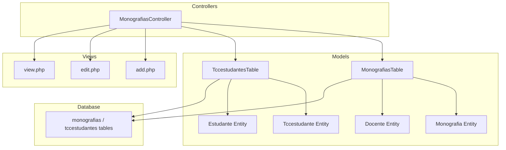
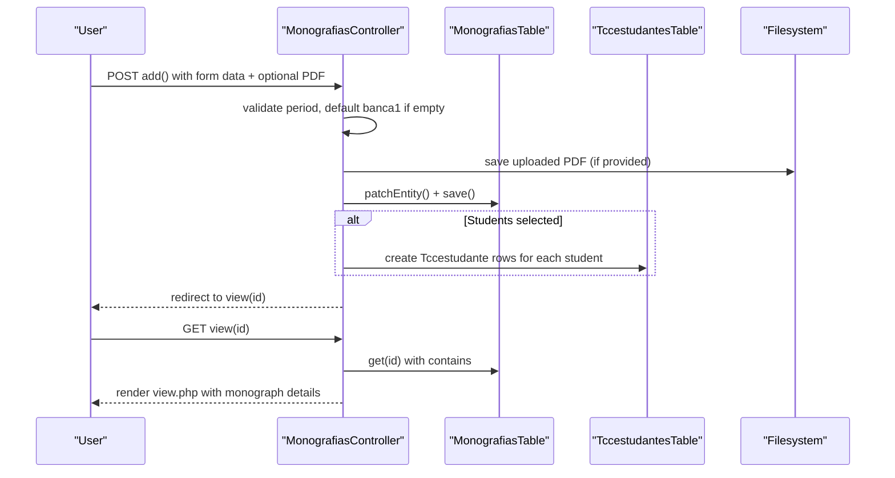
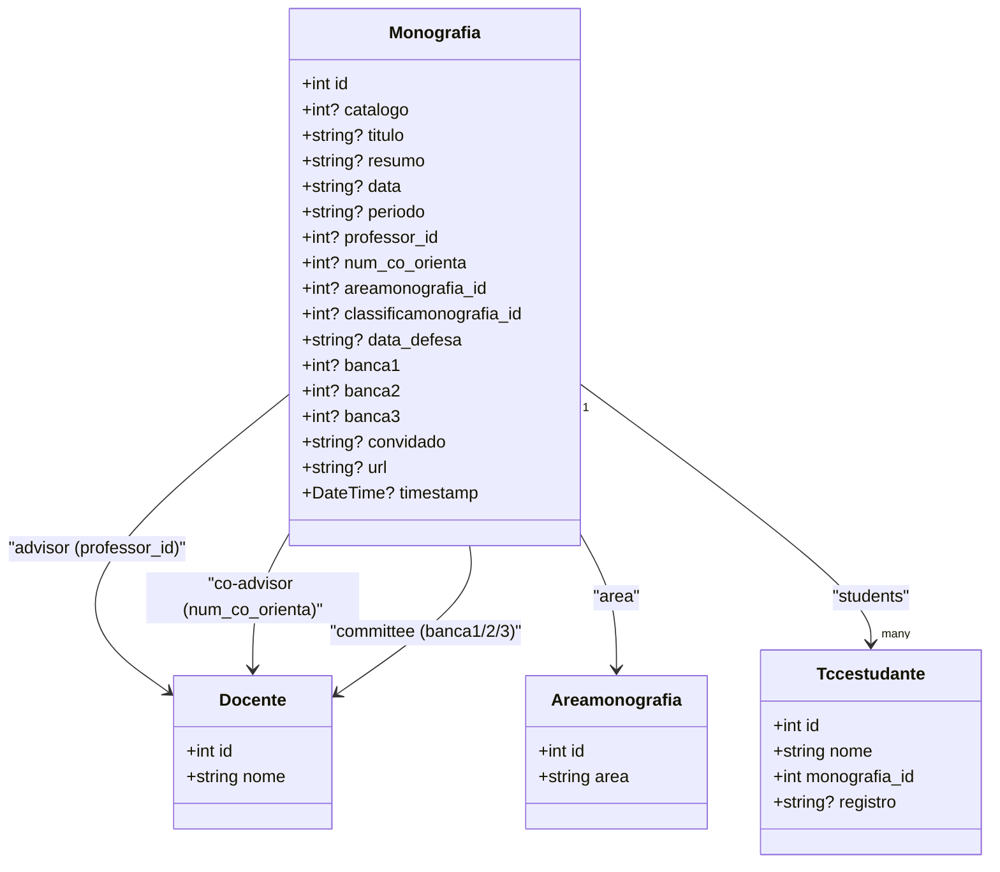
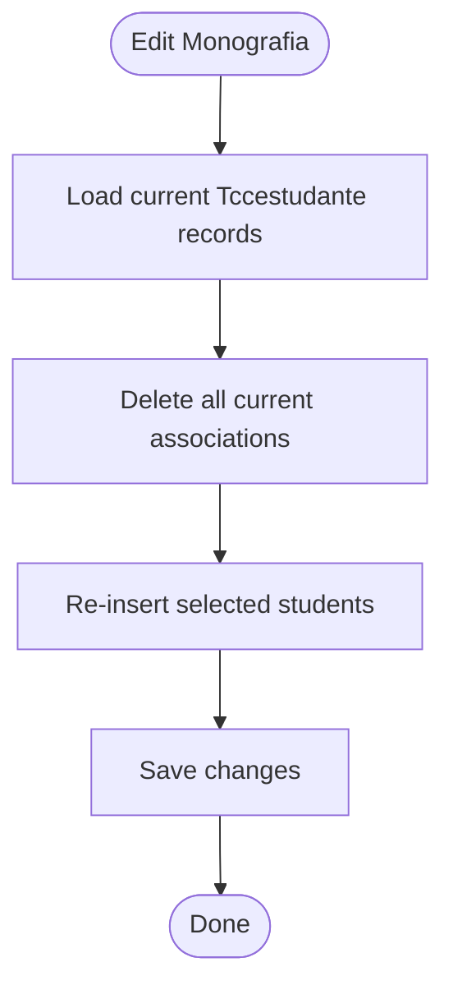
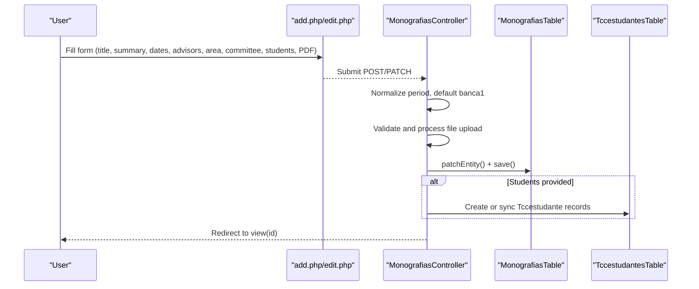
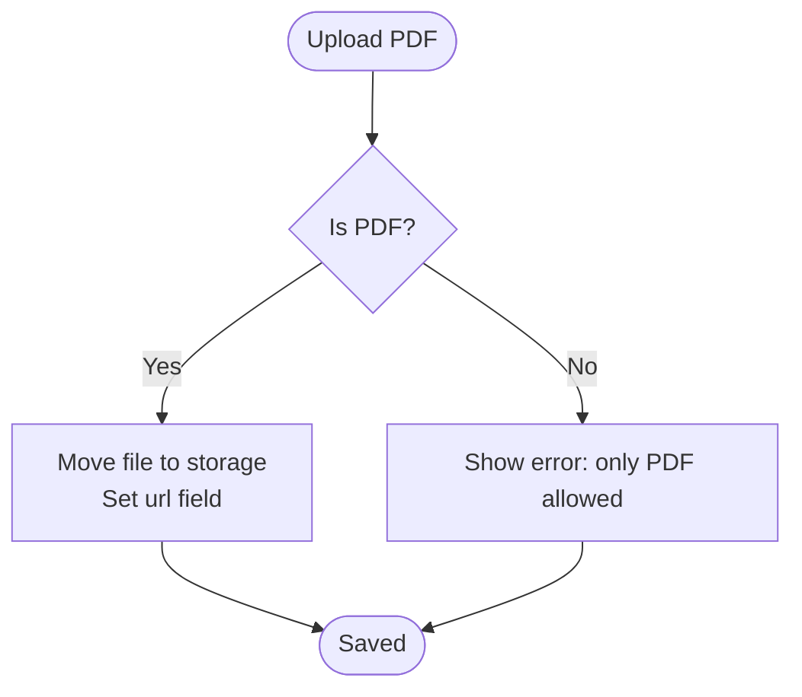
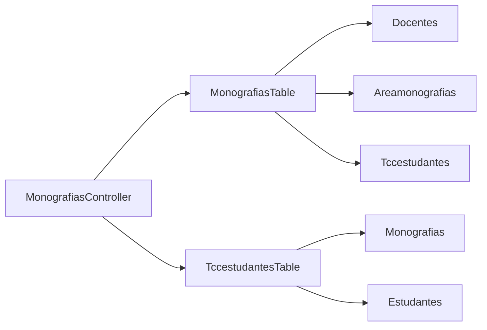

# Monograph Lifecycle Management

<cite>
**Referenced Files in This Document**
- [Monografia.php](file://src/Model/Entity/Monografia.php)
- [MonografiasTable.php](file://src/Model/Table/MonografiasTable.php)
- [MonografiasController.php](file://src/Controller/MonografiasController.php)
- [add.php](file://templates/Monografias/add.php)
- [edit.php](file://templates/Monografias/edit.php)
- [view.php](file://templates/Monografias/view.php)
- [Tccestudante.php](file://src/Model/Entity/Tccestudante.php)
- [TccestudantesTable.php](file://src/Model/Table/TccestudantesTable.php)
- [Estudante.php](file://src/Model/Entity/Estudante.php)
- [Docente.php](file://src/Model/Entity/Docente.php)
- [schema.sql](file://config/Migrations/schema.sql)
</cite>

## Table of Contents
1. Introduction
2. Project Structure
3. Core Components
4. Architecture Overview
5. Detailed Component Analysis
6. Dependency Analysis
7. Performance Considerations
8. Troubleshooting Guide
9. Conclusion

## Introduction
This document explains the monograph lifecycle management system implemented in the application. It covers how a monograph is created, associated with students and academic staff, validated, edited, viewed, and managed through file uploads. It also clarifies the data model, relationships, validation rules, and user interface flows for common scenarios such as thesis submission, revision updates, and final approval preparation.

## Project Structure
The monograph feature follows a standard MVC pattern:
- Entities define domain models (e.g., Monografia, Tccestudante, Estudante, Docente).
- Tables configure associations, behaviors, and validation rules.
- Controllers handle HTTP requests, orchestrate business logic, and manage file uploads.
- Templates render forms and views for users to create, edit, and inspect monographs.



**Diagram sources**
- [MonografiasController.php:28-513](file://src/Controller/MonografiasController.php#L28-L513)
- [MonografiasTable.php:41-100](file://src/Model/Table/MonografiasTable.php#L41-L100)
- [TccestudantesTable.php:34-57](file://src/Model/Table/TccestudantesTable.php#L34-L57)
- [Monografia.php:11-33](file://src/Model/Entity/Monografia.php#L11-L33)
- [Tccestudante.php:9-15](file://src/Model/Entity/Tccestudante.php#L9-L15)
- [Estudante.php:9-31](file://src/Model/Entity/Estudante.php#L9-L31)
- [Docente.php:9-49](file://src/Model/Entity/Docente.php#L9-L49)
- [schema.sql:434-456](file://config/Migrations/schema.sql#L434-L456)
- [schema.sql:617-626](file://config/Migrations/schema.sql#L617-L626)

**Section sources**
- [MonografiasController.php:28-513](file://src/Controller/MonografiasController.php#L28-L513)
- [MonografiasTable.php:41-100](file://src/Model/Table/MonografiasTable.php#L41-L100)
- [TccestudantesTable.php:34-57](file://src/Model/Table/TccestudantesTable.php#L34-L57)
- [schema.sql:434-456](file://config/Migrations/schema.sql#L434-L456)
- [schema.sql:617-626](file://config/Migrations/schema.sql#L617-L626)

## Core Components
- Monografia entity and table define the core record for a monograph, including title, summary, dates, period, advisor, co-advisor, area, defense date, committee members, guest, PDF URL, and timestamp.
- Tccestudante links one or more students to a monograph via a join table, storing student name and registration number.
- Relationships connect monographs to docentes (advisor and committee), areamonografias (area), and tccestudantes (students).
- Controller methods implement CRUD operations, file upload handling, student association synchronization, and list/download utilities.
- Templates provide forms for creating/editing monographs and display details in the view.

Key responsibilities:
- Data validation and integrity checks at the table layer.
- Association management between monographs, students, and academic staff.
- File upload validation and storage for PDFs.
- User-facing workflows for adding, editing, viewing, and listing monographs.

**Section sources**
- [Monografia.php:11-70](file://src/Model/Entity/Monografia.php#L11-L70)
- [MonografiasTable.php:41-188](file://src/Model/Table/MonografiasTable.php#L41-L188)
- [Tccestudante.php:9-35](file://src/Model/Entity/Tccestudante.php#L9-L35)
- [TccestudantesTable.php:34-97](file://src/Model/Table/TccestudantesTable.php#L34-L97)
- [MonografiasController.php:102-202](file://src/Controller/MonografiasController.php#L102-L202)
- [MonografiasController.php:211-283](file://src/Controller/MonografiasController.php#L211-L283)
- [MonografiasController.php:319-332](file://src/Controller/MonografiasController.php#L319-L332)
- [add.php:42-309](file://templates/Monografias/add.php#L42-L309)
- [edit.php:58-334](file://templates/Monografias/edit.php#L58-L334)
- [view.php:32-121](file://templates/Monografias/view.php#L32-L121)

## Architecture Overview
The system uses CakePHP’s ORM to manage entities and associations. The controller orchestrates request handling, while the table layer enforces validation and referential integrity. Views render forms and detail pages.



**Diagram sources**
- [MonografiasController.php:102-170](file://src/Controller/MonografiasController.php#L102-L170)
- [MonografiasController.php:175-202](file://src/Controller/MonografiasController.php#L175-L202)
- [MonografiasController.php:319-332](file://src/Controller/MonografiasController.php#L319-L332)
- [MonografiasController.php:84-95](file://src/Controller/MonografiasController.php#L84-L95)

## Detailed Component Analysis

### Monografia Entity and Table
- Fields include catalog number, title, summary, delivery date, period, advisor ID, co-advisor ID, area ID, classification ID, defense date, committee member IDs (banca1/2/3), guest name, PDF URL, and timestamp.
- Associations:
  - BelongsTo Docente (advisor) via professor_id.
  - BelongsTo Docente (co-advisor) via num_co_orienta.
  - BelongsTo Areamonografias via areamonografia_id.
  - HasMany Tccestudantes via monografia_id.
  - Additional BelongsTo Docente relations for banca1/2/3.
- Validation:
  - Type and length constraints on text fields.
  - Referential integrity enforced for professor_id and areamonografia_id.
- Behavior:
  - CounterCache on Areamonografias to maintain monograph counts per area.



**Diagram sources**
- [Monografia.php:11-33](file://src/Model/Entity/Monografia.php#L11-L33)
- [MonografiasTable.php:55-99](file://src/Model/Table/MonografiasTable.php#L55-L99)
- [Tccestudante.php:9-15](file://src/Model/Entity/Tccestudante.php#L9-L15)
- [Docente.php:9-49](file://src/Model/Entity/Docente.php#L9-L49)

**Section sources**
- [Monografia.php:11-70](file://src/Model/Entity/Monografia.php#L11-L70)
- [MonografiasTable.php:41-188](file://src/Model/Table/MonografiasTable.php#L41-L188)

### Student Association (Tccestudante)
- Purpose: Associate one or more students with a monograph.
- Fields: student name, monograph foreign key, and registration number.
- Validation: ensures names are present and lengths respected; referential checks for monograph and student existence.
- Sync behavior: during edit, existing associations are removed and re-inserted based on selection to keep the list consistent.



**Diagram sources**
- [MonografiasController.php:268-283](file://src/Controller/MonografiasController.php#L268-L283)
- [MonografiasController.php:175-202](file://src/Controller/MonografiasController.php#L175-L202)
- [TccestudantesTable.php:65-97](file://src/Model/Table/TccestudantesTable.php#L65-L97)

**Section sources**
- [Tccestudante.php:9-35](file://src/Model/Entity/Tccestudante.php#L9-L35)
- [TccestudantesTable.php:34-97](file://src/Model/Table/TccestudantesTable.php#L34-L97)
- [MonografiasController.php:175-202](file://src/Controller/MonografiasController.php#L175-L202)
- [MonografiasController.php:268-283](file://src/Controller/MonografiasController.php#L268-L283)

### Form Handling and Validation
- Add flow:
  - Accepts student selections, title, summary, delivery date, year/semester (used to compute period), advisor, co-advisor, area, defense date, committee members, guest, and optional PDF.
  - Validates and saves monograph; then creates Tccestudante entries for selected students.
  - If no banca1 is set, defaults to advisor.
- Edit flow:
  - Pre-fills fields from existing monograph.
  - Allows updating students by syncing associations.
  - Supports replacing the PDF file when one exists.
- Validation rules:
  - Field types and maximum lengths enforced in the table validator.
  - Referential integrity enforced for professor_id and areamonografia_id.



**Diagram sources**
- [add.php:42-309](file://templates/Monografias/add.php#L42-L309)
- [edit.php:58-334](file://templates/Monografias/edit.php#L58-L334)
- [MonografiasController.php:102-170](file://src/Controller/MonografiasController.php#L102-L170)
- [MonografiasController.php:211-263](file://src/Controller/MonografiasController.php#L211-L263)
- [MonografiasTable.php:108-188](file://src/Model/Table/MonografiasTable.php#L108-L188)

**Section sources**
- [MonografiasController.php:102-170](file://src/Controller/MonografiasController.php#L102-L170)
- [MonografiasController.php:211-263](file://src/Controller/MonografiasController.php#L211-L263)
- [MonografiasTable.php:108-188](file://src/Model/Table/MonografiasTable.php#L108-L188)
- [add.php:42-309](file://templates/Monografias/add.php#L42-L309)
- [edit.php:58-334](file://templates/Monografias/edit.php#L58-L334)

### File Upload and Download
- Upload:
  - Only PDF files are accepted; saved under a dedicated directory with a filename derived from student registration or timestamp.
  - On invalid MIME type, an error message is shown and saving proceeds without a URL.
- Download:
  - Provides a download endpoint that serves the stored PDF if it exists; otherwise shows an error and redirects back to the monograph view.



**Diagram sources**
- [MonografiasController.php:319-332](file://src/Controller/MonografiasController.php#L319-L332)
- [MonografiasController.php:499-511](file://src/Controller/MonografiasController.php#L499-L511)

**Section sources**
- [MonografiasController.php:319-332](file://src/Controller/MonografiasController.php#L319-L332)
- [MonografiasController.php:499-511](file://src/Controller/MonografiasController.php#L499-L511)

### View and Display
- Displays monograph details including title, summary, students, advisor, co-advisor, area, dates, committee members, guest, and PDF link.
- Links to related entities (docentes, areamonografias, tccestudantes) where available.

**Section sources**
- [view.php:32-121](file://templates/Monografias/view.php#L32-L121)

### Academic Relationships
- Advisor and committee members are docente references.
- Area categorization links to areamonografias.
- Students are linked via tccestudantes, enabling multiple students per monograph.

```mermaid
erDiagram
MONOGRAFIAS {
int id PK
int? catalogo
varchar titulo
varchar resumo
varchar data
varchar periodo
int professor_id FK
int num_co_orienta
int areamonografia_id FK
int classificamonografia_id
varchar data_defesa
int banca1
int banca2
int banca3
varchar convidado
varchar url
timestamp timestamp
}
TCCESTUDANTES {
int id PK
varchar nome
int monografia_id FK
varchar registro
}
ESTUDANTES {
int id PK
varchar nome
int registro UK
}
DOCENTES {
int id PK
varchar nome
}
AREAMONOGRAFIAS {
int id PK
varchar area
}
MONOGRAFIAS ||--o{ TCCESTUDANTES : "has many"
TCCESTUDANTES }o--|| ESTUDANTES : "links by registro"
MONOGRAFIAS }o--|| DOCENTES : "advisor (professor_id)"
MONOGRAFIAS }o--|| DOCENTES : "co-advisor (num_co_orienta)"
MONOGRAFIAS }o--|| DOCENTES : "committee (banca1/2/3)"
MONOGRAFIAS }o--|| AREAMONOGRAFIAS : "area"
```

**Diagram sources**
- [schema.sql:434-456](file://config/Migrations/schema.sql#L434-L456)
- [schema.sql:617-626](file://config/Migrations/schema.sql#L617-L626)
- [MonografiasTable.php:55-99](file://src/Model/Table/MonografiasTable.php#L55-L99)
- [TccestudantesTable.php:43-57](file://src/Model/Table/TccestudantesTable.php#L43-L57)

## Dependency Analysis
- MonografiasController depends on:
  - MonografiasTable for persistence and validation.
  - TccestudantesTable for student associations.
  - Filesystem for PDF storage.
  - Templates for rendering UI.
- MonografiasTable depends on:
  - Docentes, Areamonografias, Tccestudantes for associations.
  - Database schema for referential integrity.
- TccestudantesTable depends on:
  - Monografias and Estudantes for associations.



**Diagram sources**
- [MonografiasController.php:28-513](file://src/Controller/MonografiasController.php#L28-L513)
- [MonografiasTable.php:41-100](file://src/Model/Table/MonografiasTable.php#L41-L100)
- [TccestudantesTable.php:34-57](file://src/Model/Table/TccestudantesTable.php#L34-L57)

**Section sources**
- [MonografiasController.php:28-513](file://src/Controller/MonografiasController.php#L28-L513)
- [MonografiasTable.php:41-100](file://src/Model/Table/MonografiasTable.php#L41-L100)
- [TccestudantesTable.php:34-57](file://src/Model/Table/TccestudantesTable.php#L34-L57)

## Performance Considerations
- Pagination is used for listing monographs to avoid loading large datasets into memory.
- CounterCache behavior maintains counts on areas to reduce repeated aggregation queries.
- Student association sync deletes and re-inserts records; consider implementing diff-based updates for large numbers of students to minimize writes.
- PDF storage is filesystem-based; ensure adequate disk space and consider centralized storage for scalability.

[No sources needed since this section provides general guidance]

## Troubleshooting Guide
- Invalid file upload:
  - Only PDFs are accepted; non-PDF uploads trigger an error and do not set the URL.
- Missing associations:
  - Ensure professor_id and areamonografia_id exist before saving; referential integrity rules will prevent invalid saves.
- Student duplicates:
  - Edit flow removes old associations and re-inserts new ones; verify selections to avoid unintended deletions.
- Download failures:
  - If the PDF file is missing, the download endpoint returns an error and redirects to the monograph view.

**Section sources**
- [MonografiasController.php:319-332](file://src/Controller/MonografiasController.php#L319-L332)
- [MonografiasController.php:499-511](file://src/Controller/MonografiasController.php#L499-L511)
- [MonografiasTable.php:182-188](file://src/Model/Table/MonografiasTable.php#L182-L188)
- [MonografiasController.php:268-283](file://src/Controller/MonografiasController.php#L268-L283)

## Conclusion
The monograph lifecycle management system provides a robust foundation for registering, associating, validating, and managing monographs with students and academic staff. It supports essential workflows such as thesis submission, revisions, and preparation for defense. Future enhancements could introduce explicit status transitions and approval workflows to formalize the lifecycle stages beyond creation and editing.

[No sources needed since this section summarizes without analyzing specific files]