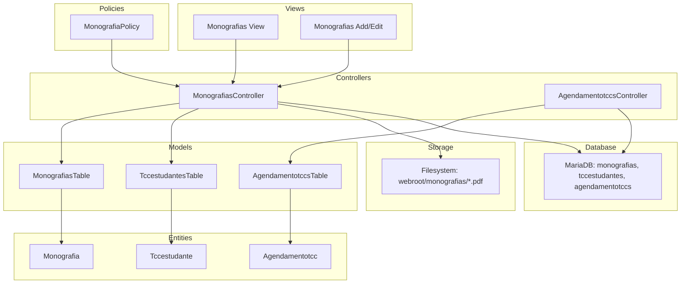
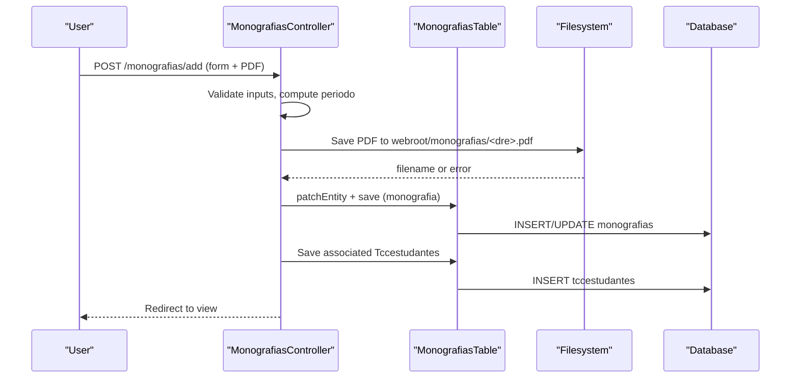
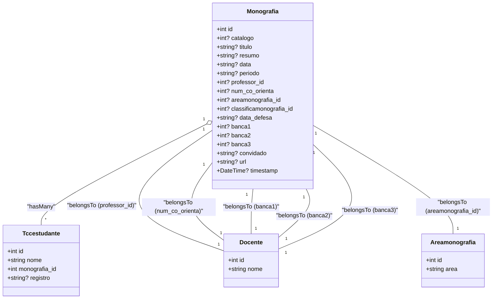
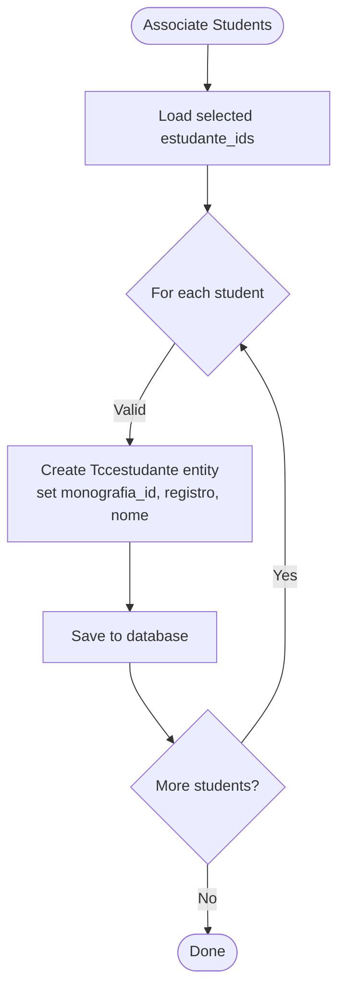
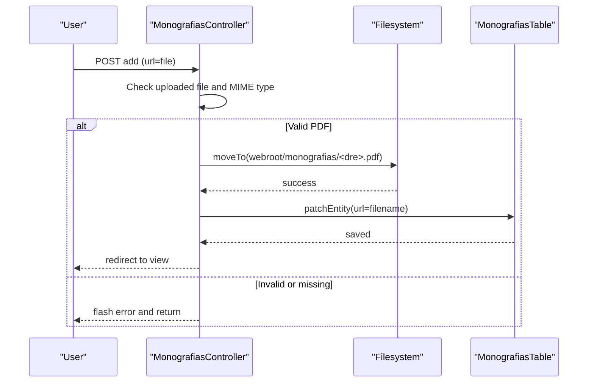
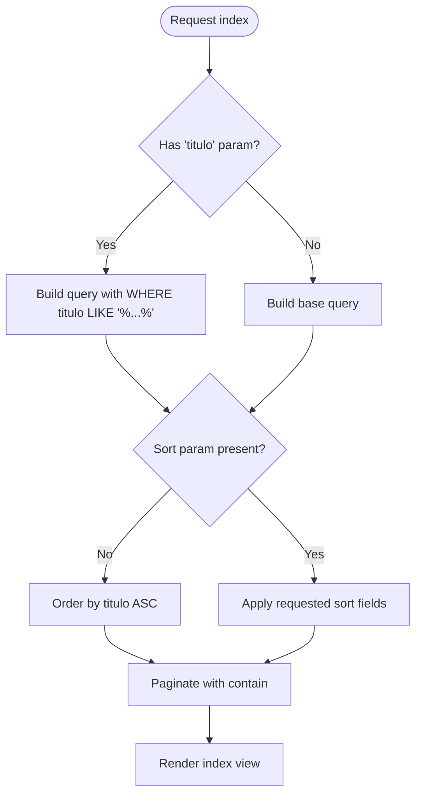
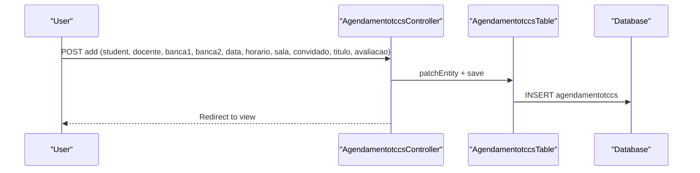
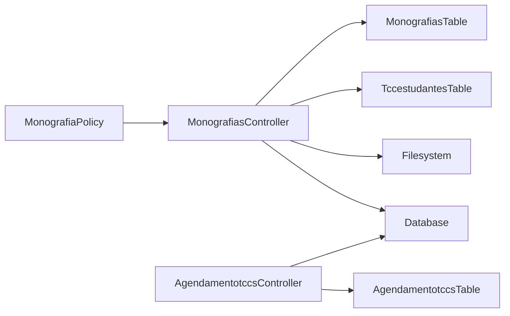

# Monograph Management

<cite>
**Referenced Files in This Document**
- [Monografia.php](file://src/Model/Entity/Monografia.php)
- [MonografiasTable.php](file://src/Model/Table/MonografiasTable.php)
- [MonografiasController.php](file://src/Controller/MonografiasController.php)
- [MonografiaPolicy.php](file://src/Policy/MonografiaPolicy.php)
- [Tccestudante.php](file://src/Model/Entity/Tccestudante.php)
- [TccestudantesTable.php](file://src/Model/Table/TccestudantesTable.php)
- [Agendamentotcc.php](file://src/Model/Entity/Agendamentotcc.php)
- [AgendamentotccsTable.php](file://src/Model/Table/AgendamentotccsTable.php)
- [AgendamentotccsController.php](file://src/Controller/AgendamentotccsController.php)
- [schema.sql](file://config/Migrations/schema.sql)
- [view.php](file://templates/Monografias/view.php)
- [add.php](file://templates/Monografias/add.php)
</cite>

## Table of Contents
1. Introduction
2. Project Structure
3. Core Components
4. Architecture Overview
5. Detailed Component Analysis
6. Dependency Analysis
7. Performance Considerations
8. Troubleshooting Guide
9. Conclusion
10. Appendices

## Introduction
This document explains the monograph management module that supports the full lifecycle of thesis documents from registration to completion. It covers the Monografia entity structure, file upload and storage for PDFs, versioning considerations, status tracking through approval workflows, relationships with students, supervisors, and evaluation committees, search and filtering, integration with the defense scheduling system, security, backup strategies, and performance optimization for large documents.

## Project Structure
The monograph feature is implemented using a CakePHP MVC pattern:
- Entities define data models (Monografia, Tccestudante, Agendamentotcc).
- Tables define associations, validation, and rules.
- Controllers handle requests, file uploads, search, and orchestration.
- Policies enforce authorization.
- Templates render views and forms for adding/editing monographs and viewing details.
- The database schema defines tables including monografias, tccestudantes, agendamentotccs, and related entities.

**Diagram sources**
- [MonografiasController.php:1-513](file://src/Controller/MonografiasController.php#L1-L513)
- [MonografiasTable.php:1-190](file://src/Model/Table/MonografiasTable.php#L1-L190)
- [TccestudantesTable.php:1-100](file://src/Model/Table/TccestudantesTable.php#L1-L100)
- [AgendamentotccsController.php:1-230](file://src/Controller/AgendamentotccsController.php#L1-L230)
- [AgendamentotccsTable.php:1-152](file://src/Model/Table/AgendamentotccsTable.php#L1-L152)
- [Monografia.php:1-73](file://src/Model/Entity/Monografia.php#L1-L73)
- [Tccestudante.php:1-36](file://src/Model/Entity/Tccestudante.php#L1-L36)
- [Agendamentotcc.php:1-56](file://src/Model/Entity/Agendamentotcc.php#L1-L56)
- [MonografiaPolicy.php:1-63](file://src/Policy/MonografiaPolicy.php#L1-L63)
- [schema.sql:434-456](file://config/Migrations/schema.sql#L434-L456)
- [schema.sql:617-627](file://config/Migrations/schema.sql#L617-L627)
- [schema.sql:33-45](file://config/Migrations/schema.sql#L33-L45)

**Section sources**
- [MonografiasController.php:1-513](file://src/Controller/MonografiasController.php#L1-L513)
- [MonografiasTable.php:1-190](file://src/Model/Table/MonografiasTable.php#L1-L190)
- [TccestudantesTable.php:1-100](file://src/Model/Table/TccestudantesTable.php#L1-L100)
- [AgendamentotccsController.php:1-230](file://src/Controller/AgendamentotccsController.php#L1-L230)
- [AgendamentotccsTable.php:1-152](file://src/Model/Table/AgendamentotccsTable.php#L1-L152)
- [Monografia.php:1-73](file://src/Model/Entity/Monografia.php#L1-L73)
- [Tccestudante.php:1-36](file://src/Model/Entity/Tccestudante.php#L1-L36)
- [Agendamentotcc.php:1-56](file://src/Model/Entity/Agendamentotcc.php#L1-L56)
- [MonografiaPolicy.php:1-63](file://src/Policy/MonografiaPolicy.php#L1-L63)
- [schema.sql:434-456](file://config/Migrations/schema.sql#L434-L456)
- [schema.sql:617-627](file://config/Migrations/schema.sql#L617-L627)
- [schema.sql:33-45](file://config/Migrations/schema.sql#L33-L45)

## Core Components
- Monografia entity and table define the core thesis record, including title, summary, period, advisor, co-advisor, area, defense date, committee members, guest, URL to PDF, and timestamp.
- Tccestudante links students to a monograph via monografia_id and stores student name and registration number.
- Agendamentotcc represents defense scheduling records with student, supervisor, committee members, date/time, room, guest, title, and evaluation.
- MonografiasController handles CRUD operations, PDF upload, search/filtering, listing, downloading, and synchronization utilities.
- AgendamentotccsController manages scheduling CRUD and list views.
- MonografiaPolicy enforces role-based access control based on user category.

Key responsibilities:
- Data modeling and associations: MonografiasTable, TccestudantesTable, AgendamentotccsTable.
- Request handling and business logic: MonografiasController, AgendamentotccsController.
- Authorization: MonografiaPolicy.
- Presentation: templates for add/edit/view.

**Section sources**
- [Monografia.php:1-73](file://src/Model/Entity/Monografia.php#L1-L73)
- [MonografiasTable.php:1-190](file://src/Model/Table/MonografiasTable.php#L1-L190)
- [Tccestudante.php:1-36](file://src/Model/Entity/Tccestudante.php#L1-L36)
- [TccestudantesTable.php:1-100](file://src/Model/Table/TccestudantesTable.php#L1-L100)
- [Agendamentotcc.php:1-56](file://src/Model/Entity/Agendamentotcc.php#L1-L56)
- [AgendamentotccsTable.php:1-152](file://src/Model/Table/AgendamentotccsTable.php#L1-L152)
- [MonografiasController.php:1-513](file://src/Controller/MonografiasController.php#L1-L513)
- [AgendamentotccsController.php:1-230](file://src/Controller/AgendamentotccsController.php#L1-L230)
- [MonografiaPolicy.php:1-63](file://src/Policy/MonografiaPolicy.php#L1-L63)

## Architecture Overview
The monograph workflow integrates three main subsystems:
- Monograph registration and management: create, edit, view, delete; associate students; store PDF; search/filter.
- Defense scheduling: create schedules for evaluations; manage dates, times, rooms, and committee members.
- Authorization and presentation: policies restrict editing/deleting to authorized users; templates provide UI.

**Diagram sources**
- [MonografiasController.php:102-170](file://src/Controller/MonografiasController.php#L102-L170)
- [MonografiasController.php:319-331](file://src/Controller/MonografiasController.php#L319-L331)
- [MonografiasTable.php:41-100](file://src/Model/Table/MonografiasTable.php#L41-L100)
- [schema.sql:434-456](file://config/Migrations/schema.sql#L434-L456)
- [schema.sql:617-627](file://config/Migrations/schema.sql#L617-L627)

## Detailed Component Analysis

### Monografia Entity and Table
- Fields include catalog number, title, summary, submission date, period, professor ID, co-advisor ID, area ID, classification ID, defense date, committee member IDs (banca1/2/3), guest, URL to PDF, and timestamp.
- Associations:
  - BelongsTo Docente (advisor), Docente (co-advisor), Areamonografias (area).
  - HasMany Tccestudantes (students linked to the monograph).
  - Additional BelongsTo Docente relations for banca1/2/3 used for committee display.
- Validation enforces field lengths and types; rules ensure referential integrity for professor and area.
- CounterCache behavior maintains counts on areas.

**Diagram sources**
- [Monografia.php:1-73](file://src/Model/Entity/Monografia.php#L1-L73)
- [MonografiasTable.php:41-100](file://src/Model/Table/MonografiasTable.php#L41-L100)
- [Tccestudante.php:1-36](file://src/Model/Entity/Tccestudante.php#L1-L36)
- [schema.sql:434-456](file://config/Migrations/schema.sql#L434-L456)
- [schema.sql:617-627](file://config/Migrations/schema.sql#L617-L627)

**Section sources**
- [Monografia.php:1-73](file://src/Model/Entity/Monografia.php#L1-L73)
- [MonografiasTable.php:1-190](file://src/Model/Table/MonografiasTable.php#L1-L190)
- [schema.sql:434-456](file://config/Migrations/schema.sql#L434-L456)

### Student Association (Tccestudante)
- Links students to monographs via monografia_id and stores student name and registration number.
- HasOne association to Estudantes for lookup by registration.
- Validation ensures presence of name and length constraints.

**Diagram sources**
- [MonografiasController.php:175-202](file://src/Controller/MonografiasController.php#L175-L202)
- [TccestudantesTable.php:34-57](file://src/Model/Table/TccestudantesTable.php#L34-L57)
- [schema.sql:617-627](file://config/Migrations/schema.sql#L617-L627)

**Section sources**
- [Tccestudante.php:1-36](file://src/Model/Entity/Tccestudante.php#L1-L36)
- [TccestudantesTable.php:1-100](file://src/Model/Table/TccestudantesTable.php#L1-L100)
- [MonografiasController.php:175-202](file://src/Controller/MonografiasController.php#L175-L202)

### File Upload and Storage (PDF)
- The add form includes a file input for PDF upload.
- On submit, the controller checks for an uploaded file, validates MIME type, and saves it to webroot/monografias with a filename derived from student registration or timestamp.
- The stored filename is saved in the monografia.url field.
- Download endpoint serves files securely by checking existence and returning a download response.

**Diagram sources**
- [MonografiasController.php:107-121](file://src/Controller/MonografiasController.php#L107-L121)
- [MonografiasController.php:319-331](file://src/Controller/MonografiasController.php#L319-L331)
- [MonografiasController.php:499-511](file://src/Controller/MonografiasController.php#L499-L511)
- [add.php:296-306](file://templates/Monografias/add.php#L296-L306)

**Section sources**
- [MonografiasController.php:107-121](file://src/Controller/MonografiasController.php#L107-L121)
- [MonografiasController.php:319-331](file://src/Controller/MonografiasController.php#L319-L331)
- [MonografiasController.php:499-511](file://src/Controller/MonografiasController.php#L499-L511)
- [add.php:296-306](file://templates/Monografias/add.php#L296-L306)

### Version Control for Document Revisions
- Current implementation does not maintain explicit version history for monograph PDFs. Each upload overwrites the existing file named by student registration or timestamp.
- To support versioning, consider:
  - Storing multiple versions per monograph with a version number or timestamp suffix.
  - Maintaining a separate versions table linking monografia_id to file paths and metadata.
  - Updating the download endpoint to serve a specific version or latest version.
  - Adding audit fields (created_by, updated_by, change notes) to track revisions.

[No sources needed since this section proposes enhancements beyond current implementation]

### Status Tracking Throughout Approval Workflow
- There is no dedicated status field in the monografias table to represent workflow stages (e.g., submitted, under review, approved, defended).
- Indicators present:
  - data_defesa indicates a scheduled defense date.
  - banca1/2/3 identify committee members.
  - convidado allows noting an invited evaluator.
- Recommendations:
  - Add a status enum field to model workflow states.
  - Implement state transitions in controllers with validation and authorization.
  - Use timestamps to log transitions and who performed them.
  - Integrate notifications when status changes.

[No sources needed since this section proposes enhancements beyond current implementation]

### Search and Filtering Capabilities
- Index action supports searching by title using a LIKE query and paginating results.
- Sorting is supported across multiple fields: title, period, URL, student name, professor name, and area.
- Containment loads related Docente, Areamonografias, and Tccestudantes for display.

**Diagram sources**
- [MonografiasController.php:46-75](file://src/Controller/MonografiasController.php#L46-L75)

**Section sources**
- [MonografiasController.php:46-75](file://src/Controller/MonografiasController.php#L46-L75)

### Integration with Defense Scheduling System
- Defense scheduling is managed by AgendamentotccsController and AgendamentotccsTable, storing student, supervisor, committee members, date/time, room, guest, title, and evaluation.
- While there is no direct foreign key from monografias to agendamentotccs in the schema shown, both share references to docentes and can be correlated by title or external mapping in application logic.
- Typical flow: after a monograph is approved and has a defense date set, schedule a defense entry referencing the same student(s) and committee members.

**Diagram sources**
- [AgendamentotccsController.php:96-139](file://src/Controller/AgendamentotccsController.php#L96-L139)
- [AgendamentotccsTable.php:43-75](file://src/Model/Table/AgendamentotccsTable.php#L43-L75)
- [schema.sql:33-45](file://config/Migrations/schema.sql#L33-L45)

**Section sources**
- [AgendamentotccsController.php:1-230](file://src/Controller/AgendamentotccsController.php#L1-L230)
- [AgendamentotccsTable.php:1-152](file://src/Model/Table/AgendamentotccsTable.php#L1-L152)
- [schema.sql:33-45](file://config/Migrations/schema.sql#L33-L45)

### Metadata Extraction
- The current implementation does not extract metadata from uploaded PDFs (e.g., author, keywords, creation date).
- To implement extraction:
  - Use a PHP library to parse PDF metadata before saving.
  - Store extracted fields in additional columns or a separate metadata table linked to monografia_id.
  - Expose metadata in view and search interfaces.

[No sources needed since this section proposes enhancements beyond current implementation]

### Relationships Between Monographs and Stakeholders
- Students: Linked via Tccestudantes (one-to-many from monograph perspective).
- Supervisors: Represented by professor_id (advisor) and optionally num_co_orienta (co-advisor).
- Evaluation Committees: Represented by banca1/2/3 referencing docentes.
- Area: Referenced via areamonografia_id.

```mermaid
erDiagram
MONOGRAFIAS {
int id PK
string titulo
string resumo
string data
string periodo
int professor_id FK
int num_co_orienta FK
int areamonografia_id FK
int classificamonografia_id FK
string data_defesa
int banca1 FK
int banca2 FK
int banca3 FK
string convidado
string url
timestamp timestamp
}
TCC_ESTUDANTES {
int id PK
string nome
int monografia_id FK
string registro
}
DOCENTES {
int id PK
string nome
}
AREAMONOGRAFIAS {
int id PK
string area
}
MONOGRAFIAS ||--o{ TCC_ESTUDANTES : "has many"
MONOGRAFIAS }o--|| DOCENTES : "advisor (professor_id)"
MONOGRAFIAS }o--|| DOCENTES : "co-advisor (num_co_orienta)"
MONOGRAFIAS }o--|| DOCENTES : "committee (banca1)"
MONOGRAFIAS }o--|| DOCENTES : "committee (banca2)"
MONOGRAFIAS }o--|| DOCENTES : "committee (banca3)"
MONOGRAFIAS }o--|| AREAMONOGRAFIAS : "area"
```

**Diagram sources**
- [schema.sql:434-456](file://config/Migrations/schema.sql#L434-L456)
- [schema.sql:617-627](file://config/Migrations/schema.sql#L617-L627)
- [MonografiasTable.php:55-99](file://src/Model/Table/MonografiasTable.php#L55-L99)

**Section sources**
- [MonografiasTable.php:55-99](file://src/Model/Table/MonografiasTable.php#L55-L99)
- [schema.sql:434-456](file://config/Migrations/schema.sql#L434-L456)
- [schema.sql:617-627](file://config/Migrations/schema.sql#L617-L627)

## Dependency Analysis
- MonografiasController depends on:
  - MonografiasTable for persistence and associations.
  - TccestudantesTable for student associations.
  - Filesystem for PDF storage.
  - Database for all persisted data.
- AgendamentotccsController depends on:
  - AgendamentotccsTable for scheduling persistence.
  - Database for scheduling data.
- Policies depend on user identity to authorize actions.

**Diagram sources**
- [MonografiasController.php:1-513](file://src/Controller/MonografiasController.php#L1-L513)
- [MonografiasTable.php:1-190](file://src/Model/Table/MonografiasTable.php#L1-L190)
- [TccestudantesTable.php:1-100](file://src/Model/Table/TccestudantesTable.php#L1-L100)
- [AgendamentotccsController.php:1-230](file://src/Controller/AgendamentotccsController.php#L1-L230)
- [AgendamentotccsTable.php:1-152](file://src/Model/Table/AgendamentotccsTable.php#L1-L152)
- [MonografiaPolicy.php:1-63](file://src/Policy/MonografiaPolicy.php#L1-L63)

**Section sources**
- [MonografiasController.php:1-513](file://src/Controller/MonografiasController.php#L1-L513)
- [AgendamentotccsController.php:1-230](file://src/Controller/AgendamentotccsController.php#L1-L230)
- [MonografiaPolicy.php:1-63](file://src/Policy/MonografiaPolicy.php#L1-L63)

## Performance Considerations
- Pagination: Index uses pagination to limit result sets and improve load times.
- Containment: Queries use contain to eagerly load related entities, reducing N+1 queries.
- Sorting: Configurable sortable fields allow efficient ordering at the database level.
- File handling:
  - Ensure webroot/monografias directory has appropriate permissions and sufficient disk space.
  - Consider chunked uploads and server-side limits for large PDFs.
  - Use CDN or object storage for scalable file serving if volume grows significantly.
- Database:
  - Add indexes on frequently filtered/sorted columns (e.g., titulo, periodo, url).
  - Consider archiving old records to keep active datasets small.
- Caching:
  - Cache lists of docentes and areas to reduce repeated lookups.
  - Use application-level caching for static configuration data.

[No sources needed since this section provides general guidance]

## Troubleshooting Guide
- File upload errors:
  - Verify MIME type check accepts only PDFs; non-PDF uploads will trigger a flash error.
  - Ensure the target directory exists and is writable.
  - Check server upload limits and timeouts for large files.
- Missing PDFs:
  - Use verification endpoints to reconcile filesystem files with database URLs.
  - If a file is missing, the URL may be cleared or marked invalid.
- Access denied:
  - Editing and deleting require user category '1'; verify identity and policy enforcement.
- Schedule conflicts:
  - Validate overlapping dates/times for rooms and committee members when creating schedules.

**Section sources**
- [MonografiasController.php:319-331](file://src/Controller/MonografiasController.php#L319-L331)
- [MonografiasController.php:406-448](file://src/Controller/MonografiasController.php#L406-L448)
- [MonografiaPolicy.php:21-48](file://src/Policy/MonografiaPolicy.php#L21-L48)

## Conclusion
The monograph management module provides robust capabilities for registering thesis documents, associating students, managing advisors and committees, uploading and serving PDFs, and scheduling defenses. While the current implementation lacks explicit workflow status and versioning, it offers a solid foundation for extending these features. Security is enforced via policies, and performance is optimized through pagination, containment, and configurable sorting. Future enhancements should introduce status tracking, version control, metadata extraction, and stronger integration between monographs and defense schedules.

[No sources needed since this section summarizes without analyzing specific files]

## Appendices

### Key Views and Forms
- Add/Edit forms include fields for student selection, title, summary, dates, period, advisor/co-advisor, area, defense date, committee members, guest, and PDF upload.
- View displays monograph details, associated students, advisor, co-advisor, area, defense date, PDF link, committee members, and guest.

**Section sources**
- [add.php:42-306](file://templates/Monografias/add.php#L42-L306)
- [view.php:32-121](file://templates/Monografias/view.php#L32-L121)