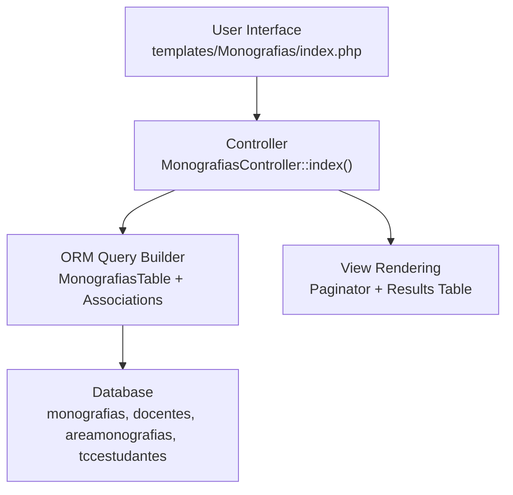
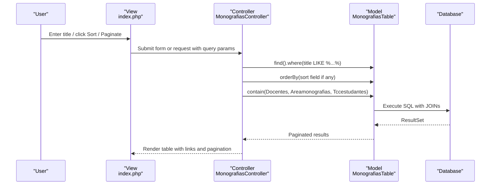
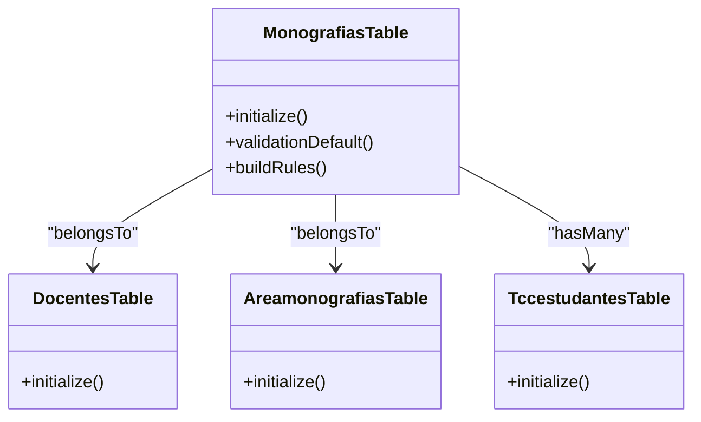
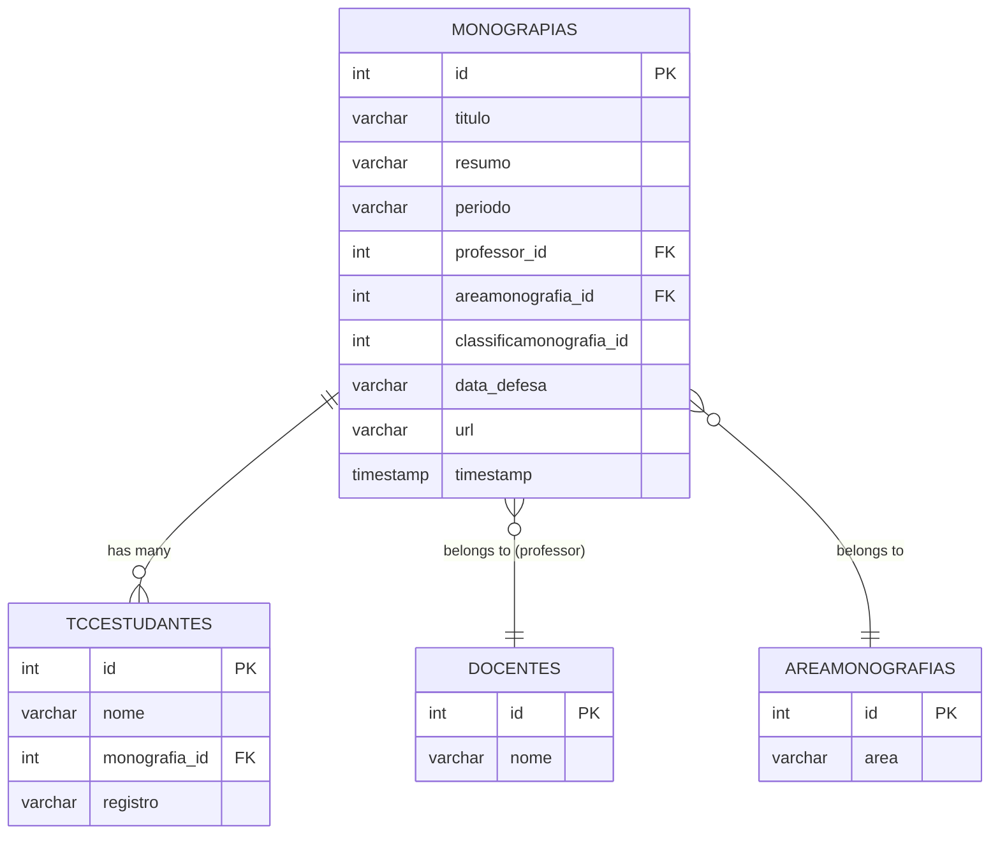

# Search and Filtering System

<cite>
**Referenced Files in This Document**
- [MonografiasController.php](file://src/Controller/MonografiasController.php)
- [MonografiasTable.php](file://src/Model/Table/MonografiasTable.php)
- [Monografia.php](file://src/Model/Entity/Monografia.php)
- [DocentesTable.php](file://src/Model/Table/DocentesTable.php)
- [AreamonografiasTable.php](file://src/Model/Table/AreamonografiasTable.php)
- [TccestudantesTable.php](file://src/Model/Table/TccestudantesTable.php)
- [index.php](file://templates/Monografias/index.php)
- [lista.php](file://templates/Monografias/lista.php)
- [templates.php](file://templates/element/templates.php)
- [paginator.php](file://templates/element/paginator.php)
- [schema.sql](file://config/Migrations/schema.sql)
</cite>

## Table of Contents
1. [Introduction](#introduction)
2. [Project Structure](#project-structure)
3. [Core Components](#core-components)
4. [Architecture Overview](#architecture-overview)
5. [Detailed Component Analysis](#detailed-component-analysis)
6. [Dependency Analysis](#dependency-analysis)
7. [Performance Considerations](#performance-considerations)
8. [Troubleshooting Guide](#troubleshooting-guide)
9. [Conclusion](#conclusion)
10. [Appendices](#appendices)

## Introduction
This document explains the search and filtering capabilities for monographs (monografias) in the system. It covers how users can search by title, filter by academic area, supervisor, student, date range, and status; how sorting and pagination work; and how database queries are constructed and optimized. It also describes the user interface elements used for search forms, filters, and result display, along with performance considerations for large datasets and relevance ranking strategies.

## Project Structure
The search and filtering functionality is centered around:
- Controller: MonografiasController handles request processing, query building, and pagination.
- Models: MonografiasTable defines associations to Docentes, Areamonografias, and Tccestudantes, enabling rich queries across related entities.
- Views: templates/Monografias/index.php provides the search form and results table with sortable columns and pagination controls.
- Database schema: config/Migrations/schema.sql defines the tables and relationships used by the queries.

**Diagram sources**
- [MonografiasController.php:46-75](file://src/Controller/MonografiasController.php#L46-L75)
- [MonografiasTable.php:41-100](file://src/Model/Table/MonografiasTable.php#L41-L100)
- [index.php:29-109](file://templates/Monografias/index.php#L29-L109)
- [schema.sql:437-456](file://config/Migrations/schema.sql#L437-L456)

**Section sources**
- [MonografiasController.php:46-75](file://src/Controller/MonografiasController.php#L46-L75)
- [index.php:29-109](file://templates/Monografias/index.php#L29-L109)
- [schema.sql:437-456](file://config/Migrations/schema.sql#L437-L456)

## Core Components
- Search input: The index view includes a text field for searching by title. When submitted, the controller applies a LIKE condition on the title field.
- Sorting: The index view uses paginator sort helpers for multiple fields (title, period, student name, supervisor name, area, PDF link). The controller declares sortable fields and sets a default order when no sort is specified.
- Pagination: The controller paginates the query using Cake’s paginator, which supports page size and navigation.
- Associations: Queries use contain to load related data (supervisor, area, students), enabling sorting and display across joined tables.

Key implementation points:
- Title search via POST data and LIKE clause.
- Default ordering by title when no sort parameter is present.
- Explicit list of sortable fields passed to paginate.
- Use of contain to fetch related entities efficiently.

**Section sources**
- [MonografiasController.php:46-75](file://src/Controller/MonografiasController.php#L46-L75)
- [index.php:29-109](file://templates/Monografias/index.php#L29-L109)
- [MonografiasTable.php:41-100](file://src/Model/Table/MonografiasTable.php#L41-L100)

## Architecture Overview
The search flow starts at the UI, passes through the controller, builds an ORM query with optional filters and sorting, executes against the database with joins to related tables, and returns paginated results to the view.

**Diagram sources**
- [MonografiasController.php:46-75](file://src/Controller/MonografiasController.php#L46-L75)
- [MonografiasTable.php:41-100](file://src/Model/Table/MonografiasTable.php#L41-L100)
- [index.php:29-109](file://templates/Monografias/index.php#L29-L109)

## Detailed Component Analysis

### Search by Title
- UI element: A single-line search box labeled “Busca por título” submits via POST.
- Behavior: If the title field is present in POST data, the controller adds a WHERE clause using LIKE with wildcards around the input value.
- Result: Only monographs whose title contains the search term are returned.

Notes:
- No full-text search index is used; this is a simple substring match.
- Input is not escaped in the shown code; consider sanitization/validation for production.

**Section sources**
- [index.php:29-39](file://templates/Monografias/index.php#L29-L39)
- [MonografiasController.php:46-75](file://src/Controller/MonografiasController.php#L46-L75)

### Sorting Mechanism
- UI: Column headers include paginator sort links for title, period, student name, supervisor name, area, and PDF link.
- Behavior: If no sort parameter is provided, the controller defaults to ordering by title ascending. Otherwise, it respects the requested sort field from the URL parameters.
- Allowed fields: The controller explicitly lists sortable fields to prevent arbitrary column injection.

Considerations:
- Sorting across associated tables (e.g., student name, supervisor name, area) relies on contain and proper join conditions defined in the model associations.

**Section sources**
- [MonografiasController.php:46-75](file://src/Controller/MonografiasController.php#L46-L75)
- [index.php:41-50](file://templates/Monografias/index.php#L41-L50)
- [MonografiasTable.php:41-100](file://src/Model/Table/MonografiasTable.php#L41-L100)

### Pagination Handling
- UI: Pagination controls render first/previous/next/last links and a counter showing current page and total records.
- Behavior: The controller paginates the built query with a configured set of sortable fields. The view uses standard paginator helpers to generate navigation.

Optimization tips:
- Ensure appropriate indexes on frequently sorted/filtering columns to improve performance under pagination.

**Section sources**
- [MonografiasController.php:62-75](file://src/Controller/MonografiasController.php#L62-L75)
- [index.php:97-109](file://templates/Monografias/index.php#L97-L109)
- [templates.php:93-99](file://templates/element/templates.php#L93-L99)
- [paginator.php:13-18](file://templates/element/paginator.php#L13-L18)

### Advanced Filtering Options
Current state:
- Title search is implemented via POST and LIKE.
- Additional filters (by author/supervisor, academic area, date range, status) are not yet implemented in the controller.

Recommended enhancements:
- Add GET parameters for filters such as supervisor_id, area_id, periodo (date range), and status/classification.
- Build conditional WHERE clauses based on presence of these parameters.
- Combine filters with existing title search using AND logic.

Example design (conceptual):
- Supervisor filter: where(['professor_id' => $supervisorId])
- Area filter: where(['areamonografia_id' => $areaId])
- Date range: where(['periodo >= ' => $from, 'periodo <= ' => $to])
- Status: where(['classificamonografia_id' => $statusId])

[No sources needed since this section proposes future enhancements]

### Full-Text Search Implementation
Current state:
- Title search uses LIKE-based substring matching without full-text indexing.

Recommendations:
- For large datasets, implement MySQL full-text search on the title field to improve performance and support ranking.
- Replace LIKE with MATCH ... AGAINST and compute relevance scores for ranking.

Implementation outline (conceptual):
- Create a FULLTEXT index on monografias.titulo.
- Use MATCH(Monografias.titulo) AGAINST(:term) in WHERE.
- Order by relevance score descending for better ranking.

[No sources needed since this section proposes future enhancements]

### Result Caching Strategies
Current state:
- No caching is implemented for search results.

Recommendations:
- Cache frequent searches keyed by normalized query parameters (e.g., title, supervisor, area, date range, sort, page).
- Use application cache (e.g., APCu, Redis) with short TTLs for dynamic content.
- Invalidate cache on write operations (add/edit/delete monograph).

[No sources needed since this section proposes future enhancements]

### User Interface Elements
- Search form: Single input for title with a submit button.
- Results table: Displays truncated title, period, student(s), supervisor, area, and PDF download link.
- Sorting: Clickable column headers to sort by various fields.
- Pagination: Standard paginator controls with page numbers and counters.

Accessibility and UX notes:
- Ensure labels and buttons are clearly described.
- Provide clear feedback when no results are found.
- Consider adding keyboard navigation for sorting and pagination.

**Section sources**
- [index.php:29-109](file://templates/Monografias/index.php#L29-L109)

## Dependency Analysis
The search functionality depends on model associations to retrieve related data for sorting and display.

**Diagram sources**
- [MonografiasTable.php:41-100](file://src/Model/Table/MonografiasTable.php#L41-L100)
- [DocentesTable.php:36-78](file://src/Model/Table/DocentesTable.php#L36-L78)
- [AreamonografiasTable.php:41-60](file://src/Model/Table/AreamonografiasTable.php#L41-L60)
- [TccestudantesTable.php:34-57](file://src/Model/Table/TccestudantesTable.php#L34-L57)

**Section sources**
- [MonografiasTable.php:41-100](file://src/Model/Table/MonografiasTable.php#L41-L100)
- [DocentesTable.php:36-78](file://src/Model/Table/DocentesTable.php#L36-L78)
- [AreamonografiasTable.php:41-60](file://src/Model/Table/AreamonografiasTable.php#L41-L60)
- [TccestudantesTable.php:34-57](file://src/Model/Table/TccestudantesTable.php#L34-L57)

## Performance Considerations
- Indexes:
  - Add indexes on frequently filtered/sorted columns: monografias.titulo, monografias.periodo, monografias.professor_id, monografias.areamonografia_id, monografias.classificamonografia_id.
  - Add indexes on foreign keys used in joins: tccestudantes.monografia_id.
- Query optimization:
  - Use contain to eagerly load only necessary associations.
  - Avoid SELECT *; specify required fields when possible.
  - Limit result sets with pagination.
- Full-text search:
  - Implement FULLTEXT on monografias.titulo for scalable substring matching and ranking.
- Caching:
  - Cache repeated queries with identical parameters.
  - Use short TTLs and invalidate on writes.
- Large datasets:
  - Consider server-side search APIs for complex queries.
  - Offload heavy computations to background jobs if needed.

[No sources needed since this section provides general guidance]

## Troubleshooting Guide
Common issues and resolutions:
- No results for title search:
  - Verify that the title field exists and contains expected values.
  - Check that the LIKE pattern is correctly applied and not overly restrictive.
- Sorting errors:
  - Ensure the requested sort field is in the allowed list.
  - Confirm that associations are properly defined so joins succeed.
- Pagination anomalies:
  - Validate that the query returns a valid count and that pagination settings are reasonable.
- Missing related data:
  - Confirm that contain is used to load associations and that foreign keys are correct.

Error handling in the controller:
- View actions handle missing records gracefully with flash messages and redirects.

**Section sources**
- [MonografiasController.php:84-95](file://src/Controller/MonografiasController.php#L84-L95)
- [MonografiasController.php:211-220](file://src/Controller/MonografiasController.php#L211-L220)

## Conclusion
The monograph management system currently supports title-based search, multi-field sorting, and pagination. The controller builds efficient ORM queries using associations to enable cross-entity sorting and display. To enhance scalability and usability, consider implementing advanced filters (supervisor, area, date range, status), full-text search with relevance ranking, and result caching. Proper indexing and careful query construction will ensure responsive performance even with large datasets.

[No sources needed since this section summarizes without analyzing specific files]

## Appendices

### Data Model Overview

**Diagram sources**
- [schema.sql:437-456](file://config/Migrations/schema.sql#L437-L456)
- [schema.sql:528-566](file://config/Migrations/schema.sql#L528-L566)
- [schema.sql:118-122](file://config/Migrations/schema.sql#L118-L122)
- [schema.sql:620-626](file://config/Migrations/schema.sql#L620-L626)