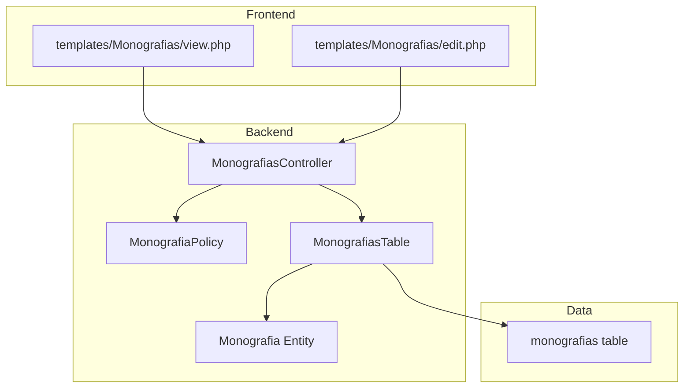
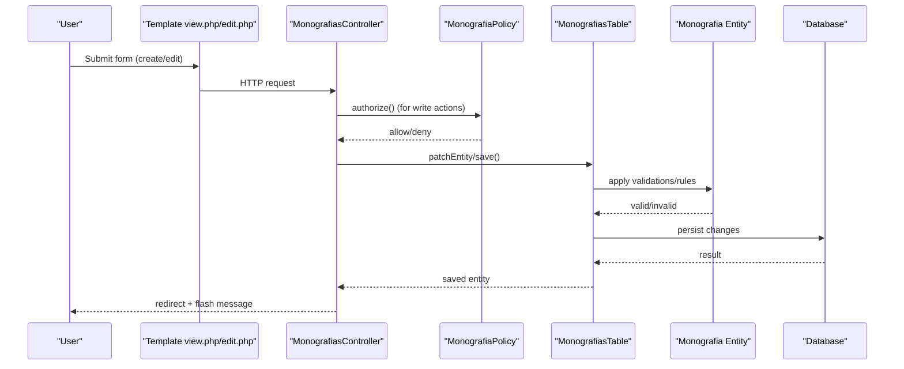
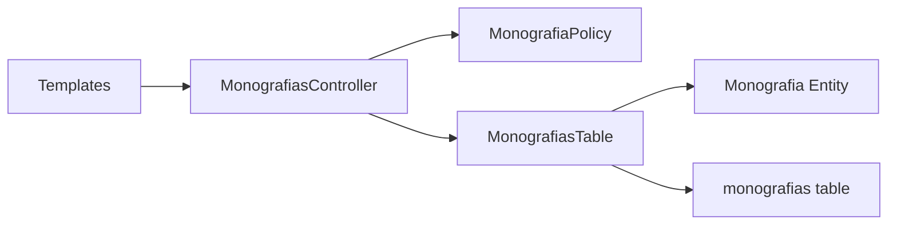
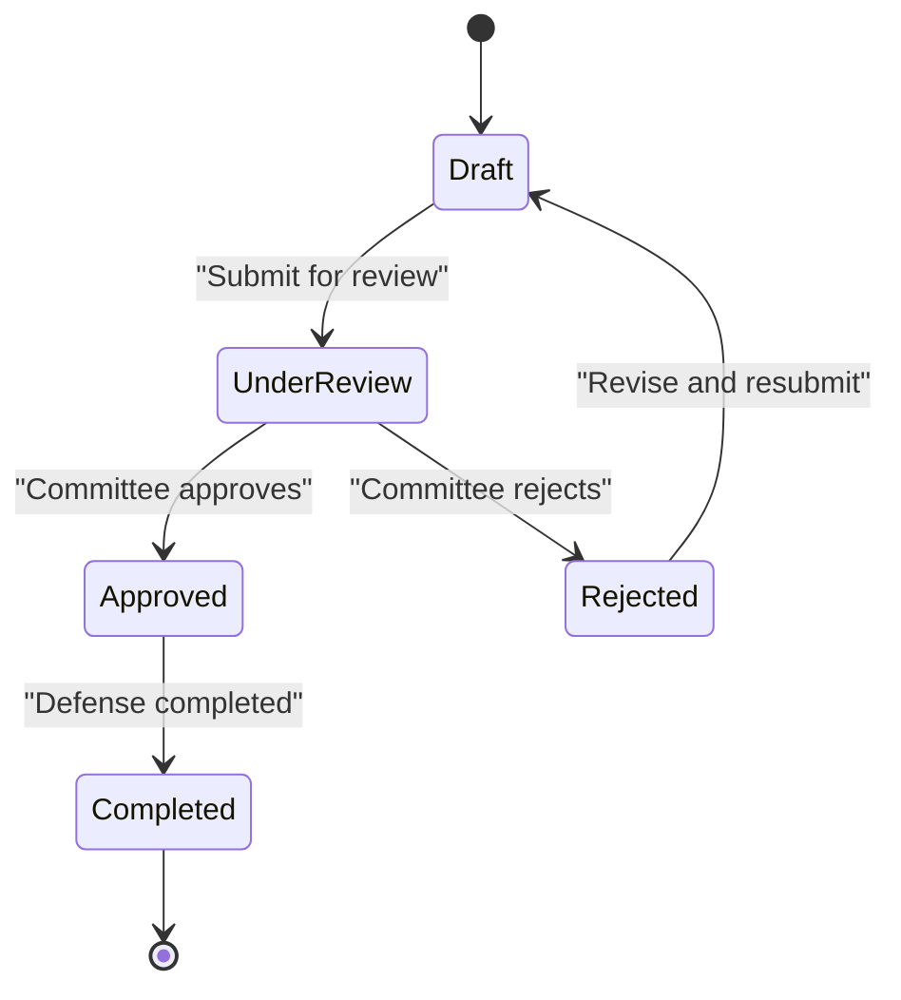

# Workflow and State Management

<cite>
**Referenced Files in This Document**
- [MonografiasController.php](file://src/Controller/MonografiasController.php)
- [MonografiaPolicy.php](file://src/Policy/MonografiaPolicy.php)
- [MonografiasTable.php](file://src/Model/Table/MonografiasTable.php)
- [Monografia.php](file://src/Model/Entity/Monografia.php)
- [User.php](file://src/Model/Entity/User.php)
- [schema.sql](file://config/Migrations/schema.sql)
- [view.php](file://templates/Monografias/view.php)
- [edit.php](file://templates/Monografias/edit.php)
</cite>

## Table of Contents
1. [Introduction](#introduction)
2. [Project Structure](#project-structure)
3. [Core Components](#core-components)
4. [Architecture Overview](#architecture-overview)
5. [Detailed Component Analysis](#detailed-component-analysis)
6. [Dependency Analysis](#dependency-analysis)
7. [Performance Considerations](#performance-considerations)
8. [Troubleshooting Guide](#troubleshooting-guide)
9. [Conclusion](#conclusion)
10. [Appendices](#appendices)

## Introduction
This document explains how monographs are created, edited, and managed in the system, focusing on workflow and state management. It covers:
- The lifecycle states a monograph can be in (draft, under review, approved, rejected, completed)
- Transition rules between states
- Role-based permissions for state changes
- Approval workflows involving supervisors and committee members
- Audit logging of state transitions
- Implementation details for state validation, business rule enforcement, and notification triggers
- Customization options and extension points for institutional requirements

The current codebase implements basic CRUD operations for monographs with role-based access control. A formal state machine for monograph progression is not yet implemented; this document outlines where and how to add it.

## Project Structure
The monograph feature spans controllers, policies, models, templates, and database schema:
- Controller: MonografiasController handles creation, editing, listing, viewing, deletion, and file upload/download
- Policy: MonografiaPolicy enforces role-based permissions based on user category
- Model: MonografiasTable defines associations and validations; Monografia entity declares accessible fields
- Templates: view.php and edit.php render UI and expose form fields for workflow-relevant data
- Schema: monografias table stores core attributes including dates, period, committee members, and PDF URL

**Diagram sources**
- [MonografiasController.php:28-39](file://src/Controller/MonografiasController.php#L28-L39)
- [MonografiaPolicy.php:21-61](file://src/Policy/MonografiaPolicy.php#L21-L61)
- [MonografiasTable.php:41-100](file://src/Model/Table/MonografiasTable.php#L41-L100)
- [Monografia.php:46-70](file://src/Model/Entity/Monografia.php#L46-L70)
- [schema.sql:437-456](file://config/Migrations/schema.sql#L437-L456)

**Section sources**
- [MonografiasController.php:28-39](file://src/Controller/MonografiasController.php#L28-L39)
- [MonografiasTable.php:41-100](file://src/Model/Table/MonografiasTable.php#L41-L100)
- [Monografia.php:46-70](file://src/Model/Entity/Monografia.php#L46-L70)
- [schema.sql:437-456](file://config/Migrations/schema.sql#L437-L456)

## Core Components
- MonografiasController: Entry point for monograph operations; handles adding, editing, deleting, listing, viewing, and file handling. Authorization is sometimes skipped for public actions but enforced for write operations.
- MonografiaPolicy: Restricts create/update/delete to users with categoria '1'. View is allowed for all.
- MonografiasTable: Defines relationships to Docentes (advisor, co-advisor, committee), Areamonografias, and Tccestudantes; provides validation rules and integrity checks.
- Monografia Entity: Declares mass-assignable fields for safe patching.
- User Entity: Holds categoria used by policy decisions.
- Database Schema: monografias table includes fields relevant to workflow such as data_defesa (defense date), banca1/banca2/banca3 (committee), url (PDF), periodo, timestamp.

Key observations:
- There is no explicit status/state field in the monografias table or entity.
- No built-in approval workflow or audit log exists in the current code.
- Permissions are role-based via user.categoria.

**Section sources**
- [MonografiasController.php:102-170](file://src/Controller/MonografiasController.php#L102-L170)
- [MonografiasController.php:211-263](file://src/Controller/MonografiasController.php#L211-L263)
- [MonografiaPolicy.php:21-61](file://src/Policy/MonografiaPolicy.php#L21-L61)
- [MonografiasTable.php:108-188](file://src/Model/Table/MonografiasTable.php#L108-L188)
- [Monografia.php:46-70](file://src/Model/Entity/Monografia.php#L46-L70)
- [User.php:38-50](file://src/Model/Entity/User.php#L38-L50)
- [schema.sql:437-456](file://config/Migrations/schema.sql#L437-L456)

## Architecture Overview
The current architecture supports basic monograph management without an explicit workflow engine. To implement robust workflow and state management, extend the controller and model layers to enforce state transitions, validate business rules, and trigger notifications.

**Diagram sources**
- [MonografiasController.php:102-170](file://src/Controller/MonografiasController.php#L102-L170)
- [MonografiasController.php:211-263](file://src/Controller/MonografiasController.php#L211-L263)
- [MonografiaPolicy.php:21-61](file://src/Policy/MonografiaPolicy.php#L21-L61)
- [MonografiasTable.php:108-188](file://src/Model/Table/MonografiasTable.php#L108-L188)
- [Monografia.php:46-70](file://src/Model/Entity/Monografia.php#L46-L70)

## Detailed Component Analysis

### MonografiasController
Responsibilities:
- List and search monographs
- Create new monographs with student associations and optional PDF upload
- Edit existing monographs, sync student associations
- Delete monographs
- Download PDFs and utility methods to reconcile files with records

Workflow integration points:
- Add/Edit methods are natural places to enforce state transitions (e.g., move from draft to under review when required fields are complete).
- File upload success could trigger moving to “under review” if configured.
- Defense date setting could indicate progression toward completion.

Permissions:
- Authorization is skipped for some read-only endpoints; write actions call authorize().

Error handling:
- Uses Flash messages for success/error feedback.
- Redirects on exceptions or missing records.

**Section sources**
- [MonografiasController.php:46-75](file://src/Controller/MonografiasController.php#L46-L75)
- [MonografiasController.php:84-95](file://src/Controller/MonografiasController.php#L84-L95)
- [MonografiasController.php:102-170](file://src/Controller/MonografiasController.php#L102-L170)
- [MonografiasController.php:211-263](file://src/Controller/MonografiasController.php#L211-L263)
- [MonografiasController.php:292-310](file://src/Controller/MonografiasController.php#L292-L310)
- [MonografiasController.php:319-332](file://src/Controller/MonografiasController.php#L319-L332)
- [MonografiasController.php:499-511](file://src/Controller/MonografiasController.php#L499-L511)

### MonografiaPolicy
Role-based permissions:
- Only users with categoria '1' can add, edit, delete monographs.
- Viewing is allowed for all users.

Extension points:
- Extend canAdd/canEdit/canDelete to consider monograph state (e.g., only allow edits in draft or under review).
- Introduce canApprove/canReject methods for committee/supervisor roles.

**Section sources**
- [MonografiaPolicy.php:21-61](file://src/Policy/MonografiaPolicy.php#L21-L61)

### MonografiasTable and Monografia Entity
Data model:
- Associations to Docentes (advisor, co-advisor, committee), Areamonografias, and Tccestudantes.
- Validation rules ensure referential integrity (existsIn checks).
- Entity exposes fields for mass assignment.

Workflow integration points:
- Add custom validation rules to enforce preconditions for state transitions (e.g., require at least one student and advisor before moving to under review).
- Use buildRules to prevent invalid state changes (e.g., cannot approve without defense date set).

**Section sources**
- [MonografiasTable.php:41-100](file://src/Model/Table/MonografiasTable.php#L41-L100)
- [MonografiasTable.php:108-188](file://src/Model/Table/MonografiasTable.php#L108-L188)
- [Monografia.php:46-70](file://src/Model/Entity/Monografia.php#L46-L70)

### Templates: view.php and edit.php
UI considerations:
- view.php displays monograph details, including students, advisor, co-advisor, area, defense date, committee members, and PDF link.
- edit.php provides forms for updating all relevant fields, including student selection, dates, committee assignments, and PDF upload.

Workflow integration points:
- Conditionally show action buttons based on current state and user role (e.g., submit for review, approve, reject).
- Display state indicators and history (requires implementing state storage and history).

**Section sources**
- [view.php:21-28](file://templates/Monografias/view.php#L21-L28)
- [view.php:32-121](file://templates/Monografias/view.php#L32-L121)
- [edit.php:57-335](file://templates/Monografias/edit.php#L57-L335)

### Database Schema: monografias table
Relevant fields for workflow:
- data_defesa: defense date (can gate completion)
- banca1/banca2/banca3: committee members
- url: PDF attachment (completion artifact)
- periodo: academic period
- timestamp: last modified time

Note:
- There is no status/state column currently. Adding a status enum and transition metadata would enable full workflow support.

**Section sources**
- [schema.sql:437-456](file://config/Migrations/schema.sql#L437-L456)

## Dependency Analysis
Current dependencies:
- Controller depends on Policy for authorization and Table for persistence.
- Table depends on Entity for data structure and associations.
- Templates depend on Controller responses and entity data.

Potential circular dependencies:
- None observed; standard MVC separation.

External integrations:
- File system for PDF storage and retrieval.
- Authentication/Authorization components integrated via controller.

**Diagram sources**
- [MonografiasController.php:28-39](file://src/Controller/MonografiasController.php#L28-L39)
- [MonografiaPolicy.php:21-61](file://src/Policy/MonografiaPolicy.php#L21-L61)
- [MonografiasTable.php:41-100](file://src/Model/Table/MonografiasTable.php#L41-L100)
- [Monografia.php:46-70](file://src/Model/Entity/Monografia.php#L46-L70)
- [schema.sql:437-456](file://config/Migrations/schema.sql#L437-L456)

**Section sources**
- [MonografiasController.php:28-39](file://src/Controller/MonografiasController.php#L28-L39)
- [MonografiasTable.php:41-100](file://src/Model/Table/MonografiasTable.php#L41-L100)
- [MonografiaPolicy.php:21-61](file://src/Policy/MonografiaPolicy.php#L21-L61)

## Performance Considerations
- Avoid heavy queries in list views; use pagination and selective contains.
- When syncing student associations during edits, minimize deletions/reinsertions; prefer upsert strategies if needed.
- File operations should validate MIME types and sizes early to reduce overhead.
- Consider caching frequently accessed lists (e.g., areas, professors) if they change infrequently.

[No sources needed since this section provides general guidance]

## Troubleshooting Guide
Common issues and resolutions:
- Missing monograph record: Controller catches exceptions and redirects with error message. Ensure IDs exist and routes are correct.
- Permission denied: Verify user.categoria matches policy expectations ('1' for admin-like actions).
- File upload failures: Check MIME type validation and storage path permissions.
- Student association duplicates: Current sync deletes existing associations then re-adds; ensure idempotency and avoid unintended data loss.

Operational tips:
- Use Flash messages to guide users through errors.
- Log critical failures server-side for auditing.

**Section sources**
- [MonografiasController.php:84-95](file://src/Controller/MonografiasController.php#L84-L95)
- [MonografiasController.php:292-310](file://src/Controller/MonografiasController.php#L292-L310)
- [MonografiasController.php:319-332](file://src/Controller/MonografiasController.php#L319-L332)

## Conclusion
The current implementation provides foundational monograph management with role-based access control but lacks an explicit workflow state machine. To achieve comprehensive workflow and state management:
- Add a status field to monografias with defined states (draft, under review, approved, rejected, completed).
- Implement state transition logic in the controller/model layer with validation and business rules.
- Extend policies to enforce role-based permissions per state.
- Introduce audit logging for state transitions.
- Add notification triggers for key transitions (e.g., notify committee when under review).
- Customize templates to reflect state-aware actions and visibility.

These enhancements will provide a robust, extensible workflow tailored to institutional requirements.

[No sources needed since this section summarizes without analyzing specific files]

## Appendices

### Proposed State Machine for Monographs
States:
- Draft: Initial creation; editable by authorized users
- Under Review: Submitted for evaluation; restricted edits
- Approved: Accepted after review; limited edits allowed
- Rejected: Returned for revisions; editable by authorized users
- Completed: Finalized after defense and approvals

Transition Rules:
- Draft → Under Review: Requires minimum data completeness (e.g., title, advisor, at least one student)
- Under Review → Approved: Requires committee approval (role-based)
- Under Review → Rejected: Requires reviewer decision
- Rejected → Draft: Allows resubmission after corrections
- Approved → Completed: Requires defense date set and final artifacts (PDF) present

[No sources needed since this diagram shows conceptual workflow, not actual code structure]

### Implementation Checklist
- Add status field to monografias table and entity
- Update MonografiasTable validation and rules to enforce preconditions
- Extend MonografiaPolicy with state-aware methods (canSubmit, canApprove, canReject)
- Modify MonografiasController to handle state transitions and notifications
- Update templates to show state-specific actions and history
- Implement audit logging for transitions (user, timestamp, reason)
- Configure email/notification service for triggers

[No sources needed since this section provides general guidance]