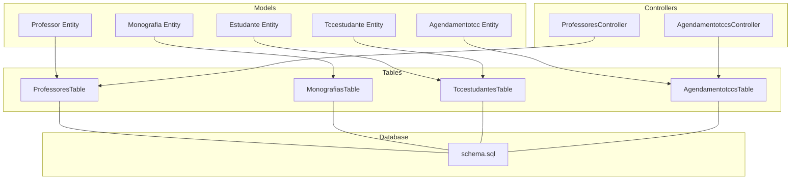
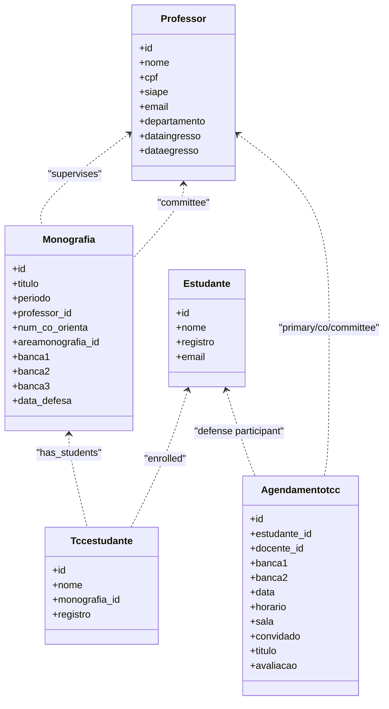
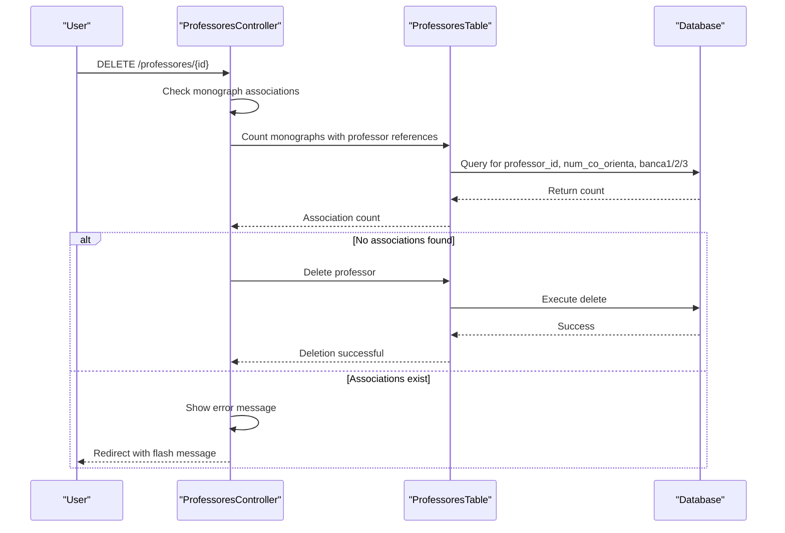
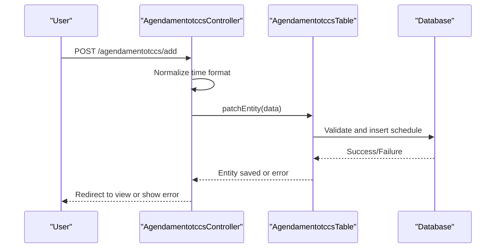
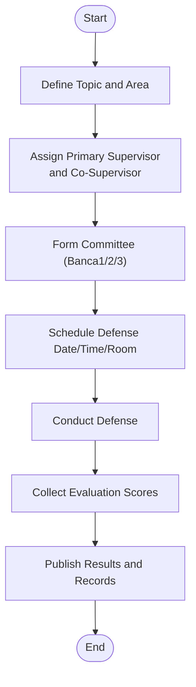
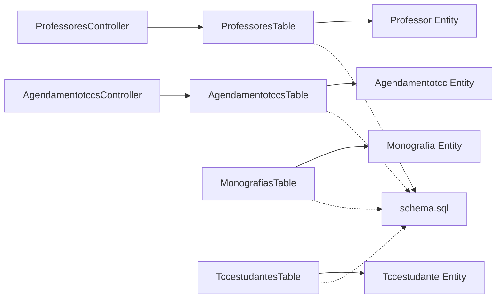

# Professor and Supervisor Management

<cite>
**Referenced Files in This Document**
- [Professor.php](file://src/Model/Entity/Professor.php)
- [Monografia.php](file://src/Model/Entity/Monografia.php)
- [Estudante.php](file://src/Model/Entity/Estudante.php)
- [Tccestudante.php](file://src/Model/Entity/Tccestudante.php)
- [Agendamentotcc.php](file://src/Model/Entity/Agendamentotcc.php)
- [ProfessoresTable.php](file://src/Model/Table/ProfessoresTable.php)
- [MonografiasTable.php](file://src/Model/Table/MonografiasTable.php)
- [TccestudantesTable.php](file://src/Model/Table/TccestudantesTable.php)
- [AgendamentotccsTable.php](file://src/Model/Table/AgendamentotccsTable.php)
- [ProfessoresController.php](file://src/Controller/ProfessoresController.php)
- [AgendamentotccsController.php](file://src/Controller/AgendamentotccsController.php)
- [schema.sql](file://config/Migrations/schema.sql)
</cite>

## Update Summary
**Changes Made**
- Complete removal of Docentes module - all teaching staff management now uses unified Professores system
- Removed all references to DocentesController, Docente entity, and DocentesTable throughout the application
- Updated all associations to use Professores instead of Docentes
- Simplified architecture with single source of truth for faculty data
- Enhanced delete validation to prevent orphaned references in monograph records
- Streamlined controller logic by eliminating internship-related functionality

## Table of Contents
1. [Introduction](#introduction)
2. [Project Structure](#project-structure)
3. [Core Components](#core-components)
4. [Architecture Overview](#architecture-overview)
5. [Detailed Component Analysis](#detailed-component-analysis)
6. [Dependency Analysis](#dependency-analysis)
7. [Performance Considerations](#performance-considerations)
8. [Troubleshooting Guide](#troubleshooting-guide)
9. [Conclusion](#conclusion)

## Introduction
This document explains how the system manages professors and supervisors for academic supervision through a unified Professores system. It covers faculty database administration, supervisor assignment workflows, committee member coordination, and evaluation score collection processes. The system has been streamlined to eliminate the previous dual-entity approach (Professor and Docente), now using a single Professor entity for all academic supervision functions including thesis/project supervision, committee membership, and defense scheduling.

## Project Structure
The application follows a simplified MVC structure with a unified faculty management system:
- Entities define data models and access rules for professors and related academic entities
- Tables define associations, validation, and integrity rules for the unified professor system
- Controllers handle HTTP requests, orchestrate business logic, and render views for professor management
- The schema defines the underlying database tables with the consolidated professor structure

**Diagram sources**
- [Professor.php:1-116](file://src/Model/Entity/Professor.php#L1-L116)
- [Monografia.php:1-74](file://src/Model/Entity/Monografia.php#L1-L74)
- [Estudante.php:1-66](file://src/Model/Entity/Estudante.php#L1-L66)
- [Tccestudante.php:1-36](file://src/Model/Entity/Tccestudante.php#L1-L36)
- [Agendamentotcc.php:1-56](file://src/Model/Entity/Agendamentotcc.php#L1-L56)
- [ProfessoresTable.php:1-244](file://src/Model/Table/ProfessoresTable.php#L1-L244)
- [MonografiasTable.php:1-190](file://src/Model/Table/MonografiasTable.php#L1-L190)
- [TccestudantesTable.php:1-100](file://src/Model/Table/TccestudantesTable.php#L1-L100)
- [AgendamentotccsTable.php:1-153](file://src/Model/Table/AgendamentotccsTable.php#L1-L153)
- [ProfessoresController.php:1-275](file://src/Controller/ProfessoresController.php#L1-L275)
- [AgendamentotccsController.php:1-228](file://src/Controller/AgendamentotccsController.php#L1-L228)
- [schema.sql:190-202](file://config/Migrations/schema.sql#L190-L202)

**Section sources**
- [schema.sql:190-202](file://config/Migrations/schema.sql#L190-L202)
- [schema.sql:437-456](file://config/Migrations/schema.sql#L437-L456)
- [schema.sql:32-45](file://config/Migrations/schema.sql#L32-L45)

## Core Components
- **Professor entity and table**: Represents faculty members with personal, academic, and employment details; serves as the single source of truth for all teaching staff information and is linked to users and monographs for academic supervision.
- **Monografia entity and table**: Represents a thesis/project with fields for title, period, area, defense date, and committee members (banca1, banca2, banca3), plus co-supervisor reference through professor_id and num_co_orienta fields.
- **Estudante entity**: Student records referenced by TCC enrollment.
- **Tccestudante entity and table**: Links students to monographs via registration number.
- **Agendamentotcc entity and table**: Schedules TCC defenses with student, primary supervisor, committee members, date/time, room, guest, title, and evaluation.

Key responsibilities:
- **Faculty database administration**: CRUD operations for professors through controllers and tables with comprehensive validation and authorization.
- **Supervisor assignment**: Stored in monograph fields (professor_id for primary supervisor, num_co_orienta for co-supervisor).
- **Committee formation**: banca1/banca2/banca3 fields link to professors for committee roles.
- **Scheduling and evaluation**: agendamentotccs store defense logistics and evaluation results.

**Section sources**
- [Professor.php:1-116](file://src/Model/Entity/Professor.php#L1-L116)
- [Monografia.php:1-74](file://src/Model/Entity/Monografia.php#L1-L74)
- [Estudante.php:1-66](file://src/Model/Entity/Estudante.php#L1-L66)
- [Tccestudante.php:1-36](file://src/Model/Entity/Tccestudante.php#L1-L36)
- [Agendamentotcc.php:1-56](file://src/Model/Entity/Agendamentotcc.php#L1-L56)
- [ProfessoresTable.php:35-52](file://src/Model/Table/ProfessoresTable.php#L35-L52)
- [MonografiasTable.php:41-100](file://src/Model/Table/MonografiasTable.php#L41-L100)
- [TccestudantesTable.php:34-57](file://src/Model/Table/TccestudantesTable.php#L34-L57)
- [AgendamentotccsTable.php:43-75](file://src/Model/Table/AgendamentotccsTable.php#L43-L75)

## Architecture Overview
The system uses CakePHP's ORM to model relationships between professors, monographs, students, and schedules through a unified faculty management approach. Controllers coordinate user interactions and persist changes via tables. The database schema enforces referential integrity and indexes for performance.

**Diagram sources**
- [Professor.php:1-116](file://src/Model/Entity/Professor.php#L1-L116)
- [Monografia.php:1-74](file://src/Model/Entity/Monografia.php#L1-L74)
- [Estudante.php:1-66](file://src/Model/Entity/Estudante.php#L1-L66)
- [Tccestudante.php:1-36](file://src/Model/Entity/Tccestudante.php#L1-L36)
- [Agendamentotcc.php:1-56](file://src/Model/Entity/Agendamentotcc.php#L1-L56)

## Detailed Component Analysis

### Faculty Database Administration (Unified Professores System)
- **ProfessoresController** provides index, view, add, edit, delete, and search functionality for professors. It enforces authorization and handles duplicate checks for siape and email during creation. The controller has been significantly simplified by removing all internship-related functionality and no longer loads or displays intern data.
- **ProfessoresTable** configures associations to Users and Monografias, enabling rich queries for profiles and workloads.
- **Enhanced delete validation**: Before deleting a professor, the system checks if they are still associated with any monographs as advisor, co-advisor, or committee member using OR conditions to check professor_id, num_co_orienta, banca1, banca2, and banca3 fields.

Implementation highlights:
- Duplicate prevention for siape and email when adding new faculty.
- Pagination and sorting for lists.
- Authorization gating for sensitive actions.
- Comprehensive null safety using nullsafe operator and improved error handling.
- **New**: Robust deletion protection preventing orphaned references in monograph records.

**Section sources**
- [ProfessoresController.php:37-52](file://src/Controller/ProfessoresController.php#L37-L52)
- [ProfessoresController.php:61-101](file://src/Controller/ProfessoresController.php#L61-L101)
- [ProfessoresController.php:108-174](file://src/Controller/ProfessoresController.php#L108-L174)
- [ProfessoresController.php:183-199](file://src/Controller/ProfessoresController.php#L183-L199)
- [ProfessoresController.php:208-252](file://src/Controller/ProfessoresController.php#L208-L252)
- [ProfessoresTable.php:35-52](file://src/Model/Table/ProfessoresTable.php#L35-L52)

### Supervisor Assignment Workflow
- **Supervisor assignment** is represented by monograph fields:
  - `professor_id`: primary supervisor
  - `num_co_orienta`: co-supervisor
- **MonografiasTable** defines associations to Professores for both primary and co-supervisor roles, enabling retrieval of supervisor details alongside monograph data.
- Validation ensures professor_id exists in Professores and areamonografia_id exists in Areamonografias.

Workflow overview:
- Create or update a monograph record with supervisor(s) selected from the professor list.
- System validates references to ensure integrity.
- Views can display supervisor information via associated Professor entities.

**Section sources**
- [Monografia.php:1-74](file://src/Model/Entity/Monografia.php#L1-L74)
- [MonografiasTable.php:55-66](file://src/Model/Table/MonografiasTable.php#L55-L66)
- [MonografiasTable.php:182-188](file://src/Model/Table/MonografiasTable.php#L182-L188)
- [schema.sql:437-456](file://config/Migrations/schema.sql#L437-L456)

### Committee Member Coordination
- **Committee members** are stored as banca1, banca2, banca3 in the monograph table, each referencing a professor.
- **MonografiasTable** defines separate associations for each banca slot to load committee member details efficiently.
- **ProfessoresTable** exposes relationships back to monographs via these slots, allowing counting and listing of committee assignments per professor.

Coordination process:
- When creating/editing a monograph, select committee members from available professors.
- System validates foreign keys to ensure valid committee members.
- Views can show full committee composition and related monographs per professor.

**Section sources**
- [Monografia.php:1-74](file://src/Model/Entity/Monografia.php#L1-L74)
- [MonografiasTable.php:68-84](file://src/Model/Table/MonografiasTable.php#L68-L84)
- [schema.sql:437-456](file://config/Migrations/schema.sql#L437-L456)

### Enhanced Delete Validation and Data Integrity
**New Section**: The Professor controller includes comprehensive validation before deletion to prevent orphaned references in monograph records.

Delete validation process:
- Before deleting a professor, the system checks if they are still associated with any monographs as advisor, co-advisor, or committee member.
- Uses OR conditions to check professor_id, num_co_orienta, banca1, banca2, and banca3 fields.
- If any associations exist, deletion is prevented with appropriate error messaging.
- Provides clear feedback about the number of associated monographs preventing deletion.

**Diagram sources**
- [ProfessoresController.php:208-252](file://src/Controller/ProfessoresController.php#L208-L252)
- [ProfessoresTable.php:44-47](file://src/Model/Table/ProfessoresTable.php#L44-L47)

**Section sources**
- [ProfessoresController.php:208-252](file://src/Controller/ProfessoresController.php#L208-L252)
- [ProfessoresTable.php:44-47](file://src/Model/Table/ProfessoresTable.php#L44-L47)

### Scheduling and Evaluation Score Collection
- **Agendamentotccs** represent scheduled TCC defenses with fields for student, primary supervisor, committee members, date/time, room, guest, title, and evaluation result.
- **AgendamentotccsTable** defines associations to Estudantes and Professores (including banca1/banca2) and enforces presence/validation for required fields.
- **AgendamentotccsController** handles create/update flows, normalizes time format, and persists schedules.

Evaluation flow:
- Schedule a defense with all participants and a chosen date/time.
- After the defense, update the avaliacao field to capture the outcome.
- List and view screens provide full context including student and committee details.

**Diagram sources**
- [AgendamentotccsController.php:96-139](file://src/Controller/AgendamentotccsController.php#L96-L139)
- [AgendamentotccsTable.php:83-131](file://src/Model/Table/AgendamentotccsTable.php#L83-L131)
- [schema.sql:32-45](file://config/Migrations/schema.sql#L32-L45)

**Section sources**
- [Agendamentotcc.php:1-56](file://src/Model/Entity/Agendamentotcc.php#L1-L56)
- [AgendamentotccsTable.php:43-75](file://src/Model/Table/AgendamentotccsTable.php#L43-L75)
- [AgendamentotccsTable.php:83-131](file://src/Model/Table/AgendamentotccsTable.php#L83-L131)
- [AgendamentotccsController.php:96-139](file://src/Controller/AgendamentotccsController.php#L96-L139)
- [schema.sql:32-45](file://config/Migrations/schema.sql#L32-L45)

### Student-Monograph Enrollment
- **Tccestudante** links students to monographs using registration numbers.
- **TccestudantesTable** associates with Monografias and optionally with Estudantes via registro.
- **MonografiasTable** has a one-to-many relationship to Tccestudantes, enabling retrieval of enrolled students per monograph.

Enrollment workflow:
- Create a Tccestudante entry linking a student (by registro) to a monograph.
- System validates existence of monograph and student records.
- Views can list students per monograph and monographs per student.

**Section sources**
- [Tccestudante.php:1-36](file://src/Model/Entity/Tccestudante.php#L1-L36)
- [TccestudantesTable.php:34-57](file://src/Model/Table/TccestudantesTable.php#L34-L57)
- [TccestudantesTable.php:91-96](file://src/Model/Table/TccestudantesTable.php#L91-L96)
- [MonografiasTable.php:93-99](file://src/Model/Table/MonografiasTable.php#L93-L99)
- [schema.sql:617-626](file://config/Migrations/schema.sql#L617-L626)

### Conceptual Overview
The following conceptual diagram illustrates the end-to-end supervision lifecycle through the unified professor system:

[No sources needed since this diagram shows conceptual workflow, not actual code structure]

## Dependency Analysis
The core dependencies among components are streamlined through the unified professor system:
- Controllers depend on Tables for persistence and validation.
- Tables define associations to other Tables and enforce referential integrity.
- Entities expose accessible fields and relationships for ORM usage.
- Schema defines the physical structure and constraints.

**Diagram sources**
- [ProfessoresController.php:1-275](file://src/Controller/ProfessoresController.php#L1-L275)
- [AgendamentotccsController.php:1-228](file://src/Controller/AgendamentotccsController.php#L1-L228)
- [ProfessoresTable.php:1-244](file://src/Model/Table/ProfessoresTable.php#L1-L244)
- [MonografiasTable.php:1-190](file://src/Model/Table/MonografiasTable.php#L1-L190)
- [TccestudantesTable.php:1-100](file://src/Model/Table/TccestudantesTable.php#L1-L100)
- [AgendamentotccsTable.php:1-153](file://src/Model/Table/AgendamentotccsTable.php#L1-L153)
- [schema.sql:437-456](file://config/Migrations/schema.sql#L437-L456)

**Section sources**
- [ProfessoresTable.php:35-52](file://src/Model/Table/ProfessoresTable.php#L35-L52)
- [MonografiasTable.php:41-100](file://src/Model/Table/MonografiasTable.php#L41-L100)
- [TccestudantesTable.php:34-57](file://src/Model/Table/TccestudantesTable.php#L34-L57)
- [AgendamentotccsTable.php:43-75](file://src/Model/Table/AgendamentotccsTable.php#L43-L75)

## Performance Considerations
- Use pagination and selective contains to avoid loading excessive associations in controller views.
- Leverage CounterCache behavior on MonografiasTable to maintain counts on related areas for faster listing.
- Ensure proper indexing on frequently queried columns (e.g., professor_id, banca1/2/3, estudante_id) as defined in the schema.
- Avoid unnecessary memory spikes by limiting deep joins; prefer targeted queries in controllers.
- **Updated**: Simplified controller logic reduces overhead by eliminating internship-related data loading operations and consolidating faculty management into a single system.

## Troubleshooting Guide
Common issues and resolutions:
- **Duplicate siape/email when adding professors**: Controllers check for existing records and redirect with error messages.
- **Missing required fields in schedules**: Validation rules enforce presence of date, time, room, title, and committee members.
- **Referential integrity errors**: RulesChecker ensures foreign keys exist before saving; fix invalid IDs in forms.
- **Not found exceptions**: Controllers catch missing records and redirect with flash messages.
- **New**: Professor deletion blocked due to active monograph associations: Check if professor is still serving as advisor, co-advisor, or committee member before attempting deletion.

Operational tips:
- Verify association names and foreign keys match schema definitions.
- Check validationDefault methods for required fields and formats.
- Inspect controller error handling paths for user feedback and redirects.
- **Enhanced**: Utilize improved null safety patterns and better error handling throughout the application.

**Section sources**
- [ProfessoresController.php:108-174](file://src/Controller/ProfessoresController.php#L108-L174)
- [AgendamentotccsTable.php:83-131](file://src/Model/Table/AgendamentotccsTable.php#L83-L131)
- [AgendamentotccsTable.php:141-148](file://src/Model/Table/AgendamentotccsTable.php#L141-L148)
- [AgendamentotccsController.php:74-89](file://src/Controller/AgendamentotccsController.php#L74-L89)
- [ProfessoresController.php:208-252](file://src/Controller/ProfessoresController.php#L208-L252)

## Conclusion
The system provides robust mechanisms for managing professors and supervisors through a unified Professores system, assigning supervision roles, forming committees, scheduling defenses, and collecting evaluations. The complete removal of the Docentes module has streamlined the architecture, eliminating complexity while maintaining all essential functionality. The enhanced delete validation prevents orphaned references and maintains data integrity. The separation of concerns across entities, tables, and controllers ensures clear responsibilities and maintainability. By leveraging CakePHP's ORM features and schema-defined constraints, the application supports reliable academic supervision workflows while offering extensibility for future enhancements such as advanced workload balancing and automated conflict detection.