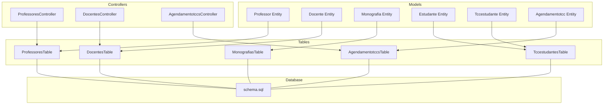
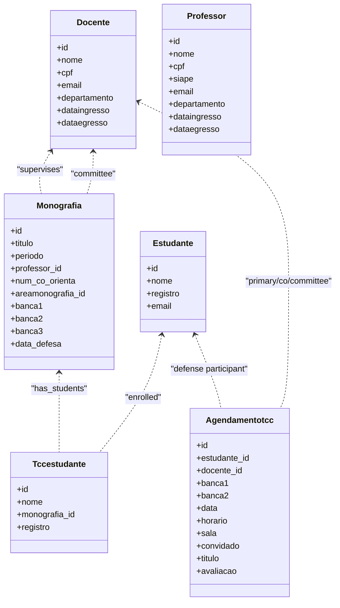
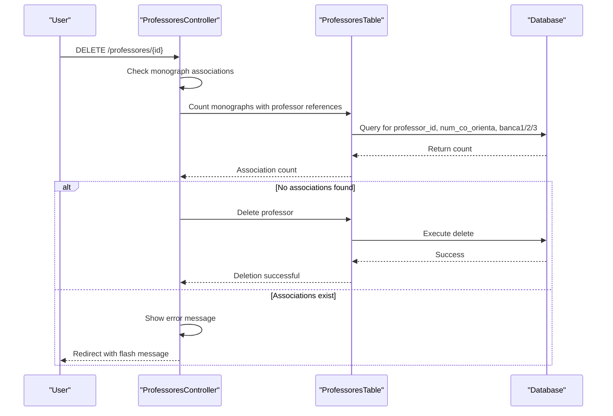
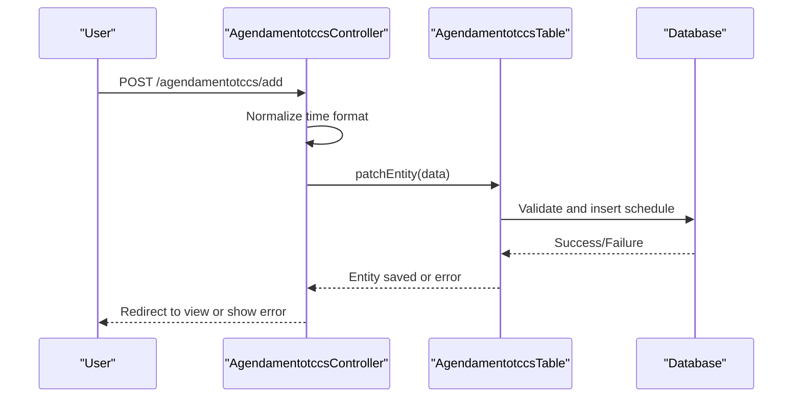
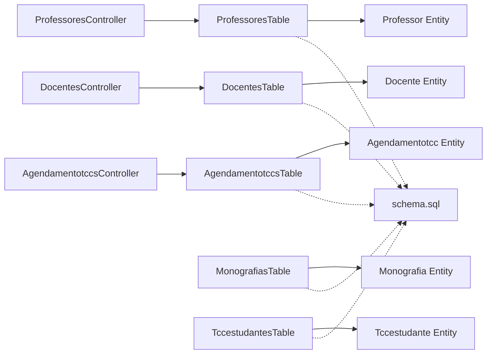

# Professor and Supervisor Management

<cite>
**Referenced Files in This Document**
- [Professor.php](file://src/Model/Entity/Professor.php)
- [Docente.php](file://src/Model/Entity/Docente.php)
- [Monografia.php](file://src/Model/Entity/Monografia.php)
- [Estudante.php](file://src/Model/Entity/Estudante.php)
- [Tccestudante.php](file://src/Model/Entity/Tccestudante.php)
- [Agendamentotcc.php](file://src/Model/Entity/Agendamentotcc.php)
- [ProfessoresTable.php](file://src/Model/Table/ProfessoresTable.php)
- [DocentesTable.php](file://src/Model/Table/DocentesTable.php)
- [MonografiasTable.php](file://src/Model/Table/MonografiasTable.php)
- [TccestudantesTable.php](file://src/Model/Table/TccestudantesTable.php)
- [AgendamentotccsTable.php](file://src/Model/Table/AgendamentotccsTable.php)
- [ProfessoresController.php](file://src/Controller/ProfessoresController.php)
- [DocentesController.php](file://src/Controller/DocentesController.php)
- [AgendamentotccsController.php](file://src/Controller/AgendamentotccsController.php)
- [schema.sql](file://config/Migrations/schema.sql)
</cite>

## Update Summary
**Changes Made**
- Updated Professor controller section to reflect removal of internship-related functionality
- Enhanced delete validation section with new monograph association checks
- Improved null safety and error handling documentation
- Removed references to internship (estagiarios) data loading and display
- Updated workflow descriptions to focus solely on academic supervision

## Table of Contents
1. [Introduction](#introduction)
2. [Project Structure](#project-structure)
3. [Core Components](#core-components)
4. [Architecture Overview](#architecture-overview)
5. [Detailed Component Analysis](#detailed-component-analysis)
6. [Dependency Analysis](#dependency-analysis)
7. [Performance Considerations](#performance-considerations)
8. [Troubleshooting Guide](#troubleshooting-guide)
9. [Conclusion](#conclusion)

## Introduction
This document explains how the system manages professors and supervisors for academic supervision, including faculty database administration, supervisor assignment workflows, committee member coordination, and evaluation score collection. It focuses on the Professor and Docente entities, their relationships with students and monographs, and the scheduling and evaluation processes that support TCC (Thesis/Project) activities. **Updated**: The Professor controller has been significantly simplified by removing all internship-related functionality, focusing exclusively on academic supervision management.

## Project Structure
The application follows a typical MVC structure:
- Entities define data models and access rules.
- Tables define associations, validation, and integrity rules.
- Controllers handle HTTP requests, orchestrate business logic, and render views.
- The schema defines the underlying database tables and relationships.

**Diagram sources**
- [Professor.php:1-116](file://src/Model/Entity/Professor.php#L1-L116)
- [Docente.php:1-107](file://src/Model/Entity/Docente.php#L1-L107)
- [Monografia.php:1-73](file://src/Model/Entity/Monografia.php#L1-L73)
- [Estudante.php:1-66](file://src/Model/Entity/Estudante.php#L1-L66)
- [Tccestudante.php:1-36](file://src/Model/Entity/Tccestudante.php#L1-L36)
- [Agendamentotcc.php:1-56](file://src/Model/Entity/Agendamentotcc.php#L1-L56)
- [ProfessoresTable.php:1-244](file://src/Model/Table/ProfessoresTable.php#L1-L244)
- [DocentesTable.php:1-272](file://src/Model/Table/DocentesTable.php#L1-L272)
- [MonografiasTable.php:1-190](file://src/Model/Table/MonografiasTable.php#L1-L190)
- [TccestudantesTable.php:1-100](file://src/Model/Table/TccestudantesTable.php#L1-L100)
- [AgendamentotccsTable.php:1-152](file://src/Model/Table/AgendamentotccsTable.php#L1-L152)
- [ProfessoresController.php:1-275](file://src/Controller/ProfessoresController.php#L1-L275)
- [DocentesController.php:1-190](file://src/Controller/DocentesController.php#L1-L190)
- [AgendamentotccsController.php:1-230](file://src/Controller/AgendamentotccsController.php#L1-L230)
- [schema.sql:437-456](file://config/Migrations/schema.sql#L437-L456)

**Section sources**
- [schema.sql:437-456](file://config/Migrations/schema.sql#L437-L456)
- [schema.sql:617-626](file://config/Migrations/schema.sql#L617-L626)
- [schema.sql:32-45](file://config/Migrations/schema.sql#L32-L45)

## Core Components
- Professor entity and table: Represents faculty members with personal, academic, and employment details; linked to users and monographs for academic supervision. **Updated**: No longer includes internship (estagiarios) associations.
- Docente entity and table: Unified view over the same professor table used for supervision and committee roles; includes many-to-many with research areas and one-to-many with scheduled defenses.
- Monografia entity and table: Represents a thesis/project with fields for title, period, area, defense date, and committee members (banca1, banca2, banca3), plus co-supervisor reference.
- Estudante entity: Student records referenced by TCC enrollment.
- Tccestudante entity and table: Links students to monographs via registration number.
- Agendamentotcc entity and table: Schedules TCC defenses with student, primary supervisor, committee members, date/time, room, guest, title, and evaluation.

Key responsibilities:
- Faculty database administration: CRUD operations for professors/docentes through controllers and tables.
- Supervisor assignment: Stored in monograph fields (professor_id, num_co_orienta).
- Committee formation: banca1/banca2/banca3 fields link to docentes.
- Scheduling and evaluation: agendamentotccs store defense logistics and evaluation results.

**Section sources**
- [Professor.php:1-116](file://src/Model/Entity/Professor.php#L1-L116)
- [Docente.php:1-107](file://src/Model/Entity/Docente.php#L1-L107)
- [Monografia.php:1-73](file://src/Model/Entity/Monografia.php#L1-L73)
- [Estudante.php:1-66](file://src/Model/Entity/Estudante.php#L1-L66)
- [Tccestudante.php:1-36](file://src/Model/Entity/Tccestudante.php#L1-L36)
- [Agendamentotcc.php:1-56](file://src/Model/Entity/Agendamentotcc.php#L1-L56)
- [ProfessoresTable.php:35-52](file://src/Model/Table/ProfessoresTable.php#L35-L52)
- [DocentesTable.php:36-78](file://src/Model/Table/DocentesTable.php#L36-L78)
- [MonografiasTable.php:41-100](file://src/Model/Table/MonografiasTable.php#L41-L100)
- [TccestudantesTable.php:34-57](file://src/Model/Table/TccestudantesTable.php#L34-L57)
- [AgendamentotccsTable.php:43-75](file://src/Model/Table/AgendamentotccsTable.php#L43-L75)

## Architecture Overview
The system uses CakePHP's ORM to model relationships between professors/docentes, monographs, students, and schedules. Controllers coordinate user interactions and persist changes via tables. The database schema enforces referential integrity and indexes for performance.

**Diagram sources**
- [Docente.php:1-107](file://src/Model/Entity/Docente.php#L1-L107)
- [Professor.php:1-116](file://src/Model/Entity/Professor.php#L1-L116)
- [Monografia.php:1-73](file://src/Model/Entity/Monografia.php#L1-L73)
- [Estudante.php:1-66](file://src/Model/Entity/Estudante.php#L1-L66)
- [Tccestudante.php:1-36](file://src/Model/Entity/Tccestudante.php#L1-L36)
- [Agendamentotcc.php:1-56](file://src/Model/Entity/Agendamentotcc.php#L1-L56)

## Detailed Component Analysis

### Faculty Database Administration (Professors and Docentes)
- ProfessoresController provides index, view, add, edit, delete, and search for professors. It enforces authorization and handles duplicate checks for siape and email during creation. **Updated**: Significantly simplified by removing all internship-related functionality and no longer loads or displays intern (Estagiarios) data.
- DocentesController mirrors similar CRUD operations for docentes, which map to the same underlying table but are used in supervision contexts.
- ProfessoresTable and DocentesTable configure associations to Users, Monografias, and research areas, enabling rich queries for profiles and workloads.

Implementation highlights:
- Duplicate prevention for siape and email when adding new faculty.
- Pagination and sorting for lists.
- Authorization gating for sensitive actions.
- **Enhanced**: Better null safety using nullsafe operator and improved error handling throughout the controller methods.

**Section sources**
- [ProfessoresController.php:37-52](file://src/Controller/ProfessoresController.php#L37-L52)
- [ProfessoresController.php:61-101](file://src/Controller/ProfessoresController.php#L61-L101)
- [ProfessoresController.php:108-174](file://src/Controller/ProfessoresController.php#L108-L174)
- [ProfessoresController.php:183-199](file://src/Controller/ProfessoresController.php#L183-L199)
- [DocentesController.php:41-84](file://src/Controller/DocentesController.php#L41-L84)
- [DocentesController.php:91-130](file://src/Controller/DocentesController.php#L91-L130)
- [DocentesController.php:139-188](file://src/Controller/DocentesController.php#L139-L188)
- [ProfessoresTable.php:35-52](file://src/Model/Table/ProfessoresTable.php#L35-L52)
- [DocentesTable.php:36-78](file://src/Model/Table/DocentesTable.php#L36-L78)

### Supervisor Assignment Workflow
- Supervisor assignment is represented by monograph fields:
  - professor_id: primary supervisor
  - num_co_orienta: co-supervisor
- MonografiasTable defines associations to Docente for both primary and co-supervisor, enabling retrieval of supervisor details alongside monograph data.
- Validation ensures professor_id exists in Docentes and areamonografia_id exists in Areamonografias.

Workflow overview:
- Create or update a monograph record with supervisor(s) selected from the docente list.
- System validates references to ensure integrity.
- Views can display supervisor information via associated Docente entities.

**Section sources**
- [Monografia.php:1-73](file://src/Model/Entity/Monografia.php#L1-L73)
- [MonografiasTable.php:55-66](file://src/Model/Table/MonografiasTable.php#L55-L66)
- [MonografiasTable.php:182-188](file://src/Model/Table/MonografiasTable.php#L182-L188)
- [schema.sql:437-456](file://config/Migrations/schema.sql#L437-L456)

### Committee Member Coordination
- Committee members are stored as banca1, banca2, banca3 in the monograph table, each referencing a docente.
- MonografiasTable defines separate associations for each banca slot to load committee member details efficiently.
- DocentesTable exposes relationships back to monographs via these slots, allowing counting and listing of committee assignments per docente.

Coordination process:
- When creating/editing a monograph, select committee members from available docentes.
- System validates foreign keys to ensure valid committee members.
- Views can show full committee composition and related monographs per docente.

**Section sources**
- [Monografia.php:1-73](file://src/Model/Entity/Monografia.php#L1-L73)
- [MonografiasTable.php:68-84](file://src/Model/Table/MonografiasTable.php#L68-L84)
- [DocentesTable.php:54-67](file://src/Model/Table/DocentesTable.php#L54-L67)
- [schema.sql:437-456](file://config/Migrations/schema.sql#L437-L456)

### Enhanced Delete Validation and Data Integrity
**New Section**: The Professor controller now includes comprehensive validation before deletion to prevent orphaned references in monograph records.

Delete validation process:
- Before deleting a professor, the system checks if they are still associated with any monographs as advisor, co-advisor, or committee member.
- Uses OR conditions to check professor_id, num_co_orienta, banca1, banca2, and banca3 fields.
- If any associations exist, deletion is prevented with appropriate error messaging.
- Provides clear feedback about the number of associated monographs preventing deletion.

**Diagram sources**
- [ProfessoresController.php:208-252](file://src/Controller/ProfessoresController.php#L208-L252)
- [ProfessoresTable.php:44-47](file://src/Model/Table/ProfessoresTable.php#L44-L47)

**Section sources**
- [ProfessoresController.php:208-252](file://src/Controller/ProfessoresController.php#L208-L252)
- [ProfessoresTable.php:44-47](file://src/Model/Table/ProfessoresTable.php#L44-L47)

### Scheduling and Evaluation Score Collection
- Agendamentotccs represent scheduled TCC defenses with fields for student, primary supervisor, committee members, date/time, room, guest, title, and evaluation result.
- AgendamentotccsTable defines associations to Estudantes and Docentes (including banca1/banca2) and enforces presence/validation for required fields.
- AgendamentotccsController handles create/update flows, normalizes time format, and persists schedules.

Evaluation flow:
- Schedule a defense with all participants and a chosen date/time.
- After the defense, update the avaliacao field to capture the outcome.
- List and view screens provide full context including student and committee details.

**Diagram sources**
- [AgendamentotccsController.php:96-139](file://src/Controller/AgendamentotccsController.php#L96-L139)
- [AgendamentotccsTable.php:83-131](file://src/Model/Table/AgendamentotccsTable.php#L83-L131)
- [schema.sql:32-45](file://config/Migrations/schema.sql#L32-L45)

**Section sources**
- [Agendamentotcc.php:1-56](file://src/Model/Entity/Agendamentotcc.php#L1-L56)
- [AgendamentotccsTable.php:43-75](file://src/Model/Table/AgendamentotccsTable.php#L43-L75)
- [AgendamentotccsTable.php:83-131](file://src/Model/Table/AgendamentotccsTable.php#L83-L131)
- [AgendamentotccsController.php:96-139](file://src/Controller/AgendamentotccsController.php#L96-L139)
- [schema.sql:32-45](file://config/Migrations/schema.sql#L32-L45)

### Student-Monograph Enrollment
- Tccestudante links students to monographs using registration numbers.
- TccestudantesTable associates with Monografias and optionally with Estudantes via registro.
- MonografiasTable has a one-to-many relationship to Tccestudantes, enabling retrieval of enrolled students per monograph.

Enrollment workflow:
- Create a Tccestudante entry linking a student (by registro) to a monograph.
- System validates existence of monograph and student records.
- Views can list students per monograph and monographs per student.

**Section sources**
- [Tccestudante.php:1-36](file://src/Model/Entity/Tccestudante.php#L1-L36)
- [TccestudantesTable.php:34-57](file://src/Model/Table/TccestudantesTable.php#L34-L57)
- [TccestudantesTable.php:91-96](file://src/Model/Table/TccestudantesTable.php#L91-L96)
- [MonografiasTable.php:93-99](file://src/Model/Table/MonografiasTable.php#L93-L99)
- [schema.sql:617-626](file://config/Migrations/schema.sql#L617-L626)

### Conceptual Overview
The following conceptual diagram illustrates the end-to-end supervision lifecycle without mapping to specific code:

[No sources needed since this diagram shows conceptual workflow, not actual code structure]

## Dependency Analysis
The core dependencies among components are:
- Controllers depend on Tables for persistence and validation.
- Tables define associations to other Tables and enforce referential integrity.
- Entities expose accessible fields and relationships for ORM usage.
- Schema defines the physical structure and constraints.

**Diagram sources**
- [ProfessoresController.php:1-275](file://src/Controller/ProfessoresController.php#L1-L275)
- [DocentesController.php:1-190](file://src/Controller/DocentesController.php#L1-L190)
- [AgendamentotccsController.php:1-230](file://src/Controller/AgendamentotccsController.php#L1-L230)
- [ProfessoresTable.php:1-244](file://src/Model/Table/ProfessoresTable.php#L1-L244)
- [DocentesTable.php:1-272](file://src/Model/Table/DocentesTable.php#L1-L272)
- [MonografiasTable.php:1-190](file://src/Model/Table/MonografiasTable.php#L1-L190)
- [TccestudantesTable.php:1-100](file://src/Model/Table/TccestudantesTable.php#L1-L100)
- [AgendamentotccsTable.php:1-152](file://src/Model/Table/AgendamentotccsTable.php#L1-L152)
- [schema.sql:437-456](file://config/Migrations/schema.sql#L437-L456)

**Section sources**
- [ProfessoresTable.php:35-52](file://src/Model/Table/ProfessoresTable.php#L35-L52)
- [DocentesTable.php:36-78](file://src/Model/Table/DocentesTable.php#L36-L78)
- [MonografiasTable.php:41-100](file://src/Model/Table/MonografiasTable.php#L41-L100)
- [TccestudantesTable.php:34-57](file://src/Model/Table/TccestudantesTable.php#L34-L57)
- [AgendamentotccsTable.php:43-75](file://src/Model/Table/AgendamentotccsTable.php#L43-L75)

## Performance Considerations
- Use pagination and selective contains to avoid loading excessive associations in controller views.
- Leverage CounterCache behavior on MonografiasTable to maintain counts on related areas for faster listing.
- Ensure proper indexing on frequently queried columns (e.g., professor_id, banca1/2/3, estudante_id) as defined in the schema.
- Avoid unnecessary memory spikes by limiting deep joins; prefer targeted queries in controllers.
- **Updated**: Simplified controller logic reduces overhead by eliminating internship-related data loading operations.

[No sources needed since this section provides general guidance]

## Troubleshooting Guide
Common issues and resolutions:
- Duplicate siape/email when adding professors: Controllers check for existing records and redirect with error messages.
- Missing required fields in schedules: Validation rules enforce presence of date, time, room, title, and committee members.
- Referential integrity errors: RulesChecker ensures foreign keys exist before saving; fix invalid IDs in forms.
- Not found exceptions: Controllers catch missing records and redirect with flash messages.
- **New**: Professor deletion blocked due to active monograph associations: Check if professor is still serving as advisor, co-advisor, or committee member before attempting deletion.

Operational tips:
- Verify association names and foreign keys match schema definitions.
- Check validationDefault methods for required fields and formats.
- Inspect controller error handling paths for user feedback and redirects.
- **Enhanced**: Utilize improved null safety patterns and better error handling throughout the application.

**Section sources**
- [ProfessoresController.php:108-174](file://src/Controller/ProfessoresController.php#L108-L174)
- [DocentesController.php:91-130](file://src/Controller/DocentesController.php#L91-L130)
- [AgendamentotccsTable.php:83-131](file://src/Model/Table/AgendamentotccsTable.php#L83-L131)
- [AgendamentotccsTable.php:141-148](file://src/Model/Table/AgendamentotccsTable.php#L141-L148)
- [AgendamentotccsController.php:74-89](file://src/Controller/AgendamentotccsController.php#L74-L89)
- [ProfessoresController.php:208-252](file://src/Controller/ProfessoresController.php#L208-L252)

## Conclusion
The system provides robust mechanisms for managing professors and supervisors, assigning supervision roles, forming committees, scheduling defenses, and collecting evaluations. **Updated**: The Professor controller has been significantly streamlined by removing all internship-related functionality, focusing exclusively on academic supervision management. The enhanced delete validation prevents orphaned references and maintains data integrity. The separation of concerns across entities, tables, and controllers ensures clear responsibilities and maintainability. By leveraging CakePHP's ORM features and schema-defined constraints, the application supports reliable academic supervision workflows while offering extensibility for future enhancements such as advanced workload balancing and automated conflict detection.

[No sources needed since this section summarizes without analyzing specific files]