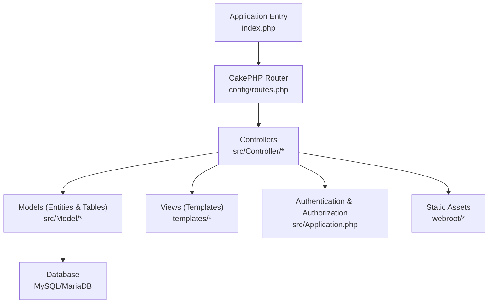
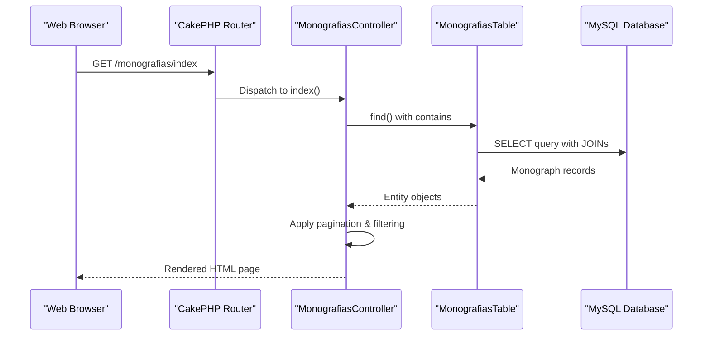
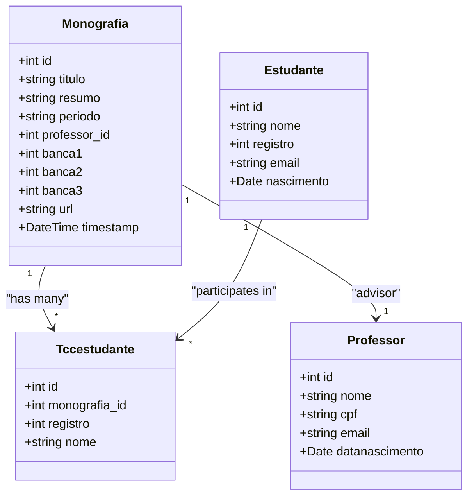
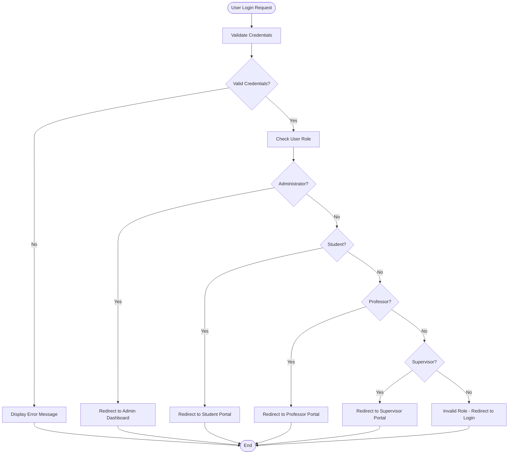
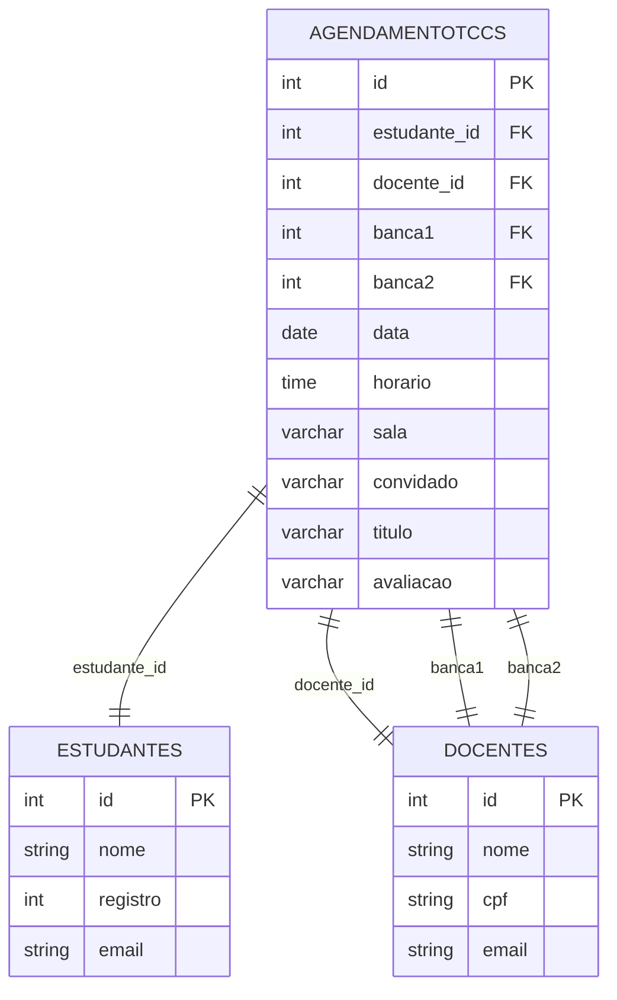
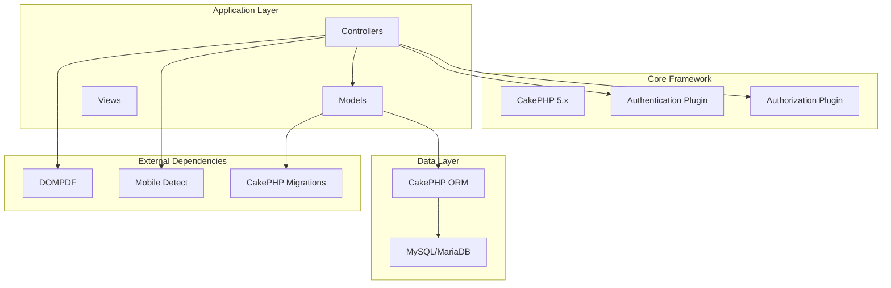

# Project Overview

<cite>
**Referenced Files in This Document**
- [README.md](file://README.md)
- [composer.json](file://composer.json)
- [config/app.php](file://config/app.php)
- [src/Application.php](file://src/Application.php)
- [config/routes.php](file://config/routes.php)
- [src/Controller/MonografiasController.php](file://src/Controller/MonografiasController.php)
- [src/Controller/UsersController.php](file://src/Controller/UsersController.php)
- [src/Controller/AgendamentotccsController.php](file://src/Controller/AgendamentotccsController.php)
- [src/Model/Entity/Monografia.php](file://src/Model/Entity/Monografia.php)
- [src/Model/Entity/Estudante.php](file://src/Model/Entity/Estudante.php)
- [src/Model/Entity/Professor.php](file://src/Model/Entity/Professor.php)
- [src/Model/Entity/User.php](file://src/Model/Entity/User.php)
- [src/Model/Entity/Agendamentotcc.php](file://src/Model/Entity/Agendamentotcc.php)
- [config/Migrations/schema.sql](file://config/Migrations/schema.sql)
</cite>

## Table of Contents
1. [Introduction](#introduction)
2. [Project Structure](#project-structure)
3. [Core Components](#core-components)
4. [Architecture Overview](#architecture-overview)
5. [Detailed Component Analysis](#detailed-component-analysis)
6. [Dependency Analysis](#dependency-analysis)
7. [Performance Considerations](#performance-considerations)
8. [Troubleshooting Guide](#troubleshooting-guide)
9. [Conclusion](#conclusion)

## Introduction
TCC5 is an Academic Management System designed for Brazilian educational institutions to coordinate thesis defense (TCC) processes. It centralizes monograph management, student-supervisor relationships, and defense scheduling while providing secure user authentication for students, professors, supervisors, and administrators. The system follows the MVC pattern using CakePHP 5.x with PHP 8.1+ and MySQL/MariaDB, enabling structured development, clear separation of concerns, and maintainable code.

Target audience:
- Students: register monographs, view schedules, and access documents
- Professors/Supervisors: manage monographs, advise students, and participate in juries
- Administrators: configure users, areas, and system settings

Key benefits:
- Streamlined workflow from monograph registration to defense scheduling
- Role-based access control and secure authentication
- Centralized repository for monograph PDFs and metadata
- Scalable architecture aligned with modern PHP frameworks

System requirements:
- PHP 8.1+
- MySQL or MariaDB
- CakePHP 5.x framework
- Composer for dependency management

[No sources needed since this section provides a high-level overview]

## Project Structure
The project follows a standard CakePHP 5 application layout:
- src/: Application source code (Controllers, Models, Views, Policies, etc.)
- templates/: View templates organized by controller
- config/: Framework configuration, routes, migrations, and environment settings
- webroot/: Public assets (CSS, JS, images)
- tests/: Unit and integration tests
- vendor/: Third-party dependencies managed by Composer

**Diagram sources**
- [config/routes.php:48-87](file://config/routes.php#L48-L87)
- [src/Application.php:91-113](file://src/Application.php#L91-L113)
- [config/app.php:261-327](file://config/app.php#L261-L327)

**Section sources**
- [composer.json:1-64](file://composer.json#L1-L64)
- [config/app.php:50-69](file://config/app.php#L50-L69)
- [config/routes.php:48-87](file://config/routes.php#L48-L87)

## Core Components
The TCC5 system revolves around several core components that implement the academic workflow:

Monograph Management:
- CRUD operations for monograph records including title, abstract, period, advisor, and jury members
- PDF upload and storage for monograph documents
- Association with students and research areas

Student-Supervisor Relationships:
- Linking students to monographs through junction tables
- Managing advisor and co-advisor assignments
- Tracking student participation in multiple monographs

Defense Scheduling:
- Creating and managing defense appointments with date, time, room, and jury composition
- Associating students, advisors, and jury members with specific defense sessions

User Authentication and Authorization:
- Secure login/logout functionality with role-based access control
- Password hashing and session management
- Policy-based authorization for resource access

**Section sources**
- [src/Controller/MonografiasController.php:46-170](file://src/Controller/MonografiasController.php#L46-L170)
- [src/Controller/UsersController.php:34-156](file://src/Controller/UsersController.php#L34-L156)
- [src/Controller/AgendamentotccsController.php:33-139](file://src/Controller/AgendamentotccsController.php#L33-L139)
- [src/Model/Entity/User.php:52-58](file://src/Model/Entity/User.php#L52-L58)

## Architecture Overview
TCC5 implements the Model-View-Controller (MVC) architectural pattern using CakePHP 5.x:

- **Model Layer**: Entity classes define data structures and behaviors, while Table classes handle database operations and business logic
- **View Layer**: Template files render user interfaces with data from controllers
- **Controller Layer**: Handle HTTP requests, process business logic, and coordinate between models and views

The application uses middleware for authentication and authorization, ensuring secure access to protected resources. Database connections are configured through CakePHP's ORM with support for MySQL/MariaDB.

**Diagram sources**
- [config/routes.php:72-87](file://config/routes.php#L72-L87)
- [src/Controller/MonografiasController.php:46-75](file://src/Controller/MonografiasController.php#L46-L75)
- [config/app.php:261-327](file://config/app.php#L261-L327)

**Section sources**
- [src/Application.php:52-113](file://src/Application.php#L52-L113)
- [config/app.php:261-327](file://config/app.php#L261-L327)

## Detailed Component Analysis

### Monograph Management System
The monograph management component handles the complete lifecycle of academic papers, from creation to publication.

**Diagram sources**
- [src/Model/Entity/Monografia.php:11-33](file://src/Model/Entity/Monografia.php#L11-L33)
- [src/Model/Entity/Estudante.php:9-31](file://src/Model/Entity/Estudante.php#L9-L31)
- [src/Model/Entity/Professor.php:9-57](file://src/Model/Entity/Professor.php#L9-L57)
- [config/Migrations/schema.sql:437-456](file://config/Migrations/schema.sql#L437-L456)

The monograph controller provides comprehensive functionality including:
- Search and filtering by title and other criteria
- File upload validation for PDF documents
- Student association management with duplicate prevention
- Period calculation and validation
- Download functionality for published monographs

**Section sources**
- [src/Controller/MonografiasController.php:46-170](file://src/Controller/MonografiasController.php#L46-L170)
- [src/Controller/MonografiasController.php:319-332](file://src/Controller/MonografiasController.php#L319-L332)
- [config/Migrations/schema.sql:437-456](file://config/Migrations/schema.sql#L437-L456)

### User Authentication and Authorization
The authentication system supports multiple user roles with secure password handling and role-based access control.

**Diagram sources**
- [src/Controller/UsersController.php:34-156](file://src/Controller/UsersController.php#L34-L156)
- [src/Model/Entity/User.php:52-58](file://src/Model/Entity/User.php#L52-L58)
- [src/Application.php:135-165](file://src/Application.php#L135-L165)

The authentication system includes:
- Secure password hashing using CakePHP's built-in hasher
- Session-based authentication with CSRF protection
- Role-based redirection after successful login
- Support for different user categories (admin, student, professor, supervisor)

**Section sources**
- [src/Controller/UsersController.php:34-156](file://src/Controller/UsersController.php#L34-L156)
- [src/Model/Entity/User.php:52-58](file://src/Model/Entity/User.php#L52-L58)
- [src/Application.php:135-165](file://src/Application.php#L135-L165)

### Defense Scheduling System
The defense scheduling component manages TCC defense appointments with comprehensive relationship tracking.

**Diagram sources**
- [config/Migrations/schema.sql:33-45](file://config/Migrations/schema.sql#L33-L45)
- [config/Migrations/schema.sql:327-345](file://config/Migrations/schema.sql#L327-L345)
- [config/Migrations/schema.sql:528-566](file://config/Migrations/schema.sql#L528-L566)

The scheduling system provides:
- Defense appointment creation with date, time, and location
- Jury member assignment (banca1, banca2)
- Student and advisor association
- Evaluation tracking and guest speaker management
- Sorting and filtering capabilities

**Section sources**
- [src/Controller/AgendamentotccsController.php:33-139](file://src/Controller/AgendamentotccsController.php#L33-L139)
- [config/Migrations/schema.sql:33-45](file://config/Migrations/schema.sql#L33-L45)

## Dependency Analysis
The TCC5 system has well-defined dependencies following CakePHP's modular architecture:

**Diagram sources**
- [composer.json:7-16](file://composer.json#L7-L16)
- [src/Application.php:78-83](file://src/Application.php#L78-L83)
- [config/app.php:261-327](file://config/app.php#L261-L327)

Key dependencies include:
- **Framework**: CakePHP 5.x for MVC structure and routing
- **Authentication**: CakePHP Authentication plugin for secure user management
- **Authorization**: CakePHP Authorization plugin for role-based access control
- **Database**: MySQL/MariaDB via CakePHP ORM
- **PDF Generation**: DOMPDF for document processing
- **Mobile Detection**: MobileDetect library for responsive design
- **Database Migrations**: CakePHP Migrations for schema management

**Section sources**
- [composer.json:7-16](file://composer.json#L7-L16)
- [src/Application.php:78-83](file://src/Application.php#L78-L83)
- [config/app.php:261-327](file://config/app.php#L261-L327)

## Performance Considerations
The TCC5 system incorporates several performance optimization strategies:

- **Database Query Optimization**: Uses CakePHP's ORM with efficient joins and contain statements to minimize N+1 query problems
- **Pagination**: Implements server-side pagination for large datasets to reduce memory usage and improve response times
- **Caching**: Configures file-based caching for translations, routes, and model metadata
- **Asset Optimization**: Supports asset timestamping for browser cache busting
- **Lazy Loading**: Utilizes CakePHP's lazy loading features to load related entities only when needed

Recommended optimizations:
- Enable query logging in development to identify slow queries
- Implement database indexing for frequently queried columns
- Consider Redis or Memcached for production caching
- Optimize image sizes and use CDN for static assets
- Implement database connection pooling for high-traffic scenarios

[No sources needed since this section provides general guidance]

## Troubleshooting Guide
Common issues and their solutions in the TCC5 system:

**Authentication Issues:**
- Verify database connection settings in config/app_local.php
- Check password hashing implementation in User entity
- Ensure proper session configuration in app.php

**File Upload Problems:**
- Verify write permissions for webroot/monografias directory
- Check PHP upload limits in php.ini configuration
- Validate MIME type checking in file upload methods

**Database Connection Errors:**
- Confirm MySQL/MariaDB service is running
- Verify database credentials in configuration files
- Check database schema migration status

**Permission Denied Errors:**
- Review CakePHP Authorization policies
- Ensure proper user role assignment
- Check file and directory permissions

**Section sources**
- [src/Model/Entity/User.php:52-58](file://src/Model/Entity/User.php#L52-L58)
- [src/Controller/MonografiasController.php:319-332](file://src/Controller/MonografiasController.php#L319-L332)
- [config/app.php:398-400](file://config/app.php#L398-L400)

## Conclusion
TCC5 provides a comprehensive solution for academic thesis defense coordination in Brazilian educational institutions. The system successfully implements core academic workflows including monograph management, student-supervisor relationships, and defense scheduling within a robust CakePHP 5.x architecture.

Key strengths of the system include:
- Well-structured MVC architecture following CakePHP best practices
- Secure authentication and authorization mechanisms
- Comprehensive database schema supporting complex academic relationships
- Extensible plugin architecture for future enhancements
- Clear separation of concerns facilitating maintenance and scalability

The system serves its target audience effectively by providing intuitive interfaces for students, professors, and administrators while maintaining technical excellence through modern PHP development practices. Future enhancements could include advanced reporting capabilities, mobile-responsive design improvements, and integration with external academic systems.

[No sources needed since this section summarizes without analyzing specific files]