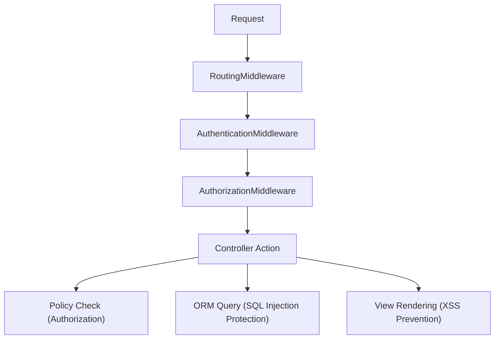
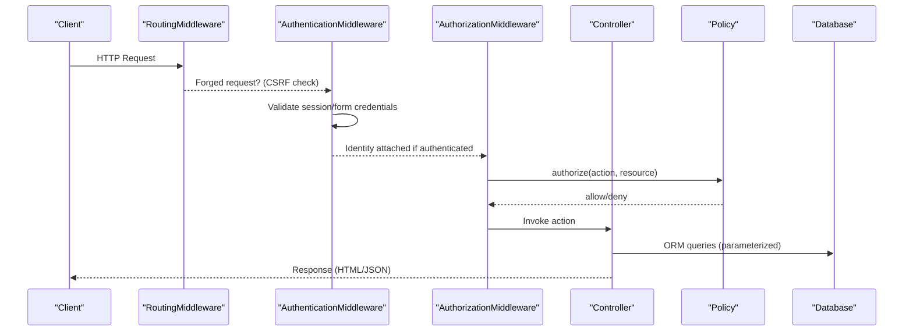
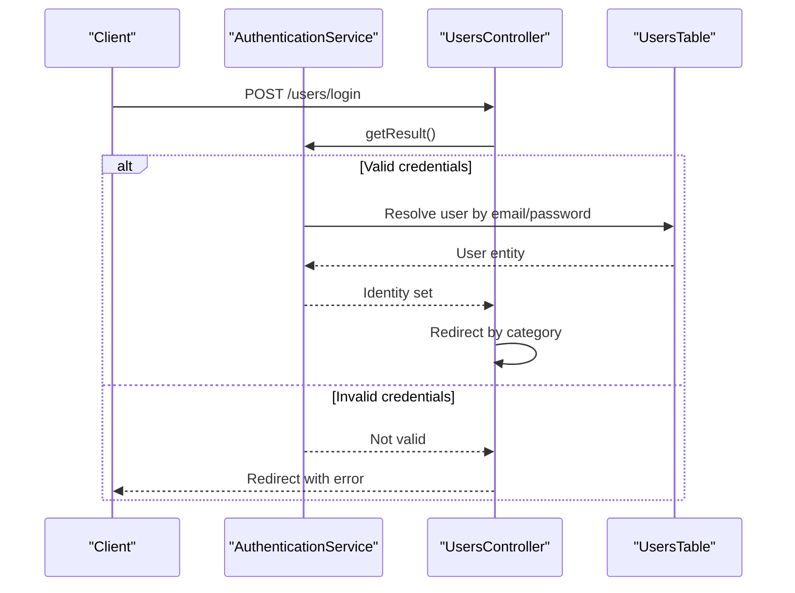
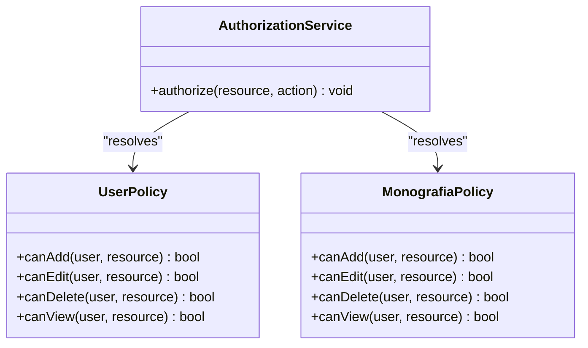
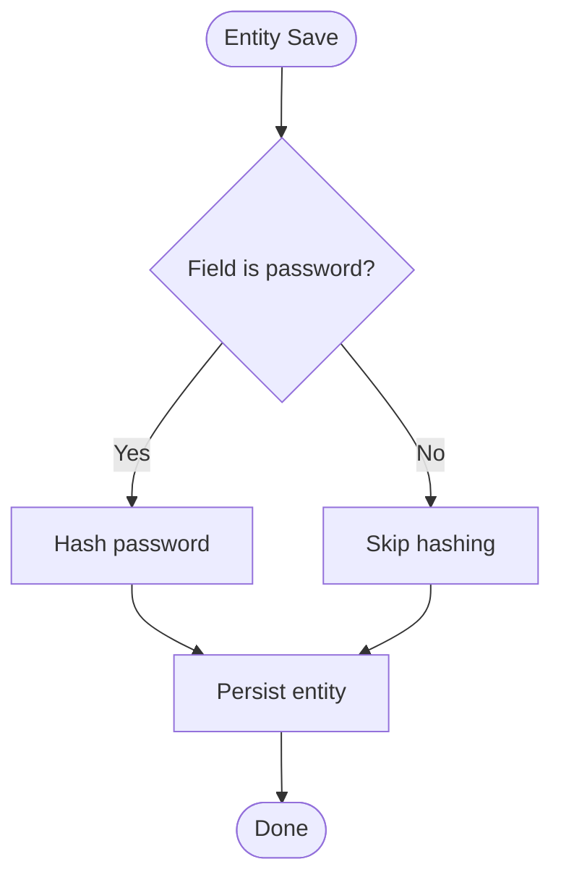
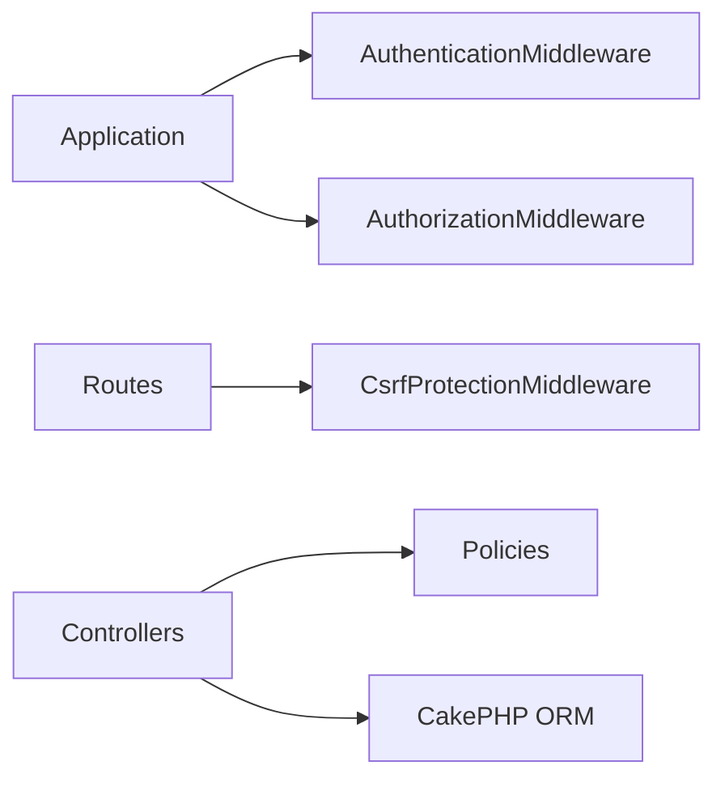

# Security Implementation

<cite>
**Referenced Files in This Document**
- [Application.php](file://src/Application.php)
- [AppController.php](file://src/Controller/AppController.php)
- [UsersController.php](file://src/Controller/UsersController.php)
- [UserPolicy.php](file://src/Policy/UserPolicy.php)
- [MonografiaPolicy.php](file://src/Policy/MonografiaPolicy.php)
- [User.php](file://src/Model/Entity/User.php)
- [app.php](file://config/app.php)
- [routes.php](file://config/routes.php)
- [bootstrap.php](file://config/bootstrap.php)
</cite>

## Table of Contents
1. [Introduction](#introduction)
2. [Project Structure](#project-structure)
3. [Core Components](#core-components)
4. [Architecture Overview](#architecture-overview)
5. [Detailed Component Analysis](#detailed-component-analysis)
6. [Dependency Analysis](#dependency-analysis)
7. [Performance Considerations](#performance-considerations)
8. [Troubleshooting Guide](#troubleshooting-guide)
9. [Conclusion](#conclusion)
10. [Appendices](#appendices)

## Introduction
This document provides comprehensive security documentation for the CakePHP application, focusing on authentication flow, authorization policies, input validation, and protection mechanisms. It details how the Authentication and Authorization plugins are integrated, policy-based access control for resources, CSRF protection, password hashing, session management, XSS prevention, and SQL injection protections. It also includes guidance for custom policy implementations, security middleware configuration, audit logging considerations, vulnerability assessment procedures, and security testing methodologies.

## Project Structure
The security implementation spans several layers:
- Application bootstrap and middleware pipeline configure authentication and authorization services.
- Controllers integrate with components to enforce login/logout flows and resource-level authorization checks.
- Policies define fine-grained permissions per entity type.
- Entities implement secure password handling and safe serialization.
- Configuration files set up CSRF protection, sessions, logging, and security keys.

**Diagram sources**
- [Application.php:91-113](file://src/Application.php#L91-L113)
- [routes.php:48-58](file://config/routes.php#L48-L58)

**Section sources**
- [Application.php:91-113](file://src/Application.php#L91-L113)
- [routes.php:48-58](file://config/routes.php#L48-L58)

## Core Components
- Authentication service configured with Session and Form authenticators using ORM resolver for user lookup by email/password.
- Authorization service uses an ORM resolver to map policies to entities.
- AppController loads Authentication and Authorization components and defines unauthenticated actions globally.
- UsersController handles login/logout flows, redirects based on user category, and enforces authorization on sensitive actions.
- User entity securely hashes passwords and hides sensitive fields from JSON output.
- CSRF protection is enabled via middleware scoped to routes.

**Section sources**
- [Application.php:135-171](file://src/Application.php#L135-L171)
- [AppController.php:44-67](file://src/Controller/AppController.php#L44-L67)
- [UsersController.php:23-171](file://src/Controller/UsersController.php#L23-L171)
- [User.php:52-69](file://src/Model/Entity/User.php#L52-L69)
- [routes.php:48-58](file://config/routes.php#L48-L58)

## Architecture Overview
The request lifecycle integrates security at multiple stages:
- Routing resolves endpoints and applies CSRF middleware.
- Authentication middleware validates identity via session or form credentials.
- Authorization middleware enforces policies before controller execution.
- Controllers perform additional authorization checks and handle business logic safely.
- Views render data through CakePHP’s templating system, which escapes output by default.

**Diagram sources**
- [Application.php:91-113](file://src/Application.php#L91-L113)
- [routes.php:48-58](file://config/routes.php#L48-L58)
- [UsersController.php:23-171](file://src/Controller/UsersController.php#L23-L171)

## Detailed Component Analysis

### Authentication Flow
- The application registers Session and Form authenticators.
- Form authenticator maps username to email and password to password, using ORM resolver against Users table.
- Unauthenticated users are redirected to a specified route; successful login sets identity and redirects based on role.
- Login and logout actions skip authorization where appropriate and manage session state.

**Diagram sources**
- [Application.php:135-165](file://src/Application.php#L135-L165)
- [UsersController.php:34-156](file://src/Controller/UsersController.php#L34-L156)

**Section sources**
- [Application.php:135-165](file://src/Application.php#L135-L165)
- [UsersController.php:34-156](file://src/Controller/UsersController.php#L34-L156)

### Authorization Policies
- Policies enforce role-based access control per entity.
- Example policies restrict create/update/delete to administrators (category '1'), while view may be public depending on policy.
- Controllers explicitly call authorize() on sensitive operations to ensure policy enforcement.

**Diagram sources**
- [UserPolicy.php:12-63](file://src/Policy/UserPolicy.php#L12-L63)
- [MonografiaPolicy.php:12-62](file://src/Policy/MonografiaPolicy.php#L12-L62)
- [Application.php:167-171](file://src/Application.php#L167-L171)

**Section sources**
- [UserPolicy.php:12-63](file://src/Policy/UserPolicy.php#L12-L63)
- [MonografiaPolicy.php:12-62](file://src/Policy/MonografiaPolicy.php#L12-L62)
- [UsersController.php:178-206](file://src/Controller/UsersController.php#L178-L206)

### Input Validation and Data Handling
- Entity mass assignment is controlled via accessible fields to prevent unintended writes.
- Passwords are hashed automatically when set, ensuring secure storage.
- Sensitive fields are hidden from JSON serialization to avoid accidental exposure.

**Diagram sources**
- [User.php:38-69](file://src/Model/Entity/User.php#L38-L69)

**Section sources**
- [User.php:38-69](file://src/Model/Entity/User.php#L38-L69)

### CSRF Protection
- CSRF middleware is registered and applied to all routes within the root scope.
- HttpOnly flag is enabled for cookies to mitigate client-side script access.

**Section sources**
- [routes.php:48-58](file://config/routes.php#L48-L58)

### Session Management
- Sessions use PHP defaults; environment-specific overrides can be applied via app_local.php.
- Secure cookie settings should be enforced in production (e.g., secure, httponly, samesite).

**Section sources**
- [app.php:398-400](file://config/app.php#L398-L400)

### XSS Prevention
- CakePHP templates escape output by default, mitigating XSS risks when rendering user-supplied data.
- Ensure views do not disable escaping unless absolutely necessary and validated content is used.

[No sources needed since this section provides general guidance]

### SQL Injection Protection
- Database interactions use CakePHP ORM, which parameterizes queries to prevent SQL injection.
- Avoid raw SQL; prefer ORM methods and query builders.

**Section sources**
- [app.php:261-327](file://config/app.php#L261-L327)

## Dependency Analysis
Security dependencies and their roles:
- Authentication plugin provides middleware and service for identity management.
- Authorization plugin provides middleware and policy resolution.
- CSRF middleware protects forms against cross-site request forgery.
- ORM ensures safe database interactions.

**Diagram sources**
- [Application.php:91-113](file://src/Application.php#L91-L113)
- [routes.php:48-58](file://config/routes.php#L48-L58)

**Section sources**
- [Application.php:91-113](file://src/Application.php#L91-L113)
- [routes.php:48-58](file://config/routes.php#L48-L58)

## Performance Considerations
- Enable route caching in production to reduce routing overhead.
- Use appropriate session handlers (e.g., cache or database) for scalability.
- Keep debug mode disabled in production to minimize overhead and information leakage.
- Configure log levels appropriately to balance visibility and performance.

[No sources needed since this section provides general guidance]

## Troubleshooting Guide
Common issues and resolutions:
- Authentication failures: Verify form field mappings and ORM resolver configuration.
- Authorization denials: Ensure policies match intended roles and that controllers invoke authorize() on protected actions.
- CSRF errors: Confirm CSRF token presence in forms and that middleware is applied to relevant routes.
- Session issues: Check session configuration and server-side session storage availability.

**Section sources**
- [Application.php:135-165](file://src/Application.php#L135-L165)
- [AppController.php:44-67](file://src/Controller/AppController.php#L44-L67)
- [routes.php:48-58](file://config/routes.php#L48-L58)

## Conclusion
The application implements a robust security posture using CakePHP’s Authentication and Authorization plugins, CSRF protection, secure password hashing, and safe database interactions. Policies provide granular access control, while configuration ensures foundational protections like secure cookies and proper logging. Adhering to these practices and extending them with continuous testing and monitoring will maintain a strong security baseline.

[No sources needed since this section summarizes without analyzing specific files]

## Appendices

### Custom Policy Implementation Guidelines
- Create a policy class per entity under src/Policy.
- Implement canAdd, canEdit, canDelete, canView methods to enforce role-based rules.
- Use identity attributes (e.g., categoria) to determine permissions.
- Call $this->Authorization->authorize($resource) in controllers for protected actions.

**Section sources**
- [UserPolicy.php:12-63](file://src/Policy/UserPolicy.php#L12-L63)
- [MonografiaPolicy.php:12-62](file://src/Policy/MonografiaPolicy.php#L12-L62)
- [UsersController.php:178-206](file://src/Controller/UsersController.php#L178-L206)

### Security Middleware Configuration
- Register Authentication and Authorization middleware in the correct order after routing.
- Apply CSRF middleware to routes requiring form submissions.
- Configure unauthenticated redirects and allowed actions at controller level.

**Section sources**
- [Application.php:91-113](file://src/Application.php#L91-L113)
- [routes.php:48-58](file://config/routes.php#L48-L58)
- [AppController.php:44-67](file://src/Controller/AppController.php#L44-L67)

### Audit Logging for Security Events
- Use CakePHP’s Log configuration to capture security-relevant events (e.g., failed logins, authorization denials).
- Add logging calls around critical security boundaries (authentication success/failure, policy decisions).
- Ensure logs are stored securely and rotated appropriately.

**Section sources**
- [app.php:332-357](file://config/app.php#L332-L357)

### Vulnerability Assessment Procedures
- Conduct regular code reviews focused on authentication, authorization, input validation, and output encoding.
- Perform static analysis using tools configured in the project (e.g., PHPStan).
- Run dynamic scans against staging environments to detect runtime vulnerabilities.
- Validate CSRF, XSS, and injection protections with targeted tests.

**Section sources**
- [phpstan.neon:25-37](file://phpstan.neon#L25-L37)

### Security Testing Methodologies
- Unit tests for policies to assert permission outcomes across roles.
- Integration tests for authentication flows (login/logout, redirect behavior).
- Functional tests for CSRF protection on form submissions.
- Penetration testing for high-risk areas (user management, admin functions).

**Section sources**
- [UsersController.php:23-171](file://src/Controller/UsersController.php#L23-L171)
- [UserPolicy.php:12-63](file://src/Policy/UserPolicy.php#L12-L63)