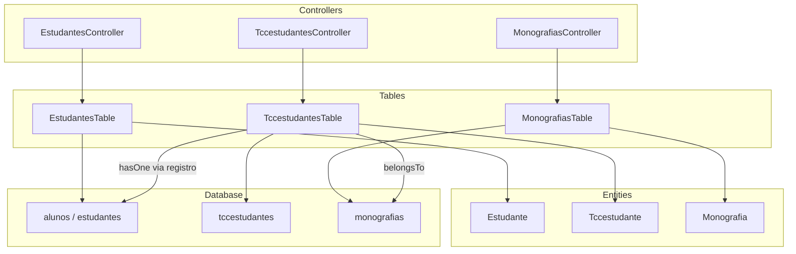
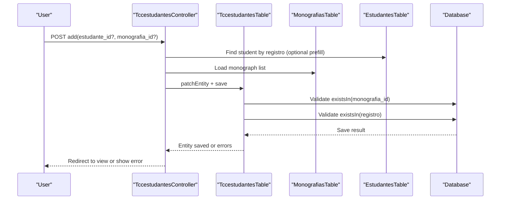
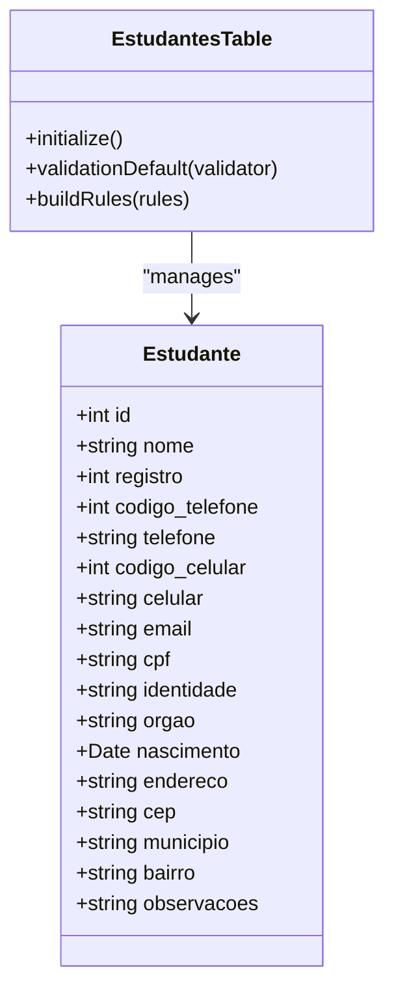
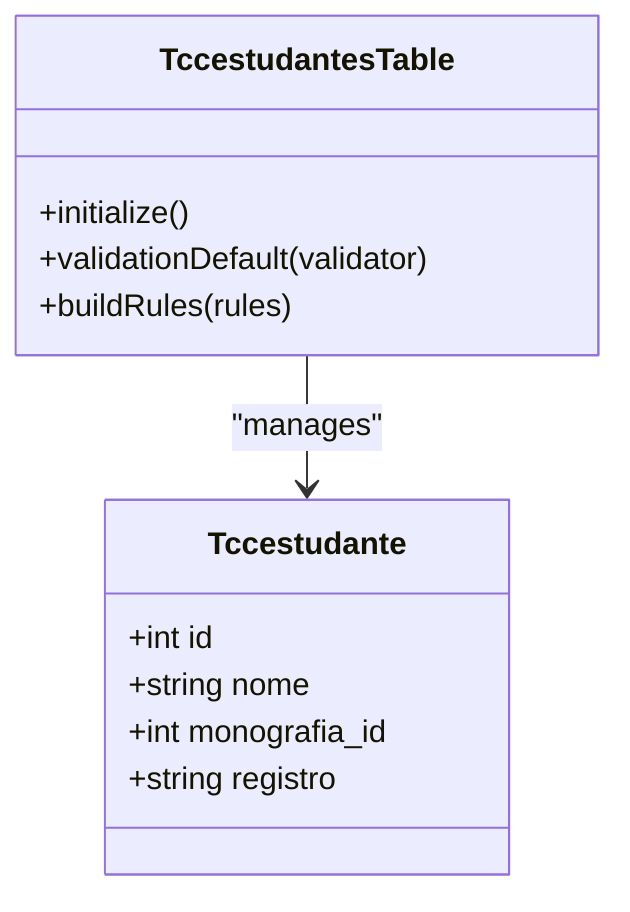
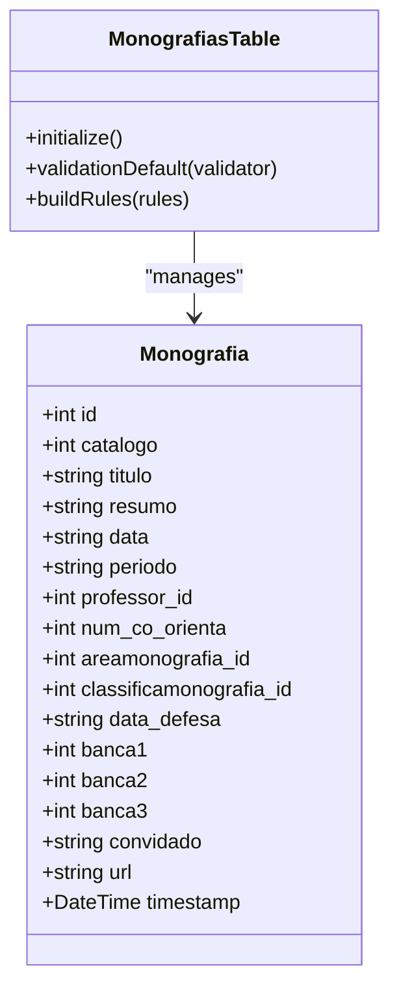
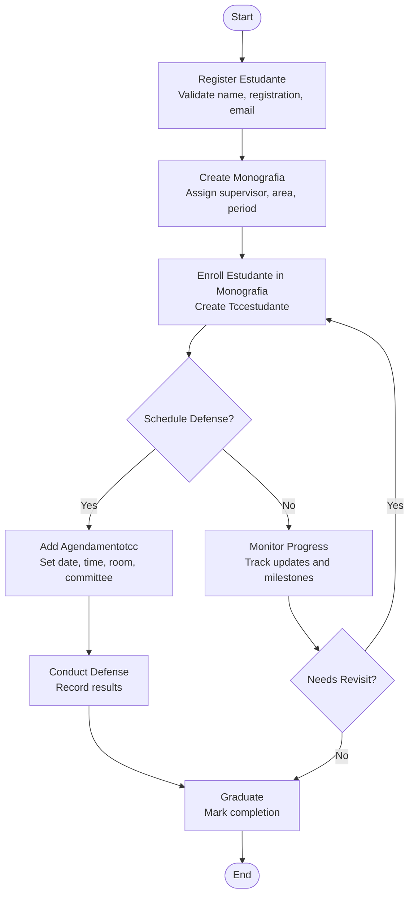
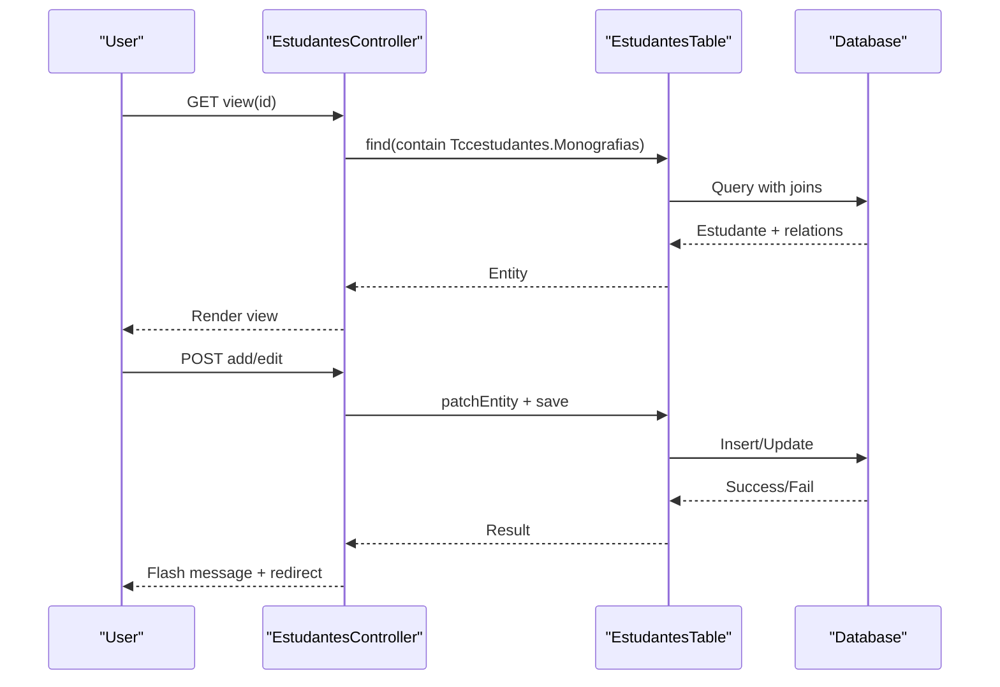
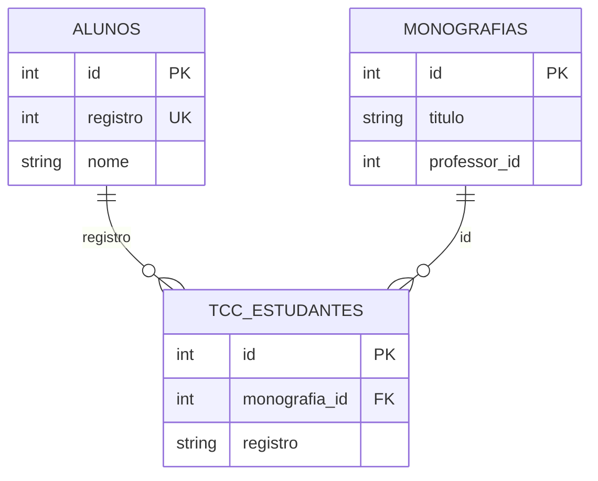

# Student Management

<cite>
**Referenced Files in This Document**
- [Estudante.php](file://src/Model/Entity/Estudante.php)
- [Tccestudante.php](file://src/Model/Entity/Tccestudante.php)
- [Monografia.php](file://src/Model/Entity/Monografia.php)
- [EstudantesTable.php](file://src/Model/Table/EstudantesTable.php)
- [TccestudantesTable.php](file://src/Model/Table/TccestudantesTable.php)
- [MonografiasTable.php](file://src/Model/Table/MonografiasTable.php)
- [EstudantesController.php](file://src/Controller/EstudantesController.php)
- [TccestudantesController.php](file://src/Controller/TccestudantesController.php)
- [schema.sql](file://config/Migrations/schema.sql)
- [view.php](file://templates/Estudantes/view.php)
- [add.php](file://templates/Tccestudantes/add.php)
</cite>

## Update Summary
**Changes Made**
- Removed references to internship-related spreadsheet generation functionality
- Updated student management focus to core thesis enrollment workflow only
- Simplified entity relationships by removing internship associations
- Updated architecture diagrams to reflect current TCC-only functionality

## Table of Contents
1. [Introduction](#introduction)
2. [Project Structure](#project-structure)
3. [Core Components](#core-components)
4. [Architecture Overview](#architecture-overview)
5. [Detailed Component Analysis](#detailed-component-analysis)
6. [Dependency Analysis](#dependency-analysis)
7. [Performance Considerations](#performance-considerations)
8. [Troubleshooting Guide](#troubleshooting-guide)
9. [Conclusion](#conclusion)
10. [Appendices](#appendices)

## Introduction
This document explains the student management system for academic history tracking and thesis program enrollment. The system has been streamlined to focus exclusively on thesis (TCC) management, with all internship-related features removed. It focuses on the Estudante (student) and Tccestudante (thesis student enrollment) entities, their relationships with Monografia (monograph/thesis), and the end-to-end workflow from admission to graduation. The system now provides a clean, focused interface for managing student profiles, academic records, and thesis enrollments without the complexity of internship tracking.

## Project Structure
The system is implemented using a CakePHP MVC structure with a simplified focus on thesis management:
- Entities define domain models (Estudante, Tccestudante, Monografia).
- Tables define associations, validations, and rules specific to thesis enrollment.
- Controllers handle HTTP requests for CRUD operations and thesis enrollment workflows.
- Templates render user interfaces for viewing and editing student and thesis records.
- The database schema defines tables and constraints that enforce referential integrity for thesis data only.

**Diagram sources**
- [EstudantesController.php:38-83](file://src/Controller/EstudantesController.php#L38-L83)
- [TccestudantesController.php:31-66](file://src/Controller/TccestudantesController.php#L31-L66)
- [EstudantesTable.php:32-53](file://src/Model/Table/EstudantesTable.php#L32-L53)
- [TccestudantesTable.php:34-57](file://src/Model/Table/TccestudantesTable.php#L34-L57)
- [schema.sql:103-130](file://config/Migrations/schema.sql#L103-L130)
- [schema.sql:155-174](file://config/Migrations/schema.sql#L155-L174)
- [schema.sql:201-244](file://config/Migrations/schema.sql#L201-L244)

**Section sources**
- [EstudantesController.php:38-83](file://src/Controller/EstudantesController.php#L38-L83)
- [TccestudantesController.php:31-66](file://src/Controller/TccestudantesController.php#L31-L66)
- [EstudantesTable.php:32-53](file://src/Model/Table/EstudantesTable.php#L32-L53)
- [TccestudantesTable.php:34-57](file://src/Model/Table/TccestudantesTable.php#L34-L57)
- [schema.sql:103-130](file://config/Migrations/schema.sql#L103-L130)
- [schema.sql:155-174](file://config/Migrations/schema.sql#L155-L174)
- [schema.sql:201-244](file://config/Migrations/schema.sql#L201-L244)

## Core Components
- **Estudante**: Represents a registered student with personal and contact details, now focused solely on thesis enrollment context.
- **Tccestudante**: Represents a student's enrollment in a specific monograph (thesis), with simplified validation and relationships.
- **Monografia**: Represents a thesis project including metadata, supervisor(s), and defense information.

Key responsibilities:
- Estudante entity/table manages student profiles and enforces uniqueness on registration number and email.
- Tccestudante entity/table links students to monographs and validates existence of referenced monograph and student.
- Monografia entity/table manages thesis metadata and relationships to supervisors and enrolled students.

**Updated** Removed internship-related associations and simplified the student management focus to thesis enrollment only.

**Section sources**
- [Estudante.php:9-31](file://src/Model/Entity/Estudante.php#L9-L31)
- [Tccestudante.php:9-15](file://src/Model/Entity/Tccestudante.php#L9-L15)
- [Monografia.php:11-33](file://src/Model/Entity/Monografia.php#L11-L33)
- [EstudantesTable.php:61-163](file://src/Model/Table/EstudantesTable.php#L61-L163)
- [TccestudantesTable.php:65-97](file://src/Model/Table/TccestudantesTable.php#L65-L97)

## Architecture Overview
The system follows a streamlined layered architecture focused on thesis management:
- Controllers orchestrate user interactions and delegate to Tables for thesis enrollment operations.
- Tables encapsulate business rules, associations, and validations specific to thesis processes.
- Entities represent domain objects with accessible fields for student and thesis data.
- Database schema enforces referential integrity and indexes for thesis-related data only.

**Diagram sources**
- [TccestudantesController.php:93-145](file://src/Controller/TccestudantesController.php#L93-L145)
- [TccestudantesTable.php:34-97](file://src/Model/Table/TccestudantesTable.php#L34-L97)
- [schema.sql:201-244](file://config/Migrations/schema.sql#L201-L244)

## Detailed Component Analysis

### Estudante Entity and Table
- Fields include name, registration number, phone/mobile, email, CPF, identity, birth date, address, city, neighborhood, and observations.
- Associations:
  - HasMany Agendamentotccs (thesis scheduling).
  - HasOne Tccestudantes (thesis enrollment).
- Validation:
  - Name required and length-limited.
  - Registration number required and unique.
  - Phone/mobile codes required; numbers optional and length-limited.
  - Email validated format and unique.
  - CPF length-limited.
  - Address fields length-limited.
  - Date validation for birth date.
- Rules:
  - Unique email and registration number enforced at table level.

**Diagram sources**
- [Estudante.php:9-64](file://src/Model/Entity/Estudante.php#L9-L64)
- [EstudantesTable.php:32-163](file://src/Model/Table/EstudantesTable.php#L32-L163)

**Section sources**
- [Estudante.php:9-64](file://src/Model/Entity/Estudante.php#L9-L64)
- [EstudantesTable.php:32-163](file://src/Model/Table/EstudantesTable.php#L32-L163)
- [schema.sql:103-130](file://config/Migrations/schema.sql#L103-L130)

### Tccestudante Entity and Table
- Fields include name, monograph ID, and registration number linking back to the student.
- Associations:
  - BelongsTo Monografias (thesis project).
  - HasOne Estudantes via registration number (for display and lookup).
- Validation:
  - Name required and length-limited.
  - Registration number optional but length-limited when provided.
- Rules:
  - Existence checks for monograph ID and student registration number.

**Diagram sources**
- [Tccestudante.php:9-35](file://src/Model/Entity/Tccestudante.php#L9-L35)
- [TccestudantesTable.php:34-97](file://src/Model/Table/TccestudantesTable.php#L34-L97)

**Section sources**
- [Tccestudante.php:9-35](file://src/Model/Entity/Tccestudante.php#L9-L35)
- [TccestudantesTable.php:34-97](file://src/Model/Table/TccestudantesTable.php#L34-L97)
- [schema.sql:201-244](file://config/Migrations/schema.sql#L201-L244)

### Monografia Entity and Table
- Fields include catalog number, title, summary, dates, period, professor ID, co-supervisor count, area ID, classification ID, defense date, committee IDs, guest, URL, timestamp.
- Associations:
  - BelongsTo Docentes (supervisor and committee members).
  - BelongsTo Areamonografias (area).
  - HasMany Tccestudantes (enrolled students).
- Validation:
  - Title length-limited.
  - Summary length-limited.
  - Period length-limited.
  - Defense date length-limited.
  - Committee member IDs allowed empty.
- Rules:
  - Existence checks for professor and area.

**Diagram sources**
- [Monografia.php:11-70](file://src/Model/Entity/Monografia.php#L11-L70)
- [MonografiasTable.php:41-188](file://src/Model/Table/MonografiasTable.php#L41-L188)

**Section sources**
- [Monografia.php:11-70](file://src/Model/Entity/Monografia.php#L11-L70)
- [MonografiasTable.php:41-188](file://src/Model/Table/MonografiasTable.php#L41-L188)
- [schema.sql:155-174](file://config/Migrations/schema.sql#L155-L174)

### Enrollment Workflow (Admission to Graduation)
The enrollment workflow connects a student to a monograph and supports subsequent steps such as scheduling defenses and recording outcomes. The system now focuses exclusively on this core thesis process.

[No sources needed since this diagram shows conceptual workflow, not actual code structure]

### Student Profile Management
- View: Displays student details and actions based on user role.
- Add/Edit: Validates and persists student data.
- Delete: Prevents deletion if related thesis enrollment records exist.

**Diagram sources**
- [EstudantesController.php:118-169](file://src/Controller/EstudantesController.php#L118-L169)
- [EstudantesTable.php:32-163](file://src/Model/Table/EstudantesTable.php#L32-L163)
- [schema.sql:103-130](file://config/Migrations/schema.sql#L103-L130)

**Section sources**
- [EstudantesController.php:118-169](file://src/Controller/EstudantesController.php#L118-L169)
- [view.php:1-97](file://templates/Estudantes/view.php#L1-L97)

### Academic Record Maintenance
- Student records maintain personal and contact information with strict validation.
- Thesis enrollment records link students to monographs and ensure referential integrity.
- Monograph records track metadata, supervision, and defense details.

**Updated** Simplified to focus only on thesis-related academic records, removing internship tracking capabilities.

**Section sources**
- [EstudantesTable.php:61-163](file://src/Model/Table/EstudantesTable.php#L61-L163)
- [TccestudantesTable.php:65-97](file://src/Model/Table/TccestudantesTable.php#L65-L97)
- [MonografiasTable.php:108-188](file://src/Model/Table/MonografiasTable.php#L108-L188)

### Integration with Monograph System
- Tccestudantes links to Monografias via foreign key and to Estudantes via registration number.
- Monografias expose a collection of enrolled students (Tccestudantes).
- Controllers provide lists of monographs and students for selection during enrollment.

**Section sources**
- [TccestudantesTable.php:34-57](file://src/Model/Table/TccestudantesTable.php#L34-L57)
- [TccestudantesController.php:114-145](file://src/Controller/TccestudantesController.php#L114-L145)

### Data Validation Examples
- Student registration requires a unique registration number and valid email.
- Thesis enrollment requires both a valid monograph and an existing student registration.
- Monograph creation requires a valid supervisor and area.

**Section sources**
- [EstudantesTable.php:61-163](file://src/Model/Table/EstudantesTable.php#L61-L163)
- [TccestudantesTable.php:65-97](file://src/Model/Table/TccestudantesTable.php#L65-L97)
- [MonografiasTable.php:108-188](file://src/Model/Table/MonografiasTable.php#L108-L188)

### Enrollment Status Tracking and Reporting
- Index pages paginate and sort students and enrollments, enabling overview reports.
- Views can contain related monographs and schedules for progress monitoring.
- Filters allow searching by name and sorting by key fields for administrative reporting.

**Section sources**
- [EstudantesController.php:38-83](file://src/Controller/EstudantesController.php#L38-L83)
- [TccestudantesController.php:31-66](file://src/Controller/TccestudantesController.php#L31-L66)
- [view.php:1-97](file://templates/Estudantes/view.php#L1-L97)

## Dependency Analysis
Relationships between core components:
- EstudantesTable has a one-to-one relationship with Tccestudantes via registration number.
- TccestudantesTable belongs to Monografias and has a one-to-one relationship with Estudantes via registration number.
- MonografiasTable has many Tccestudantes.

**Diagram sources**
- [schema.sql:103-130](file://config/Migrations/schema.sql#L103-L130)
- [schema.sql:155-174](file://config/Migrations/schema.sql#L155-L174)
- [schema.sql:201-244](file://config/Migrations/schema.sql#L201-L244)

**Section sources**
- [EstudantesTable.php:32-53](file://src/Model/Table/EstudantesTable.php#L32-L53)
- [TccestudantesTable.php:34-57](file://src/Model/Table/TccestudantesTable.php#L34-L57)
- [schema.sql:103-130](file://config/Migrations/schema.sql#L103-L130)
- [schema.sql:155-174](file://config/Migrations/schema.sql#L155-L174)
- [schema.sql:201-244](file://config/Migrations/schema.sql#L201-L244)

## Performance Considerations
- Use pagination and sorting on index endpoints to avoid loading large datasets.
- Leverage contains to eagerly load necessary associations (e.g., Tccestudantes.Monografias) to reduce N+1 queries.
- Ensure database indexes on frequently queried columns (registration number, monograph ID) to speed up lookups.
- Avoid unnecessary joins; use targeted queries in controllers for filtering and sorting.
- **Updated** Simplified query patterns due to removal of internship-related joins and complex relationships.

## Troubleshooting Guide
Common issues and resolutions:
- Duplicate registration number or email: Validation will reject duplicates; ensure unique values before saving.
- Invalid monograph or student reference: Tccestudante save fails if references do not exist; verify IDs before enrollment.
- Deletion blocked due to related records: Student cannot be deleted if associated with thesis enrollments; remove dependencies first.
- Empty results on index: Check filters and sorting parameters; ensure data exists and query conditions are correct.
- **Updated** No longer need to check for internship-related conflicts when deleting students.

**Section sources**
- [EstudantesController.php:178-205](file://src/Controller/EstudantesController.php#L178-L205)
- [TccestudantesController.php:193-204](file://src/Controller/TccestudantesController.php#L193-L204)
- [EstudantesTable.php:156-163](file://src/Model/Table/EstudantesTable.php#L156-L163)
- [TccestudantesTable.php:91-97](file://src/Model/Table/TccestudantesTable.php#L91-L97)

## Conclusion
The student management system provides streamlined support for managing student profiles, tracking academic history, and enrolling students into thesis programs. With the removal of internship-related functionality, the system now offers a focused, efficient interface for thesis management. Through well-defined entities, tables, and controllers, it ensures data integrity via validation and referential constraints. The workflow from admission to graduation is supported by clear enrollment processes, scheduling, and monitoring capabilities. Administrators can generate reports and track progress using indexed queries and paginated views, all within the simplified thesis-focused scope.

## Appendices

### Database Schema Highlights
- Students table stores personal and contact information with unique registration numbers.
- Thesis enrollments link students to monographs and validate references.
- Monographs store thesis metadata, supervision, and defense details.
- **Updated** Internship-related tables are explicitly out of scope for TCC5 application.

**Section sources**
- [schema.sql:103-130](file://config/Migrations/schema.sql#L103-L130)
- [schema.sql:155-174](file://config/Migrations/schema.sql#L155-L174)
- [schema.sql:201-244](file://config/Migrations/schema.sql#L201-L244)

### User Interface References
- Student view template displays profile details and actions.
- Thesis enrollment form allows selecting monographs and students.
- **Updated** All templates now focus exclusively on thesis management functionality.

**Section sources**
- [view.php:1-97](file://templates/Estudantes/view.php#L1-L97)
- [add.php:23-45](file://templates/Tccestudantes/add.php#L23-L45)