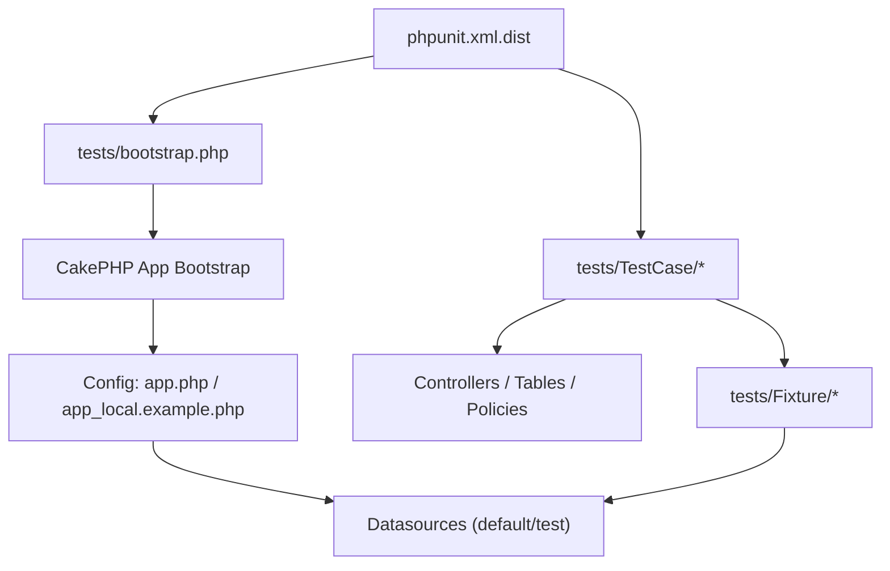
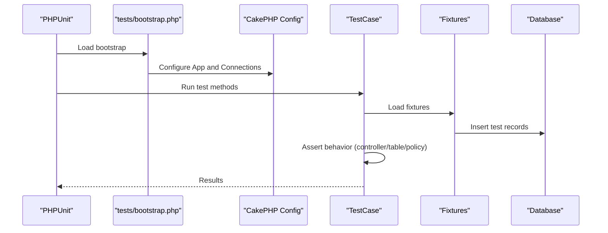
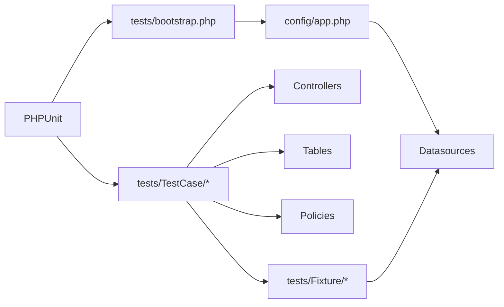
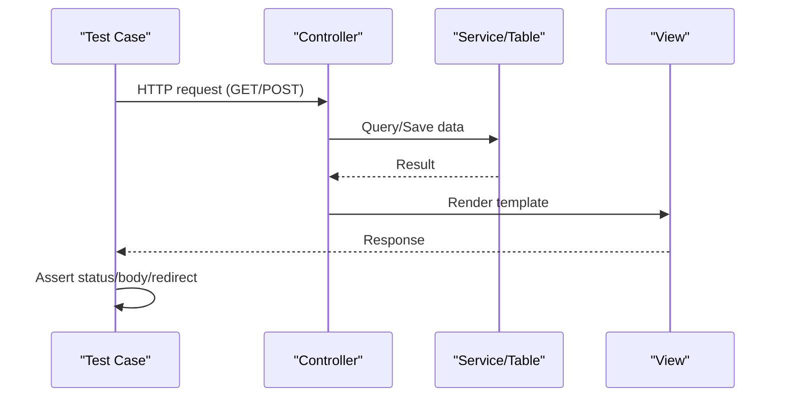
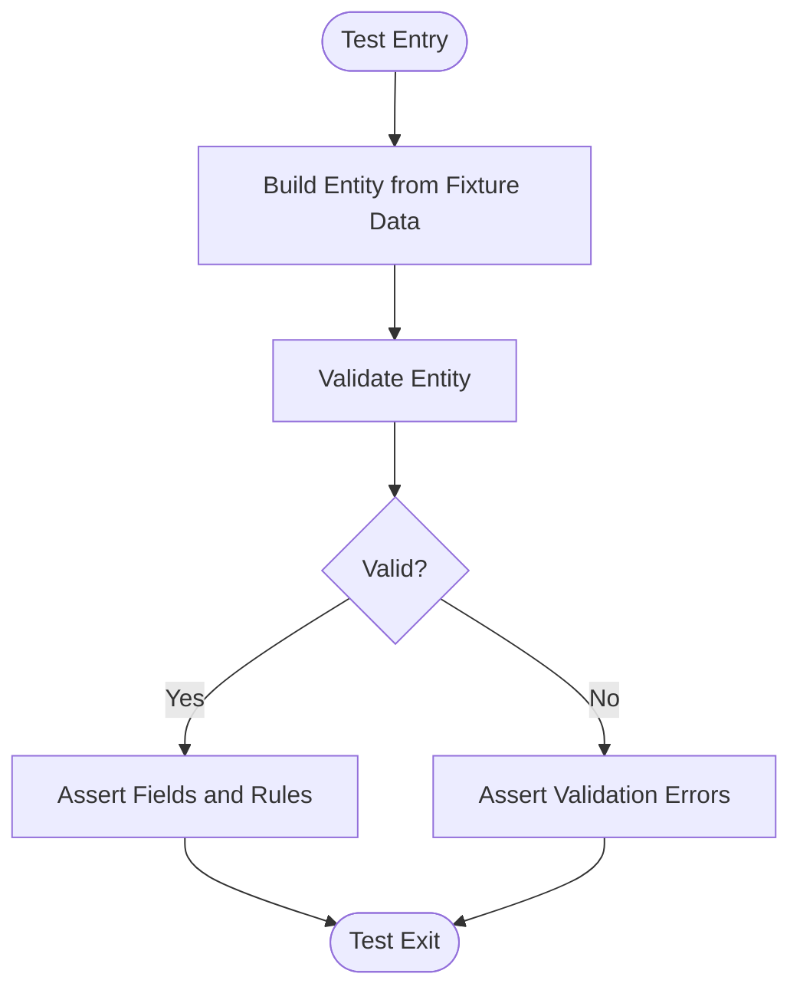

# Testing Strategy

<cite>
**Referenced Files in This Document**
- [phpunit.xml.dist](file://phpunit.xml.dist)
- [bootstrap.php](file://tests/bootstrap.php)
- [composer.json](file://composer.json)
- [UsersControllerTest.php](file://tests/TestCase/Controller/UsersControllerTest.php)
- [AppControllerTest.php](file://tests/TestCase/Controller/AppControllerTest.php)
- [UsersTableTest.php](file://tests/TestCase/Model/Table/UsersTableTest.php)
- [UsersFixture.php](file://tests/Fixture/UsersFixture.php)
- [UserPolicy.php](file://src/Policy/UserPolicy.php)
- [ApplicationTest.php](file://tests/TestCase/ApplicationTest.php)
- [app.php](file://config/app.php)
- [app_local.example.php](file://config/app_local.example.php)
</cite>

## Table of Contents
1. Introduction
2. Project Structure
3. Core Components
4. Architecture Overview
5. Detailed Component Analysis
6. Dependency Analysis
7. Performance Considerations
8. Troubleshooting Guide
9. Conclusion
10. Appendices

## Introduction
This document defines the testing strategy for the CakePHP application, covering unit tests, integration tests, and test organization aligned with CakePHP conventions. It explains PHPUnit configuration, test bootstrap behavior, fixtures, assertion patterns, mocking strategies for external dependencies, and how to test controllers, models (Tables), policies, and database interactions. It also includes guidance on code coverage measurement, test data management, debugging failing tests, and a continuous integration setup using Composer scripts.

## Project Structure
The repository follows standard CakePHP layout:
- Tests live under tests/ with TestCase and Fixture directories mirroring src/.
- PHPUnit is configured via phpunit.xml.dist and bootstrapped by tests/bootstrap.php.
- Datasource connections are defined in config/app.php and overridden per environment in app_local.example.php.
- Composer scripts provide a convenient entry point to run tests and other checks.

**Diagram sources**
- [phpunit.xml.dist:1-26](file://phpunit.xml.dist#L1-L26)
- [bootstrap.php:1-53](file://tests/bootstrap.php#L1-L53)
- [app.php:261-327](file://config/app.php#L261-L327)
- [app_local.example.php:37-74](file://config/app_local.example.php#L37-L74)

**Section sources**
- [phpunit.xml.dist:1-26](file://phpunit.xml.dist#L1-L26)
- [composer.json:43-54](file://composer.json#L43-L54)
- [bootstrap.php:1-53](file://tests/bootstrap.php#L1-L53)

## Core Components
- PHPUnit configuration: Defines the app test suite, source include/exclude, and cache directory.
- Test bootstrap: Loads autoloader, CakePHP bootstrap, sets base URL, configures a test DebugKit connection, and fixes session id for CLI.
- Composer scripts: Provide commands to run tests and code style checks.
- Fixtures: Provide deterministic test data for tables used by controller and table tests.
- Controller tests: Use IntegrationTestTrait to simulate HTTP requests against controllers.
- Table tests: Instantiate Table classes via TableLocator and assert validation/rules.
- Policy tests: Validate authorization decisions for entities.

**Section sources**
- [phpunit.xml.dist:1-26](file://phpunit.xml.dist#L1-L26)
- [bootstrap.php:1-53](file://tests/bootstrap.php#L1-L53)
- [composer.json:43-54](file://composer.json#L43-L54)
- [UsersFixture.php:1-37](file://tests/Fixture/UsersFixture.php#L1-L37)
- [UsersControllerTest.php:1-119](file://tests/TestCase/Controller/UsersControllerTest.php#L1-L119)
- [UsersTableTest.php:1-79](file://tests/TestCase/Model/Table/UsersTableTest.php#L1-L79)
- [UserPolicy.php:1-64](file://src/Policy/UserPolicy.php#L1-L64)

## Architecture Overview
The test execution flow initializes the framework, prepares a test database connection, loads fixtures, and runs assertions against controllers, tables, and policies.

**Diagram sources**
- [phpunit.xml.dist:1-26](file://phpunit.xml.dist#L1-L26)
- [bootstrap.php:1-53](file://tests/bootstrap.php#L1-L53)
- [app.php:261-327](file://config/app.php#L261-L327)
- [UsersFixture.php:1-37](file://tests/Fixture/UsersFixture.php#L1-L37)

## Detailed Component Analysis

### PHPUnit Configuration
- Suite definition: The app suite scans tests/TestCase/.
- Source inclusion: Coverage targets src/ and plugins/*/src/, excluding specific files.
- Cache: Uses .phpunit.cache for performance.
- Environment: Sets memory_limit and APC settings for CLI.

Practical implications:
- Add plugin test suites under the same structure if needed.
- Adjust source excludes to refine coverage reports.

**Section sources**
- [phpunit.xml.dist:1-26](file://phpunit.xml.dist#L1-L26)

### Test Bootstrap and Environment
- Autoloads Composer and CakePHP bootstrap.
- Sets fullBaseUrl for request generation.
- Configures a SQLite-based DebugKit connection alias to avoid errors when running tests with DebugKit enabled.
- Fixes session_id early to prevent CLI output issues.

Operational notes:
- Ensure TMP exists and is writable for DebugKit SQLite file.
- For CI, ensure environment variables for databases are set appropriately.

**Section sources**
- [bootstrap.php:1-53](file://tests/bootstrap.php#L1-L53)

### Database Configuration for Tests
- Default and test datasources are defined in app.php; local overrides in app_local.example.php.
- The test suite uses the 'test' datasource by convention.

Recommendations:
- Keep credentials out of version control; use environment variables or app_local.php.
- For isolated CI runs, consider using an in-memory SQLite or dedicated test database.

**Section sources**
- [app.php:261-327](file://config/app.php#L261-L327)
- [app_local.example.php:37-74](file://config/app_local.example.php#L37-L74)

### Controller Integration Tests
- Pattern: Extend TestCase, use IntegrationTestTrait, declare required fixtures.
- Typical flows: Simulate GET/POST requests, assert response status, view vars, redirects, and flash messages.
- Example skeleton present in UsersControllerTest.php and AppControllerTest.php.

Guidelines:
- Prepare minimal fixture data that satisfies controller logic and authorization.
- Use $this->get(), $this->post(), etc., from IntegrationTestTrait to exercise endpoints.
- Assert both success and failure paths (e.g., invalid input, unauthorized).

**Section sources**
- [UsersControllerTest.php:1-119](file://tests/TestCase/Controller/UsersControllerTest.php#L1-L119)
- [AppControllerTest.php:1-38](file://tests/TestCase/Controller/AppControllerTest.php#L1-L38)

### Model (Table) Unit Tests
- Pattern: Extend TestCase, get Table via TableLocator in setUp, define fixtures.
- Focus areas: Validation rules, buildRules, custom finder methods, behaviors.
- Example skeleton present in UsersTableTest.php.

Guidelines:
- Isolate Table logic by avoiding heavy side effects.
- Use fixtures to create valid and invalid entity states for rule testing.
- Assert exceptions for invalid operations where appropriate.

**Section sources**
- [UsersTableTest.php:1-79](file://tests/TestCase/Model/Table/UsersTableTest.php#L1-L79)

### Policy Tests
- Purpose: Verify authorization decisions for actions like add/edit/view/delete.
- Approach: Create mock IdentityInterface instances representing different roles and assert policy outcomes.
- Example policy present in UserPolicy.php demonstrates role-based checks.

Guidelines:
- Mock the identity object with varying attributes (e.g., categoria).
- Assert true/false for each action method based on expected permissions.
- Combine with controller integration tests to validate end-to-end authorization.

**Section sources**
- [UserPolicy.php:1-64](file://src/Policy/UserPolicy.php#L1-L64)

### Application-Level Tests
- Example in ApplicationTest.php validates plugin registration and middleware stack.
- Useful to ensure bootstrap integrity and middleware order.

Guidelines:
- Assert presence and order of critical middleware.
- Guard against regressions when adding/removing plugins.

**Section sources**
- [ApplicationTest.php:1-91](file://tests/TestCase/ApplicationTest.php#L1-L91)

### Fixtures and Test Data Management
- Fixtures reside in tests/Fixture and mirror application tables.
- They provide deterministic datasets for tests, ensuring repeatability.
- Example UsersFixture defines schema and sample records.

Best practices:
- Keep fixtures minimal but sufficient to satisfy business rules.
- Use multiple fixtures when relationships are involved.
- Prefer factory-like helpers if data becomes complex, while keeping fixtures simple.

**Section sources**
- [UsersFixture.php:1-37](file://tests/Fixture/UsersFixture.php#L1-L37)

### Mocking Strategies for External Dependencies
- Use PHPUnit’s built-in mocking to stub services, mailers, PDF generators, or third-party SDKs.
- For HTTP clients or email transports, replace with in-memory or null implementations during tests.
- In controller tests, prefer IntegrationTestTrait to avoid deep coupling; isolate only when necessary.

Example approach:
- Create a mock of an external service class and inject it into the controller or component.
- Assert that the service was called with expected parameters and return values.

[No sources needed since this section provides general guidance]

### Assertion Patterns
- Response assertions: status codes, headers, body content, redirects.
- Entity assertions: field values, validity, error messages.
- Authorization assertions: policy returns for given identities.
- Exception assertions: expect thrown exceptions for invalid inputs.

[No sources needed since this section provides general guidance]

### Continuous Integration Setup
- Composer script "test" runs PHPUnit with colors enabled.
- Scripts "check" runs tests and code style checks together.
- Integrate these scripts into your CI pipeline to enforce quality gates.

CI recommendations:
- Install dependencies with composer install --no-interaction --prefer-stable.
- Set up a test database or SQLite for isolation.
- Export coverage artifacts for reporting.

**Section sources**
- [composer.json:43-54](file://composer.json#L43-L54)

## Dependency Analysis
Tests depend on:
- PHPUnit and CakePHP test utilities.
- Application bootstrap and configuration.
- Fixtures for data.
- Controllers, Tables, and Policies under test.

**Diagram sources**
- [phpunit.xml.dist:1-26](file://phpunit.xml.dist#L1-L26)
- [bootstrap.php:1-53](file://tests/bootstrap.php#L1-L53)
- [app.php:261-327](file://config/app.php#L261-L327)
- [UsersFixture.php:1-37](file://tests/Fixture/UsersFixture.php#L1-L37)

**Section sources**
- [composer.json:17-25](file://composer.json#L17-L25)
- [phpunit.xml.dist:1-26](file://phpunit.xml.dist#L1-L26)

## Performance Considerations
- Use fixtures judiciously to minimize DB overhead.
- Prefer SQLite for fast, isolated tests when possible.
- Enable query logging selectively during development to diagnose slow tests.
- Group related tests to reduce bootstrap costs.
- Avoid heavy initialization inside test methods; move to setUp or data providers.

[No sources needed since this section provides general guidance]

## Troubleshooting Guide
Common issues and resolutions:
- Missing test database: Ensure 'test' datasource is configured and accessible.
- DebugKit errors in CLI: The bootstrap configures a test_debug_kit SQLite connection; verify TMP is writable.
- Session warnings in CLI: Bootstrap fixes session_id early; ensure no premature output before bootstrap.
- Slow tests: Reduce fixture size, use SQLite, and avoid unnecessary I/O.
- Flaky tests: Ensure fixtures fully represent required relationships; reset state between tests.

Debugging techniques:
- Run a single test file or method to isolate failures.
- Increase verbosity with PHPUnit flags to see detailed output.
- Temporarily enable query logging to inspect SQL generated by tests.
- Use breakpoints or debuggers compatible with PHPUnit in your IDE.

**Section sources**
- [bootstrap.php:35-53](file://tests/bootstrap.php#L35-L53)
- [app.php:332-357](file://config/app.php#L332-L357)

## Conclusion
This testing strategy leverages CakePHP’s conventions and PHPUnit to deliver reliable unit and integration tests. By organizing tests under tests/TestCase, using fixtures for deterministic data, and applying targeted mocking, you can confidently cover controllers, tables, policies, and database interactions. Adopt the provided Composer scripts for consistent execution and integrate them into CI to maintain quality over time.

## Appendices

### Running Tests
- Execute all tests: composer test
- Run a specific test file: vendor/bin/phpunit tests/TestCase/Controller/UsersControllerTest.php
- Generate coverage (if configured): vendor/bin/phpunit --coverage-html=coverage

[No sources needed since this section provides general guidance]

### Code Coverage Measurement
- Configure coverage in phpunit.xml.dist to include src/ and exclude non-code files.
- Use tools like Xdebug or PCOV depending on your environment.
- Publish coverage reports in CI for visibility.

[No sources needed since this section provides general guidance]

### Example Test Workflows

#### Controller Integration Flow

[No sources needed since this diagram shows conceptual workflow, not actual code structure]

#### Table Validation Flow

[No sources needed since this diagram shows conceptual workflow, not actual code structure]