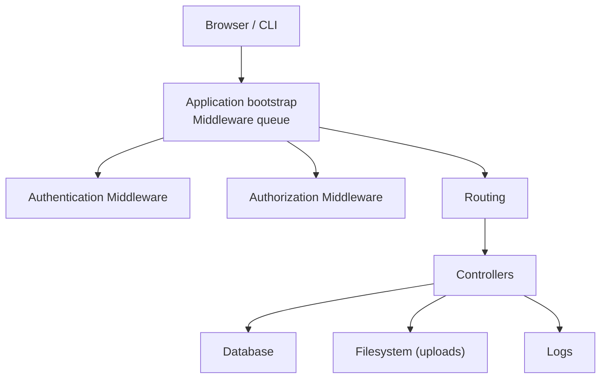
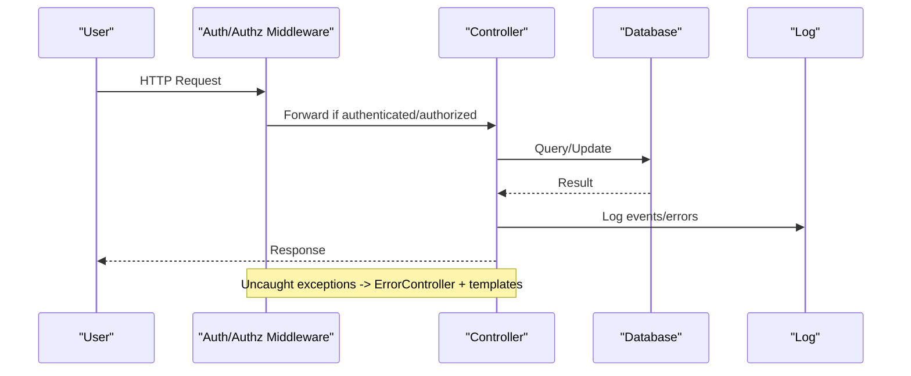
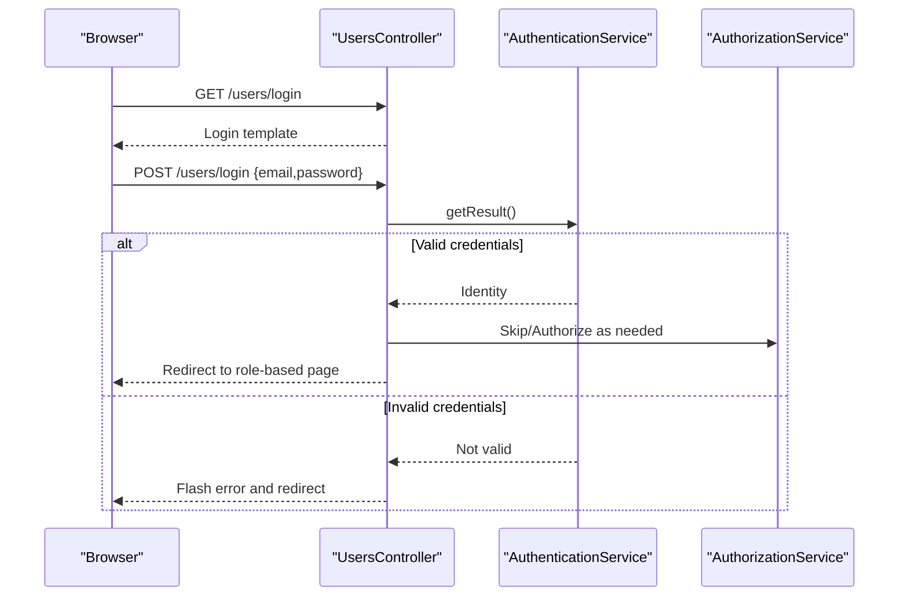
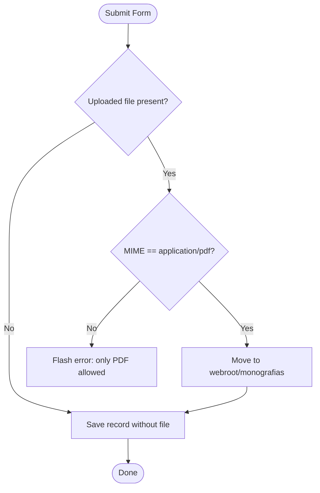
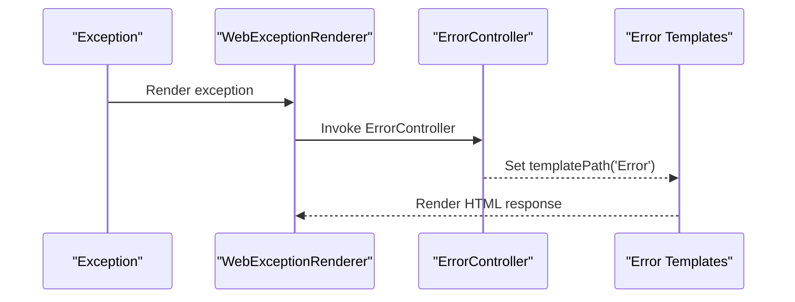
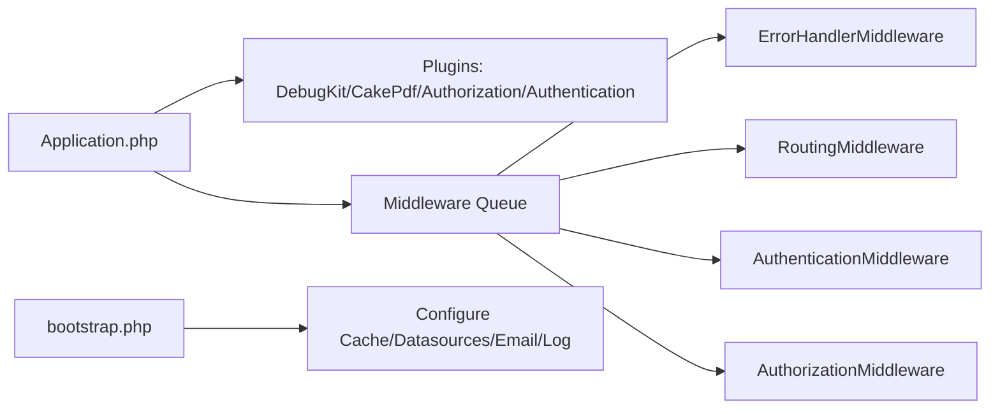

# Troubleshooting and FAQ

<cite>
**Referenced Files in This Document**
- [Application.php](file://src/Application.php)
- [AppController.php](file://src/Controller/AppController.php)
- [UsersController.php](file://src/Controller/UsersController.php)
- [ErrorController.php](file://src/Controller/ErrorController.php)
- [error400.php](file://templates/Error/error400.php)
- [error500.php](file://templates/Error/error500.php)
- [login.php](file://templates/Users/login.php)
- [app.php](file://config/app.php)
- [app_local.example.php](file://config/app_local.example.php)
- [bootstrap.php](file://config/bootstrap.php)
- [MonografiasController.php](file://src/Controller/MonografiasController.php)
- [edit.php](file://templates/Monografias/edit.php)
- [ConsoleCommand.php](file://src/Command/ConsoleCommand.php)
</cite>

## Table of Contents
1. Introduction
2. Project Structure
3. Core Components
4. Architecture Overview
5. Detailed Component Analysis
6. Dependency Analysis
7. Performance Considerations
8. Troubleshooting Guide
9. Conclusion
10. Appendices

## Introduction
This document provides comprehensive troubleshooting guidance for the application, focusing on common installation issues, database connectivity problems, file upload errors, authentication failures, performance optimization techniques, log analysis procedures, debugging methodologies, and frequently asked questions. It includes step-by-step solutions and diagnostic commands to help you identify and resolve issues quickly.

## Project Structure
The application is a CakePHP-based system with:
- Configuration files for environment-specific settings, caching, logging, and database connections
- Controllers handling authentication, authorization, and business logic (including file uploads)
- Error templates for 4xx/5xx responses
- Bootstrap routines that set up middleware, plugins, and runtime configuration
- A console command providing an interactive shell for diagnostics

**Diagram sources**
- [Application.php:91-113](file://src/Application.php#L91-L113)
- [bootstrap.php:165-169](file://config/bootstrap.php#L165-L169)

**Section sources**
- [Application.php:91-113](file://src/Application.php#L91-L113)
- [bootstrap.php:165-169](file://config/bootstrap.php#L165-L169)

## Core Components
- Authentication and Authorization: Configured via Application service providers and middleware; controllers can skip or enforce authorization as needed.
- Error Handling: Custom error controller and templates render user-friendly pages and expose SQL details in debug mode.
- Logging: File-based logs for debug, error, and queries; query logging requires enabling datasource logging.
- Database: MySQL connection configured centrally; local overrides supported via app_local.php.
- File Uploads: Monografias controller validates MIME type and persists PDFs under webroot.

**Section sources**
- [Application.php:135-171](file://src/Application.php#L135-L171)
- [AppController.php:47-69](file://src/Controller/AppController.php#L47-L69)
- [UsersController.php:23-32](file://src/Controller/UsersController.php#L23-L32)
- [ErrorController.php:26-59](file://src/Controller/ErrorController.php#L26-L59)
- [error400.php:10-38](file://templates/Error/error400.php#L10-L38)
- [error500.php:10-42](file://templates/Error/error500.php#L10-L42)
- [app.php:261-327](file://config/app.php#L261-L327)
- [app.php:332-357](file://config/app.php#L332-L357)
- [MonografiasController.php:107-131](file://src/Controller/MonografiasController.php#L107-L131)
- [MonografiasController.php:319-332](file://src/Controller/MonografiasController.php#L319-L332)

## Architecture Overview
The request lifecycle integrates authentication and authorization middleware before routing to controllers. Errors are rendered by a dedicated error controller and templates. Logs are written to files based on configuration.

**Diagram sources**
- [Application.php:91-113](file://src/Application.php#L91-L113)
- [ErrorController.php:26-59](file://src/Controller/ErrorController.php#L26-L59)
- [error400.php:10-38](file://templates/Error/error400.php#L10-L38)
- [error500.php:10-42](file://templates/Error/error500.php#L10-L42)

## Detailed Component Analysis

### Authentication Flow and Common Failures
- The login form posts email/password to the users login action.
- Authentication uses session and form authenticators; successful login redirects based on user category.
- Unauthorized access is redirected to a default route.

**Diagram sources**
- [UsersController.php:23-156](file://src/Controller/UsersController.php#L23-L156)
- [Application.php:135-165](file://src/Application.php#L135-L165)
- [login.php:13-36](file://templates/Users/login.php#L13-L36)

**Section sources**
- [UsersController.php:23-156](file://src/Controller/UsersController.php#L23-L156)
- [Application.php:135-165](file://src/Application.php#L135-L165)
- [login.php:13-36](file://templates/Users/login.php#L13-L36)

### File Upload Processing and Validation
- The monografias edit flow accepts a file input named url.
- Only PDFs are allowed; other types trigger an error message and no save.
- Uploaded files are moved to a public directory under webroot.

**Diagram sources**
- [MonografiasController.php:107-131](file://src/Controller/MonografiasController.php#L107-L131)
- [MonografiasController.php:319-332](file://src/Controller/MonografiasController.php#L319-L332)
- [edit.php:292-324](file://templates/Monografias/edit.php#L292-L324)

**Section sources**
- [MonografiasController.php:107-131](file://src/Controller/MonografiasController.php#L107-L131)
- [MonografiasController.php:319-332](file://src/Controller/MonografiasController.php#L319-L332)
- [edit.php:292-324](file://templates/Monografias/edit.php#L292-L324)

### Error Rendering and Debugging
- ErrorController sets the template path to Error views.
- In debug mode, 400/500 templates show SQL query and parameters when available.
- Error handler configuration controls whether exceptions are logged and traced.

**Diagram sources**
- [ErrorController.php:26-59](file://src/Controller/ErrorController.php#L26-L59)
- [error400.php:10-38](file://templates/Error/error400.php#L10-L38)
- [error500.php:10-42](file://templates/Error/error500.php#L10-L42)
- [app.php:179-185](file://config/app.php#L179-L185)

**Section sources**
- [ErrorController.php:26-59](file://src/Controller/ErrorController.php#L26-L59)
- [error400.php:10-38](file://templates/Error/error400.php#L10-L38)
- [error500.php:10-42](file://templates/Error/error500.php#L10-L42)
- [app.php:179-185](file://config/app.php#L179-L185)

## Dependency Analysis
- Application bootstraps plugins (DebugKit conditionally, CakePdf, Authorization, Authentication).
- Middleware order ensures error handling first, then assets, routing, authentication, and authorization.
- Datasources, cache, mailer, and log configurations are loaded from app.php and overridden by app_local.php.

**Diagram sources**
- [Application.php:62-83](file://src/Application.php#L62-L83)
- [Application.php:91-113](file://src/Application.php#L91-L113)
- [bootstrap.php:165-169](file://config/bootstrap.php#L165-L169)

**Section sources**
- [Application.php:62-83](file://src/Application.php#L62-L83)
- [Application.php:91-113](file://src/Application.php#L91-L113)
- [bootstrap.php:165-169](file://config/bootstrap.php#L165-L169)

## Performance Considerations
- Enable query logging selectively to diagnose slow queries; remember it adds overhead.
- Use appropriate cache engines and ensure writable cache directories.
- Keep debug false in production to avoid verbose output and extra processing.
- Ensure timezone and locale settings match your deployment to avoid formatting overhead.

[No sources needed since this section provides general guidance]

## Troubleshooting Guide

### Installation and Environment Issues
Symptoms:
- Blank pages or framework not loading
- Missing plugin errors
- Incorrect base URL or asset paths

Checks:
- Verify PHP extensions and Composer dependencies are installed.
- Confirm DebugKit is only enabled in development.
- Ensure fullBaseUrl is correctly set or auto-detected.

Steps:
- Review bootstrap to confirm plugins are added and error handlers registered.
- Check that routes and middleware are loaded in the correct order.

**Section sources**
- [Application.php:62-83](file://src/Application.php#L62-L83)
- [Application.php:91-113](file://src/Application.php#L91-L113)
- [bootstrap.php:127-134](file://config/bootstrap.php#L127-L134)

### Database Connection Problems
Symptoms:
- “Unable to connect to database”
- Schema metadata errors
- Slow queries or timeouts

Checks:
- Confirm host, port, username, password, and database name in app_local.php override app.php defaults.
- Ensure MySQL driver and PDO extension are enabled.
- Validate charset flags if using MariaDB/MySQL with specific server settings.

Steps:
- Temporarily enable datasource logging to capture failing queries.
- Inspect logs for detailed error messages.
- Test connectivity using a simple script or CLI tool outside the app.

**Section sources**
- [app.php:261-327](file://config/app.php#L261-L327)
- [app_local.example.php:37-74](file://config/app_local.example.php#L37-L74)
- [app.php:332-357](file://config/app.php#L332-L357)

### File Upload Errors
Symptoms:
- “Only PDF files are allowed”
- File not saved or missing after submission
- Permission denied errors

Checks:
- Ensure the target directory exists and is writable by the web server process.
- Verify the form field name matches the controller expectation.
- Confirm MIME type validation allows the intended file type.

Steps:
- Inspect the uploaded file’s MIME type and size limits.
- Check filesystem permissions for the webroot subdirectory used for uploads.
- Review flash messages and logs for validation errors.

**Section sources**
- [MonografiasController.php:107-131](file://src/Controller/MonografiasController.php#L107-L131)
- [MonografiasController.php:319-332](file://src/Controller/MonografiasController.php#L319-L332)
- [edit.php:292-324](file://templates/Monografias/edit.php#L292-L324)

### Authentication Failures
Symptoms:
- Redirected to default route after login attempt
- “Invalid user or password” flash message
- Session not persisting across requests

Checks:
- Confirm form fields map to email and password as configured.
- Verify unauthenticated actions include login, add, logout where needed.
- Ensure session storage is working (default PHP sessions).

Steps:
- Enable debug temporarily to see detailed errors during login.
- Check logs for authentication-related warnings or exceptions.
- Validate that the Users table contains expected records and hashed passwords.

**Section sources**
- [Application.php:135-165](file://src/Application.php#L135-L165)
- [UsersController.php:23-32](file://src/Controller/UsersController.php#L23-L32)
- [UsersController.php:34-156](file://src/Controller/UsersController.php#L34-L156)
- [login.php:13-36](file://templates/Users/login.php#L13-L36)

### Error Pages and Exceptions
Symptoms:
- 404 or 500 pages shown
- Missing controller or action errors
- Internal server errors

Checks:
- Ensure ErrorController template path is set to Error views.
- Confirm error handler configuration logs exceptions and traces.
- In debug mode, verify SQL query and params are displayed for database errors.

Steps:
- Review error templates to ensure they render correctly.
- Check logs for stack traces and underlying causes.
- Adjust errorLevel and skipLog options as needed for your environment.

**Section sources**
- [ErrorController.php:26-59](file://src/Controller/ErrorController.php#L26-L59)
- [error400.php:10-38](file://templates/Error/error400.php#L10-L38)
- [error500.php:10-42](file://templates/Error/error500.php#L10-L42)
- [app.php:179-185](file://config/app.php#L179-L185)

### Logging and Query Diagnostics
- Logs are written to files under the logs directory with separate scopes for debug, error, and queries.
- To capture SQL statements, enable datasource logging for the relevant connection.
- Use the interactive console to run ad-hoc queries and inspect entities.

Steps:
- Enable query logging in datasource config temporarily.
- Monitor logs while reproducing the issue.
- Use the console command to explore models and relationships interactively.

**Section sources**
- [app.php:332-357](file://config/app.php#L332-L357)
- [ConsoleCommand.php:38-66](file://src/Command/ConsoleCommand.php#L38-L66)

### Frequently Asked Questions
- Why am I redirected after login?
  - If credentials are invalid or authorization fails, the system redirects to a default route. Check authentication configuration and user roles.
- Can I upload non-PDF files?
  - The current implementation restricts uploads to PDFs. Modify validation if you need to support other formats.
- How do I see SQL queries causing errors?
  - Enable datasource logging and review the queries log. In debug mode, error pages may also display query details.
- Where are logs stored?
  - Under the logs directory, with separate files for debug, error, and queries depending on configuration.

[No sources needed since this section summarizes without analyzing specific files]

## Conclusion
Use this guide to systematically diagnose and resolve common issues related to installation, database connectivity, file uploads, authentication, and error handling. Leverage logging, debug templates, and the interactive console to pinpoint problems quickly. Adjust configuration carefully per environment to balance visibility and performance.

[No sources needed since this section summarizes without analyzing specific files]

## Appendices

### Diagnostic Tools and Commands
- Interactive Console:
  - Run the provided console command to start a REPL for querying models and exploring application state.
- Log Inspection:
  - Tail the debug, error, and queries log files to observe real-time activity.
- Configuration Overrides:
  - Use app_local.php to adjust database credentials and other environment-specific settings without modifying shared configs.

**Section sources**
- [ConsoleCommand.php:38-66](file://src/Command/ConsoleCommand.php#L38-L66)
- [app.php:332-357](file://config/app.php#L332-L357)
- [app_local.example.php:37-74](file://config/app_local.example.php#L37-L74)