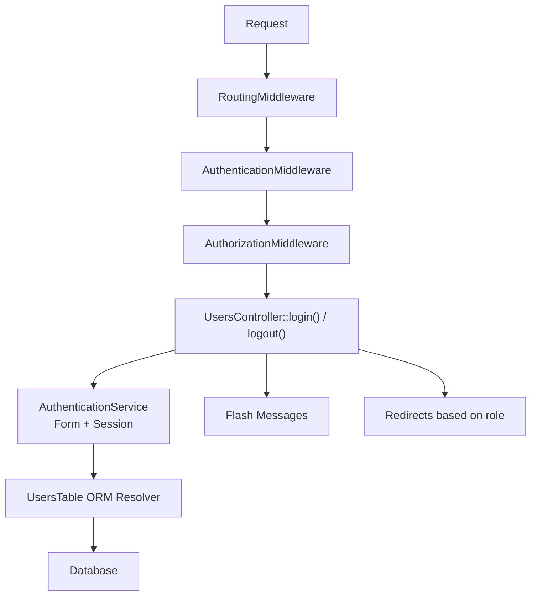
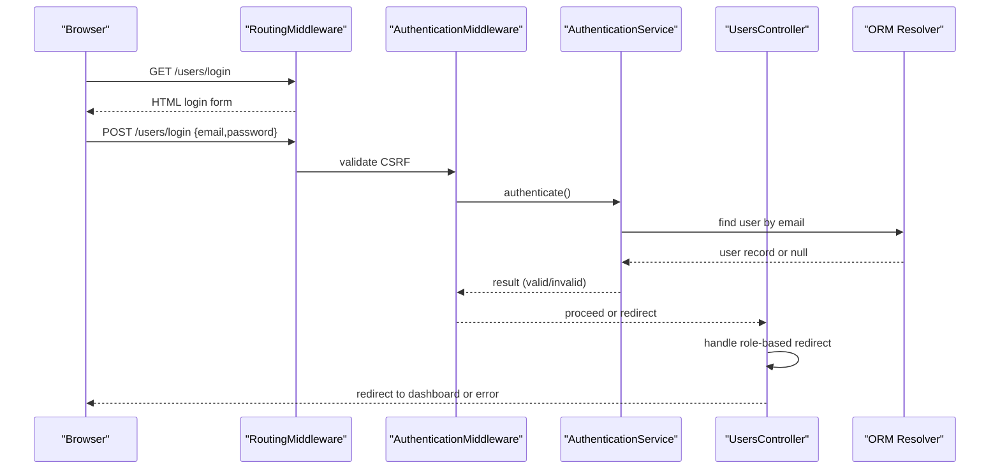
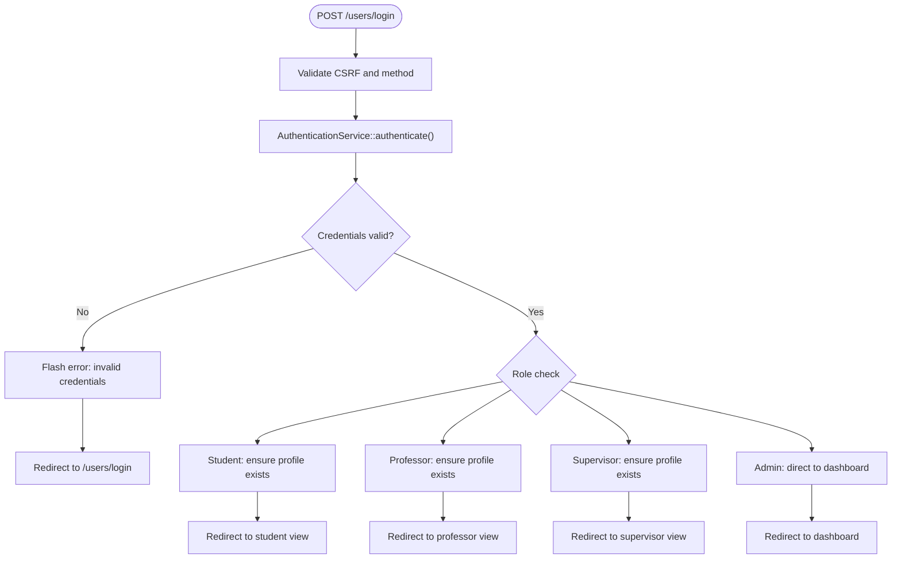
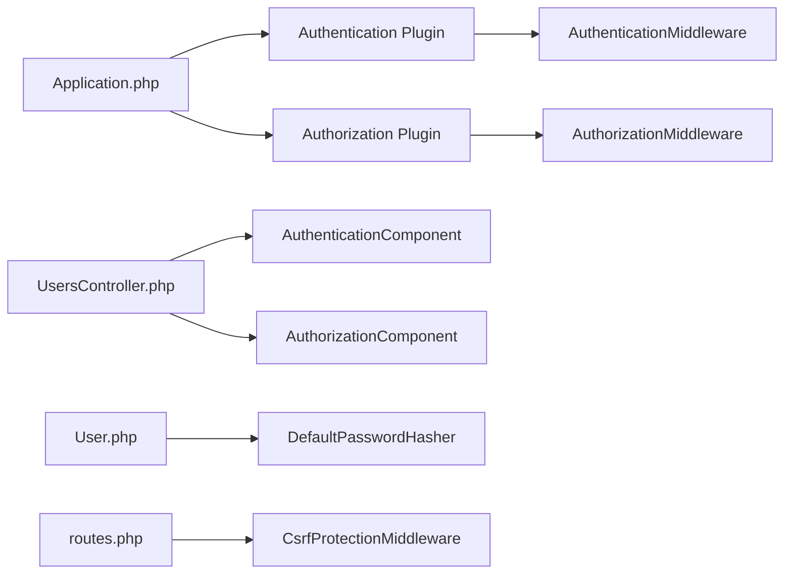

# Authentication System

<cite>
**Referenced Files in This Document**
- [Application.php](file://src/Application.php)
- [UsersController.php](file://src/Controller/UsersController.php)
- [AppController.php](file://src/Controller/AppController.php)
- [User.php](file://src/Model/Entity/User.php)
- [login.php](file://templates/Users/login.php)
- [app.php](file://config/app.php)
- [routes.php](file://config/routes.php)
- [sessions.sql](file://config/schema/sessions.sql)
</cite>

## Table of Contents
1. [Introduction](#introduction)
2. [Project Structure](#project-structure)
3. [Core Components](#core-components)
4. [Architecture Overview](#architecture-overview)
5. [Detailed Component Analysis](#detailed-component-analysis)
6. [Dependency Analysis](#dependency-analysis)
7. [Performance Considerations](#performance-considerations)
8. [Troubleshooting Guide](#troubleshooting-guide)
9. [Conclusion](#conclusion)

## Introduction
This document explains the authentication system implemented in this CakePHP application using the Authentication plugin. It covers:
- Configuration of the Authentication service and middleware stack
- Session-based authentication flow and form-based login
- Password hashing via DefaultPasswordHasher on the User entity
- CSRF protection and secure session handling
- Login form handling, credential validation, session management, and logout

## Project Structure
The authentication implementation spans several layers:
- Application bootstrap and middleware configuration
- Authentication service setup with authenticators (Session and Form)
- Controller actions for login/logout and user registration
- Entity-level password hashing
- Routes and CSRF middleware
- Session configuration and optional database-backed sessions

**Diagram sources**
- [Application.php:91-113](file://src/Application.php#L91-L113)
- [UsersController.php:34-171](file://src/Controller/UsersController.php#L34-L171)
- [routes.php:48-58](file://config/routes.php#L48-L58)

**Section sources**
- [Application.php:91-113](file://src/Application.php#L91-L113)
- [routes.php:48-58](file://config/routes.php#L48-L58)

## Core Components
- Authentication service: configured in Application to use Session and Form authenticators with an Orm resolver for Users table.
- Middleware stack: Error handling, assets, routing, Authentication, Authorization.
- User entity: password field is hashed automatically using DefaultPasswordHasher when set.
- Controllers: UsersController handles login, logout, and registration; AppController loads Authentication and Authorization components and sets unauthenticated actions globally.
- Routes: CSRF protection middleware applied globally.
- Sessions: default PHP sessions; schema provided for database sessions if needed.

**Section sources**
- [Application.php:135-165](file://src/Application.php#L135-L165)
- [Application.php:91-113](file://src/Application.php#L91-L113)
- [User.php:53-58](file://src/Model/Entity/User.php#L53-L58)
- [UsersController.php:23-32](file://src/Controller/UsersController.php#L23-L32)
- [AppController.php:44-67](file://src/Controller/AppController.php#L44-L67)
- [routes.php:48-58](file://config/routes.php#L48-L58)
- [app.php:398-400](file://config/app.php#L398-L400)
- [sessions.sql:8-15](file://config/schema/sessions.sql#L8-L15)

## Architecture Overview
The request lifecycle for authentication involves:
- Routing and CSRF validation
- Authentication middleware checking identity via Session first, then Form submission
- Authorization middleware enforcing policies after authentication
- Controller actions processing login results and redirecting by role

**Diagram sources**
- [routes.php:48-58](file://config/routes.php#L48-L58)
- [Application.php:91-113](file://src/Application.php#L91-L113)
- [Application.php:135-165](file://src/Application.php#L135-L165)
- [UsersController.php:34-171](file://src/Controller/UsersController.php#L34-L171)

## Detailed Component Analysis

### Authentication Service Setup
- The application implements the Authentication service provider interface and returns a configured AuthenticationService.
- Authenticators loaded:
  - Session: checks existing authenticated sessions
  - Form: validates credentials from login form
- Form authenticator fields map username to email and password to password.
- Identifier uses the Orm resolver against the Users table with matching fields.
- Unauthenticated redirect target and query parameter for redirection are configured.

Security notes:
- Uses Orm resolver to fetch users securely.
- Redirects unauthenticated requests to a safe route.

**Section sources**
- [Application.php:135-165](file://src/Application.php#L135-L165)

### Middleware Stack
- Order: ErrorHandler -> Asset -> Routing -> Authentication -> Authorization.
- Authentication runs after routing so controllers can be resolved before identity checks.
- Authorization runs after authentication to enforce policies on authenticated identities.

CSRF protection:
- CsrfProtectionMiddleware is registered and applied to all routes with httponly enabled.

**Section sources**
- [Application.php:91-113](file://src/Application.php#L91-L113)
- [routes.php:48-58](file://config/routes.php#L48-L58)

### User Entity and Password Hashing
- The User entity overrides the password setter to hash passwords using DefaultPasswordHasher whenever a non-empty password is provided.
- Password is hidden in JSON serialization to prevent accidental exposure.

Best practices:
- Always store only hashed passwords.
- Ensure password field is not mass assignable unless necessary; here it is allowed for registration flows.

**Section sources**
- [User.php:53-58](file://src/Model/Entity/User.php#L53-L58)
- [User.php:65-67](file://src/Model/Entity/User.php#L65-L67)

### Login Flow and Form Handling
- The login template renders a form with email and password fields.
- UsersController::login():
  - Skips authorization for login/add/logout.
  - Allows GET/POST methods.
  - Retrieves authentication result; if valid, redirects based on user category (student, professor, supervisor, admin).
  - On failed POST, shows an error message and redirects back to login.
- Registration flow (add action) creates a new user and associates them with student/professor/supervisor records where applicable.

**Diagram sources**
- [UsersController.php:34-171](file://src/Controller/UsersController.php#L34-L171)
- [routes.php:48-58](file://config/routes.php#L48-L58)

**Section sources**
- [login.php:13-31](file://templates/Users/login.php#L13-L31)
- [UsersController.php:34-171](file://src/Controller/UsersController.php#L34-L171)

### Logout Functionality
- UsersController::logout():
  - Skips authorization.
  - If user is logged in, calls logout to clear session identity and flashes a goodbye message.
  - Redirects to login page.

**Section sources**
- [UsersController.php:158-171](file://src/Controller/UsersController.php#L158-L171)

### Global Authentication and Authorization
- AppController loads Authentication and Authorization components and exposes identity to views.
- Adds global unauthenticated actions (index, view, busca, download) across controllers.
- UsersController further whitelists login, add, and logout.

**Section sources**
- [AppController.php:44-67](file://src/Controller/AppController.php#L44-L67)
- [UsersController.php:23-32](file://src/Controller/UsersController.php#L23-L32)

### Session Management
- Sessions are configured to use PHP defaults.
- A schema for database-backed sessions is provided for scalability and persistence needs.

Recommendations:
- For multi-server deployments, switch to database or cache-backed sessions.
- Ensure session cookie settings align with HTTPS-only environments.

**Section sources**
- [app.php:398-400](file://config/app.php#L398-L400)
- [sessions.sql:8-15](file://config/schema/sessions.sql#L8-L15)

## Dependency Analysis
Key dependencies and relationships:
- Application depends on Authentication and Authorization plugins and configures their middleware.
- UsersController depends on AuthenticationComponent and AuthorizationComponent.
- User entity depends on DefaultPasswordHasher for secure password storage.
- Routes apply CSRF middleware globally.

**Diagram sources**
- [Application.php:91-113](file://src/Application.php#L91-L113)
- [Application.php:135-165](file://src/Application.php#L135-L165)
- [UsersController.php:23-32](file://src/Controller/UsersController.php#L23-L32)
- [User.php:53-58](file://src/Model/Entity/User.php#L53-L58)
- [routes.php:48-58](file://config/routes.php#L48-L58)

**Section sources**
- [Application.php:91-113](file://src/Application.php#L91-L113)
- [Application.php:135-165](file://src/Application.php#L135-L165)
- [UsersController.php:23-32](file://src/Controller/UsersController.php#L23-L32)
- [User.php:53-58](file://src/Model/Entity/User.php#L53-L58)
- [routes.php:48-58](file://config/routes.php#L48-L58)

## Performance Considerations
- Prefer database-backed sessions for horizontal scaling and centralized session stores.
- Avoid unnecessary queries in login flow; the current flow performs lookups to associate roles post-login, which is acceptable but consider caching role mappings if frequent.
- Keep debug mode off in production to reduce overhead and avoid leaking sensitive information.

[No sources needed since this section provides general guidance]

## Troubleshooting Guide
Common issues and resolutions:
- Invalid credentials:
  - Ensure email/password mapping matches the form fields and identifier configuration.
  - Verify that the Users table contains correctly hashed passwords.
- Redirect loops after login:
  - Check role-based redirects and whether associated profiles exist for students/professors/supervisors.
- CSRF errors on login:
  - Confirm CSRF middleware is applied and forms include required tokens if used.
- Session not persisting:
  - Verify session handler configuration and ensure cookies are properly set and accepted by the browser.

**Section sources**
- [UsersController.php:34-171](file://src/Controller/UsersController.php#L34-L171)
- [routes.php:48-58](file://config/routes.php#L48-L58)
- [app.php:398-400](file://config/app.php#L398-L400)

## Conclusion
This application implements a robust authentication system using CakePHP’s Authentication plugin:
- Secure password hashing at the entity level
- Middleware-driven authentication and authorization
- CSRF protection on all routes
- Role-aware redirects after successful login
- Clear separation between authentication, authorization, and business logic

For enhanced security and scalability:
- Enforce HTTPS and secure session cookies
- Use database-backed sessions in production
- Regularly audit access controls and role assignments

[No sources needed since this section summarizes without analyzing specific files]