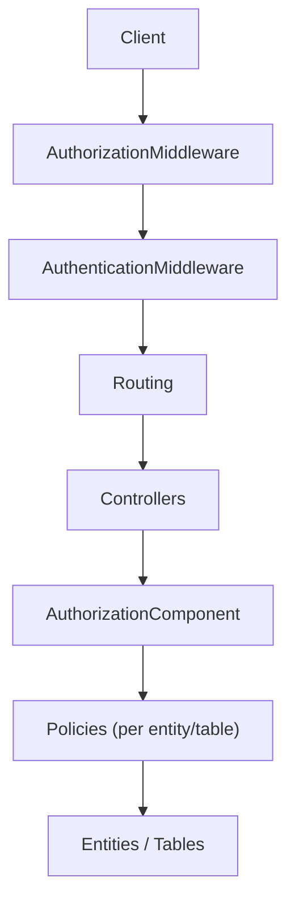
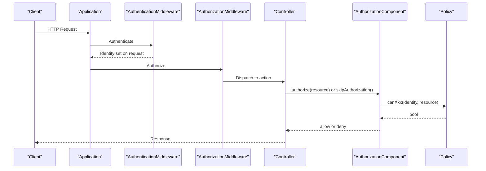
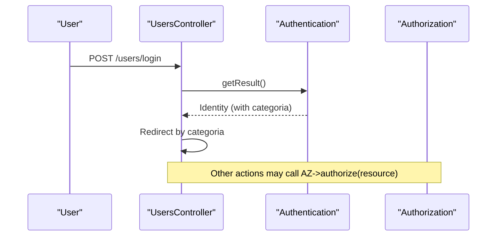
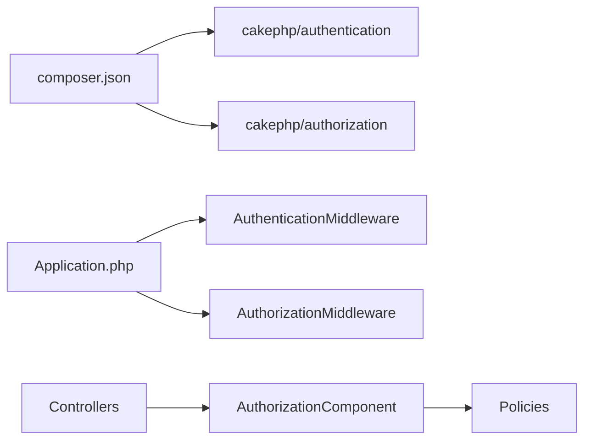

# Authorization and Policies

<cite>
**Referenced Files in This Document**
- [Application.php](file://src/Application.php)
- [AppController.php](file://src/Controller/AppController.php)
- [UsersController.php](file://src/Controller/UsersController.php)
- [UserPolicy.php](file://src/Policy/UserPolicy.php)
- [UsersTablePolicy.php](file://src/Policy/UsersTablePolicy.php)
- [EstudantePolicy.php](file://src/Policy/EstudantePolicy.php)
- [ProfessorPolicy.php](file://src/Policy/ProfessorPolicy.php)
- [MonografiaPolicy.php](file://src/Policy/MonografiaPolicy.php)
- [User.php](file://src/Model/Entity/User.php)
- [composer.json](file://composer.json)
</cite>

## Table of Contents
1. [Introduction](#introduction)
2. [Project Structure](#project-structure)
3. [Core Components](#core-components)
4. [Architecture Overview](#architecture-overview)
5. [Detailed Component Analysis](#detailed-component-analysis)
6. [Dependency Analysis](#dependency-analysis)
7. [Performance Considerations](#performance-considerations)
8. [Troubleshooting Guide](#troubleshooting-guide)
9. [Conclusion](#conclusion)
10. [Appendices](#appendices)

## Introduction
This document explains the authorization system built with CakePHP’s Authorization plugin and policy-based access control. It focuses on how roles are modeled via a user category field, how policies enforce permissions for students, professors, and administrators, and how controllers integrate with the Authorization middleware to protect resources. It also covers best practices, common security patterns, and approaches to testing policies.

## Project Structure
The authorization system is implemented across three layers:
- Middleware layer: Authentication and Authorization plugins are registered and executed in the correct order.
- Controller layer: Controllers load the Authorization component, skip authorization where appropriate (e.g., login), and explicitly authorize actions or resources.
- Policy layer: Per-resource policies define fine-grained rules based on the current identity and resource attributes.



**Diagram sources**
- [Application.php:91-113](file://src/Application.php#L91-L113)
- [AppController.php:44-67](file://src/Controller/AppController.php#L44-L67)
- [UsersController.php:23-32](file://src/Controller/UsersController.php#L23-L32)

**Section sources**
- [Application.php:62-113](file://src/Application.php#L62-L113)
- [AppController.php:44-67](file://src/Controller/AppController.php#L44-L67)

## Core Components
- Application bootstrap registers the Authorization and Authentication plugins and configures the middleware pipeline so that authentication runs before authorization.
- AppController loads the Authentication and Authorization components and defines unauthenticated actions globally.
- UsersController demonstrates explicit authorization usage and role-based redirects after login.
- Policies implement per-resource permission checks using the current identity’s role (categoria).

Key implementation highlights:
- Role model: The User entity stores a numeric/string category (categoria) used by policies to determine permissions.
- Policy methods: canView, canAdd, canEdit, canDelete map to controller actions and resource operations.
- Controller integration: Controllers call $this->Authorization->authorize($resource) or skip authorization for public flows.

**Section sources**
- [Application.php:81-113](file://src/Application.php#L81-L113)
- [AppController.php:44-67](file://src/Controller/AppController.php#L44-L67)
- [UsersController.php:23-32](file://src/Controller/UsersController.php#L23-L32)
- [User.php:16-21](file://src/Model/Entity/User.php#L16-L21)

## Architecture Overview
The request lifecycle enforces authorization through middleware and component calls:



**Diagram sources**
- [Application.php:91-113](file://src/Application.php#L91-L113)
- [UsersController.php:34-37](file://src/Controller/UsersController.php#L34-L37)
- [UsersController.php:200-206](file://src/Controller/UsersController.php#L200-L206)

## Detailed Component Analysis

### UserPolicy and Role-Based Permissions
- Role model: Users have a categoria field indicating their role. Based on usage across policies and controllers, the following mapping is evident:
  - Administrators: categoria '1'
  - Students: categoria '2'
  - Professors: categoria '3'
  - Supervisors: categoria '4'
- Permission rules observed:
  - Admin-only write operations: canAdd, canEdit, canDelete typically require categoria '1'.
  - Read operations: canView often allows broader access (e.g., true for some entities), enabling public or authenticated reads.
  - Some policies restrict view to admin only (e.g., UserPolicy canView requires categoria '1').

```mermaid
flowchart TD
Start(["Authorize Action"]) --> CheckRole["Check identity.categoria"]
CheckRole --> |'1' AdminWrite["Allow write (add/edit/delete)"]
CheckRole --> |'2','3','4' Restricted["Deny write unless policy allows"]
CheckRole --> |any| ViewRule{"View rule?"}
ViewRule --> |true| AllowView["Allow view"]
ViewRule --> |false| Deny["Deny access"]
```

**Diagram sources**
- [UserPolicy.php:21-61](file://src/Policy/UserPolicy.php#L21-L61)
- [EstudantePolicy.php:22-57](file://src/Policy/EstudantePolicy.php#L22-L57)
- [ProfessorPolicy.php:21-60](file://src/Policy/ProfessorPolicy.php#L21-L60)
- [MonografiaPolicy.php:21-61](file://src/Policy/MonografiaPolicy.php#L21-L61)

**Section sources**
- [UserPolicy.php:21-61](file://src/Policy/UserPolicy.php#L21-L61)
- [UsersTablePolicy.php:22-24](file://src/Policy/UsersTablePolicy.php#L22-L24)
- [EstudantePolicy.php:22-57](file://src/Policy/EstudantePolicy.php#L22-L57)
- [ProfessorPolicy.php:21-60](file://src/Policy/ProfessorPolicy.php#L21-L60)
- [MonografiaPolicy.php:21-61](file://src/Policy/MonografiaPolicy.php#L21-L61)

### Integration with Controllers
- Global setup: AppController loads Authentication and Authorization components and declares global unauthenticated actions (index, view, busca, download).
- Login flow: UsersController skips authorization for login/add/logout and uses Authentication to handle credentials. After successful login, it routes users based on categoria.
- Resource protection: For sensitive actions, controllers retrieve the resource and call $this->Authorization->authorize($resource) to enforce policies.



**Diagram sources**
- [UsersController.php:23-32](file://src/Controller/UsersController.php#L23-L32)
- [UsersController.php:34-156](file://src/Controller/UsersController.php#L34-L156)
- [UsersController.php:200-206](file://src/Controller/UsersController.php#L200-L206)

**Section sources**
- [AppController.php:44-67](file://src/Controller/AppController.php#L44-L67)
- [UsersController.php:23-32](file://src/Controller/UsersController.php#L23-L32)
- [UsersController.php:34-156](file://src/Controller/UsersController.php#L34-L156)
- [UsersController.php:200-206](file://src/Controller/UsersController.php#L200-L206)

### Fine-Grained Resource Access Control
- Table-level policies: UsersTablePolicy controls list/index access for Users, requiring admin role.
- Entity-level policies: Each entity has its own policy class defining canView/canAdd/canEdit/canDelete.
- Conditional logic: Policies inspect identity.categoria and sometimes resource attributes to decide access.

Examples of patterns:
- Admin-only writes: Many canAdd/canEdit/canDelete return true only when identity.categoria == '1'.
- Public or broad read: Some canView return true to allow viewing without strict role checks.
- Mixed policies: UserPolicy restricts view to admin, while other entities allow broader view access.

**Section sources**
- [UsersTablePolicy.php:22-24](file://src/Policy/UsersTablePolicy.php#L22-L24)
- [UserPolicy.php:21-61](file://src/Policy/UserPolicy.php#L21-L61)
- [EstudantePolicy.php:22-57](file://src/Policy/EstudantePolicy.php#L22-L57)
- [ProfessorPolicy.php:21-60](file://src/Policy/ProfessorPolicy.php#L21-L60)
- [MonografiaPolicy.php:21-61](file://src/Policy/MonografiaPolicy.php#L21-L61)

### Policy Rule Definitions and Inheritance Patterns
- Rule definitions: Each policy method maps to an operation (view/add/edit/delete) and returns a boolean decision based on identity and resource.
- Inheritance pattern: No base policy class is used; each policy is self-contained. Reuse is achieved by consistent checks against identity.categoria.
- Best practice note: To reduce duplication, consider extracting common checks into helper methods within policies or a shared base policy if future refactoring is needed.

**Section sources**
- [UserPolicy.php:21-61](file://src/Policy/UserPolicy.php#L21-L61)
- [EstudantePolicy.php:22-57](file://src/Policy/EstudantePolicy.php#L22-L57)
- [ProfessorPolicy.php:21-60](file://src/Policy/ProfessorPolicy.php#L21-L60)
- [MonografiaPolicy.php:21-61](file://src/Policy/MonografiaPolicy.php#L21-L61)

### Custom Policy Rules and Conditional Authorization Logic
- Conditional logic examples:
  - Admin-only operations: Checks identity.categoria == '1' for add/edit/delete.
  - Open views: Some policies allow view access broadly.
  - Mixed restrictions: UserPolicy restricts view to admin, while others do not.
- Extensibility: Add new conditions inside policy methods (e.g., ownership checks, status flags) to implement fine-grained rules without changing controllers.

**Section sources**
- [UserPolicy.php:21-61](file://src/Policy/UserPolicy.php#L21-L61)
- [EstudantePolicy.php:22-57](file://src/Policy/EstudantePolicy.php#L22-L57)
- [ProfessorPolicy.php:21-60](file://src/Policy/ProfessorPolicy.php#L21-L60)
- [MonografiaPolicy.php:21-61](file://src/Policy/MonografiaPolicy.php#L21-L61)

### Testing Approaches for Policies
- Unit tests for policies: Create test cases that instantiate policies with mock identities and resources, then assert allowed/denied outcomes for each canXxx method.
- Controller tests: Use the application test harness to simulate requests and verify that unauthorized actions are denied and authorized actions succeed.
- Assertions: Validate that admin-only endpoints return forbidden/unauthorized responses for non-admin identities, and that open endpoints behave as expected.

[No sources needed since this section provides general guidance]

## Dependency Analysis
The authorization stack depends on the following core dependencies and integrations:



**Diagram sources**
- [composer.json:7-15](file://composer.json#L7-L15)
- [Application.php:81-113](file://src/Application.php#L81-L113)

**Section sources**
- [composer.json:7-15](file://composer.json#L7-L15)
- [Application.php:81-113](file://src/Application.php#L81-L113)

## Performance Considerations
- Keep policy checks lightweight: Avoid heavy database queries inside canXxx methods; prefer checking identity attributes already loaded.
- Minimize scope: Only fetch necessary data in controllers before authorizing to reduce overhead.
- Cache decisions where appropriate: If complex conditions are evaluated frequently, consider caching results at the service or request level.

[No sources needed since this section provides general guidance]

## Troubleshooting Guide
Common issues and resolutions:
- Unauthorized access errors: Ensure controllers call $this->Authorization->authorize($resource) for protected actions and that policies return the intended boolean.
- Login bypassing authorization: Verify that login-related actions intentionally skip authorization and that subsequent actions enforce it.
- Role mismatches: Confirm identity.categoria values match policy expectations (e.g., '1' for admin).
- Global vs local unauthenticated actions: Check AppController’s global list and any controller-specific overrides.

**Section sources**
- [AppController.php:44-67](file://src/Controller/AppController.php#L44-L67)
- [UsersController.php:23-32](file://src/Controller/UsersController.php#L23-L32)
- [UsersController.php:200-206](file://src/Controller/UsersController.php#L200-L206)

## Conclusion
The application implements robust, policy-based authorization using CakePHP’s Authorization plugin. Roles are modeled via a simple category field, and policies enforce granular permissions per resource. Controllers integrate seamlessly with the Authorization component to protect actions and resources. Following the patterns shown here ensures clear, maintainable, and secure access control across the application.

[No sources needed since this section summarizes without analyzing specific files]

## Appendices

### Security Best Practices
- Always authorize sensitive actions explicitly in controllers.
- Prefer deny-by-default policies and grant minimal privileges.
- Validate identity presence before accessing attributes in policies.
- Avoid storing sensitive data in session beyond what is required.
- Regularly audit policies and controller logic for unintended access paths.

[No sources needed since this section provides general guidance]