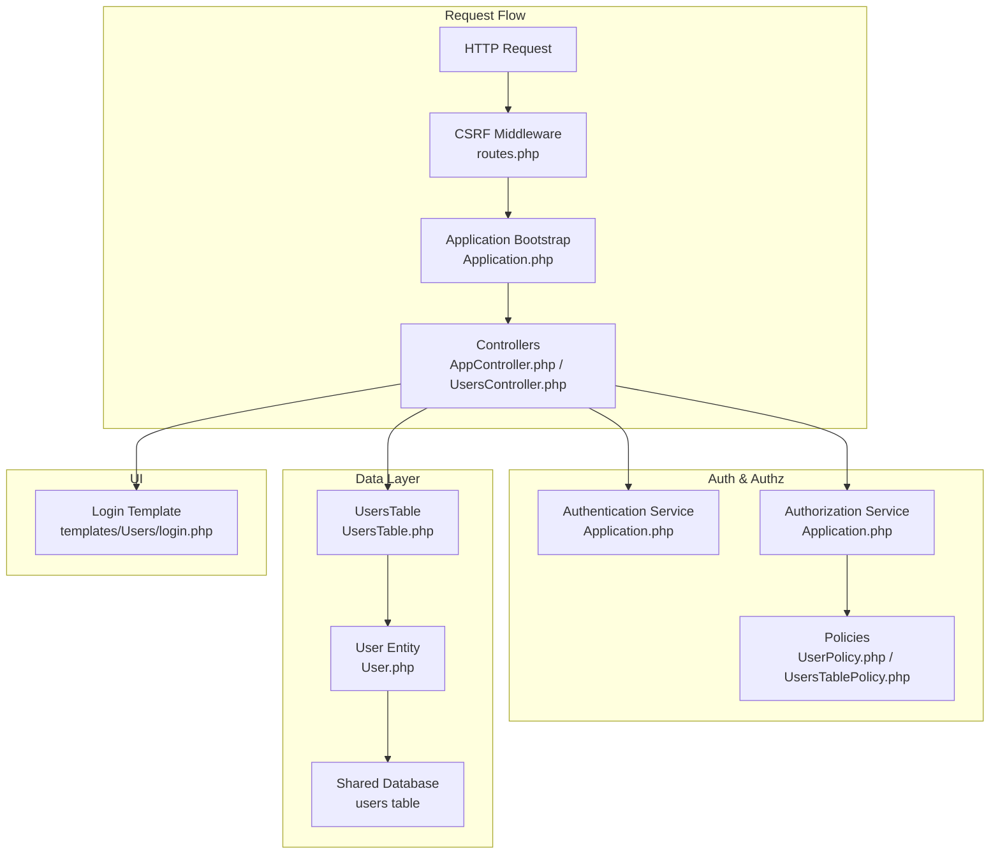
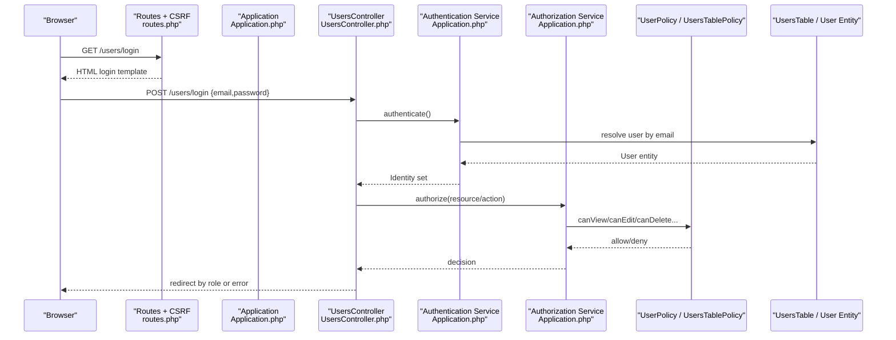
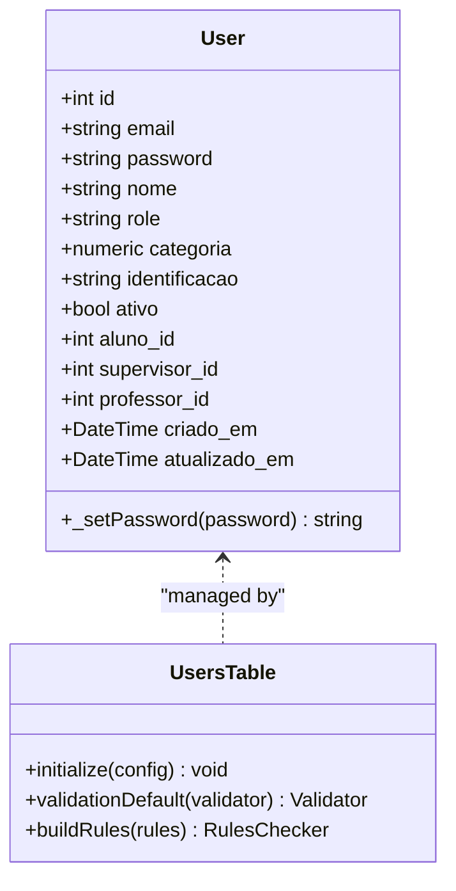
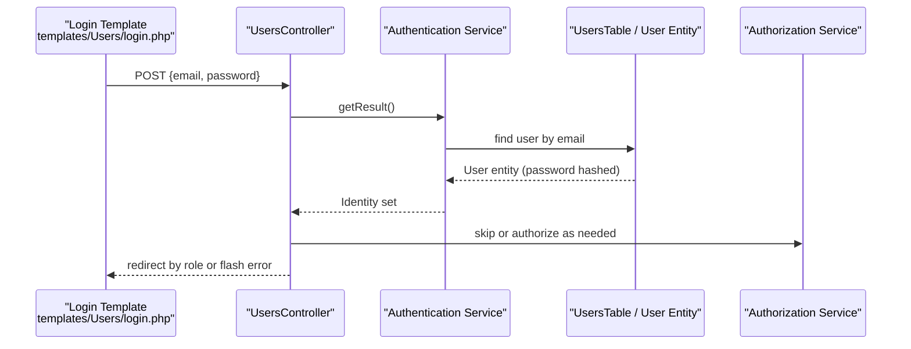
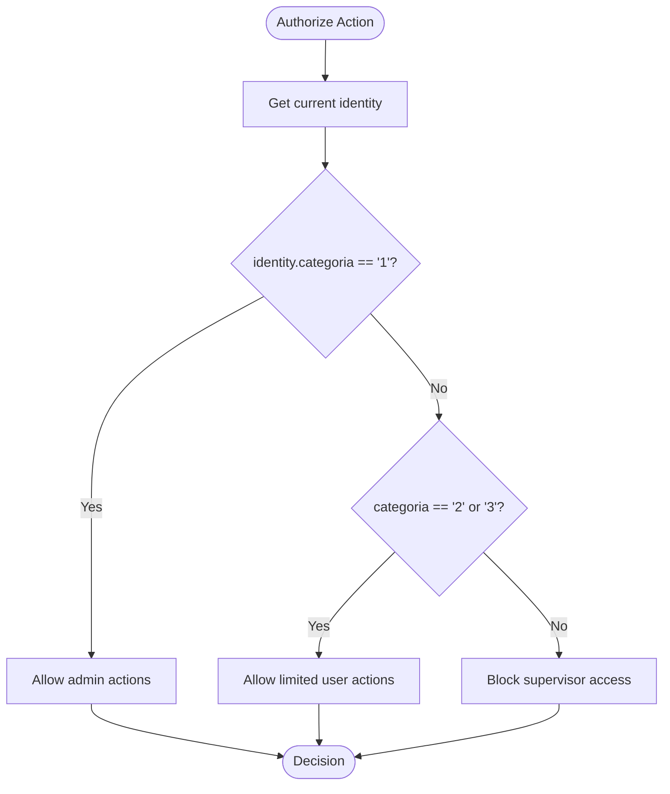
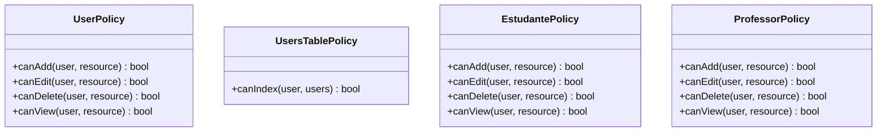
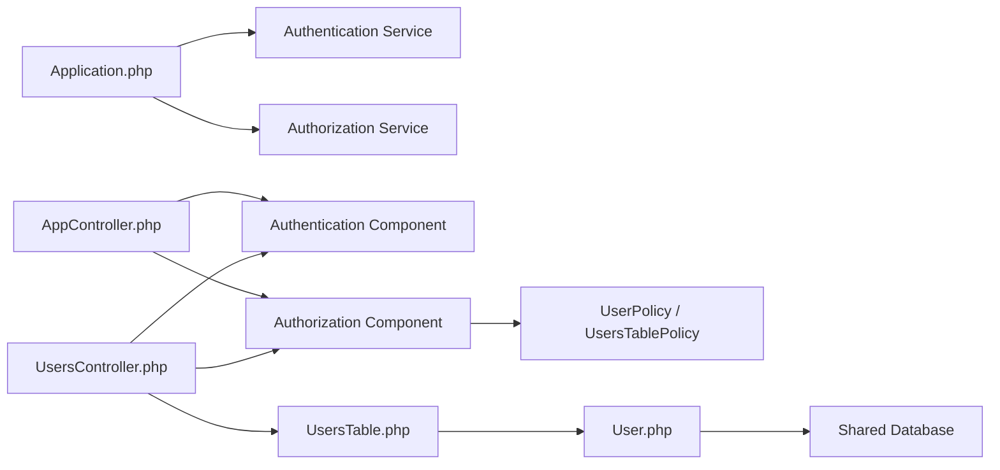

# User Management System

<cite>
**Referenced Files in This Document**
- [Application.php](file://src/Application.php)
- [AppController.php](file://src/Controller/AppController.php)
- [UsersController.php](file://src/Controller/UsersController.php)
- [UserPolicy.php](file://src/Policy/UserPolicy.php)
- [UsersTablePolicy.php](file://src/Policy/UsersTablePolicy.php)
- [EstudantePolicy.php](file://src/Policy/EstudantePolicy.php)
- [ProfessorPolicy.php](file://src/Policy/ProfessorPolicy.php)
- [User.php](file://src/Model/Entity/User.php)
- [UsersTable.php](file://src/Model/Table/UsersTable.php)
- [login.php](file://templates/Users/login.php)
- [routes.php](file://config/routes.php)
- [app.php](file://config/app.php)
</cite>

## Update Summary
**Changes Made**
- Updated User entity structure to reflect enhanced field definitions and mass assignment configuration
- Enhanced validation rules section with comprehensive field validation details
- Updated authentication service configuration with improved field mappings
- Added documentation for shared table architecture supporting multiple applications
- Strengthened security considerations with enhanced password hashing implementation

## Table of Contents
1. [Introduction](#introduction)
2. [Project Structure](#project-structure)
3. [Core Components](#core-components)
4. [Architecture Overview](#architecture-overview)
5. [Detailed Component Analysis](#detailed-component-analysis)
6. [Dependency Analysis](#dependency-analysis)
7. [Performance Considerations](#performance-considerations)
8. [Troubleshooting Guide](#troubleshooting-guide)
9. [Conclusion](#conclusion)

## Introduction
This document explains the user management system implemented in this CakePHP application. It covers authentication, authorization, and role-based access control (RBAC) using CakePHP's Authentication and Authorization plugins. The system features a shared user table architecture that supports multiple applications (TCC5 and mural5), with enhanced validation rules and field mappings for improved security and data integrity. It details the User entity structure, session-based login flow, form-based authentication, policy-driven authorization for fine-grained control, and security measures such as password hashing, CSRF protection, and input validation.

## Project Structure
The user management system spans controllers, models, policies, templates, and configuration:
- Controllers handle login/logout, registration, and user CRUD operations with authorization checks
- Models define the User entity and table with enhanced validation rules and associations for shared table architecture
- Policies enforce RBAC based on a numeric category field representing roles
- Templates provide the login form and integrate with CakePHP's Form helper
- Configuration wires up Authentication and Authorization services, middleware, and sessions

**Diagram sources**
- [routes.php:48-58](file://config/routes.php#L48-L58)
- [Application.php:135-170](file://src/Application.php#L135-L170)
- [AppController.php:44-67](file://src/Controller/AppController.php#L44-L67)
- [UsersController.php:23-32](file://src/Controller/UsersController.php#L23-L32)
- [UserPolicy.php:12-63](file://src/Policy/UserPolicy.php#L12-L63)
- [UsersTablePolicy.php:13-26](file://src/Policy/UsersTablePolicy.php#L13-L26)
- [UsersTable.php:40-59](file://src/Model/Table/UsersTable.php#L40-L59)
- [User.php:27-69](file://src/Model/Entity/User.php#L27-L69)
- [login.php:13-31](file://templates/Users/login.php#L13-L31)

**Section sources**
- [routes.php:48-58](file://config/routes.php#L48-L58)
- [Application.php:135-170](file://src/Application.php#L135-L170)
- [AppController.php:44-67](file://src/Controller/AppController.php#L44-L67)
- [UsersController.php:23-32](file://src/Controller/UsersController.php#L23-L32)
- [UserPolicy.php:12-63](file://src/Policy/UserPolicy.php#L12-L63)
- [UsersTablePolicy.php:13-26](file://src/Policy/UsersTablePolicy.php#L13-L26)
- [UsersTable.php:40-59](file://src/Model/Table/UsersTable.php#L40-L59)
- [User.php:27-69](file://src/Model/Entity/User.php#L27-L69)
- [login.php:13-31](file://templates/Users/login.php#L13-L31)

## Core Components
- Authentication service: Configured to use Session and Form authenticators, with Orm resolver for credential lookup against the Users table
- Authorization service: Uses an ORM resolver to map controller actions to policy methods
- Policies: Role checks are based on the User entity's categoria field (e.g., "1" for administrators)
- User model: Defines enhanced fields, comprehensive validation rules, and secure password hashing via entity setter
- Controllers: Handle login/logout flows, redirect by role, and enforce authorization on protected actions
- Templates: Provide the login form bound to email/password fields expected by the authentication service

Key implementation references:
- Authentication setup and form fields mapping: [Application.php:135-164](file://src/Application.php#L135-L164)
- Global components and unauthenticated actions: [AppController.php:44-67](file://src/Controller/AppController.php#L44-L67)
- Login/logout and role-based redirects: [UsersController.php:23-171](file://src/Controller/UsersController.php#L23-L171)
- User entity password hashing and hidden fields: [User.php:27-69](file://src/Model/Entity/User.php#L27-L69)
- Enhanced validation rules for users: [UsersTable.php:67-108](file://src/Model/Table/UsersTable.php#L67-L108)
- CSRF middleware applied to routes: [routes.php:48-58](file://config/routes.php#L48-L58)
- Session defaults: [app.php:398-400](file://config/app.php#L398-L400)

**Section sources**
- [Application.php:135-170](file://src/Application.php#L135-L170)
- [AppController.php:44-67](file://src/Controller/AppController.php#L44-L67)
- [UsersController.php:23-171](file://src/Controller/UsersController.php#L23-L171)
- [User.php:27-69](file://src/Model/Entity/User.php#L27-L69)
- [UsersTable.php:67-108](file://src/Model/Table/UsersTable.php#L67-L108)
- [routes.php:48-58](file://config/routes.php#L48-L58)
- [app.php:398-400](file://config/app.php#L398-L400)

## Architecture Overview
The system uses CakePHP's plugin architecture with a shared table design:
- Application bootstraps Authentication and Authorization plugins
- Requests pass through CSRF middleware, then hit controllers that rely on Authentication/Authorization components
- The Authentication service validates credentials via Session or Form authenticator and sets the identity
- The Authorization service enforces policies per action/resource
- Shared table architecture supports multiple applications (TCC5 and mural5) while maintaining separation of concerns

**Diagram sources**
- [routes.php:48-58](file://config/routes.php#L48-L58)
- [Application.php:135-170](file://src/Application.php#L135-L170)
- [UsersController.php:34-156](file://src/Controller/UsersController.php#L34-L156)
- [UserPolicy.php:12-63](file://src/Policy/UserPolicy.php#L12-L63)
- [UsersTablePolicy.php:13-26](file://src/Policy/UsersTablePolicy.php#L13-L26)
- [UsersTable.php:40-59](file://src/Model/Table/UsersTable.php#L40-L59)
- [User.php:27-69](file://src/Model/Entity/User.php#L27-L69)

## Detailed Component Analysis

### User Entity and Table - Enhanced Structure
**Updated** Enhanced with additional fields and improved mass assignment configuration for shared table architecture

- **Fields**: id, email, password, nome, role, categoria, identificacao, ativo, aluno_id, supervisor_id, professor_id, criado_em, atualizado_em
- **Mass Assignment**: Explicitly configured for security with specific field allowances
- **Password Security**: Automatic hashing via DefaultPasswordHasher when password is set
- **Validation**: Comprehensive rules including email format, password length limits, and valid categoria values
- **Shared Architecture**: Designed to support both TCC5 and mural5 applications while maintaining data integrity

**Diagram sources**
- [User.php:27-69](file://src/Model/Entity/User.php#L27-L69)
- [UsersTable.php:40-125](file://src/Model/Table/UsersTable.php#L40-L125)

**Section sources**
- [User.php:27-69](file://src/Model/Entity/User.php#L27-L69)
- [UsersTable.php:40-125](file://src/Model/Table/UsersTable.php#L40-L125)

### Authentication Service and Login Flow - Enhanced Configuration
**Updated** Improved field mappings and authentication flow with enhanced validation

- **Authentication Service**: Loads Session and Form authenticators with enhanced field mapping
- **Field Mapping**: Maps username to email and password to password using ORM resolver against Users table
- **Unauthenticated Actions**: login, add, logout explicitly allowed for public access
- **Role-Based Redirection**: Enhanced logic handles different user categories (students, professors, administrators, supervisors)
- **Shared Table Support**: Maintains compatibility with mural5 while focusing on TCC5 functionality

**Diagram sources**
- [login.php:13-31](file://templates/Users/login.php#L13-L31)
- [UsersController.php:34-156](file://src/Controller/UsersController.php#L34-L156)
- [Application.php:135-164](file://src/Application.php#L135-L164)
- [UsersTable.php:40-59](file://src/Model/Table/UsersTable.php#L40-L59)
- [User.php:27-69](file://src/Model/Entity/User.php#L27-L69)

**Section sources**
- [Application.php:135-164](file://src/Application.php#L135-L164)
- [UsersController.php:34-156](file://src/Controller/UsersController.php#L34-L156)
- [login.php:13-31](file://templates/Users/login.php#L13-L31)

### Authorization and Role-Based Access Control - Enhanced Policies
**Updated** Strengthened role checks with improved validation and shared table support

- **Roles**: Represented by numeric categoria field on User entity with enhanced validation
- **Policy Enforcement**: 
  - Administrators (categoria "1") have full permissions
  - Students (categoria "2") and Professors (categoria "3") have restricted access
  - Supervisors (categoria "4") are blocked from TCC5 access but supported for mural5
- **Table-Level Policies**: Restrict listing/indexing to administrators only
- **Shared Architecture**: Maintains backward compatibility with mural5 requirements

**Diagram sources**
- [UserPolicy.php:21-63](file://src/Policy/UserPolicy.php#L21-L63)
- [UsersTablePolicy.php:13-26](file://src/Policy/UsersTablePolicy.php#L13-L26)

**Section sources**
- [UserPolicy.php:21-63](file://src/Policy/UserPolicy.php#L21-L63)
- [UsersTablePolicy.php:13-26](file://src/Policy/UsersTablePolicy.php#L13-L26)

### Policy System for Fine-Grained Authorization - Enhanced Rules
**Updated** Strengthened policy rules with better validation and shared table support

- **Resource-Level Policies**: Govern create/update/delete/view on User entities with enhanced validation
- **Table-Level Policies**: Govern list/index operations on collections with administrator-only access
- **Domain Policies**: EstudantePolicy and ProfessorPolicy follow similar patterns with enhanced restrictions
- **Shared Architecture**: Maintains compatibility with mural5 while enforcing TCC5-specific restrictions

**Diagram sources**
- [UserPolicy.php:12-63](file://src/Policy/UserPolicy.php#L12-L63)
- [UsersTablePolicy.php:13-26](file://src/Policy/UsersTablePolicy.php#L13-L26)
- [EstudantePolicy.php:13-59](file://src/Policy/EstudantePolicy.php#L13-L59)
- [ProfessorPolicy.php:12-62](file://src/Policy/ProfessorPolicy.php#L12-L62)

**Section sources**
- [UserPolicy.php:12-63](file://src/Policy/UserPolicy.php#L12-L63)
- [UsersTablePolicy.php:13-26](file://src/Policy/UsersTablePolicy.php#L13-L26)
- [EstudantePolicy.php:13-59](file://src/Policy/EstudantePolicy.php#L13-L59)
- [ProfessorPolicy.php:12-62](file://src/Policy/ProfessorPolicy.php#L12-L62)

### Session Management - Enhanced Security
**Updated** Improved session handling with enhanced CSRF protection

- **Session Configuration**: Uses PHP defaults configured in application settings
- **Authentication Integration**: Relies on Session authenticator to maintain login state across requests
- **CSRF Protection**: Enabled globally via middleware, protecting forms and state-changing requests
- **Security Enhancements**: HttpOnly cookies and enhanced validation rules

Implementation references:
- Session defaults: [app.php:398-400](file://config/app.php#L398-L400)
- CSRF middleware registration and application: [routes.php:48-58](file://config/routes.php#L48-L58)

**Section sources**
- [app.php:398-400](file://config/app.php#L398-L400)
- [routes.php:48-58](file://config/routes.php#L48-L58)

### Form-Based Login Process - Enhanced Validation
**Updated** Improved form handling with enhanced validation and error handling

- **Form Fields**: Email and password fields matching authentication service configuration
- **Validation**: Enhanced server-side validation with comprehensive error messages
- **Authentication Flow**: Delegates to Authentication component/service for credential validation
- **Role-Based Workflows**: Enhanced redirection logic for different user types

References:
- Login form fields: [login.php:13-31](file://templates/Users/login.php#L13-L31)
- Authentication field mapping: [Application.php:144-162](file://src/Application.php#L144-L162)
- Controller login handling: [UsersController.php:34-156](file://src/Controller/UsersController.php#L34-L156)

**Section sources**
- [login.php:13-31](file://templates/Users/login.php#L13-L31)
- [Application.php:144-162](file://src/Application.php#L144-L162)
- [UsersController.php:34-156](file://src/Controller/UsersController.php#L34-L156)

### User Profile Management - Enhanced Workflow
**Updated** Improved profile management with enhanced validation and shared table support

- **Registration**: Enhanced user creation with comprehensive validation and role association
- **Editing**: Secure user editing with authorization checks and enhanced validation
- **Role Association**: Automatic linking to student, professor, or supervisor records based on category
- **Shared Architecture**: Maintains compatibility with mural5 while providing TCC5-specific functionality

References:
- Add/Edit/Delete flows and role association: [UsersController.php:213-353](file://src/Controller/UsersController.php#L213-L353)
- Authorization calls on resources: [UsersController.php:200-206](file://src/Controller/UsersController.php#L200-L206), [UsersController.php:308-323](file://src/Controller/UsersController.php#L308-L323)

**Section sources**
- [UsersController.php:213-353](file://src/Controller/UsersController.php#L213-L353)
- [UsersController.php:200-206](file://src/Controller/UsersController.php#L200-L206)
- [UsersController.php:308-323](file://src/Controller/UsersController.php#L308-L323)

## Dependency Analysis
**Updated** Enhanced dependency relationships with shared table architecture

- Controllers depend on Authentication and Authorization components loaded in AppController
- Application configures Authentication and Authorization services and plugins
- Policies depend on the IdentityInterface and User entity attributes (notably categoria)
- Data layer depends on UsersTable and User entity for persistence and validation
- Shared table architecture maintains dependencies with both TCC5 and mural5 applications

**Diagram sources**
- [Application.php:135-170](file://src/Application.php#L135-L170)
- [AppController.php:44-67](file://src/Controller/AppController.php#L44-L67)
- [UsersController.php:23-32](file://src/Controller/UsersController.php#L23-L32)
- [UserPolicy.php:12-63](file://src/Policy/UserPolicy.php#L12-L63)
- [UsersTablePolicy.php:13-26](file://src/Policy/UsersTablePolicy.php#L13-L26)
- [UsersTable.php:40-59](file://src/Model/Table/UsersTable.php#L40-L59)
- [User.php:27-69](file://src/Model/Entity/User.php#L27-L69)

**Section sources**
- [Application.php:135-170](file://src/Application.php#L135-L170)
- [AppController.php:44-67](file://src/Controller/AppController.php#L44-L67)
- [UsersController.php:23-32](file://src/Controller/UsersController.php#L23-L32)
- [UserPolicy.php:12-63](file://src/Policy/UserPolicy.php#L12-L63)
- [UsersTablePolicy.php:13-26](file://src/Policy/UsersTablePolicy.php#L13-L26)
- [UsersTable.php:40-59](file://src/Model/Table/UsersTable.php#L40-L59)
- [User.php:27-69](file://src/Model/Entity/User.php#L27-L69)

## Performance Considerations
**Updated** Enhanced performance considerations for shared table architecture

- Keep policy checks minimal and centralized to avoid repeated role checks in controllers
- Use eager loading sparingly; only load necessary associations during user operations
- Ensure database indexes exist on frequently queried fields like email and foreign keys (aluno_id, professor_id, supervisor_id)
- Avoid heavy computations in entity setters; keep password hashing efficient and off critical paths where possible
- Optimize shared table queries to minimize impact on other applications using the same database

[No sources needed since this section provides general guidance]

## Troubleshooting Guide
**Updated** Enhanced troubleshooting guide with shared table considerations

Common issues and resolutions:
- **Invalid credentials**: Ensure the form fields match the authentication service configuration and that the Users table contains correctly hashed passwords
  - References: [Application.php:144-162](file://src/Application.php#L144-L162), [User.php:52-58](file://src/Model/Entity/User.php#L52-L58)
- **Unauthorized access errors**: Verify that policies allow the intended action for the current identity's categoria
  - References: [UserPolicy.php:21-63](file://src/Policy/UserPolicy.php#L21-L63), [UsersTablePolicy.php:13-26](file://src/Policy/UsersTablePolicy.php#L13-L26)
- **CSRF errors on form submissions**: Confirm CSRF middleware is applied and forms include the required token
  - Reference: [routes.php:48-58](file://config/routes.php#L48-L58)
- **Session not persisting**: Check session configuration and ensure cookies are properly set and accepted by the browser
  - Reference: [app.php:398-400](file://config/app.php#L398-L400)
- **Redirect loops after login**: Validate role-based redirection logic and ensure unauthenticated actions are correctly declared
  - References: [UsersController.php:23-32](file://src/Controller/UsersController.php#L23-L32), [UsersController.php:34-156](file://src/Controller/UsersController.php#L34-L156)
- **Shared table conflicts**: Ensure data integrity when multiple applications access the same users table
  - References: [UsersTable.php:13-15](file://src/Model/Table/UsersTable.php#L13-L15), [User.php:13-15](file://src/Model/Entity/User.php#L13-L15)

**Section sources**
- [Application.php:144-162](file://src/Application.php#L144-L162)
- [User.php:52-58](file://src/Model/Entity/User.php#L52-L58)
- [UserPolicy.php:21-63](file://src/Policy/UserPolicy.php#L21-L63)
- [UsersTablePolicy.php:13-26](file://src/Policy/UsersTablePolicy.php#L13-L26)
- [routes.php:48-58](file://config/routes.php#L48-L58)
- [app.php:398-400](file://config/app.php#L398-L400)
- [UsersController.php:23-32](file://src/Controller/UsersController.php#L23-L32)
- [UsersController.php:34-156](file://src/Controller/UsersController.php#L34-L156)

## Conclusion
This user management system leverages CakePHP's Authentication and Authorization plugins to implement secure, role-based access control with a shared table architecture. The enhanced User entity centralizes data and security concerns (like password hashing), while policies enforce granular permissions based on roles. The login flow integrates seamlessly with session management and CSRF protection, ensuring robust security. The system now supports multiple applications (TCC5 and mural5) while maintaining clear separation of concerns and enhanced validation rules. Controllers orchestrate authentication, authorization, and role-specific workflows, providing a scalable and maintainable architecture that supports future growth and integration needs.

[No sources needed since this section summarizes without analyzing specific files]