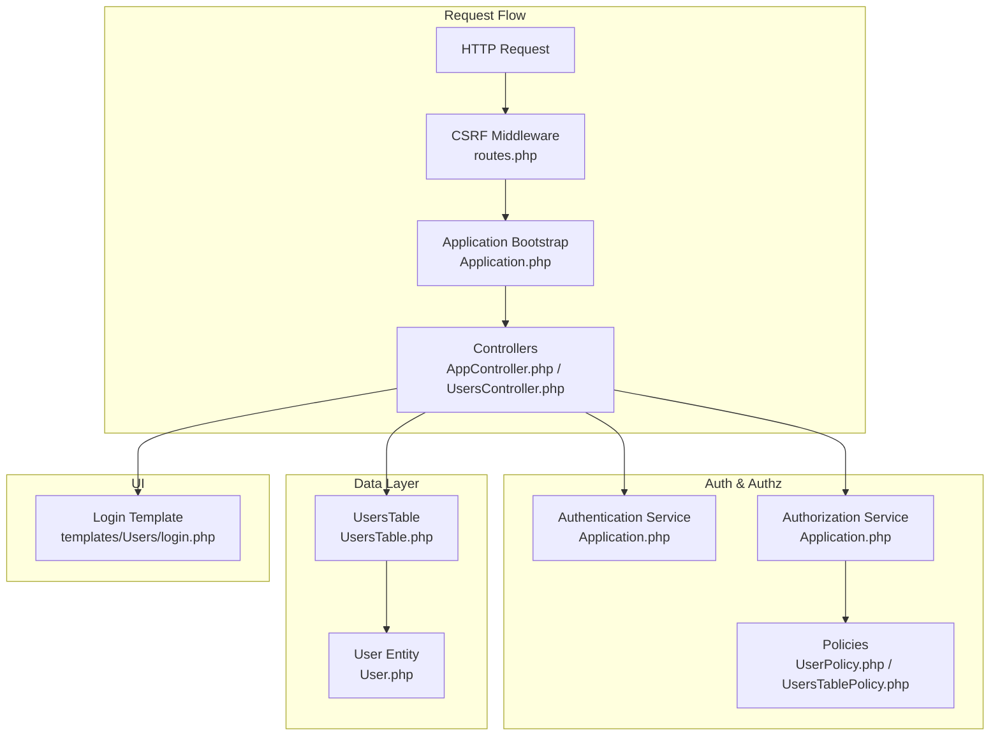
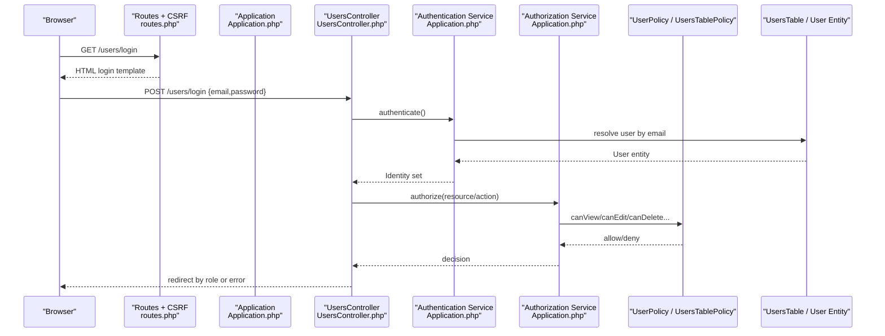
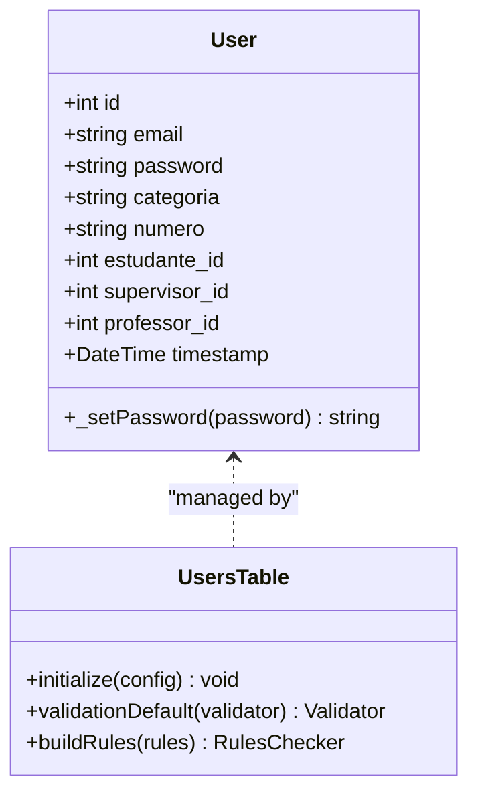
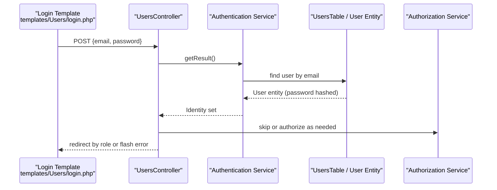
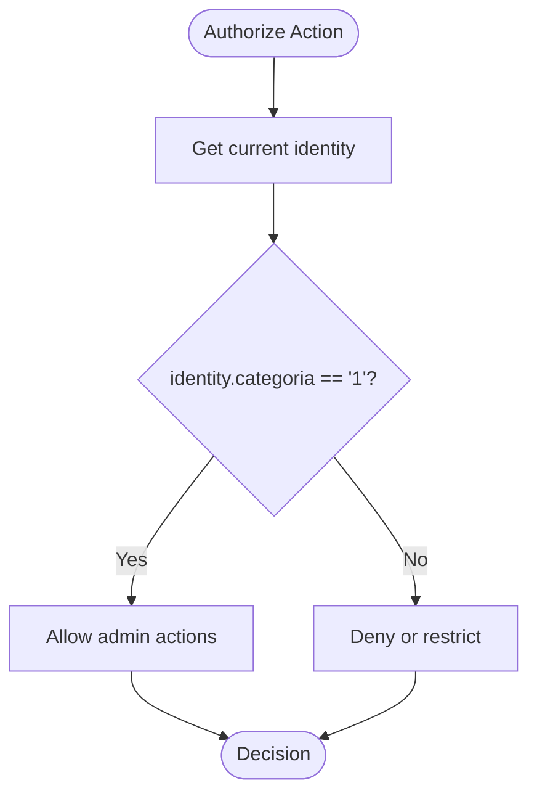
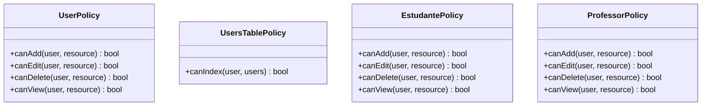
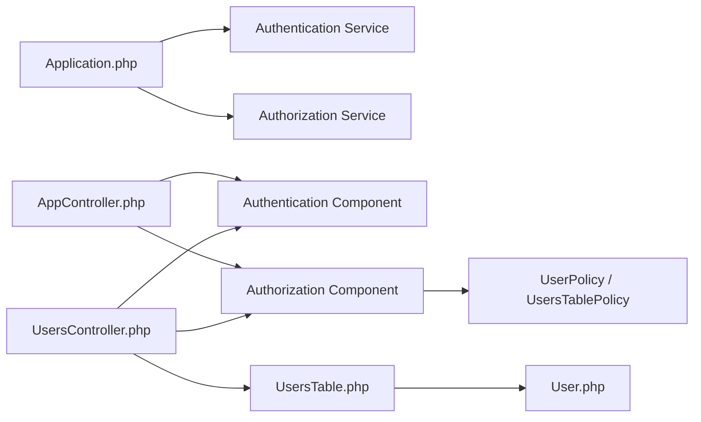

# User Management System

<cite>
**Referenced Files in This Document**
- [Application.php](file://src/Application.php)
- [AppController.php](file://src/Controller/AppController.php)
- [UsersController.php](file://src/Controller/UsersController.php)
- [UserPolicy.php](file://src/Policy/UserPolicy.php)
- [UsersTablePolicy.php](file://src/Policy/UsersTablePolicy.php)
- [EstudantePolicy.php](file://src/Policy/EstudantePolicy.php)
- [ProfessorPolicy.php](file://src/Policy/ProfessorPolicy.php)
- [User.php](file://src/Model/Entity/User.php)
- [UsersTable.php](file://src/Model/Table/UsersTable.php)
- [login.php](file://templates/Users/login.php)
- [routes.php](file://config/routes.php)
- [app.php](file://config/app.php)
</cite>

## Table of Contents
1. [Introduction](#introduction)
2. [Project Structure](#project-structure)
3. [Core Components](#core-components)
4. [Architecture Overview](#architecture-overview)
5. [Detailed Component Analysis](#detailed-component-analysis)
6. [Dependency Analysis](#dependency-analysis)
7. [Performance Considerations](#performance-considerations)
8. [Troubleshooting Guide](#troubleshooting-guide)
9. [Conclusion](#conclusion)

## Introduction
This document explains the user management system implemented in this CakePHP application. It covers authentication, authorization, and role-based access control (RBAC) using CakePHP’s Authentication and Authorization plugins. It details the User entity structure, session-based login flow, form-based authentication, policy-driven authorization for fine-grained control, and security measures such as password hashing, CSRF protection, and input validation.

## Project Structure
The user management system spans controllers, models, policies, templates, and configuration:
- Controllers handle login/logout, registration, and user CRUD operations with authorization checks.
- Models define the User entity and table with validation rules and associations.
- Policies enforce RBAC based on a numeric category field representing roles.
- Templates provide the login form and integrate with CakePHP’s Form helper.
- Configuration wires up Authentication and Authorization services, middleware, and sessions.

**Diagram sources**
- [routes.php:48-58](file://config/routes.php#L48-L58)
- [Application.php:135-170](file://src/Application.php#L135-L170)
- [AppController.php:44-67](file://src/Controller/AppController.php#L44-L67)
- [UsersController.php:23-32](file://src/Controller/UsersController.php#L23-L32)
- [UserPolicy.php:12-63](file://src/Policy/UserPolicy.php#L12-L63)
- [UsersTablePolicy.php:13-26](file://src/Policy/UsersTablePolicy.php#L13-L26)
- [UsersTable.php:40-59](file://src/Model/Table/UsersTable.php#L40-L59)
- [User.php:27-69](file://src/Model/Entity/User.php#L27-L69)
- [login.php:13-31](file://templates/Users/login.php#L13-L31)

**Section sources**
- [routes.php:48-58](file://config/routes.php#L48-L58)
- [Application.php:135-170](file://src/Application.php#L135-L170)
- [AppController.php:44-67](file://src/Controller/AppController.php#L44-L67)
- [UsersController.php:23-32](file://src/Controller/UsersController.php#L23-L32)
- [UserPolicy.php:12-63](file://src/Policy/UserPolicy.php#L12-L63)
- [UsersTablePolicy.php:13-26](file://src/Policy/UsersTablePolicy.php#L13-L26)
- [UsersTable.php:40-59](file://src/Model/Table/UsersTable.php#L40-L59)
- [User.php:27-69](file://src/Model/Entity/User.php#L27-L69)
- [login.php:13-31](file://templates/Users/login.php#L13-L31)

## Core Components
- Authentication service: Configured to use Session and Form authenticators, with Orm resolver for credential lookup against the Users table.
- Authorization service: Uses an ORM resolver to map controller actions to policy methods.
- Policies: Role checks are based on the User entity’s categoria field (e.g., “1” for administrators).
- User model: Defines fields, validation, and password hashing via an entity setter.
- Controllers: Handle login/logout flows, redirect by role, and enforce authorization on protected actions.
- Templates: Provide the login form bound to email/password fields expected by the authentication service.

Key implementation references:
- Authentication setup and form fields mapping: [Application.php:135-164](file://src/Application.php#L135-L164)
- Global components and unauthenticated actions: [AppController.php:44-67](file://src/Controller/AppController.php#L44-L67)
- Login/logout and role-based redirects: [UsersController.php:23-171](file://src/Controller/UsersController.php#L23-L171)
- User entity password hashing and hidden fields: [User.php:27-69](file://src/Model/Entity/User.php#L27-L69)
- Validation rules for users: [UsersTable.php:67-108](file://src/Model/Table/UsersTable.php#L67-L108)
- CSRF middleware applied to routes: [routes.php:48-58](file://config/routes.php#L48-L58)
- Session defaults: [app.php:398-400](file://config/app.php#L398-L400)

**Section sources**
- [Application.php:135-170](file://src/Application.php#L135-L170)
- [AppController.php:44-67](file://src/Controller/AppController.php#L44-L67)
- [UsersController.php:23-171](file://src/Controller/UsersController.php#L23-L171)
- [User.php:27-69](file://src/Model/Entity/User.php#L27-L69)
- [UsersTable.php:67-108](file://src/Model/Table/UsersTable.php#L67-L108)
- [routes.php:48-58](file://config/routes.php#L48-L58)
- [app.php:398-400](file://config/app.php#L398-L400)

## Architecture Overview
The system uses CakePHP’s plugin architecture:
- Application bootstraps Authentication and Authorization plugins.
- Requests pass through CSRF middleware, then hit controllers that rely on Authentication/Authorization components.
- The Authentication service validates credentials via Session or Form authenticator and sets the identity.
- The Authorization service enforces policies per action/resource.

**Diagram sources**
- [routes.php:48-58](file://config/routes.php#L48-L58)
- [Application.php:135-170](file://src/Application.php#L135-L170)
- [UsersController.php:34-156](file://src/Controller/UsersController.php#L34-L156)
- [UserPolicy.php:12-63](file://src/Policy/UserPolicy.php#L12-L63)
- [UsersTablePolicy.php:13-26](file://src/Policy/UsersTablePolicy.php#L13-L26)
- [UsersTable.php:40-59](file://src/Model/Table/UsersTable.php#L40-L59)
- [User.php:27-69](file://src/Model/Entity/User.php#L27-L69)

## Detailed Component Analysis

### User Entity and Table
- Fields: id, email, password, categoria, numero, estudante_id, supervisor_id, professor_id, timestamp, plus related entities.
- Mass assignment is explicitly allowed for required fields; password is hidden from JSON output.
- Passwords are hashed automatically when set via the entity setter.
- Validation enforces email presence/format, password presence/length, and valid categoria values.
- Relationships link users to Alunos, Supervisores, and Professores.

**Diagram sources**
- [User.php:27-69](file://src/Model/Entity/User.php#L27-L69)
- [UsersTable.php:40-125](file://src/Model/Table/UsersTable.php#L40-L125)

**Section sources**
- [User.php:27-69](file://src/Model/Entity/User.php#L27-L69)
- [UsersTable.php:40-125](file://src/Model/Table/UsersTable.php#L40-L125)

### Authentication Service and Login Flow
- Authentication service loads Session and Form authenticators.
- Form authenticator maps username to email and password to password, using an ORM resolver against the Users table.
- Unauthenticated actions include login, add, logout; other actions require authentication.
- On successful login, the controller inspects the identity’s categoria to determine redirection and profile completion.

**Diagram sources**
- [login.php:13-31](file://templates/Users/login.php#L13-L31)
- [UsersController.php:34-156](file://src/Controller/UsersController.php#L34-L156)
- [Application.php:135-164](file://src/Application.php#L135-L164)
- [UsersTable.php:40-59](file://src/Model/Table/UsersTable.php#L40-L59)
- [User.php:27-69](file://src/Model/Entity/User.php#L27-L69)

**Section sources**
- [Application.php:135-164](file://src/Application.php#L135-L164)
- [UsersController.php:34-156](file://src/Controller/UsersController.php#L34-L156)
- [login.php:13-31](file://templates/Users/login.php#L13-L31)

### Authorization and Role-Based Access Control
- Roles are represented by the numeric categoria field on the User entity.
- Policies check the current identity’s categoria to allow or deny actions:
  - Administrators (categoria “1”) have broad permissions.
  - Other roles may be restricted depending on policy logic.
- Table-level policies restrict listing/indexing to administrators.

**Diagram sources**
- [UserPolicy.php:21-63](file://src/Policy/UserPolicy.php#L21-L63)
- [UsersTablePolicy.php:13-26](file://src/Policy/UsersTablePolicy.php#L13-L26)

**Section sources**
- [UserPolicy.php:21-63](file://src/Policy/UserPolicy.php#L21-L63)
- [UsersTablePolicy.php:13-26](file://src/Policy/UsersTablePolicy.php#L13-L26)

### Policy System for Fine-Grained Authorization
- Resource-level policies (e.g., UserPolicy) govern create/update/delete/view on User entities.
- Table-level policies (e.g., UsersTablePolicy) govern list/index operations on collections.
- Additional domain policies (e.g., EstudantePolicy, ProfessorPolicy) follow similar patterns, often restricting write operations to administrators while allowing read access broadly.

**Diagram sources**
- [UserPolicy.php:12-63](file://src/Policy/UserPolicy.php#L12-L63)
- [UsersTablePolicy.php:13-26](file://src/Policy/UsersTablePolicy.php#L13-L26)
- [EstudantePolicy.php:13-59](file://src/Policy/EstudantePolicy.php#L13-L59)
- [ProfessorPolicy.php:12-62](file://src/Policy/ProfessorPolicy.php#L12-L62)

**Section sources**
- [UserPolicy.php:12-63](file://src/Policy/UserPolicy.php#L12-L63)
- [UsersTablePolicy.php:13-26](file://src/Policy/UsersTablePolicy.php#L13-L26)
- [EstudantePolicy.php:13-59](file://src/Policy/EstudantePolicy.php#L13-L59)
- [ProfessorPolicy.php:12-62](file://src/Policy/ProfessorPolicy.php#L12-L62)

### Session Management
- Sessions use PHP defaults configured in application settings.
- Authentication relies on the Session authenticator to maintain login state across requests.
- CSRF protection is enabled globally via middleware, protecting forms and state-changing requests.

Implementation references:
- Session defaults: [app.php:398-400](file://config/app.php#L398-L400)
- CSRF middleware registration and application: [routes.php:48-58](file://config/routes.php#L48-L58)

**Section sources**
- [app.php:398-400](file://config/app.php#L398-L400)
- [routes.php:48-58](file://config/routes.php#L48-L58)

### Form-Based Login Process
- The login template renders a form with email and password fields matching the authentication service’s configured fields.
- Upon submission, the controller delegates to the Authentication component/service to validate credentials and set the identity.
- Successful authentication triggers role-based redirection and optional profile completion workflows.

References:
- Login form fields: [login.php:13-31](file://templates/Users/login.php#L13-L31)
- Authentication field mapping: [Application.php:144-162](file://src/Application.php#L144-L162)
- Controller login handling: [UsersController.php:34-156](file://src/Controller/UsersController.php#L34-L156)

**Section sources**
- [login.php:13-31](file://templates/Users/login.php#L13-L31)
- [Application.php:144-162](file://src/Application.php#L144-L162)
- [UsersController.php:34-156](file://src/Controller/UsersController.php#L34-L156)

### User Profile Management
- Registration and editing of users are handled in the Users controller with authorization checks.
- After saving, the controller associates the user with a student, professor, or supervisor record if available, updating the user’s foreign keys and identifiers.
- Views and edits invoke authorization to ensure only permitted users can modify records.

References:
- Add/Edit/Delete flows and role association: [UsersController.php:213-353](file://src/Controller/UsersController.php#L213-L353)
- Authorization calls on resources: [UsersController.php:200-206](file://src/Controller/UsersController.php#L200-L206), [UsersController.php:308-323](file://src/Controller/UsersController.php#L308-L323)

**Section sources**
- [UsersController.php:213-353](file://src/Controller/UsersController.php#L213-L353)
- [UsersController.php:200-206](file://src/Controller/UsersController.php#L200-L206)
- [UsersController.php:308-323](file://src/Controller/UsersController.php#L308-L323)

## Dependency Analysis
- Controllers depend on Authentication and Authorization components loaded in AppController.
- Application configures Authentication and Authorization services and plugins.
- Policies depend on the IdentityInterface and User entity attributes (notably categoria).
- Data layer depends on UsersTable and User entity for persistence and validation.

**Diagram sources**
- [Application.php:135-170](file://src/Application.php#L135-L170)
- [AppController.php:44-67](file://src/Controller/AppController.php#L44-L67)
- [UsersController.php:23-32](file://src/Controller/UsersController.php#L23-L32)
- [UserPolicy.php:12-63](file://src/Policy/UserPolicy.php#L12-L63)
- [UsersTablePolicy.php:13-26](file://src/Policy/UsersTablePolicy.php#L13-L26)
- [UsersTable.php:40-59](file://src/Model/Table/UsersTable.php#L40-L59)
- [User.php:27-69](file://src/Model/Entity/User.php#L27-L69)

**Section sources**
- [Application.php:135-170](file://src/Application.php#L135-L170)
- [AppController.php:44-67](file://src/Controller/AppController.php#L44-L67)
- [UsersController.php:23-32](file://src/Controller/UsersController.php#L23-L32)
- [UserPolicy.php:12-63](file://src/Policy/UserPolicy.php#L12-L63)
- [UsersTablePolicy.php:13-26](file://src/Policy/UsersTablePolicy.php#L13-L26)
- [UsersTable.php:40-59](file://src/Model/Table/UsersTable.php#L40-L59)
- [User.php:27-69](file://src/Model/Entity/User.php#L27-L69)

## Performance Considerations
- Keep policy checks minimal and centralized to avoid repeated role checks in controllers.
- Use eager loading sparingly; only load necessary associations during user operations.
- Ensure database indexes exist on frequently queried fields like email and foreign keys (estudante_id, professor_id, supervisor_id).
- Avoid heavy computations in entity setters; keep password hashing efficient and off critical paths where possible.

[No sources needed since this section provides general guidance]

## Troubleshooting Guide
Common issues and resolutions:
- Invalid credentials: Ensure the form fields match the authentication service configuration and that the Users table contains correctly hashed passwords.
  - References: [Application.php:144-162](file://src/Application.php#L144-L162), [User.php:52-58](file://src/Model/Entity/User.php#L52-L58)
- Unauthorized access errors: Verify that policies allow the intended action for the current identity’s categoria.
  - References: [UserPolicy.php:21-63](file://src/Policy/UserPolicy.php#L21-L63), [UsersTablePolicy.php:13-26](file://src/Policy/UsersTablePolicy.php#L13-L26)
- CSRF errors on form submissions: Confirm CSRF middleware is applied and forms include the required token.
  - Reference: [routes.php:48-58](file://config/routes.php#L48-L58)
- Session not persisting: Check session configuration and ensure cookies are properly set and accepted by the browser.
  - Reference: [app.php:398-400](file://config/app.php#L398-L400)
- Redirect loops after login: Validate role-based redirection logic and ensure unauthenticated actions are correctly declared.
  - References: [UsersController.php:23-32](file://src/Controller/UsersController.php#L23-L32), [UsersController.php:34-156](file://src/Controller/UsersController.php#L34-L156)

**Section sources**
- [Application.php:144-162](file://src/Application.php#L144-L162)
- [User.php:52-58](file://src/Model/Entity/User.php#L52-L58)
- [UserPolicy.php:21-63](file://src/Policy/UserPolicy.php#L21-L63)
- [UsersTablePolicy.php:13-26](file://src/Policy/UsersTablePolicy.php#L13-L26)
- [routes.php:48-58](file://config/routes.php#L48-L58)
- [app.php:398-400](file://config/app.php#L398-L400)
- [UsersController.php:23-32](file://src/Controller/UsersController.php#L23-L32)
- [UsersController.php:34-156](file://src/Controller/UsersController.php#L34-L156)

## Conclusion
This user management system leverages CakePHP’s Authentication and Authorization plugins to implement secure, role-based access control. The User entity centralizes data and security concerns (like password hashing), while policies enforce granular permissions based on roles. The login flow integrates seamlessly with session management and CSRF protection, ensuring robust security. Controllers orchestrate authentication, authorization, and role-specific workflows, providing a clear separation of concerns and maintainable architecture.

[No sources needed since this section summarizes without analyzing specific files]