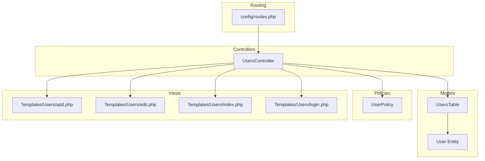
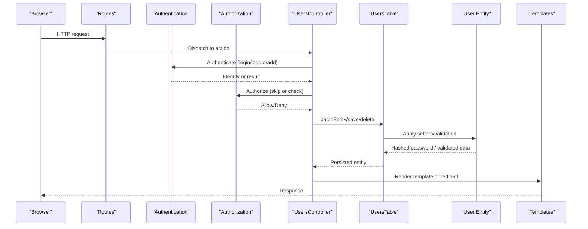
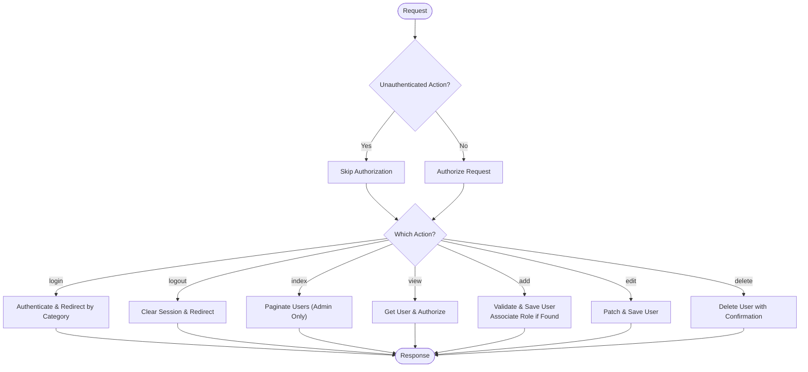
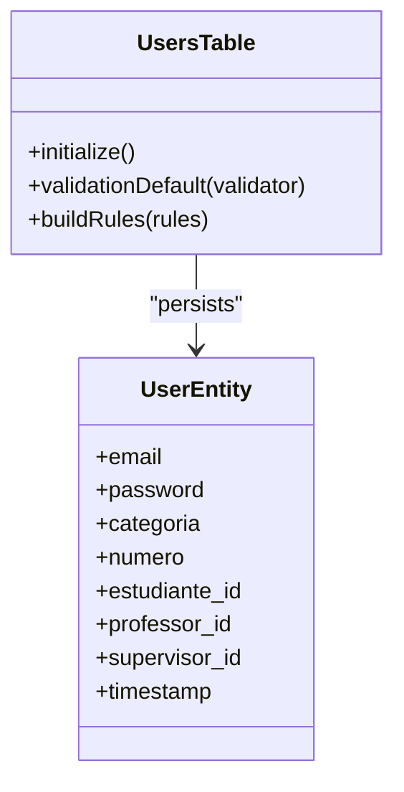
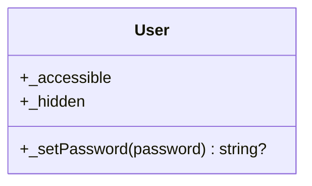
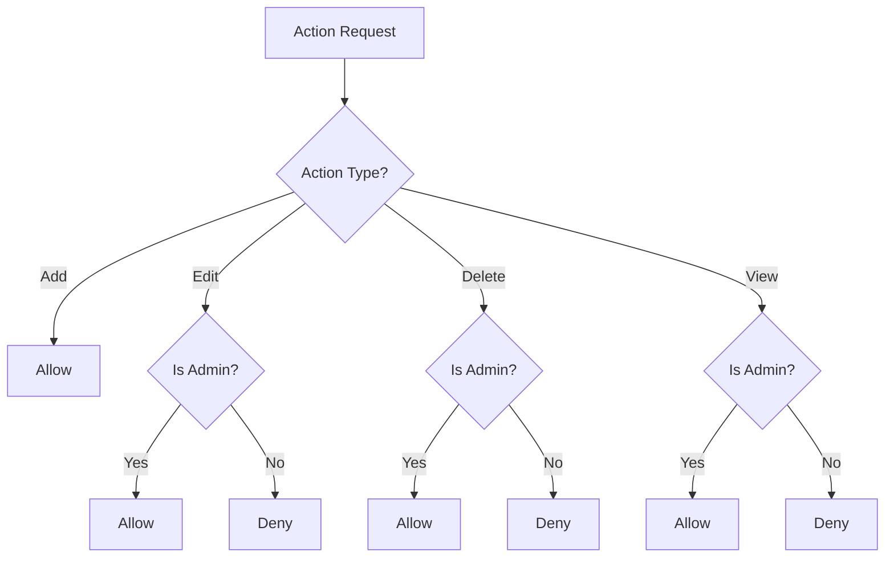
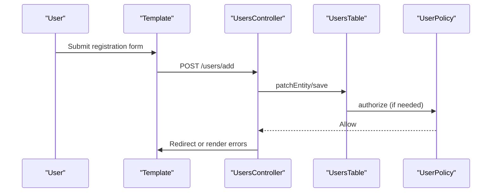
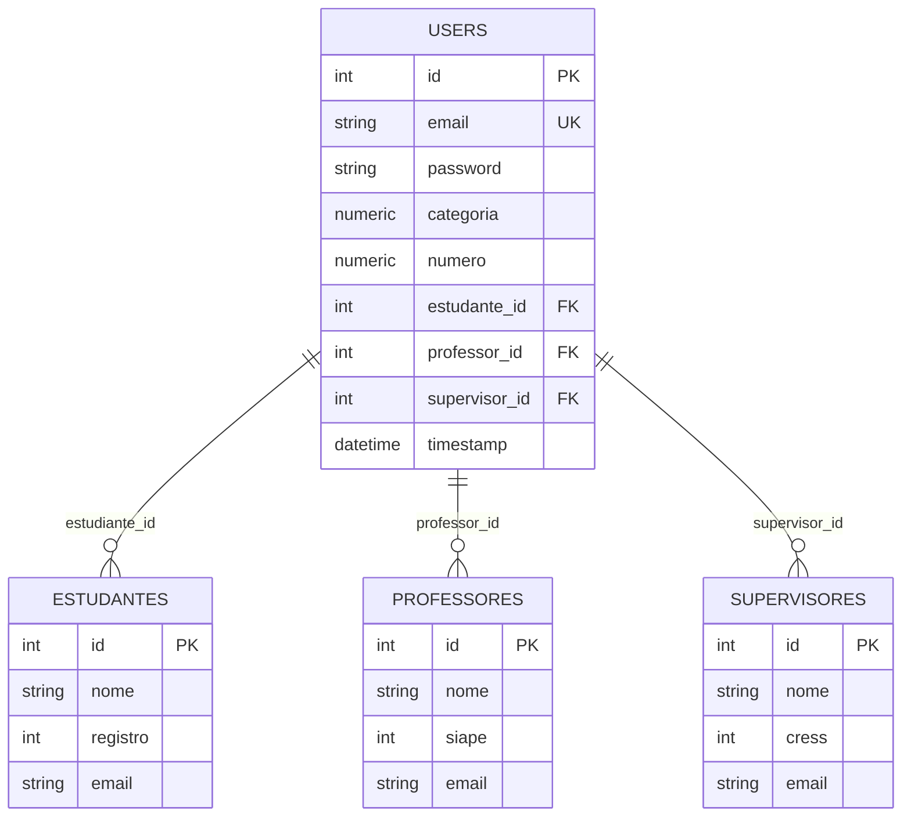
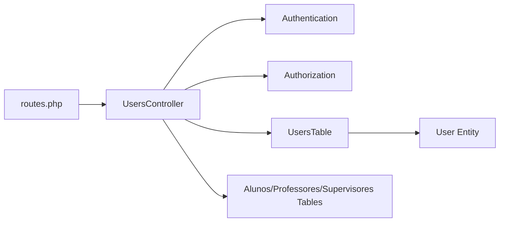

# User Profile Management

<cite>
**Referenced Files in This Document**
- [UsersController.php](file://src/Controller/UsersController.php)
- [UsersTable.php](file://src/Model/Table/UsersTable.php)
- [User.php](file://src/Model/Entity/User.php)
- [UserPolicy.php](file://src/Policy/UserPolicy.php)
- [add.php](file://templates/Users/add.php)
- [edit.php](file://templates/Users/edit.php)
- [index.php](file://templates/Users/index.php)
- [login.php](file://templates/Users/login.php)
- [routes.php](file://config/routes.php)
- [Estudante.php](file://src/Model/Entity/Estudante.php)
- [Professor.php](file://src/Model/Entity/Professor.php)
</cite>

## Table of Contents
1. Introduction
2. Project Structure
3. Core Components
4. Architecture Overview
5. Detailed Component Analysis
6. Dependency Analysis
7. Performance Considerations
8. Troubleshooting Guide
9. Conclusion
10. Appendices

## Introduction
This document explains the user profile management functionality for registration, editing, and administration. It covers the UsersController CRUD operations, form validation and sanitization, data persistence, relationships with academic roles (students, professors), profile field management, user status tracking, and admin-level user management features. It also addresses privacy and security considerations such as password hashing, authorization policies, and CSRF protection.

## Project Structure
The user profile feature spans controllers, models, entities, policies, and templates:
- Controller layer: UsersController handles authentication, registration, listing, viewing, editing, and deletion.
- Model layer: UsersTable defines associations to academic roles and validation rules; User entity implements password hashing and access control.
- Policy layer: UserPolicy enforces role-based permissions for view, edit, delete actions.
- Templates: add, edit, index, login provide UI for user workflows.
- Routing: routes.php configures application-wide middleware including CSRF protection.

**Diagram sources**
- [UsersController.php:23-356](file://src/Controller/UsersController.php#L23-L356)
- [UsersTable.php:40-127](file://src/Model/Table/UsersTable.php#L40-L127)
- [User.php:27-69](file://src/Model/Entity/User.php#L27-L69)
- [UserPolicy.php:12-64](file://src/Policy/UserPolicy.php#L12-L64)
- [add.php:13-60](file://templates/Users/add.php#L13-L60)
- [edit.php:36-49](file://templates/Users/edit.php#L36-L49)
- [index.php:25-67](file://templates/Users/index.php#L25-L67)
- [login.php:13-36](file://templates/Users/login.php#L13-L36)
- [routes.php:48-88](file://config/routes.php#L48-L88)

**Section sources**
- [UsersController.php:23-356](file://src/Controller/UsersController.php#L23-L356)
- [UsersTable.php:40-127](file://src/Model/Table/UsersTable.php#L40-L127)
- [User.php:27-69](file://src/Model/Entity/User.php#L27-L69)
- [UserPolicy.php:12-64](file://src/Policy/UserPolicy.php#L12-L64)
- [add.php:13-60](file://templates/Users/add.php#L13-L60)
- [edit.php:36-49](file://templates/Users/edit.php#L36-L49)
- [index.php:25-67](file://templates/Users/index.php#L25-L67)
- [login.php:13-36](file://templates/Users/login.php#L13-L36)
- [routes.php:48-88](file://config/routes.php#L48-L88)

## Core Components
- UsersController: Manages login, logout, user registration (add), listing (index), viewing (view), editing (edit), and deletion (delete). It integrates Authentication and Authorization components, and coordinates with related tables for students, professors, and supervisors.
- UsersTable: Defines ORM associations to academic roles and validation rules for email, password, category, and numeric identifiers. Enforces referential integrity via existsIn rules.
- User Entity: Implements secure password hashing on write and hides sensitive fields from JSON serialization. Controls mass assignment via accessible properties.
- UserPolicy: Restricts view, edit, and delete to administrators (category '1'). Allows adding users without restriction.
- Templates: Provide forms for login, registration, editing, and an admin list with pagination and actions.

Key responsibilities:
- Registration workflow validates inputs, creates a user, and associates them with an academic role if available.
- Login flow authenticates and redirects based on user category, ensuring role-specific profiles are linked.
- Admin features allow listing, editing, and deleting users with policy enforcement.

**Section sources**
- [UsersController.php:23-356](file://src/Controller/UsersController.php#L23-L356)
- [UsersTable.php:40-127](file://src/Model/Table/UsersTable.php#L40-L127)
- [User.php:27-69](file://src/Model/Entity/User.php#L27-L69)
- [UserPolicy.php:12-64](file://src/Policy/UserPolicy.php#L12-L64)
- [add.php:13-60](file://templates/Users/add.php#L13-L60)
- [edit.php:36-49](file://templates/Users/edit.php#L36-L49)
- [index.php:25-67](file://templates/Users/index.php#L25-L67)
- [login.php:13-36](file://templates/Users/login.php#L13-L36)

## Architecture Overview
The system uses CakePHP’s MVC pattern with Authentication and Authorization components:
- Requests enter through routes and are handled by UsersController.
- Controllers use UsersTable to persist and validate user data.
- Entities enforce security (password hashing) and expose safe attributes.
- Policies gate access to resources based on current identity.
- Templates render forms and lists with consistent styling and error handling.

**Diagram sources**
- [UsersController.php:23-356](file://src/Controller/UsersController.php#L23-L356)
- [UsersTable.php:40-127](file://src/Model/Table/UsersTable.php#L40-L127)
- [User.php:27-69](file://src/Model/Entity/User.php#L27-L69)
- [UserPolicy.php:12-64](file://src/Policy/UserPolicy.php#L12-L64)
- [routes.php:48-88](file://config/routes.php#L48-L88)

## Detailed Component Analysis

### UsersController: CRUD and Workflows
- beforeFilter: Registers unauthenticated actions for login, add, and logout.
- login: Authenticates users, skips authorization during login, and redirects based on category:
  - Category '2' (student): Ensures student record exists; links user to student profile.
  - Category '3' (professor): Ensures professor record exists; links user to professor profile.
  - Category '4' (supervisor): Ensures supervisor record exists; links user to supervisor profile.
  - Category '1' (admin): Redirects to dashboard.
- logout: Clears session and redirects to login.
- index: Lists all users (admin only); paginates results.
- view: Retrieves a single user and authorizes access.
- add: Creates new users, validates input, and associates with academic roles when possible.
- edit: Updates user details with authorization checks.
- delete: Removes users with confirmation and authorization checks.

**Diagram sources**
- [UsersController.php:23-356](file://src/Controller/UsersController.php#L23-L356)

**Section sources**
- [UsersController.php:23-356](file://src/Controller/UsersController.php#L23-L356)

### UsersTable: Validation and Associations
- Associations: BelongsTo relationships to Alunos (students), Professores (professors), and Supervisores (supervisors) using foreign keys estudiante_id, professor_id, supervisor_id.
- Validation:
  - email: required on create, must be valid email format.
  - password: required on create, max length enforced, non-empty.
  - categoria: numeric, required, restricted to allowed values ('1', '2', '3', '4').
  - numero: optional numeric identifier used to link to academic roles.
  - Foreign key fields: integer types, nullable.
  - timestamp: non-empty datetime.
- Rules: Referential integrity ensures referenced IDs exist in related tables.

**Diagram sources**
- [UsersTable.php:40-127](file://src/Model/Table/UsersTable.php#L40-L127)
- [User.php:27-69](file://src/Model/Entity/User.php#L27-L69)

**Section sources**
- [UsersTable.php:40-127](file://src/Model/Table/UsersTable.php#L40-L127)

### User Entity: Security and Access Control
- Mass assignment: Explicitly allows specific fields for safety.
- Password hashing: Automatically hashes passwords on set to ensure secure storage.
- Hidden fields: Excludes password from JSON output to prevent leakage.

**Diagram sources**
- [User.php:27-69](file://src/Model/Entity/User.php#L27-L69)

**Section sources**
- [User.php:27-69](file://src/Model/Entity/User.php#L27-L69)

### UserPolicy: Role-Based Permissions
- canAdd: Always allows creating users (registration open).
- canEdit, canDelete, canView: Restricted to administrators (category '1').

**Diagram sources**
- [UserPolicy.php:12-64](file://src/Policy/UserPolicy.php#L12-L64)

**Section sources**
- [UserPolicy.php:12-64](file://src/Policy/UserPolicy.php#L12-L64)

### Templates: Forms and Admin UI
- add.php: Registration form with email, password, category selection, and numeric identifier input.
- edit.php: Edit form with hidden password field and category options; includes delete link for admins.
- index.php: Admin-only user list with pagination and actions (view, edit, delete).
- login.php: Login form with email/password fields and links to register or recover password.

**Diagram sources**
- [add.php:13-60](file://templates/Users/add.php#L13-L60)
- [edit.php:36-49](file://templates/Users/edit.php#L36-L49)
- [index.php:25-67](file://templates/Users/index.php#L25-L67)
- [login.php:13-36](file://templates/Users/login.php#L13-L36)
- [UsersController.php:213-324](file://src/Controller/UsersController.php#L213-L324)

**Section sources**
- [add.php:13-60](file://templates/Users/add.php#L13-L60)
- [edit.php:36-49](file://templates/Users/edit.php#L36-L49)
- [index.php:25-67](file://templates/Users/index.php#L25-L67)
- [login.php:13-36](file://templates/Users/login.php#L13-L36)

### Relationships with Academic Roles
- Users belong to at most one academic role via foreign keys:
  - estudiante_id -> Estudante
  - professor_id -> Professor
  - supervisor_id -> Supervisor
- During registration and login, the controller attempts to associate the user with the corresponding academic record using numeric identifiers (registro, siape, cress). If not found, it redirects to the respective add pages to complete enrollment.

**Diagram sources**
- [UsersTable.php:49-58](file://src/Model/Table/UsersTable.php#L49-L58)
- [UsersController.php:50-138](file://src/Controller/UsersController.php#L50-L138)
- [UsersController.php:222-287](file://src/Controller/UsersController.php#L222-L287)

**Section sources**
- [UsersTable.php:49-58](file://src/Model/Table/UsersTable.php#L49-L58)
- [UsersController.php:50-138](file://src/Controller/UsersController.php#L50-L138)
- [UsersController.php:222-287](file://src/Controller/UsersController.php#L222-L287)

## Dependency Analysis
- UsersController depends on:
  - Authentication component for login/logout flows.
  - Authorization component for permission checks.
  - UsersTable for data operations.
  - Related tables (Alunos, Professores, Supervisores) for role association.
- UsersTable depends on:
  - Validation framework for input rules.
  - Rules checker for referential integrity.
- UserEntity depends on:
  - Password hasher for secure storage.
- Templates depend on:
  - Form helpers and shared elements for consistent UI.
- Routing applies CSRF middleware globally.

**Diagram sources**
- [UsersController.php:23-356](file://src/Controller/UsersController.php#L23-L356)
- [UsersTable.php:40-127](file://src/Model/Table/UsersTable.php#L40-L127)
- [User.php:27-69](file://src/Model/Entity/User.php#L27-L69)
- [routes.php:48-88](file://config/routes.php#L48-L88)

**Section sources**
- [UsersController.php:23-356](file://src/Controller/UsersController.php#L23-L356)
- [UsersTable.php:40-127](file://src/Model/Table/UsersTable.php#L40-L127)
- [User.php:27-69](file://src/Model/Entity/User.php#L27-L69)
- [routes.php:48-88](file://config/routes.php#L48-L88)

## Performance Considerations
- Pagination: The user index uses pagination to avoid loading large datasets into memory.
- Minimal contains: Views and edits load minimal associated data to reduce query overhead.
- Validation at model level: Centralized validation reduces redundant checks and improves consistency.
- Avoid N+1 queries: When displaying user lists, consider eager-loading related roles if needed to minimize database calls.

[No sources needed since this section provides general guidance]

## Troubleshooting Guide
Common issues and resolutions:
- Invalid credentials: Ensure email and password match stored records; verify password hashing is applied on creation.
- Missing academic role association: If login redirects to role add page, confirm that the numeric identifier (registro/siape/cress) exists in the corresponding table.
- Unauthorized access: Admin-only actions require category '1'; verify user identity and policy enforcement.
- CSRF errors: Ensure requests include CSRF tokens; global middleware is configured in routes.

**Section sources**
- [UsersController.php:151-156](file://src/Controller/UsersController.php#L151-L156)
- [UsersController.php:180-191](file://src/Controller/UsersController.php#L180-L191)
- [routes.php:48-58](file://config/routes.php#L48-L58)

## Conclusion
The user profile management system provides secure registration, login, editing, and administrative controls. Validation and hashing ensure data integrity and security. Role-based authorization restricts sensitive operations to administrators. Integration with academic roles enables seamless linking of users to student, professor, or supervisor profiles. Proper use of pagination and minimal data loading supports performance.

[No sources needed since this section summarizes without analyzing specific files]

## Appendices

### Data Validation Rules Summary
- Email: Required on create, must be a valid email format.
- Password: Required on create, non-empty, maximum length enforced.
- Categoria: Numeric, required, restricted to allowed values.
- Numero: Optional numeric identifier used to link to academic roles.
- Timestamp: Non-empty datetime.

**Section sources**
- [UsersTable.php:67-108](file://src/Model/Table/UsersTable.php#L67-L108)

### Admin-Level User Management Features
- List users with pagination and actions (view, edit, delete).
- Create new users via registration form.
- Edit existing users (restricted to admins).
- Delete users with confirmation prompts (restricted to admins).

**Section sources**
- [index.php:25-67](file://templates/Users/index.php#L25-L67)
- [edit.php:36-49](file://templates/Users/edit.php#L36-L49)
- [UserPolicy.php:34-61](file://src/Policy/UserPolicy.php#L34-L61)

### Privacy and Security Considerations
- Passwords are hashed automatically upon setting, preventing plaintext storage.
- Passwords are hidden from JSON serialization to avoid accidental exposure.
- CSRF protection is enabled globally via middleware to mitigate cross-site request forgery.
- Authorization policies enforce role-based access control for sensitive operations.

**Section sources**
- [User.php:52-67](file://src/Model/Entity/User.php#L52-L67)
- [routes.php:48-58](file://config/routes.php#L48-L58)
- [UserPolicy.php:12-64](file://src/Policy/UserPolicy.php#L12-L64)